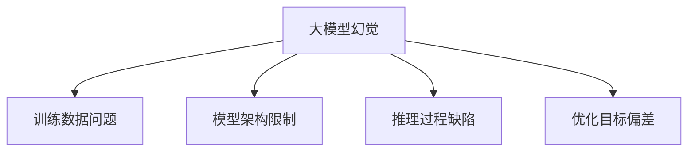
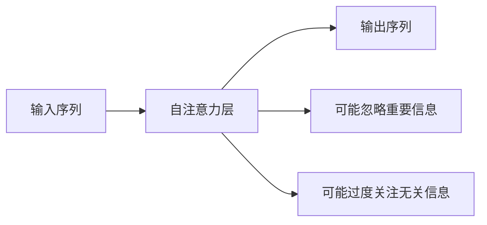
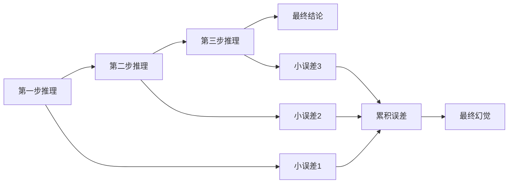
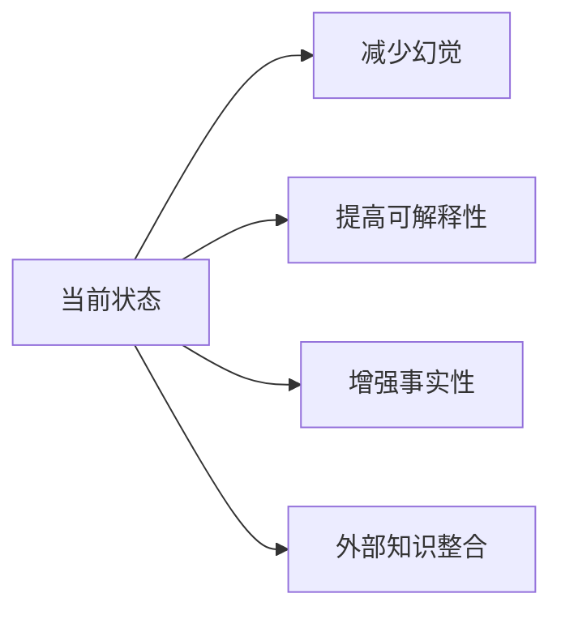

# 大模型产生幻觉的原因

---

## 目录

1. [什么是大模型幻觉](#1-什么是大模型幻觉)
2. [幻觉产生的核心原因](#2-幻觉产生的核心原因)
3. [训练数据层面的原因](#3-训练数据层面的原因)
4. [模型架构层面的原因](#4-模型架构层面的原因)
5. [推理过程层面的原因](#5-推理过程层面的原因)
6. [幻觉的类型分类](#6-幻觉的类型分类)
7. [减轻幻觉的方法](#7-减轻幻觉的方法)
8. [未来展望](#8-未来展望)

---

## 1. 什么是大模型幻觉

**幻觉（Hallucination）** 是指大语言模型生成的内容看似合理、流畅，但实际上是虚构的、不准确的或与事实不符的信息。

### 幻觉示例

```
用户：李白是哪个朝代的诗人？
模型：李白是宋朝著名的诗人。（错误，实际是唐朝）

用户：地球到火星的距离是多少？
模型：地球到火星的距离约为500万公里。（错误，实际最近约5500万公里）
```

### 幻觉的特点

| 特点 | 说明 |
|------|------|
| **看似合理** | 生成的内容语法正确、逻辑连贯 |
| **难以察觉** | 对于不熟悉领域的用户很难发现错误 |
| **自信表达** | 模型通常以肯定的语气表达虚构内容 |
| **上下文敏感** | 幻觉可能与上下文相关但不准确 |

---

## 2. 幻觉产生的核心原因



大模型幻觉的产生是多种因素共同作用的结果，主要可以归结为以下几个层面：

---

## 3. 训练数据层面的原因

### 3.1 数据质量问题

| 问题类型 | 说明 |
|---------|------|
| **噪声数据** | 训练数据中包含错误信息、谣言、虚构内容 |
| **数据偏差** | 数据分布不均匀，某些领域数据过多或过少 |
| **过时信息** | 训练数据截止到特定时间点，无法更新最新信息 |
| **数据冲突** | 同一事实存在多种相互矛盾的表述 |

### 3.2 数据规模与覆盖范围

```
训练数据量巨大（万亿级别token），模型无法完全理解和记忆所有内容
→ 对于低频知识，模型更容易产生幻觉
→ 对于边缘领域，模型缺乏足够的训练样本
```

### 3.3 数据中的虚假信息

训练数据包含大量网络文本，其中不可避免地包含：
- 错误的事实陈述
- 虚构的新闻报道
- 未经证实的传言
- 故意误导的内容

---

## 4. 模型架构层面的原因

### 4.1 概率预测本质

大模型的核心是基于概率预测下一个token：

```python
def predict_next_token(model, context):
    # 计算每个token的概率
    probabilities = model.forward(context)
    # 选择概率最高的token（或采样）
    next_token = torch.argmax(probabilities)
    return next_token
```

**问题**：概率最高的token不一定是正确的token，只是在训练数据中最常见的组合。

### 4.2 注意力机制的局限性



注意力机制可能：
- 忽略关键的上下文信息
- 过度关注不相关的细节
- 错误地关联不相关的概念

### 4.3 上下文窗口限制

| 模型 | 上下文窗口 | 限制 |
|------|-----------|------|
| GPT-3 | 2048 tokens | 无法处理长文档 |
| GPT-4 | 8192/32768 tokens | 长文档仍可能丢失信息 |
| LLaMA 2 | 4096/8192 tokens | 同样存在窗口限制 |

---

## 5. 推理过程层面的原因

### 5.1 缺乏真正的理解能力

大模型是**模式匹配器**，而非**理解器**：

```
模型学习的是：A后面通常跟着B
而不是：A和B之间存在什么逻辑关系
```

### 5.2 链式推理中的累积误差



在多步推理中，每一步的小误差会累积，最终导致严重的幻觉。

### 5.3 优化目标与准确性的权衡

模型训练的目标是**预测准确性**和**生成流畅性**的平衡：

```
训练目标：最小化预测误差 + 最大化生成多样性
→ 为了流畅性可能牺牲准确性
→ 为了多样性可能生成新颖但错误的内容
```

---

## 6. 幻觉的类型分类

### 6.1 按内容类型分类

| 类型 | 说明 | 示例 |
|------|------|------|
| **事实幻觉** | 虚构事实 | "李白是宋朝诗人" |
| **命名实体幻觉** | 虚构人名、地名等 | "美国总统是张三" |
| **数字幻觉** | 虚构数值 | "地球人口10亿" |
| **逻辑幻觉** | 逻辑错误 | "因为下雨了，所以太阳很大" |
| **上下文幻觉** | 与上下文矛盾 | 前文说A，后文说非A |

### 6.2 按严重程度分类

| 程度 | 说明 | 影响 |
|------|------|------|
| **轻微幻觉** | 小错误，不影响理解 | 错别字、次要事实错误 |
| **中度幻觉** | 重要信息错误 | 关键数据错误 |
| **严重幻觉** | 完全虚构或误导 | 编造事件、伪造引用 |

---

## 7. 减轻幻觉的方法

### 7.1 数据层面

| 方法 | 说明 |
|------|------|
| **数据清洗** | 过滤低质量、错误数据 |
| **数据验证** | 验证训练数据的准确性 |
| **数据增强** | 添加高质量的权威数据源 |

### 7.2 模型层面

| 方法 | 说明 |
|------|------|
| **增加事实核查** | 在生成过程中检查事实准确性 |
| **引入外部知识** | 调用搜索引擎或知识库 |
| **微调优化** | 使用高质量数据进行微调 |

### 7.3 推理层面

```python
# 引入外部知识的示例
def generate_with_knowledge(model, question):
    # 1. 调用搜索引擎获取相关信息
    search_results = search_engine.query(question)
    
    # 2. 将搜索结果作为上下文
    context = f"参考信息：{search_results}\n问题：{question}"
    
    # 3. 基于增强的上下文生成回答
    answer = model.generate(context)
    return answer
```

### 7.4 输出层面

| 方法 | 说明 |
|------|------|
| **事实核查** | 对生成内容进行事后验证 |
| **不确定性标注** | 让模型标注不确定的内容 |
| **引用来源** | 要求模型提供信息来源 |

---

## 8. 未来展望

### 8.1 技术发展方向



### 8.2 研究热点

| 方向 | 说明 |
|------|------|
| **检索增强生成** | 将检索与生成结合 |
| **可验证生成** | 生成可验证的内容 |
| **自我反思** | 让模型自我检查错误 |
| **多模态验证** | 结合多种信息源验证 |

### 8.3 挑战与机遇

| 挑战 | 机遇 |
|------|------|
| 完全消除幻觉困难 | 可以显著减少幻觉 |
| 平衡准确性与创造力 | 找到最佳平衡点 |
| 动态知识更新 | 结合实时数据 |

---

## 总结

大模型幻觉是一个复杂的问题，涉及训练数据、模型架构、推理过程等多个层面。虽然完全消除幻觉非常困难，但通过多种方法的组合，可以显著减少幻觉的发生。

**关键要点：**
- 幻觉是概率预测的固有特性
- 训练数据质量是基础
- 模型架构需要不断优化
- 外部知识整合是重要方向

随着技术的发展，大模型的事实准确性将会不断提高，但幻觉问题可能永远无法完全解决，需要在使用中保持警惕。
