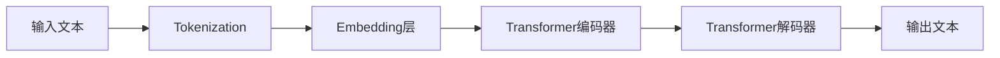
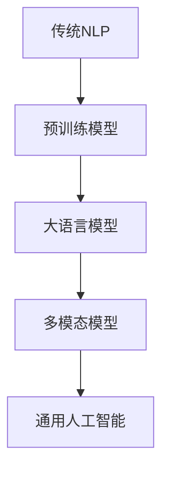
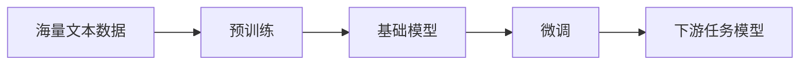
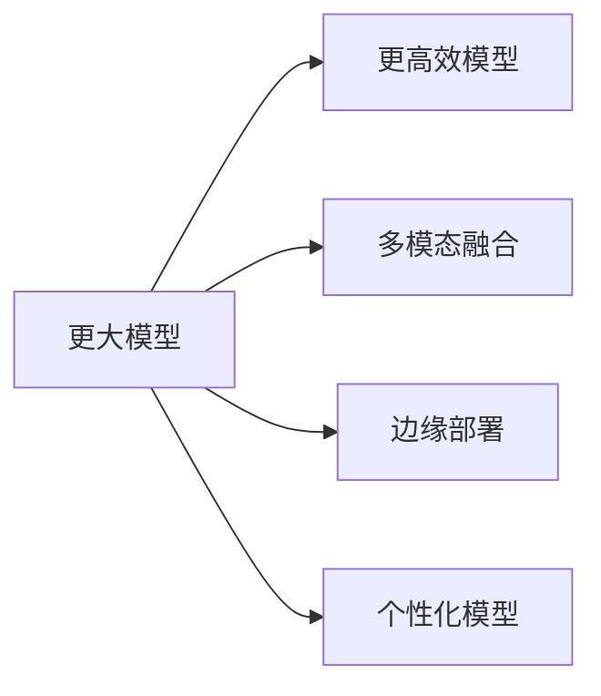

# 大模型简介

---

## 目录

1. [什么是大语言模型](#1-什么是大语言模型)
2. [大模型发展历程](#2-大模型发展历程)
3. [核心技术原理](#3-核心技术原理)
4. [主流大模型介绍](#4-主流大模型介绍)
5. [大模型应用场景](#5-大模型应用场景)
6. [大模型挑战与未来](#6-大模型挑战与未来)

---

## 1. 什么是大语言模型

**大语言模型（Large Language Model, LLM）** 是一种基于深度学习的人工智能模型，通过学习海量文本数据来理解和生成人类语言。

### 核心特点

| 特点 | 说明 |
|------|------|
| **大规模参数** | 通常具有数十亿甚至数万亿个参数 |
| **海量训练数据** | 训练数据涵盖书籍、网页、文章等多种文本来源 |
| **上下文理解** | 能够理解上下文语境，生成连贯的文本 |
| **多任务能力** | 支持问答、翻译、摘要、创作等多种任务 |

### 工作原理



---

## 2. 大模型发展历程

### 里程碑事件

| 时间 | 事件 | 意义 |
|------|------|------|
| **2017** | Transformer架构提出 | 奠定大模型基础 |
| **2018** | BERT发布 | 开启预训练时代 |
| **2019** | GPT-2发布 | 展示零样本学习能力 |
| **2020** | GPT-3发布 | 参数达1750亿，能力大幅提升 |
| **2022** | ChatGPT发布 | 引爆AI应用热潮 |
| **2023** | GPT-4发布 | 多模态能力显著增强 |

### 发展趋势



---

## 3. 核心技术原理

### 3.1 Transformer架构

Transformer是大模型的核心架构，由**编码器**和**解码器**组成：

```java
// Transformer核心组件
public class Transformer {
    // 多头注意力机制
    private MultiHeadAttention attention;
    
    // 前馈神经网络
    private FeedForwardNetwork ffn;
    
    // 层归一化
    private LayerNorm layerNorm;
}
```

### 3.2 自注意力机制

自注意力机制允许模型在处理每个词时，关注输入序列中的其他词：

```python
def self_attention(query, key, value):
    # 计算注意力分数
    scores = torch.matmul(query, key.transpose(-2, -1)) / scale
    
    # 应用softmax获取权重
    weights = torch.softmax(scores, dim=-1)
    
    # 加权求和
    output = torch.matmul(weights, value)
    return output
```

### 3.3 预训练与微调



---

## 4. 主流大模型介绍

### 4.1 GPT系列（OpenAI）

| 模型 | 参数规模 | 特点 |
|------|---------|------|
| GPT-1 | 1.17亿 | 首个GPT模型 |
| GPT-2 | 15亿 | 零样本学习能力 |
| GPT-3 | 1750亿 | 能力大幅跃升 |
| GPT-3.5 | ~1750亿 | 支持对话功能 |
| GPT-4 | 未公开 | 多模态能力 |

### 4.2 PaLM系列（Google）

| 模型 | 参数规模 | 特点 |
|------|---------|------|
| PaLM | 5400亿 | 大规模模型 |
| PaLM 2 | 未公开 | 多语言支持增强 |

### 4.3 LLaMA系列（Meta）

| 模型 | 参数规模 | 特点 |
|------|---------|------|
| LLaMA | 7B/13B/33B/65B | 开源可商用 |
| LLaMA 2 | 7B/13B/70B | 改进版 |

### 4.4 国产大模型

| 模型 | 厂商 | 特点 |
|------|------|------|
| 文心一言 | 百度 | 中文优化 |
| 讯飞星火 | 科大讯飞 | 多模态 |
| 豆包 | 字节跳动 | 轻量化 |
| 通义千问 | 阿里云 | 企业级 |

---

## 5. 大模型应用场景

### 5.1 自然语言处理

| 场景 | 应用 |
|------|------|
| **问答系统** | ChatGPT、智能客服 |
| **机器翻译** | 多语言翻译 |
| **文本摘要** | 自动生成摘要 |
| **情感分析** | 舆情分析 |

### 5.2 代码辅助

| 场景 | 应用 |
|------|------|
| **代码生成** | GitHub Copilot |
| **代码解释** | 代码注释生成 |
| **Bug修复** | 自动发现并修复bug |

### 5.3 创意内容

| 场景 | 应用 |
|------|------|
| **文章创作** | 自动写文章 |
| **诗歌创作** | 生成诗歌 |
| **剧本创作** | 影视剧本 |

### 5.4 企业应用

| 场景 | 应用 |
|------|------|
| **智能助手** | 企业内部助手 |
| **数据分析** | 自动分析报告 |
| **知识管理** | 企业知识库 |

---

## 6. 大模型挑战与未来

### 6.1 当前挑战

| 挑战 | 说明 |
|------|------|
| **计算资源** | 训练成本高昂 |
| **数据质量** | 依赖高质量数据 |
| **幻觉问题** | 生成虚假信息 |
| **安全风险** | 恶意使用风险 |
| **可解释性** | 决策过程不透明 |

### 6.2 未来方向



### 6.3 技术趋势

| 趋势 | 说明 |
|------|------|
| **MoE架构** | 混合专家模型，提高效率 |
| **上下文长度扩展** | 支持更长对话历史 |
| **工具使用** | 调用外部工具能力 |
| **推理优化** | 提升推理速度 |

---

## 总结

大语言模型是人工智能领域的重大突破，正在深刻改变我们与计算机交互的方式。从聊天机器人到代码助手，从内容创作到数据分析，大模型的应用场景正在不断扩展。

**关键要点：**
- Transformer架构是大模型的基础
- 预训练+微调是主流训练范式
- 开源模型正在推动生态发展
- 安全性和可解释性是未来重点

大模型的发展才刚刚开始，未来将会有更多创新和突破！
