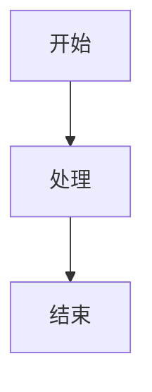

# 开发Markdown文档规则

## 一、核心原则

### 1.1 文档定位
- 文档内容必须**紧紧结合文件名称**，不发散扩展
- 知识库准确，基于行业标准和最佳实践
- 语言简洁清晰，便于理解

### 1.2 目标用户
- 后端开发工程师
- 系统架构师
- 技术学习者

## 二、文档结构规范

### 2.1 标题层级

```markdown
# 一级标题（文档主题）
## 二级标题（主要章节）
### 三级标题（子章节）
#### 四级标题（小节）
```

### 2.2 标准结构

| 章节 | 说明 | 是否必需 |
|------|------|----------|
| **概述** | 介绍文档主题和目的 | 必需 |
| **核心概念** | 讲解基础概念 | 必需 |
| **实现原理** | 深入分析技术原理 | 建议 |
| **代码示例** | 提供可运行代码 | 建议 |
| **最佳实践** | 分享使用建议 | 建议 |
| **总结** | 总结核心要点 | 必需 |

## 三、内容要求

### 3.1 准确性
- 技术知识点必须准确无误
- 引用权威来源
- 代码示例可运行

### 3.2 完整性
- 覆盖核心知识点
- 提供足够的细节说明
- 包含必要的示例代码

### 3.3 实用性
- 提供可操作的指导
- 包含实际应用场景
- 分享经验教训

## 四、格式规范

### 4.1 代码块

使用语言标识确保语法高亮：

```markdown
```java
public class Example {
    // 代码内容
}
```
```

### 4.2 表格

使用标准Markdown表格：

```markdown
| 列1 | 列2 | 列3 |
|------|------|------|
| 内容1 | 内容2 | 内容3 |
```

### 4.3 流程图

使用Mermaid绘制流程图：

```markdown

```

### 4.4 列表

- 使用无序列表表示并列项
- 使用有序列表表示步骤

## 五、代码示例规范

### 5.1 代码质量
- 代码格式规范
- 注释清晰
- 可直接运行

### 5.2 示例结构

```markdown
#### 示例标题

**功能说明**：简要说明代码功能

```java
// 代码示例
```

**关键点**：
- 关键点1
- 关键点2
```

## 六、流程图使用规范

### 6.1 适用场景
- 展示流程步骤
- 展示架构关系
- 展示决策逻辑

### 6.2 图表类型

| 类型 | 语法 | 适用场景 |
|------|------|----------|
| **流程图** | `flowchart` | 流程步骤 |
| **时序图** | `sequenceDiagram` | 交互流程 |
| **状态图** | `stateDiagram` | 状态转换 |
| **类图** | `classDiagram` | 类关系 |

## 七、最佳实践

### 7.1 命名规范
- 文件名称清晰描述内容
- 使用英文小写字母和连字符
- 避免使用特殊字符

### 7.2 版本控制
- 定期更新维护
- 记录变更历史
- 保持文档与代码同步

### 7.3 可维护性
- 结构清晰，易于扩展
- 使用模板保持一致性
- 避免重复内容

## 八、检查清单

在提交文档前，检查以下内容：

- [ ] 文档内容与文件名匹配
- [ ] 结构完整，符合规范
- [ ] 代码示例可运行
- [ ] 流程图正确渲染
- [ ] 语言简洁清晰
- [ ] 无语法错误

## 九、总结

开发Markdown文档时，请遵循以下核心原则：

1. **准确性**：确保技术内容正确无误
2. **完整性**：覆盖核心知识点
3. **实用性**：提供可操作的指导
4. **规范性**：遵循统一的格式规范

通过以上规则，确保产出高质量的技术文档，帮助读者快速理解和掌握相关技术知识。
