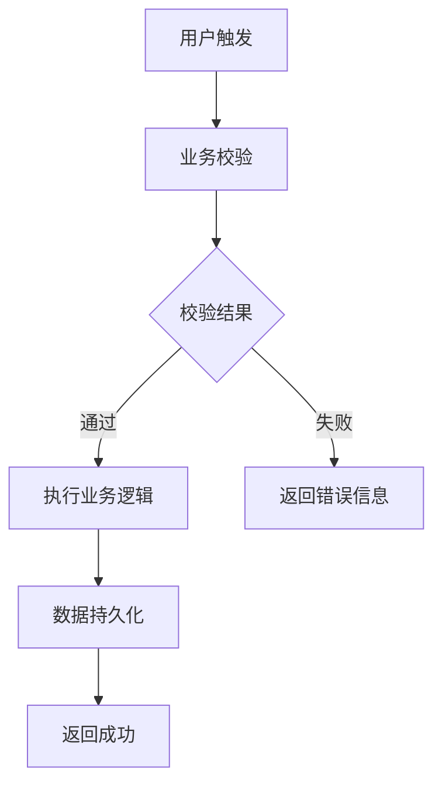
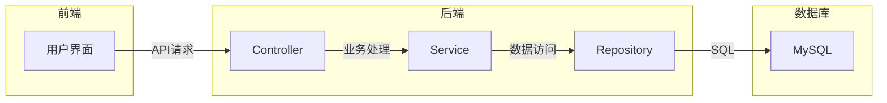
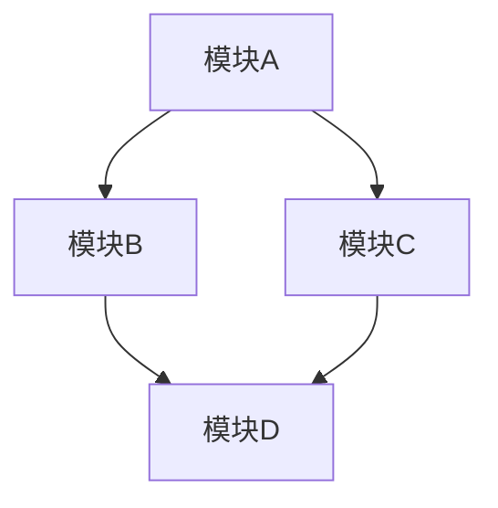

# 开发需求方案设计文档

## 一、需求背景

### 1.1 业务背景
描述需求产生的业务背景和原因，包括：
- 业务场景说明
- 现有系统问题
- 需求来源（产品、运营、客户等）
- 预期收益

### 1.2 目标用户
明确需求的目标用户群体：
- 用户角色
- 用户特征
- 使用场景

### 1.3 相关文档
列出相关的参考文档：
- 产品需求文档（PRD）
- 原型设计
- 相关技术文档

---

## 二、需求描述

### 2.1 需求概述
用简洁的语言描述需求的核心内容：
- 需求名称
- 需求编号
- 需求来源
- 优先级（P0/P1/P2）
- 预计排期

### 2.2 功能需求
详细描述需要实现的功能：

| 功能点 | 描述 | 优先级 | 关联模块 |
|--------|------|--------|----------|
| 功能1 | 具体描述 | P0 | 模块A |
| 功能2 | 具体描述 | P1 | 模块B |
| 功能3 | 具体描述 | P1 | 模块C |

### 2.3 非功能需求
描述非功能方面的要求：
- 性能要求
- 安全性要求
- 兼容性要求
- 可用性要求

---

## 三、需求分析

### 3.1 业务流程分析



### 3.2 数据流向分析



### 3.3 核心业务规则
列出核心业务规则和约束条件：
- 规则1：XXX
- 规则2：XXX
- 规则3：XXX

---

## 四、功能模块设计

### 4.1 模块划分

| 模块名称 | 职责描述 | 状态 | 负责人 |
|----------|----------|------|--------|
| 模块A | 负责XXX功能 | 待开发 | 张三 |
| 模块B | 负责XXX功能 | 待开发 | 李四 |
| 模块C | 负责XXX功能 | 待评估 | - |

### 4.2 模块关系



### 4.3 关键类设计

| 类名 | 职责 | 所属模块 | 关键方法 |
|------|------|----------|----------|
| ClassA | 处理XXX业务 | 模块A | methodA(), methodB() |
| ClassB | 处理XXX业务 | 模块B | methodC(), methodD() |

---

## 五、数据库设计

### 5.1 新增/修改表

#### 表1：表名

| 字段名 | 类型 | 约束 | 说明 |
|--------|------|------|------|
| id | BIGINT | PRIMARY KEY, AUTO_INCREMENT | 主键 |
| field1 | VARCHAR(255) | NOT NULL | 字段1 |
| field2 | INT | DEFAULT 0 | 字段2 |
| created_at | DATETIME | NOT NULL | 创建时间 |
| updated_at | DATETIME | NOT NULL | 更新时间 |

#### 表2：表名（如需要）

| 字段名 | 类型 | 约束 | 说明 |
|--------|------|------|------|
| id | BIGINT | PRIMARY KEY, AUTO_INCREMENT | 主键 |
| ... | ... | ... | ... |

### 5.2 索引设计

| 表名 | 索引名 | 字段 | 类型 |
|------|--------|------|------|
| table1 | idx_field1 | field1 | 普通索引 |
| table1 | uk_field2 | field2 | 唯一索引 |

### 5.3 数据迁移
说明数据迁移方案（如需要）：
- 迁移内容
- 迁移策略
- 回滚方案

---

## 六、接口设计

### 6.1 接口列表

| API路径 | HTTP方法 | 所属模块 | 功能描述 |
|---------|----------|----------|----------|
| /api/v1/xxx | POST | 模块A | 创建XXX |
| /api/v1/xxx/{id} | GET | 模块A | 查询XXX详情 |
| /api/v1/xxx/{id} | PUT | 模块A | 更新XXX |
| /api/v1/xxx/{id} | DELETE | 模块A | 删除XXX |

### 6.2 接口详细设计

#### 接口1：POST /api/v1/xxx

**请求体：**
```json
{
    "field1": "value1",
    "field2": 123,
    "field3": {
        "nestedField": "value"
    }
}
```

**响应体：**
```json
{
    "code": 200,
    "message": "success",
    "data": {
        "id": 1,
        "field1": "value1",
        "field2": 123,
        "createdAt": "2024-01-01 12:00:00"
    }
}
```

#### 接口2：GET /api/v1/xxx/{id}

**路径参数：**

| 参数名 | 类型 | 必填 | 说明 |
|--------|------|------|------|
| id | Long | 是 | 资源ID |

**响应体：**
```json
{
    "code": 200,
    "message": "success",
    "data": {
        "id": 1,
        "field1": "value1",
        "field2": 123
    }
}
```

---

## 七、测试影响点

### 7.1 单元测试
- 需要新增的单元测试用例
- 需要修改的单元测试用例

### 7.2 集成测试
- 需要覆盖的集成场景
- 接口联调测试

### 7.3 回归测试
- 受影响的现有功能
- 需要回归的测试用例

### 7.4 测试数据准备
- 需要准备的测试数据
- 数据初始化方案

---

## 八、上线清单

### 8.1 前置条件
- [ ] 代码评审通过
- [ ] 测试用例全部通过
- [ ] 依赖服务已就绪
- [ ] 数据库变更已确认

### 8.2 上线步骤

| 步骤 | 操作内容 | 负责人 | 预计时间 |
|------|----------|--------|----------|
| 1 | 备份数据库 | DBA | 10分钟 |
| 2 | 部署代码到测试环境 | 开发 | 15分钟 |
| 3 | 执行数据库迁移 | DBA | 5分钟 |
| 4 | 启动服务 | 运维 | 5分钟 |
| 5 | 执行冒烟测试 | 测试 | 20分钟 |
| 6 | 验证核心功能 | 产品 | 10分钟 |

### 8.3 回滚方案
- 回滚步骤说明
- 回滚条件
- 回滚时间预估

### 8.4 监控指标
- 需要监控的指标
- 告警阈值设置
- 异常处理流程

---

## 九、风险评估

### 9.1 风险列表

| 风险点 | 风险等级 | 影响范围 | 缓解措施 |
|--------|----------|----------|----------|
| 数据库迁移失败 | 高 | 数据层 | 提前备份，准备回滚脚本 |
| 性能问题 | 中 | 系统整体 | 压测验证，性能优化 |
| 接口兼容性 | 中 | 上下游系统 | 版本兼容，灰度发布 |

### 9.2 应急预案
- 故障响应流程
- 紧急联系人
- 应急处理步骤

---

## 十、附录

### 10.1 术语表
| 术语 | 定义 |
|------|------|
| 术语1 | 定义说明 |
| 术语2 | 定义说明 |

### 10.2 参考链接
- [相关PRD文档]()
- [原型设计]()
- [技术方案评审记录]()
