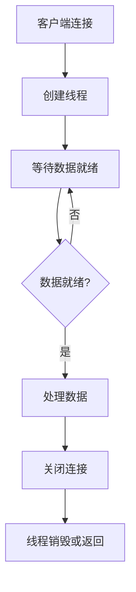
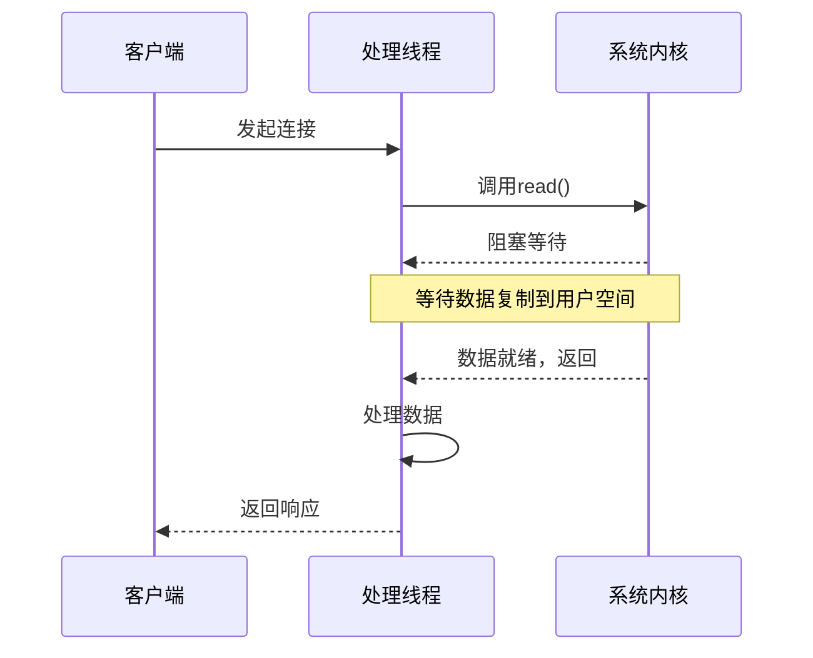
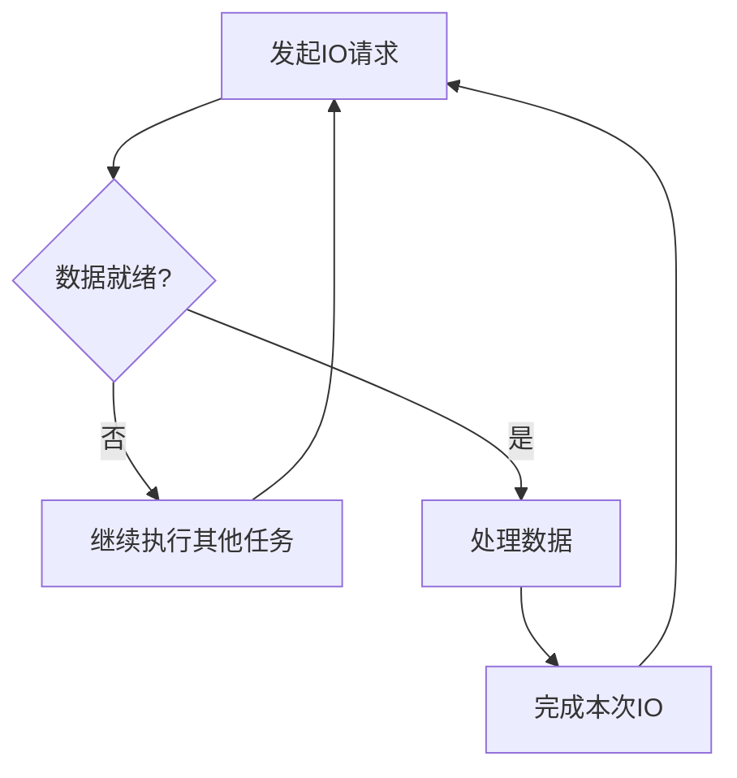
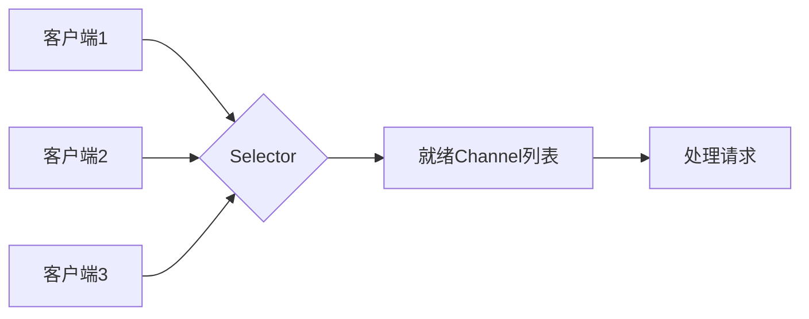
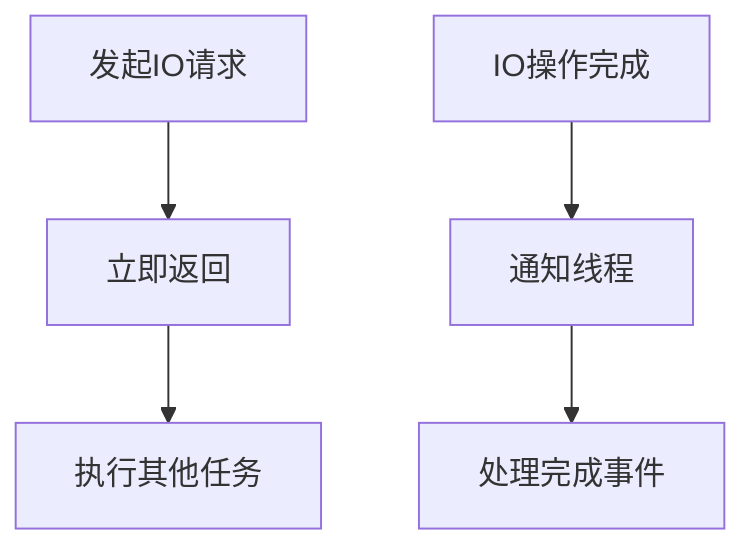
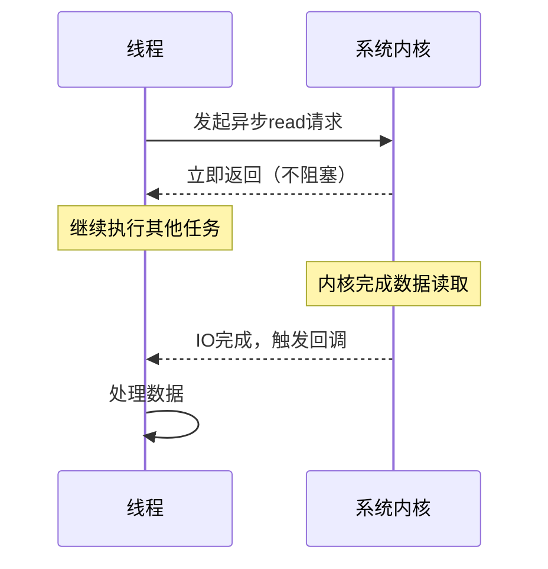
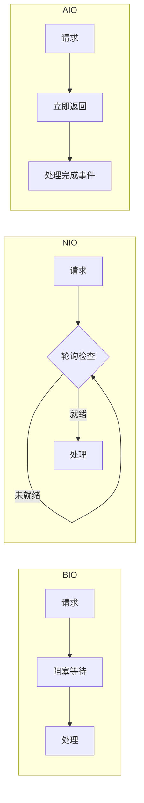
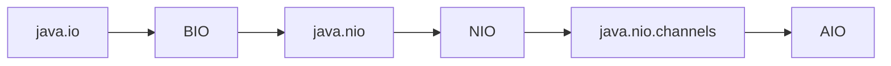

# IO模型

## 一、IO模型概述

IO（Input/Output）模型是操作系统处理输入输出的方式，主要有四种基本的I/O模型：

| IO模型 | 类型 | 说明 |
|--------|------|------|
| **同步阻塞IO（BIO）** | 同步阻塞 | 等待数据就绪后返回 |
| **同步非阻塞IO（NIO）** | 同步非阻塞 | 立即返回，定期轮询 |
| **异步IO（AIO）** | 异步非阻塞 | 操作完成后通知 |
| **信号驱动IO** | 较少使用 | 信号通知 |

---

## 二、同步阻塞IO（BIO）

### 2.1 原理

同步阻塞IO是最传统的IO模型，当线程发起IO请求时会阻塞，直到IO操作完成。



### 2.2 工作流程



### 2.3 代码示例

```java
// BIO服务器
public class BioServer {
    
    public static void main(String[] args) throws IOException {
        ServerSocket serverSocket = new ServerSocket(8080);
        System.out.println("BIO服务器启动，端口：8080");
        
        while (true) {
            // 阻塞等待客户端连接
            Socket socket = serverSocket.accept();
            System.out.println("收到客户端连接：" + socket.getRemoteSocketAddress());
            
            // 为每个连接创建新线程处理
            new Thread(() -> {
                try {
                    handler(socket);
                } catch (IOException e) {
                    e.printStackTrace();
                }
            }).start();
        }
    }
    
    private static void handler(Socket socket) throws IOException {
        try (BufferedReader reader = new BufferedReader(
                new InputStreamReader(socket.getInputStream()));
             PrintWriter writer = new PrintWriter(
                     socket.getOutputStream(), true)) {
            
            String message;
            while ((message = reader.readLine()) != null) {
                System.out.println("收到消息：" + message);
                writer.println("服务器响应：" + message);
            }
        } catch (IOException e) {
            e.printStackTrace();
        }
    }
}
```

### 2.4 特点

| 优点 | 缺点 |
|------|------|
| 实现简单 | 每个连接一个线程，资源消耗大 |
| 编程方便 | 线程切换开销大 |
| 适合低并发 | 不适合高并发场景 |

### 2.5 适用场景

- 连接数量较少的场景
- 每次连接操作时间较长的场景
- 开发调试简单的客户端-服务器通信

---

## 三、同步非阻塞IO（NIO）

### 3.1 原理

同步非阻塞IO允许线程发起IO请求后立即返回，线程通过轮询检查IO状态。



### 3.2 核心组件

NIO的三大核心组件：

| 组件 | 说明 |
|------|------|
| **Buffer** | 缓冲区，用于读写数据 |
| **Channel** | 通道，表示打开的连接 |
| **Selector** | 选择器，多路复用器 |

### 3.3 代码示例

```java
// NIO服务器
public class NioServer {
    
    public static void main(String[] args) throws IOException {
        Selector selector = Selector.open();
        
        ServerSocketChannel serverChannel = ServerSocketChannel.open();
        serverChannel.bind(new InetSocketAddress(8080));
        serverChannel.configureBlocking(false);  // 非阻塞模式
        serverChannel.register(selector, SelectionKey.OP_ACCEPT);
        
        System.out.println("NIO服务器启动，端口：8080");
        
        while (true) {
            // 阻塞等待就绪的Channel
            selector.select();
            
            // 处理所有就绪的Channel
            Set<SelectionKey> keys = selector.selectedKeys();
            Iterator<SelectionKey> iterator = keys.iterator();
            
            while (iterator.hasNext()) {
                SelectionKey key = iterator.next();
                iterator.remove();
                
                if (key.isAcceptable()) {
                    handleAccept(key);
                } else if (key.isReadable()) {
                    handleRead(key);
                }
            }
        }
    }
    
    private static void handleAccept(SelectionKey key) throws IOException {
        ServerSocketChannel server = (ServerSocketChannel) key.channel();
        SocketChannel client = server.accept();
        client.configureBlocking(false);
        client.register(key.selector(), SelectionKey.OP_READ);
        System.out.println("收到客户端连接：" + client.getRemoteAddress());
    }
    
    private static void handleRead(SelectionKey key) throws IOException {
        SocketChannel client = (SocketChannel) key.channel();
        ByteBuffer buffer = ByteBuffer.allocate(1024);
        int read = client.read(buffer);
        
        if (read > 0) {
            buffer.flip();
            String message = StandardCharsets.UTF_8.decode(buffer).toString();
            System.out.println("收到消息：" + message);
            
            // 响应客户端
            String response = "服务器响应：" + message;
            ByteBuffer responseBuffer = ByteBuffer.wrap(response.getBytes());
            client.write(responseBuffer);
        } else if (read == -1) {
            client.close();
            System.out.println("客户端断开连接");
        }
    }
}
```

### 3.4 Selector工作原理



### 3.5 特点

| 优点 | 缺点 |
|------|------|
| 单线程处理多连接 | 实现较复杂 |
| 非阻塞IO | 需要手动管理Buffer |
| 高并发支持 | 错误处理较繁琐 |

### 3.6 适用场景

- 高并发连接场景
- 长连接场景
- 聊天服务器、游戏服务器等

---

## 四、异步IO（AIO）

### 4.1 原理

异步IO是最高效的IO模型，线程发起IO请求后立即返回，当IO操作完成时由操作系统通知线程。



### 4.2 工作流程



### 4.3 代码示例

```java
// AIO服务器
public class AioServer {
    
    public static void main(String[] args) throws Exception {
        AsynchronousServerSocketChannel serverChannel = 
            AsynchronousServerSocketChannel.open()
            .bind(new InetSocketAddress(8080));
        
        System.out.println("AIO服务器启动，端口：8080");
        
        // 异步接受连接
        serverChannel.accept(null, new CompletionHandler<AsynchronousSocketChannel, Object>() {
            @Override
            public void completed(AsynchronousSocketChannel client, Object attachment) {
                // 继续接受下一个连接
                serverChannel.accept(null, this);
                handle(client);
            }
            
            @Override
            public void failed(Throwable exc, Object attachment) {
                exc.printStackTrace();
            }
        });
        
        // 主线程保持运行
        Thread.sleep(Long.MAX_VALUE);
    }
    
    private static void handle(AsynchronousSocketChannel channel) {
        ByteBuffer buffer = ByteBuffer.allocate(1024);
        
        channel.read(buffer, buffer, new CompletionHandler<Integer, ByteBuffer>() {
            @Override
            public void completed(Integer result, ByteBuffer attachment) {
                if (result > 0) {
                    attachment.flip();
                    String message = StandardCharsets.UTF_8.decode(attachment).toString();
                    System.out.println("收到消息：" + message);
                    
                    // 响应客户端
                    String response = "服务器响应：" + message;
                    ByteBuffer responseBuffer = ByteBuffer.wrap(response.getBytes());
                    channel.write(responseBuffer);
                }
            }
            
            @Override
            public void failed(Throwable exc, ByteBuffer attachment) {
                exc.printStackTrace();
            }
        });
    }
}
```

### 4.4 特点

| 优点 | 缺点 |
|------|------|
| 真正异步非阻塞 | API较复杂 |
| 最高效的IO模型 | Windows支持好，Linux支持一般 |
| 代码简洁 | 需要JDK 7+ |

### 4.5 适用场景

- 高性能Web服务器
- 文件处理服务
- 需要极致性能的后端服务

---

## 五、三种IO模型对比

### 5.1 核心对比表

| 特性 | BIO | NIO | AIO |
|------|-----|-----|-----|
| **IO类型** | 同步阻塞 | 同步非阻塞 | 异步非阻塞 |
| **编程复杂度** | 简单 | 中等 | 复杂 |
| **线程数** | 多线程 | 单线程/少线程 | 事件驱动 |
| **阻塞方式** | 阻塞等待 | 非阻塞轮询 | 完全不阻塞 |
| **数据就绪通知** | 无 | 状态轮询 | 回调通知 |
| **吞吐量** | 低 | 高 | 最高 |
| **适用场景** | 低并发 | 高并发 | 极致性能 |

### 5.2 工作流程对比图



### 5.3 选择建议

| 场景 | 推荐模型 |
|------|----------|
| 连接数少 (<100) | BIO |
| 连接数多 (>1000) | NIO |
| 需要极致性能 | AIO |
| 追求开发效率 | BIO |
| 复杂业务逻辑 | NIO |

---

## 六、Java IO发展历程



| JDK版本 | IO支持 |
|---------|--------|
| JDK 1.0 | BIO (InputStream/OutputStream) |
| JDK 1.4 | NIO (Buffer/Channel/Selector) |
| JDK 1.7 | AIO (AsynchronousChannel) |

---

## 七、总结

### 7.1 核心要点

| 要点 | 说明 |
|------|------|
| **BIO** | 同步阻塞，实现简单，适合低并发 |
| **NIO** | 同步非阻塞，单线程处理多连接，适合高并发 |
| **AIO** | 异步非阻塞，性能最高，实现复杂 |

### 7.2 选择原则

1. **低并发场景**：选择BIO，开发维护简单
2. **高并发场景**：选择NIO，性价比最高
3. **极致性能场景**：选择AIO，需要充分测试

### 7.3 发展趋势

随着JDK的升级，AIO在Linux上的支持也在不断完善，未来AIO可能会成为高性能服务器的首选。
