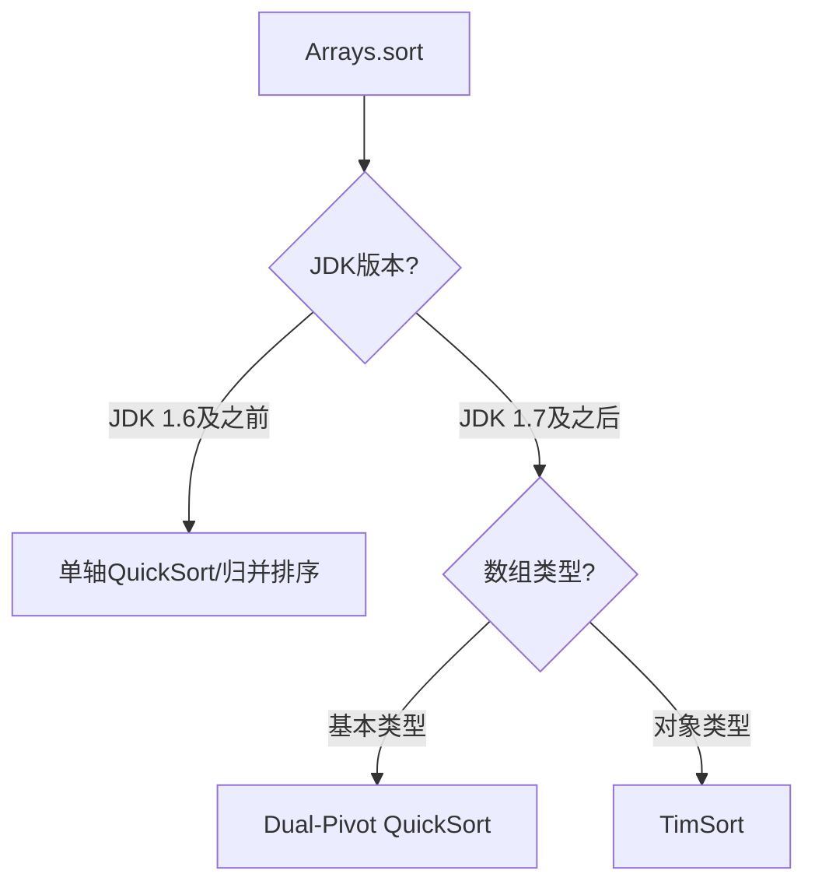
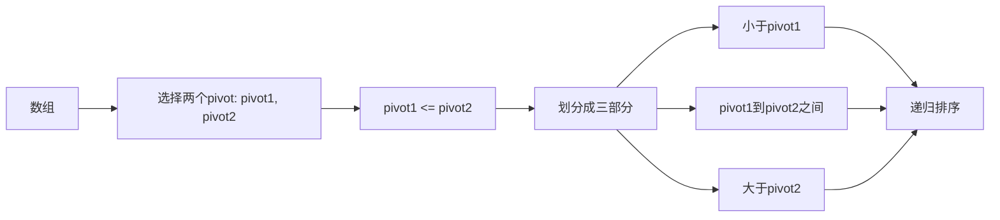
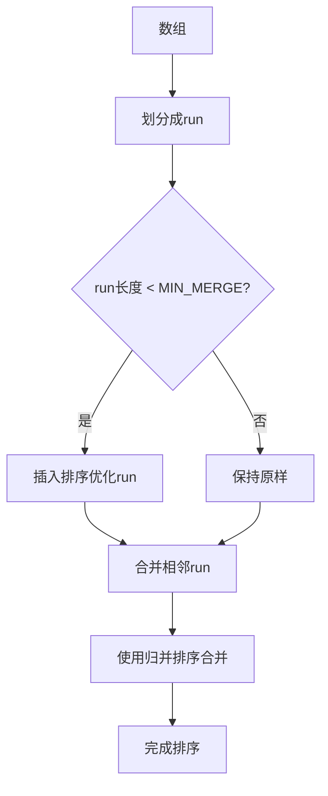
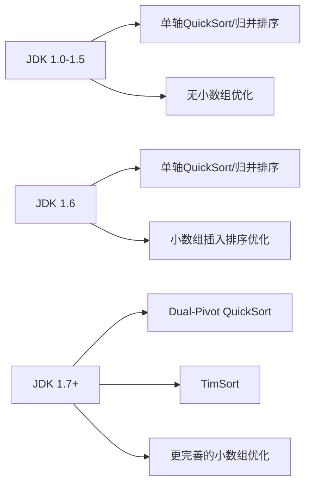
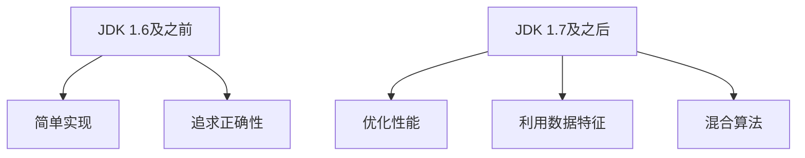

# Arrays.sort排序算法详解

## 一、Arrays.sort概述

### 1.1 JDK版本说明

**本文档描述的是JDK 1.7及之后版本**的`Arrays.sort`实现。在JDK 1.7中，Java对排序算法进行了重大优化：

| JDK版本 | 基本类型排序 | 对象数组排序 |
|---------|-------------|-------------|
| **JDK 1.6及之前** | 单轴快速排序 | 归并排序 |
| **JDK 1.7及之后** | **Dual-Pivot QuickSort** | **TimSort** |

### 1.2 算法选择策略



### 1.3 当前版本（JDK 1.7+）的算法选择

| 数组类型 | 使用的排序算法 | 时间复杂度 | 稳定性 |
|----------|--------------|------------|--------|
| **基本类型数组**（int[], long[], char[]等） | **Dual-Pivot QuickSort**（双轴快速排序） | O(n log n) | 不稳定 |
| **对象数组**（Object[]） | **TimSort**（归并排序的优化版本） | O(n log n) | 稳定 |
| **小数组**（长度 < 47） | **插入排序** | O(n²) | 稳定 |

---

## 二、基本类型数组排序 - Dual-Pivot QuickSort（JDK 1.7+）

### 2.1 引入背景

在JDK 1.7之前，基本类型数组使用普通的单轴快速排序。JDK 1.7引入了**双轴快速排序**，由Vladimir Yaroslavskiy提出，性能比传统快排提升约10-20%。

### 2.2 算法原理

双轴快速排序使用两个基准元素（pivot）将数组划分为三部分：



### 2.3 核心步骤

```java
// Dual-Pivot QuickSort核心逻辑（JDK 1.7+）
public static void sort(int[] a, int left, int right) {
    // 1. 小数组优化：使用插入排序
    if (right - left < INSERTIONSORT_THRESHOLD) {  // INSERTIONSORT_THRESHOLD = 47
        insertionSort(a, left, right);
        return;
    }
    
    // 2. 选择两个pivot（取三个元素的中值）
    int mid = (left + right) >>> 1;
    int pivot1 = a[left];
    int pivot2 = a[right];
    
    // 3. 确保pivot1 <= pivot2
    if (pivot1 > pivot2) {
        swap(a, left, right);
        pivot1 = a[left];
        pivot2 = a[right];
    }
    
    // 4. 划分指针
    int less = left + 1;
    int great = right - 1;
    int k = less;
    
    // 5. 遍历数组进行划分
    while (k <= great) {
        if (a[k] < pivot1) {
            swap(a, k++, less++);
        } else if (a[k] > pivot2) {
            swap(a, k, great--);
        } else {
            k++;
        }
    }
    
    // 6. 将pivot放到正确位置
    swap(a, left, --less);
    swap(a, right, ++great);
    
    // 7. 递归排序三部分
    sort(a, left, less - 1);
    sort(a, less + 1, great - 1);
    sort(a, great + 1, right);
}
```

### 2.4 算法优势

| 优势 | 说明 |
|------|------|
| **减少递归深度** | 双轴划分使每次递归处理更小的子数组 |
| **更好的缓存局部性** | 数据访问更连续，缓存命中率更高 |
| **减少比较次数** | 单次比较可以确定元素属于哪个区间 |
| **性能提升** | 相比单轴快排，性能提升约10-20% |

---

## 三、对象数组排序 - TimSort（JDK 1.7+）

### 3.1 引入背景

在JDK 1.7之前，对象数组使用传统的归并排序。JDK 1.7引入了**TimSort**，这是一种混合排序算法，由Tim Peters在2002年为Python设计。

### 3.2 算法原理

TimSort结合了归并排序和插入排序的优点，特别适合处理**部分有序**的数据：



### 3.3 Run的概念

**Run**是数组中已经有序的片段：
- **自然run**：数组中本身就有序的连续元素
- **MIN_MERGE**：最小run长度，默认32（JDK 1.7+）
- 长度小于MIN_MERGE的run会使用插入排序优化

### 3.4 核心步骤

```java
// TimSort核心逻辑（JDK 1.7+简化版）
public static void sort(Object[] a) {
    int n = a.length;
    
    // 1. 最小run长度（MIN_MERGE = 32）
    int minRun = minRunLength(n);
    
    // 2. 划分并优化每个run
    for (int i = 0; i < n; i += minRun) {
        int end = Math.min(i + minRun, n);
        // 对每个run使用插入排序优化
        binarySort(a, i, end);
    }
    
    // 3. 合并run（使用栈管理）
    // 合并策略：保证栈中run满足一定的大小关系
    // len3 > len2 + len1
    // len2 > len1
    for (int size = minRun; size < n; size *= 2) {
        for (int left = 0; left < n; left += 2 * size) {
            int mid = left + size - 1;
            int right = Math.min(left + 2 * size - 1, n - 1);
            
            if (mid < right) {
                merge(a, left, mid, right);
            }
        }
    }
}
```

### 3.5 算法优势

| 优势 | 说明 |
|------|------|
| **稳定性** | 保持相等元素的相对顺序，适合对象排序 |
| **处理部分有序数据** | 对于部分有序数组性能接近O(n) |
| **减少数据移动** | 归并排序比快速排序移动次数少 |
| **自适应** | 根据数据特征自动调整策略 |

---

## 四、JDK版本对比

### 4.1 排序算法演变



### 4.2 版本特性对比

| 特性 | JDK 1.6及之前 | JDK 1.7及之后 |
|------|--------------|---------------|
| **基本类型排序** | 单轴QuickSort | Dual-Pivot QuickSort |
| **对象数组排序** | 归并排序 | TimSort |
| **小数组阈值** | 较小（如7） | 较大（47） |
| **稳定性** | 对象排序稳定 | 对象排序稳定 |
| **性能** | 较好 | 更好（提升10-20%） |

---

## 五、实际应用示例

### 5.1 基本类型数组排序

```java
// JDK 1.7+ 使用 Dual-Pivot QuickSort
int[] arr = {3, 1, 4, 1, 5, 9, 2, 6};
Arrays.sort(arr);
// 结果: [1, 1, 2, 3, 4, 5, 6, 9]
```

### 5.2 对象数组排序

```java
// JDK 1.7+ 使用 TimSort（稳定排序）
String[] arr = {"banana", "apple", "cherry", "Apple"};
Arrays.sort(arr);
// 结果: [Apple, apple, banana, cherry]（保持大小写顺序）
```

### 5.3 自定义比较器排序

```java
Person[] people = {
    new Person("张三", 25),
    new Person("李四", 20),
    new Person("王五", 30)
};

// 使用TimSort稳定排序
Arrays.sort(people, Comparator.comparingInt(Person::getAge));
```

---

## 六、总结

### 6.1 核心要点

| JDK版本 | 基本类型排序 | 对象数组排序 |
|---------|-------------|-------------|
| **JDK 1.6及之前** | 单轴QuickSort | 归并排序 |
| **JDK 1.7及之后** | **Dual-Pivot QuickSort** | **TimSort** |

### 6.2 设计思想演变



### 6.3 性能特点

| 数据特征 | JDK 1.6及之前 | JDK 1.7及之后 |
|----------|--------------|---------------|
| **随机数据** | O(n log n) | O(n log n)（更快） |
| **部分有序** | O(n log n) | 接近O(n) |
| **小数组** | O(n²) | O(n²)（阈值更高） |

**总结**：本文档描述的排序算法（Dual-Pivot QuickSort和TimSort）是**JDK 1.7及之后版本**的实现，相比之前版本有显著的性能提升！
