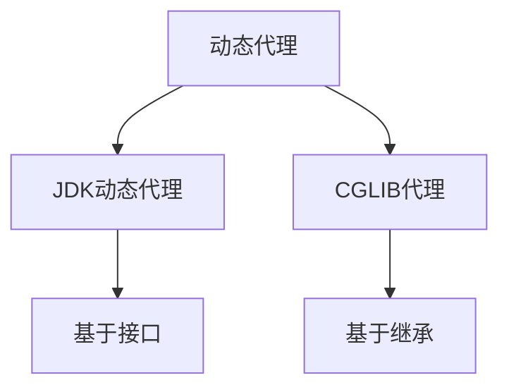
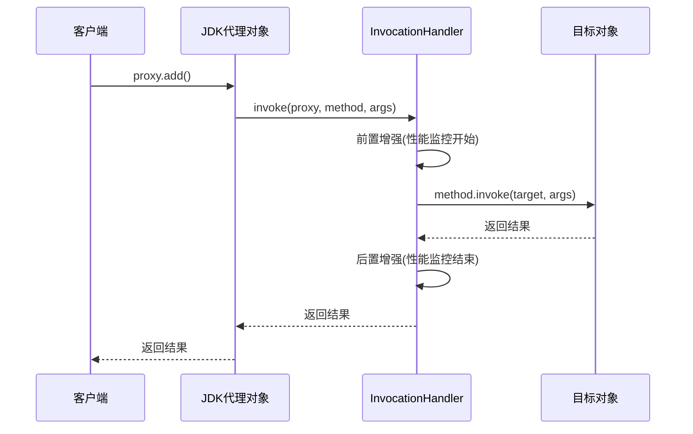
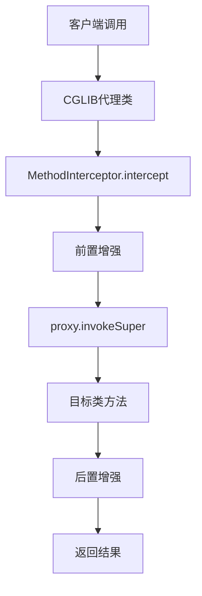
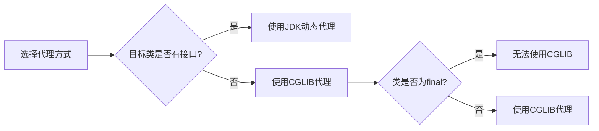

# Java动态代理

## 一、动态代理概念

### 1.1 什么是动态代理

动态代理是一种设计模式，允许在**运行时**动态创建代理对象，代理对象可以：
- 拦截目标对象的方法调用
- 在方法执行前后添加额外逻辑
- 无需手动编写代理类

### 1.2 应用场景

| 场景 | 说明 |
|------|------|
| **AOP编程** | 实现切面逻辑（日志、事务、权限） |
| **RPC框架** | 远程方法调用的透明化 |
| **Mock测试** | 模拟外部服务 |
| **性能监控** | 方法执行时间统计 |

### 1.3 动态代理分类



---

## 二、JDK动态代理

### 2.1 核心组件

| 组件 | 说明 |
|------|------|
| **Proxy** | 生成代理对象的工具类 |
| **InvocationHandler** | 方法调用处理器 |
| **Interface** | 目标对象必须实现的接口 |

### 2.2 代码示例

#### 步骤1：定义接口

```java
public interface UserService {
    void add();
    void delete();
}
```

#### 步骤2：实现目标类

```java
public class UserServiceImpl implements UserService {
    
    @Override
    public void add() {
        System.out.println("----------------------add----------------------");
    }
    
    @Override
    public void delete() {
        System.out.println("----------------------delete----------------------");
    }
}
```

#### 步骤3：实现InvocationHandler

```java
import java.lang.reflect.InvocationHandler;
import java.lang.reflect.Method;
import java.lang.reflect.Proxy;

public class MyInvocationHandler implements InvocationHandler {
    
    private Object target;
    
    public MyInvocationHandler(Object target) {
        this.target = target;
    }
    
    @Override
    public Object invoke(Object proxy, Method method, Object[] args) throws Throwable {
        // 前置增强：性能监控开始
        PerformanceMonitor.begin(target.getClass().getName() + "." + method.getName());
        
        // 执行目标方法
        Object result = method.invoke(target, args);
        
        // 后置增强：性能监控结束
        PerformanceMonitor.end();
        
        return result;
    }
    
    public Object getProxy() {
        return Proxy.newProxyInstance(
            Thread.currentThread().getContextClassLoader(),
            target.getClass().getInterfaces(),
            this
        );
    }
}
```

#### 步骤4：性能监控工具类

```java
public class PerformanceMonitor {
    
    private static ThreadLocal<Long> startTime = new ThreadLocal<>();
    
    public static void begin(String methodName) {
        startTime.set(System.currentTimeMillis());
        System.out.println("开始监控: " + methodName);
    }
    
    public static void end() {
        long duration = System.currentTimeMillis() - startTime.get();
        System.out.println("监控结束, 耗时: " + duration + "ms");
        startTime.remove();
    }
}
```

#### 步骤5：测试代码

```java
public class DynamicProxyTest {
    
    public static void main(String[] args) {
        // 创建目标对象
        UserService service = new UserServiceImpl();
        
        // 创建调用处理器
        MyInvocationHandler handler = new MyInvocationHandler(service);
        
        // 获取代理对象
        UserService proxy = (UserService) handler.getProxy();
        
        // 调用代理方法
        proxy.add();
        proxy.delete();
    }
}
```

### 2.3 执行流程



### 2.4 核心API说明

```java
// 创建代理对象
Proxy.newProxyInstance(
    ClassLoader loader,           // 类加载器
    Class<?>[] interfaces,       // 目标对象实现的接口
    InvocationHandler h          // 调用处理器
);
```

---

## 三、CGLIB代理

### 3.1 CGLIB简介

**CGLIB（Code Generation Library）** 是一个代码生成类库，可以在运行时动态生成某个类的子类。

> **注意**：CGLIB是通过继承的方式实现动态代理，因此如果某个类被标记为`final`，它无法使用CGLIB动态代理。

### 3.2 代码示例

#### 步骤1：添加依赖

```xml
<dependency>
    <groupId>cglib</groupId>
    <artifactId>cglib</artifactId>
    <version>3.3.0</version>
</dependency>
```

#### 步骤2：定义目标类（无需接口）

```java
public class UserService {
    
    public void add() {
        System.out.println("----------------------add----------------------");
    }
    
    public void delete() {
        System.out.println("----------------------delete----------------------");
    }
}
```

#### 步骤3：实现MethodInterceptor

```java
import net.sf.cglib.proxy.Enhancer;
import net.sf.cglib.proxy.MethodInterceptor;
import net.sf.cglib.proxy.MethodProxy;
import java.lang.reflect.Method;

public class MyMethodInterceptor implements MethodInterceptor {
    
    @Override
    public Object intercept(Object obj, Method method, Object[] args, MethodProxy proxy) throws Throwable {
        // 前置增强
        PerformanceMonitor.begin(method.getName());
        
        // 执行目标方法
        Object result = proxy.invokeSuper(obj, args);
        
        // 后置增强
        PerformanceMonitor.end();
        
        return result;
    }
    
    public Object getProxy(Class<?> targetClass) {
        Enhancer enhancer = new Enhancer();
        enhancer.setSuperclass(targetClass);
        enhancer.setCallback(this);
        return enhancer.create();
    }
}
```

#### 步骤4：测试代码

```java
public class CglibProxyTest {
    
    public static void main(String[] args) {
        MyMethodInterceptor interceptor = new MyMethodInterceptor();
        UserService proxy = (UserService) interceptor.getProxy(UserService.class);
        
        proxy.add();
        proxy.delete();
    }
}
```

### 3.3 CGLIB执行流程



---

## 四、JDK动态代理 vs CGLIB代理

### 4.1 对比表格

| 特性 | JDK动态代理 | CGLIB代理 |
|------|------------|-----------|
| **代理方式** | 基于接口实现 | 基于继承 |
| **目标类要求** | 必须实现接口 | 无需接口 |
| **final类** | 不影响 | 无法代理 |
| **final方法** | 不影响 | 无法拦截 |
| **性能** | 调用稍慢 | 调用较快 |
| **生成类数量** | 一个代理类 | 可能生成多个类 |
| **JDK版本** | JDK 1.3+ | 需要额外依赖 |

### 4.2 选择建议



### 4.3 Spring AOP中的选择

Spring AOP默认策略：
- 如果目标对象实现了接口 → 使用JDK动态代理
- 如果目标对象没有实现接口 → 使用CGLIB代理
- 可以通过配置强制使用CGLIB：`@EnableAspectJAutoProxy(proxyTargetClass = true)`

---

## 五、总结

### 5.1 核心要点

| 代理方式 | 原理 | 适用场景 |
|----------|------|----------|
| **JDK动态代理** | 实现接口 | 目标类有接口 |
| **CGLIB代理** | 继承目标类 | 目标类无接口 |

### 5.2 最佳实践

1. **优先使用JDK动态代理**：无额外依赖，JDK原生支持
2. **需要代理无接口类时使用CGLIB**
3. **避免final方法**：CGLIB无法拦截final方法
4. **注意性能差异**：CGLIB在方法调用上性能更好

### 5.3 应用示例

```java
// 统一代理工厂
public class ProxyFactory {
    
    public static <T> T createJdkProxy(T target) {
        MyInvocationHandler handler = new MyInvocationHandler(target);
        return (T) handler.getProxy();
    }
    
    public static <T> T createCglibProxy(Class<T> clazz) {
        MyMethodInterceptor interceptor = new MyMethodInterceptor();
        return (T) interceptor.getProxy(clazz);
    }
}
```

动态代理是Java中实现AOP的基础，理解其原理对于深入理解Spring框架至关重要！
