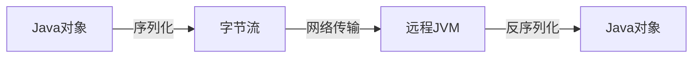
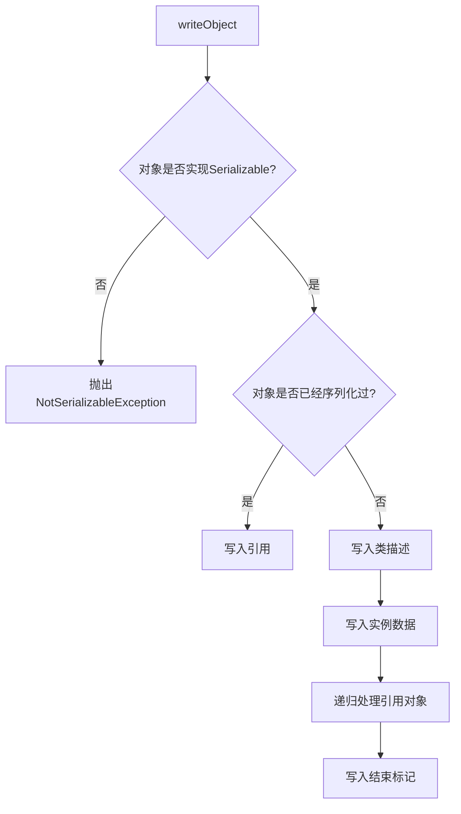
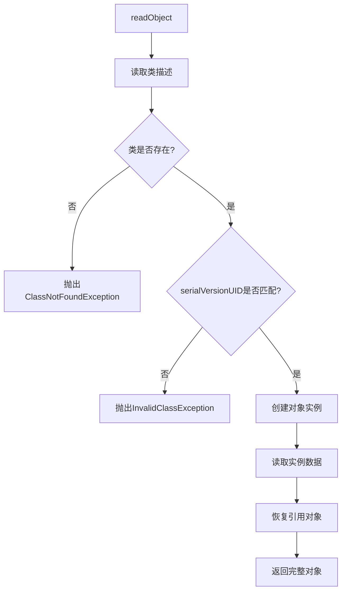
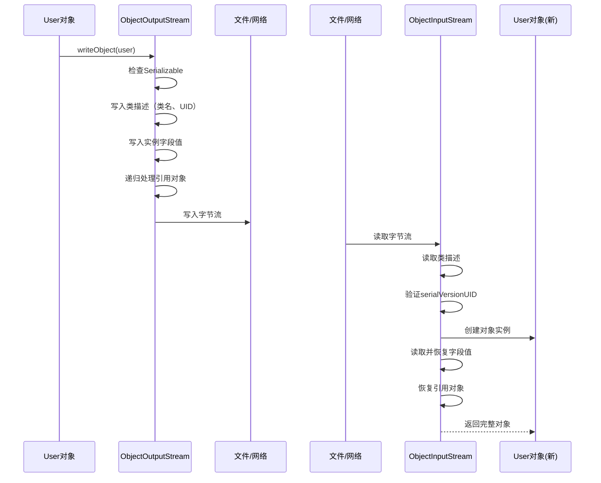
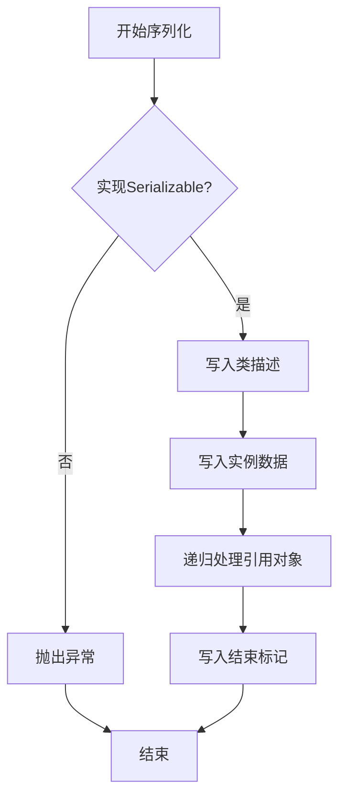

# Java序列化

## 一、序列化概念

### 1.1 什么是序列化

**序列化（Serialization）** 是将Java对象转换为字节流的过程，用于：

- 将对象保存到文件
- 在网络上传输对象
- 在不同JVM之间传递对象

**反序列化（Deserialization）** 是序列化的逆过程，将字节流恢复为Java对象。

### 1.2 应用场景

| 场景            | 说明                     |
| ------------- | ---------------------- |
| **对象持久化**     | 将对象保存到数据库或文件系统         |
| **网络传输**      | RMI（远程方法调用）、WebService |
| **缓存**        | Redis、Memcached存储对象    |
| **Session复制** | 分布式Session共享           |

### 1.3 序列化的意义



***

## 二、Java原生序列化（默认方式）

### 2.1 实现Serializable接口

Java原生序列化需要类实现`java.io.Serializable`接口：

```java
public class User implements Serializable {
    
    private static final long serialVersionUID = 1L;
    
    private String username;
    private int age;
    private transient String password;  // 不被序列化
    
    public User(String username, int age, String password) {
        this.username = username;
        this.age = age;
        this.password = password;
    }
    
    // getters and setters
    @Override
    public String toString() {
        return "User{username='" + username + "', age=" + age + ", password='" + password + "'}";
    }
}
```

### 2.2 序列化代码示例

```java
import java.io.*;

public class SerializationDemo {
    
    private static final String FILE_PATH = "user.ser";
    
    // 序列化：对象 -> 字节流
    public static void serialize(User user) throws IOException {
        try (ObjectOutputStream oos = new ObjectOutputStream(
                new FileOutputStream(FILE_PATH))) {
            oos.writeObject(user);
            System.out.println("序列化成功！");
        }
    }
    
    // 反序列化：字节流 -> 对象
    public static User deserialize() throws IOException, ClassNotFoundException {
        try (ObjectInputStream ois = new ObjectInputStream(
                new FileInputStream(FILE_PATH))) {
            User user = (User) ois.readObject();
            System.out.println("反序列化成功！");
            return user;
        }
    }
    
    public static void main(String[] args) {
        User user = new User("张三", 25, "secret123");
        
        try {
            // 序列化
            serialize(user);
            
            // 反序列化
            User deserializedUser = deserialize();
            System.out.println("反序列化后：" + deserializedUser);
            
            // 注意：password为null，因为使用了transient关键字
            System.out.println("反序列化后password：" + deserializedUser.getPassword());
            
        } catch (IOException | ClassNotFoundException e) {
            e.printStackTrace();
        }
    }
}
```

### 2.3 输出结果

```
序列化成功！
反序列化成功！
反序列化后：User{username='张三', age=25, password='null'}
反序列化后password：null
```

***

## 三、序列化原理

### 3.1 核心组件

| 组件                     | 说明        |
| ---------------------- | --------- |
| **ObjectOutputStream** | 对象序列化输出流  |
| **ObjectInputStream**  | 对象反序列化输入流 |
| **Serializable**       | 标记接口      |
| **serialVersionUID**   | 版本控制标识    |

### 3.2 ObjectOutputStream序列化原理



**核心源码逻辑：**

```java
// ObjectOutputStream核心方法
public class ObjectOutputStream extends OutputStream {
    
    public void writeObject(Object obj) throws IOException {
        // 1. 检查对象是否可序列化
        if (obj instanceof Serializable) {
            // 2. 写入对象描述（类名、serialVersionUID）
            writeObject0(obj, false);
        } else {
            throw new NotSerializableException();
        }
    }
    
    private void writeObject0(Object obj, boolean unshared) throws IOException {
        // 写入类的描述信息
        desc.writeExternal(out);
        
        // 调用对象的writeObject方法（如果重写了）
        if (obj instanceof Serializable) {
            // 写入字段值
            writeFields();
            // 递归写入关联对象
            writeChildren(obj);
        }
    }
}
```

### 3.3 ObjectInputStream反序列化原理



**核心源码逻辑：**

```java
// ObjectInputStream核心方法
public class ObjectInputStream extends InputStream {
    
    public Object readObject() throws IOException, ClassNotFoundException {
        // 1. 读取对象类型
        ObjectStreamClass desc = readClassDesc();
        
        // 2. 根据类描述创建对象
        Object obj = desc.forClass().newInstance();
        
        // 3. 读取字段值
        readFields(obj);
        
        // 4. 恢复引用关系
        readChildren(obj);
        
        // 5. 返回对象
        return obj;
    }
}
```

### 3.4 序列化机制图解



***

## 四、序列化高级主题

### 4.1 serialVersionUID

`serialVersionUID`用于版本控制，确保序列化和反序列化的类版本一致：

```java
public class User implements Serializable {
    
    private static final long serialVersionUID = 1L;
    
    // ...
}
```

**规则：**

- 如果不显式声明，Java会自动根据类内容生成
- 修改类结构后 UID 会变化，导致反序列化失败
- **建议显式声明**，便于版本兼容

| 情况             | 结果            |
| -------------- | ------------- |
| 显式声明UID，类结构变化  | 可能兼容（取决于变化类型） |
| 未显式声明UID，类结构变化 | 一定不兼容         |

### 4.2 transient关键字

`transient`修饰的字段不会被序列化：

```java
public class User implements Serializable {
    
    private String username;
    private transient String password;  // 不会被序列化
    private transient int sessionId;      // 不会被序列化
    
    // 反序列化后，transient字段为默认值（null/0）
}
```

**反序列化后的值：**

| 字段类型    | 反序列化后的值 |
| ------- | ------- |
| String  | null    |
| int     | 0       |
| boolean | false   |
| 对象引用    | null    |

### 4.3 自定义序列化

可以重写`writeObject`和`readObject`方法：

```java
public class User implements Serializable {
    
    private static final long serialVersionUID = 1L;
    
    private String username;
    private String password;  // 加密存储
    
    // 自定义序列化逻辑
    private void writeObject(ObjectOutputStream out) throws IOException {
        out.defaultWriteObject();  // 调用默认序列化
        // 自定义：序列化前加密
        out.writeObject(encrypt(password));
    }
    
    // 自定义反序列化逻辑
    private void readObject(ObjectInputStream in) throws IOException, ClassNotFoundException {
        in.defaultReadObject();  // 调用默认反序列化
        // 自定义：反序列化后解密
        this.password = decrypt((String) in.readObject());
    }
    
    private String encrypt(String password) {
        // 加密逻辑
        return Base64.getEncoder().encodeToString(password.getBytes());
    }
    
    private String decrypt(String encrypted) {
        // 解密逻辑
        return new String(Base64.getDecoder().decode(encrypted));
    }
}
```

### 4.4 static字段序列化

**static字段不会被序列化**，因为static字段属于类，不属于对象：

```java
public class User implements Serializable {
    
    private static final long serialVersionUID = 1L;
    
    private String username;
    private static int count;  // 不会被序列化
    
    public static void incrementCount() {
        count++;
    }
}
```

### 4.5 父子类序列化

| 情况                        | 说明                  |
| ------------------------- | ------------------- |
| **父类实现Serializable**      | 子类自动可序列化            |
| **子类实现Serializable，父类没有** | 只有子类的字段会被序列化        |
| **父类字段需要序列化**             | 父类也必须实现Serializable |

***

## 五、常见问题与解决方案

### 5.1 常见异常

| 异常                       | 原因                  | 解决方案             |
| ------------------------ | ------------------- | ---------------- |
| NotSerializableException | 类未实现Serializable    | 让类实现Serializable |
| InvalidClassException    | serialVersionUID不匹配 | 检查UID或更新UID      |
| ClassNotFoundException   | 找不到类                | 确保类在classpath中   |

### 5.2 序列化安全性

**问题**：序列化数据可能被恶意攻击

**解决方案**：

1. 重写`readObject`进行安全检查
2. 使用加密序列化框架
3. 验证serialVersionUID

```java
private void readObject(ObjectInputStream in) throws IOException, ClassNotFoundException {
    in.defaultReadObject();
    
    // 安全检查
    if (age < 0 || age > 150) {
        throw new SecurityException("年龄不合法");
    }
}
```

***

## 六、总结

### 6.1 核心要点

| 要点                   | 说明                        |
| -------------------- | ------------------------- |
| **实现Serializable**   | 类必须实现Serializable接口       |
| **serialVersionUID** | 建议显式声明，便于版本控制             |
| **transient**        | 修饰的字段不被序列化                |
| **static字段**         | 不会被序列化                    |
| **父子类**              | 父类实现Serializable才能序列化父类字段 |

### 6.2 序列化流程图



### 6.3 最佳实践

1. **始终实现Serializable**：需要序列化的类都应实现
2. **显式声明serialVersionUID**：避免版本不兼容
3. **谨慎处理敏感数据**：使用加密或不要序列化敏感信息
4. **合理使用transient**：不需要序列化的字段加上transient
5. **自定义序列化**：需要特殊处理时重写writeObject/readObject

