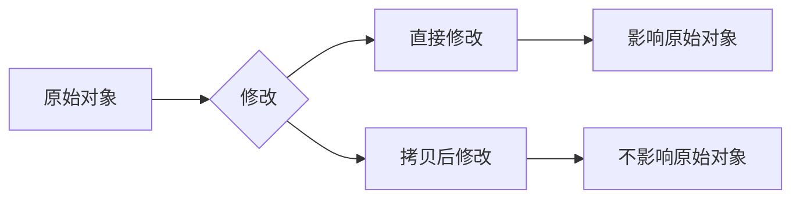
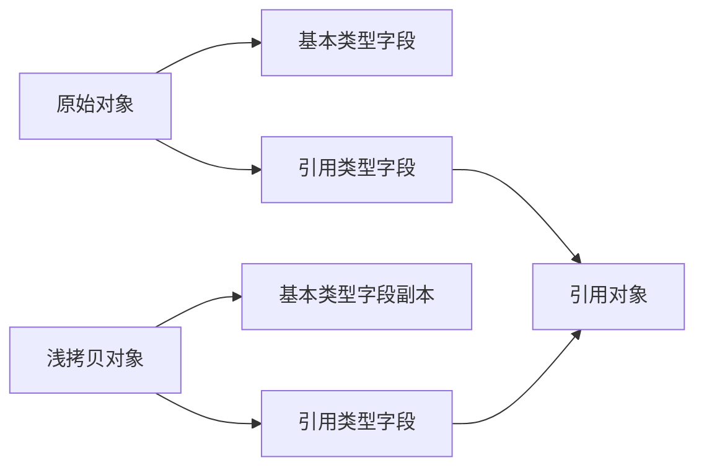
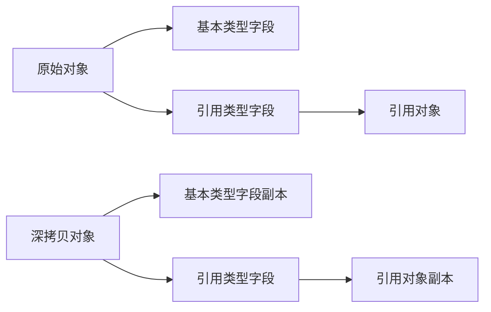
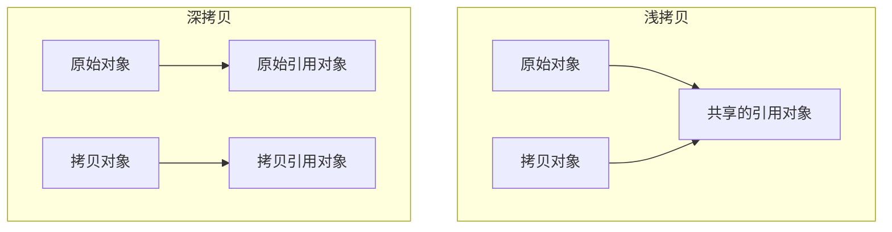
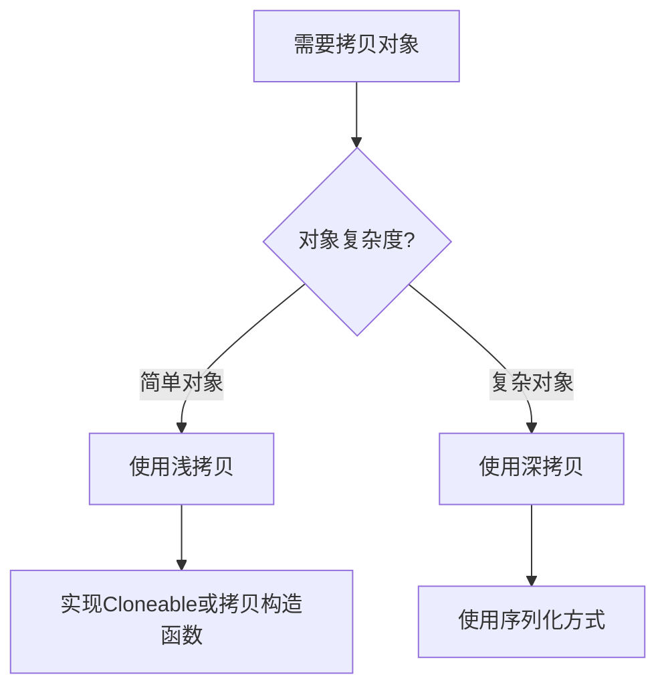

# 深拷贝与浅拷贝

## 一、对象拷贝概述

### 1.1 什么是对象拷贝

**对象拷贝**是创建一个对象副本的过程，在Java中主要有两种方式：

| 拷贝方式    | 说明                |
| ------- | ----------------- |
| **浅拷贝** | 只拷贝对象本身，不拷贝引用类型字段 |
| **深拷贝** | 递归拷贝对象及其所有引用类型字段  |

### 1.2 为什么需要拷贝



***

## 二、浅拷贝

### 2.1 原理

浅拷贝只复制对象的基本类型字段，引用类型字段仍然指向原来的对象。



### 2.2 实现方式

#### 方式1：实现Cloneable接口

```java
public class Person implements Cloneable {
    
    private String name;
    private int age;
    private Address address;  // 引用类型
    
    public Person(String name, int age, Address address) {
        this.name = name;
        this.age = age;
        this.address = address;
    }
    
    @Override
    protected Object clone() throws CloneNotSupportedException {
        return super.clone();  // 调用Object的clone方法
    }
    
    // getters and setters
}

public class Address {
    private String city;
    
    public Address(String city) {
        this.city = city;
    }
    
    // getters and setters
}
```

#### 方式2：拷贝构造函数

```java
public class Person {
    
    private String name;
    private int age;
    private Address address;
    
    // 拷贝构造函数
    public Person(Person other) {
        this.name = other.name;
        this.age = other.age;
        this.address = other.address;  // 浅拷贝引用
    }
}
```

### 2.3 代码示例

```java
public class ShallowCopyTest {
    
    public static void main(String[] args) throws CloneNotSupportedException {
        Address address = new Address("北京");
        Person original = new Person("张三", 25, address);
        
        // 浅拷贝
        Person cloned = (Person) original.clone();
        
        System.out.println("原始对象地址: " + original.getAddress());
        System.out.println("拷贝对象地址: " + cloned.getAddress());
        System.out.println("地址是否相同: " + (original.getAddress() == cloned.getAddress()));
        
        // 修改拷贝对象的地址
        cloned.getAddress().setCity("上海");
        
        System.out.println("\n修改拷贝对象地址后:");
        System.out.println("原始对象城市: " + original.getAddress().getCity());
        System.out.println("拷贝对象城市: " + cloned.getAddress().getCity());
    }
}
```

### 2.4 输出结果

```
原始对象地址: Address@1b6d3586
拷贝对象地址: Address@1b6d3586
地址是否相同: true

修改拷贝对象地址后:
原始对象城市: 上海
拷贝对象城市: 上海
```

**结论**：浅拷贝后，引用类型字段指向同一个对象，修改拷贝对象会影响原始对象。

### 2.5 浅拷贝的特点

| 优点     | 缺点       |
| ------ | -------- |
| 实现简单   | 引用类型共享   |
| 性能较高   | 可能导致意外修改 |
| 适合简单对象 | 不适合嵌套对象  |

***

## 三、深拷贝（Deep Copy）

### 3.1 原理

深拷贝递归复制对象及其所有引用类型字段，创建完全独立的副本。



### 3.2 实现方式

#### 方式1：递归实现Cloneable接口

```java
public class Person implements Cloneable {
    
    private String name;
    private int age;
    private Address address;
    
    @Override
    protected Object clone() throws CloneNotSupportedException {
        Person cloned = (Person) super.clone();
        // 深拷贝引用类型字段
        cloned.address = (Address) address.clone();
        return cloned;
    }
}

public class Address implements Cloneable {
    private String city;
    
    @Override
    protected Object clone() throws CloneNotSupportedException {
        return super.clone();
    }
}
```

#### 方式2：使用序列化（推荐）

```java
import java.io.*;

public class DeepCopyUtil {
    
    @SuppressWarnings("unchecked")
    public static <T extends Serializable> T deepCopy(T obj) {
        try (ByteArrayOutputStream baos = new ByteArrayOutputStream();
             ObjectOutputStream oos = new ObjectOutputStream(baos)) {
            
            // 序列化
            oos.writeObject(obj);
            
            // 反序列化
            try (ByteArrayInputStream bais = new ByteArrayInputStream(baos.toByteArray());
                 ObjectInputStream ois = new ObjectInputStream(bais)) {
                return (T) ois.readObject();
            }
            
        } catch (IOException | ClassNotFoundException e) {
            throw new RuntimeException("深拷贝失败", e);
        }
    }
}
```

#### 方式3：手动实现拷贝逻辑

```java
public class Person {
    
    private String name;
    private int age;
    private Address address;
    
    // 深拷贝构造函数
    public Person(Person other) {
        this.name = other.name;
        this.age = other.age;
        this.address = new Address(other.address.getCity());  // 深拷贝
    }
}
```

### 3.3 代码示例

```java
public class DeepCopyTest {
    
    public static void main(String[] args) {
        Address address = new Address("北京");
        Person original = new Person("张三", 25, address);
        
        // 使用序列化方式深拷贝
        Person cloned = DeepCopyUtil.deepCopy(original);
        
        System.out.println("原始对象地址: " + original.getAddress());
        System.out.println("拷贝对象地址: " + cloned.getAddress());
        System.out.println("地址是否相同: " + (original.getAddress() == cloned.getAddress()));
        
        // 修改拷贝对象的地址
        cloned.getAddress().setCity("上海");
        
        System.out.println("\n修改拷贝对象地址后:");
        System.out.println("原始对象城市: " + original.getAddress().getCity());
        System.out.println("拷贝对象城市: " + cloned.getAddress().getCity());
    }
}
```

### 3.4 输出结果

```
原始对象地址: Address@1b6d3586
拷贝对象地址: Address@4554617c
地址是否相同: false

修改拷贝对象地址后:
原始对象城市: 北京
拷贝对象城市: 上海
```

**结论**：深拷贝后，引用类型字段是独立的副本，修改拷贝对象不会影响原始对象。

### 3.5 深拷贝的特点

| 优点     | 缺点               |
| ------ | ---------------- |
| 完全独立   | 实现复杂             |
| 安全可靠   | 性能较低             |
| 适合复杂对象 | 需要Serializable接口 |

***

## 四、浅拷贝 vs 深拷贝对比

### 4.1 核心对比表

| 特性        | 浅拷贝        | 深拷贝       |
| --------- | ---------- | --------- |
| **引用类型**  | 共享引用       | 创建副本      |
| **内存开销**  | 较小         | 较大        |
| **性能**    | 较快         | 较慢        |
| **独立性**   | 不独立        | 完全独立      |
| **实现复杂度** | 简单         | 复杂        |
| **适用场景**  | 简单对象、无嵌套对象 | 复杂对象、嵌套对象 |

### 4.2 内存模型对比



### 4.3 选择建议

| 场景               | 推荐方式     |
| ---------------- | -------- |
| 对象只有基本类型字段       | 浅拷贝      |
| 对象有引用类型字段但不需要修改  | 浅拷贝      |
| 对象有引用类型字段且需要独立修改 | 深拷贝      |
| 对象嵌套层级较深         | 序列化方式深拷贝 |

***

## 五、常见问题

### 5.1 循环引用问题

当对象之间存在循环引用时，深拷贝可能导致栈溢出：

```java
public class Node implements Serializable {
    private String value;
    private Node next;  // 循环引用
}
```

**解决方案**：序列化方式可以自动处理循环引用。

### 5.2 不可变对象

对于不可变对象（如String、Integer），浅拷贝和深拷贝效果相同：

```java
String str = "hello";
String copy = str;  // 引用共享，但String不可变
```

### 5.3 数组拷贝

```java
// 浅拷贝数组
int[] original = {1, 2, 3};
int[] copy = Arrays.copyOf(original, original.length);

// 深拷贝二维数组
int[][] original2D = {{1, 2}, {3, 4}};
int[][] copy2D = Arrays.stream(original2D)
    .map(row -> Arrays.copyOf(row, row.length))
    .toArray(int[][]::new);
```

***

## 六、总结

### 6.1 核心要点

| 要点       | 说明                   |
| -------- | -------------------- |
| **浅拷贝**  | 只拷贝对象本身，引用类型共享       |
| **深拷贝**  | 递归拷贝所有引用类型，完全独立      |
| **实现方式** | Cloneable接口、序列化、手动实现 |
| **选择依据** | 根据对象复杂度和修改需求选择       |

### 6.2 最佳实践

1. **简单对象**：使用浅拷贝或拷贝构造函数
2. **复杂对象**：使用序列化方式深拷贝
3. **不可变对象**：直接引用即可，无需拷贝
4. **注意循环引用**：使用序列化方式处理

### 6.3 拷贝流程图



