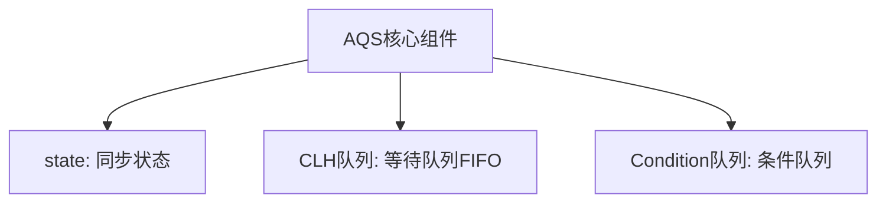
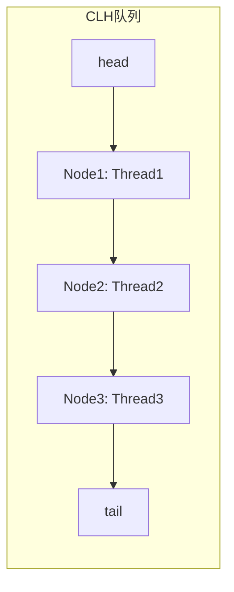
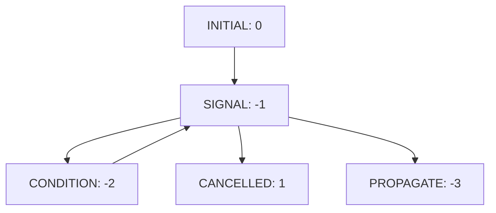
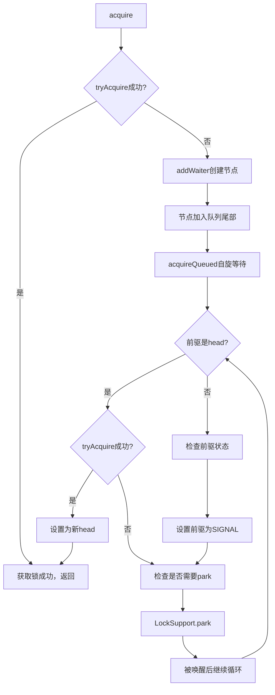
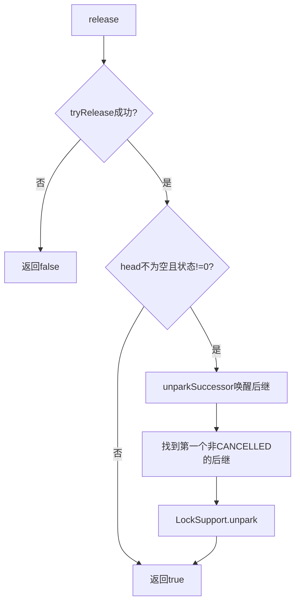
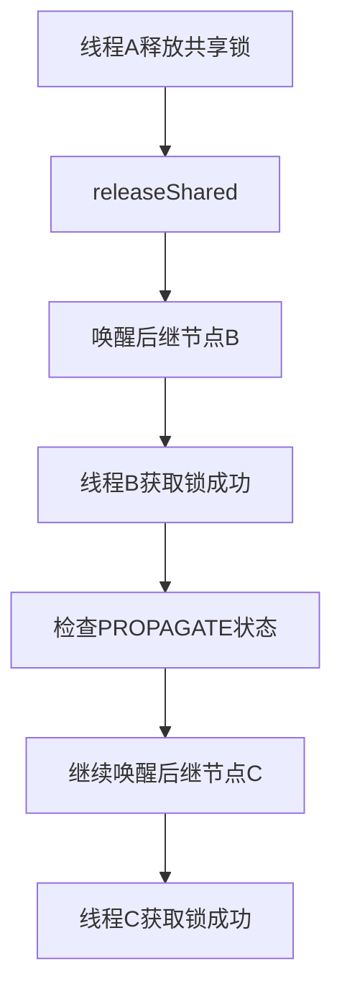
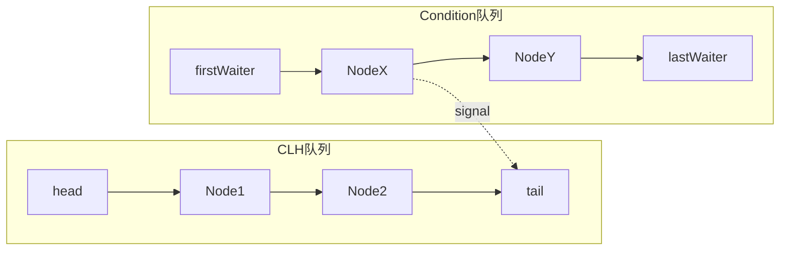
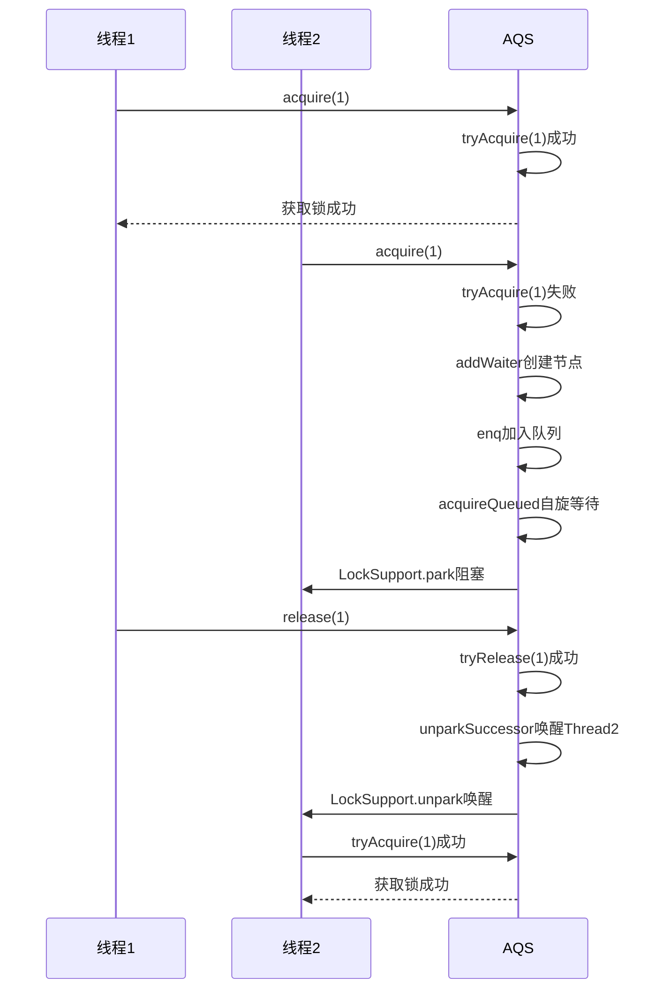

# AQS（AbstractQueuedSynchronizer）详解

## 一、AQS概述

### 1.1 什么是AQS

**AQS**（AbstractQueuedSynchronizer）是Java并发包（`java.util.concurrent.locks`）中的核心同步框架，为实现锁和同步器提供了统一的基础框架。



### 1.2 AQS的设计思想

AQS采用**模板方法模式**，定义了同步器的骨架，子类只需实现特定方法即可：

| 方法                          | 说明      | 是否必须实现 |
| --------------------------- | ------- | ------ |
| `tryAcquire(int arg)`       | 尝试获取独占锁 | 独占模式必须 |
| `tryRelease(int arg)`       | 尝试释放独占锁 | 独占模式必须 |
| `tryAcquireShared(int arg)` | 尝试获取共享锁 | 共享模式必须 |
| `tryReleaseShared(int arg)` | 尝试释放共享锁 | 共享模式必须 |
| `isHeldExclusively()`       | 判断是否独占  | 条件队列需要 |

### 1.3 基于AQS的同步器

| 同步器                        | 模式   | 用途    |
| -------------------------- | ---- | ----- |
| **ReentrantLock**          | 独占模式 | 可重入锁  |
| **Semaphore**              | 共享模式 | 信号量   |
| **CountDownLatch**         | 共享模式 | 倒计时门闩 |
| **CyclicBarrier**          | 共享模式 | 循环栅栏  |
| **ReentrantReadWriteLock** | 混合模式 | 读写锁   |

***

## 二、AQS核心组件

### 2.1 同步状态（state）

`state`是AQS的核心属性，表示共享资源的状态：

```java
private volatile int state;

// 获取状态
protected final int getState() {
    return state;
}

// 设置状态
protected final void setState(int newState) {
    state = newState;
}

// CAS设置状态
protected final boolean compareAndSetState(int expect, int update) {
    return unsafe.compareAndSwapInt(this, stateOffset, expect, update);
}
```

**state的含义**：

- **0**：锁未被持有
- **>0**：锁被持有（对于可重入锁，表示重入次数）

### 2.2 CLH队列

**CLH队列**（Craig, Landin, Hagersten Queue）是一个双向链表，用于管理等待获取锁的线程：



### 2.3 为什么使用双向链表而不是单向链表

AQS选择使用双向链表而非单向链表，主要有以下几个关键原因：

#### 2.3.1 支持高效的节点删除

在AQS中，当线程取消等待（超时或中断）时，需要从队列中删除对应的节点。双向链表支持O(1)时间复杂度的节点删除：

```java
// 双向链表删除节点
private void unlink(Node node) {
    Node prev = node.prev;
    Node next = node.next;
    
    if (prev == null) {
        head = next;
    } else {
        prev.next = next;
        node.prev = null;  // 帮助GC
    }
    
    if (next == null) {
        tail = prev;
    } else {
        next.prev = prev;
        node.next = null;  // 帮助GC
    }
}
```

**对比单向链表**：单向链表删除节点需要O(n)时间复杂度，因为需要从头遍历找到前驱节点。

#### 2.3.2 支持从尾部向前遍历

在`unparkSuccessor`方法中，当需要唤醒后继节点时，如果直接的后继节点被取消（`waitStatus > 0`），需要从队列尾部向前遍历找到第一个有效的后继节点：

```java
private void unparkSuccessor(Node node) {
    // ...
    Node s = node.next;
    if (s == null || s.waitStatus > 0) {
        s = null;
        // 从尾部向前遍历
        for (Node t = tail; t != null && t != node; t = t.prev)
            if (t.waitStatus <= 0)
                s = t;
    }
    // ...
}
```

**为什么需要反向遍历**：
- 由于`addWaiter`方法中先设置`node.prev`，再CAS设置`tail`，最后设置`pred.next`
- 在多线程环境下，可能存在`pred.next`尚未设置的情况
- 从尾部向前遍历可以确保找到正确的后继节点

#### 2.3.3 支持前驱节点状态检查

在`acquireQueued`方法中，节点需要检查前驱节点的状态来决定是否需要park：

```java
final boolean acquireQueued(final Node node, int arg) {
    for (;;) {
        final Node p = node.predecessor();  // 需要访问前驱节点
        if (p == head && tryAcquire(arg)) {
            // 获取锁成功
        }
        if (shouldParkAfterFailedAcquire(p, node) &&  // 需要检查前驱状态
            parkAndCheckInterrupt())
            interrupted = true;
    }
}
```

#### 2.3.4 双向链表vs单向链表对比

| 特性 | 双向链表 | 单向链表 |
|------|---------|---------|
| **节点删除** | O(1) | O(n) |
| **反向遍历** | 支持 | 不支持 |
| **前驱访问** | O(1) | O(n) |
| **内存开销** | 较大（每个节点多一个prev指针） | 较小 |
| **适用场景** | 需要频繁删除、反向遍历 | 只需顺序遍历、插入 |

#### 2.3.5 设计权衡

虽然双向链表增加了一定的内存开销（每个节点多一个`prev`指针），但在AQS的使用场景中，这种开销是值得的：

1. **删除操作频繁**：线程可能因超时、中断等原因取消等待
2. **反向遍历必要**：多线程入队的竞态条件需要从尾部向前查找
3. **前驱状态检查**：判断是否需要park必须访问前驱节点

```mermaid
flowchart TD
    A[AQS队列操作] --> B{操作类型}
    B -->|插入| C[单向链表O(1)]
    B -->|删除| D[双向链表O(1)]
    B -->|查找后继| E[双向链表反向遍历]
    B -->|检查前驱状态| F[双向链表O(1)]
    
    C --> G[性能相当]
    D --> H[双向链表更优]
    E --> H
    F --> H
    
    G --> I[综合评估]
    H --> I
    I --> J[选择双向链表]
```

### 2.4 Node节点结构

每个等待线程对应一个Node节点：

```java
static final class Node {
    // 节点状态
    volatile int waitStatus;
    
    // 前驱节点
    volatile Node prev;
    
    // 后继节点
    volatile Node next;
    
    // 等待的线程
    volatile Thread thread;
    
    // 下一个等待在Condition上的节点
    Node nextWaiter;
    
    // 节点状态常量
    static final int CANCELLED =  1;  // 已取消
    static final int SIGNAL    = -1;  // 需要唤醒后继
    static final int CONDITION = -2;  // 等待在Condition上
    static final int PROPAGATE = -3;  // 共享模式传播
    static final int INITIAL   =  0;  // 初始状态
}
```

### 2.4 节点状态流转



| 状态            | 值  | 说明                |
| ------------- | -- | ----------------- |
| **CANCELLED** | 1  | 节点被取消（超时或中断）      |
| **SIGNAL**    | -1 | 后继节点需要被唤醒         |
| **CONDITION** | -2 | 节点在Condition队列中等待 |
| **PROPAGATE** | -3 | 共享模式下状态需要传播       |
| **INITIAL**   | 0  | 初始状态              |

***

## 三、独占模式 - 获取锁流程

### 3.1 acquire方法

```java
public final void acquire(int arg) {
    // 1. 尝试获取锁
    if (!tryAcquire(arg) &&
        // 2. 获取失败，加入等待队列
        acquireQueued(addWaiter(Node.EXCLUSIVE), arg))
        // 3. 如果被中断，自我中断
        selfInterrupt();
}
```

### 3.2 获取锁流程图



### 3.3 addWaiter方法

将节点加入队列尾部：

```java
private Node addWaiter(Node mode) {
    Node node = new Node(Thread.currentThread(), mode);
    
    // 快速尝试加入尾部
    Node pred = tail;
    if (pred != null) {
        node.prev = pred;
        if (compareAndSetTail(pred, node)) {
            pred.next = node;
            return node;
        }
    }
    
    // 完整的入队逻辑
    enq(node);
    return node;
}
```

### 3.4 acquireQueued方法

节点在队列中自旋等待：

```java
final boolean acquireQueued(final Node node, int arg) {
    boolean failed = true;
    try {
        boolean interrupted = false;
        for (;;) {
            final Node p = node.predecessor();
            
            // 只有前驱是head才尝试获取锁
            if (p == head && tryAcquire(arg)) {
                setHead(node);
                p.next = null; // 帮助GC
                failed = false;
                return interrupted;
            }
            
            // 判断是否需要park
            if (shouldParkAfterFailedAcquire(p, node) &&
                parkAndCheckInterrupt())
                interrupted = true;
        }
    } finally {
        if (failed)
            cancelAcquire(node);
    }
}
```

***

## 四、独占模式 - 释放锁流程

### 4.1 release方法

```java
public final boolean release(int arg) {
    // 1. 尝试释放锁
    if (tryRelease(arg)) {
        Node h = head;
        // 2. 如果head不为空且状态不是初始状态
        if (h != null && h.waitStatus != 0)
            // 3. 唤醒后继节点
            unparkSuccessor(h);
        return true;
    }
    return false;
}
```

### 4.2 释放锁流程图



### 4.3 unparkSuccessor方法

唤醒后继节点：

```java
private void unparkSuccessor(Node node) {
    int ws = node.waitStatus;
    if (ws < 0)
        compareAndSetWaitStatus(node, ws, 0);
    
    // 找到后继节点
    Node s = node.next;
    if (s == null || s.waitStatus > 0) {
        s = null;
        // 从尾部向前找
        for (Node t = tail; t != null && t != node; t = t.prev)
            if (t.waitStatus <= 0)
                s = t;
    }
    
    if (s != null)
        LockSupport.unpark(s.thread);
}
```

***

## 五、共享模式

### 5.1 共享模式与独占模式的区别

| 特性          | 独占模式          | 共享模式                      |
| ----------- | ------------- | ------------------------- |
| **锁持有者**    | 单个线程          | 多个线程                      |
| **state含义** | 重入次数          | 可用资源数                     |
| **获取方式**    | `acquire()`   | `acquireShared()`         |
| **释放方式**    | `release()`   | `releaseShared()`         |
| **典型应用**    | ReentrantLock | Semaphore, CountDownLatch |

### 5.2 acquireShared方法

```java
public final void acquireShared(int arg) {
    if (tryAcquireShared(arg) < 0)
        doAcquireShared(arg);
}
```

### 5.3 doAcquireShared方法

```java
private void doAcquireShared(int arg) {
    final Node node = addWaiter(Node.SHARED);
    boolean failed = true;
    try {
        boolean interrupted = false;
        for (;;) {
            final Node p = node.predecessor();
            if (p == head) {
                int r = tryAcquireShared(arg);
                if (r >= 0) {
                    setHeadAndPropagate(node, r);
                    p.next = null; // help GC
                    if (interrupted)
                        selfInterrupt();
                    failed = false;
                    return;
                }
            }
            if (shouldParkAfterFailedAcquire(p, node) &&
                parkAndCheckInterrupt())
                interrupted = true;
        }
    } finally {
        if (failed)
            cancelAcquire(node);
    }
}
```

### 5.4 共享模式的传播机制



***

## 六、Condition条件队列

### 6.1 Condition与Object监视器方法对比

| 方法   | Object        | Condition     |
| ---- | ------------- | ------------- |
| 等待   | `wait()`      | `await()`     |
| 通知   | `notify()`    | `signal()`    |
| 通知所有 | `notifyAll()` | `signalAll()` |

### 6.2 Condition队列结构



### 6.3 await流程

```java
public final void await() throws InterruptedException {
    if (Thread.interrupted())
        throw new InterruptedException();
    
    // 加入Condition队列
    Node node = addConditionWaiter();
    
    // 释放锁
    int savedState = fullyRelease(node);
    int interruptMode = 0;
    
    // 在Condition队列中等待
    while (!isOnSyncQueue(node)) {
        LockSupport.park(this);
        if ((interruptMode = checkInterruptWhileWaiting(node)) != 0)
            break;
    }
    
    // 重新获取锁
    if (acquireQueued(node, savedState) && interruptMode != THROW_IE)
        interruptMode = REINTERRUPT;
    
    // 清理条件队列中的节点
    if (node.nextWaiter != null)
        unlinkCancelledWaiters();
    
    if (interruptMode != 0)
        reportInterruptAfterWait(interruptMode);
}
```

***

## 七、AQS完整工作流程



***

## 八、总结

### 8.1 AQS核心要点

| 要点       | 说明                            |
| -------- | ----------------------------- |
| **核心组件** | state状态 + CLH队列 + Condition队列 |
| **设计模式** | 模板方法模式                        |
| **获取锁**  | 尝试获取 → 失败入队 → 自旋等待            |
| **释放锁**  | 尝试释放 → 唤醒后继                   |
| **两种模式** | 独占模式、共享模式                     |

### 8.2 AQS设计精髓

1. **CAS原子操作**：保证state和队列操作的原子性
2. **自旋+park**：减少上下文切换，提高性能
3. **CLH队列**：无锁的线程排队机制
4. **状态传播**：共享模式下的高效唤醒

### 8.3 学习建议

| 步骤 | 内容               |
| -- | ---------------- |
| 1  | 理解state的含义和CAS操作 |
| 2  | 理解CLH队列的结构和节点状态  |
| 3  | 跟踪acquire方法的完整流程 |
| 4  | 跟踪release方法的完整流程 |
| 5  | 对比独占模式和共享模式      |
| 6  | 学习基于AQS的同步器实现    |

## 参考资料

- [从ReentrantLock的实现看AQS的原理及应用](https://tech.meituan.com/2019/12/05/aqs-theory-and-apply.html)
- [Java并发之AQS详解](https://www.cnblogs.com/waterystone/p/4920797.html)
- [Java并发编程AQS详解](https://blog.csdn.net/qq_40076948/article/details/123723125)

