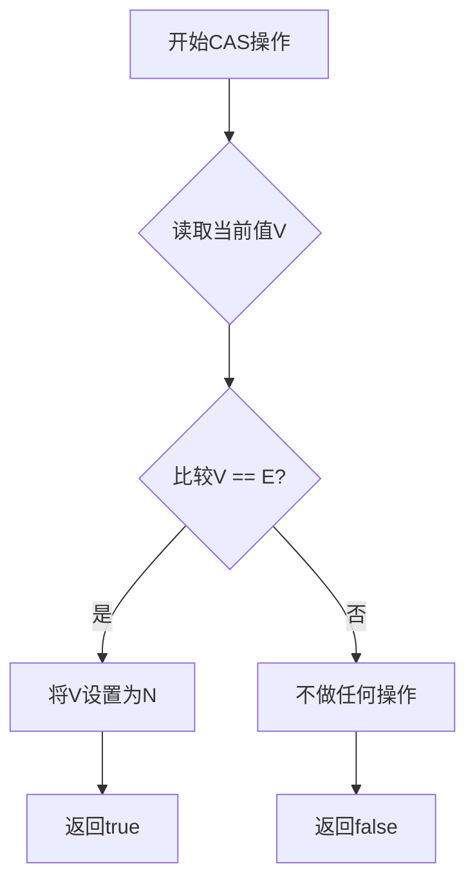
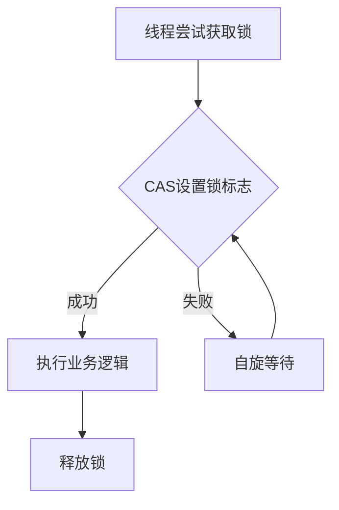
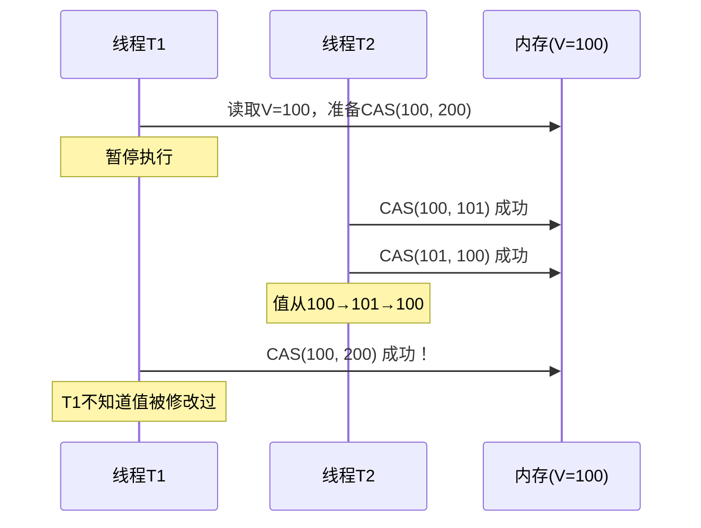
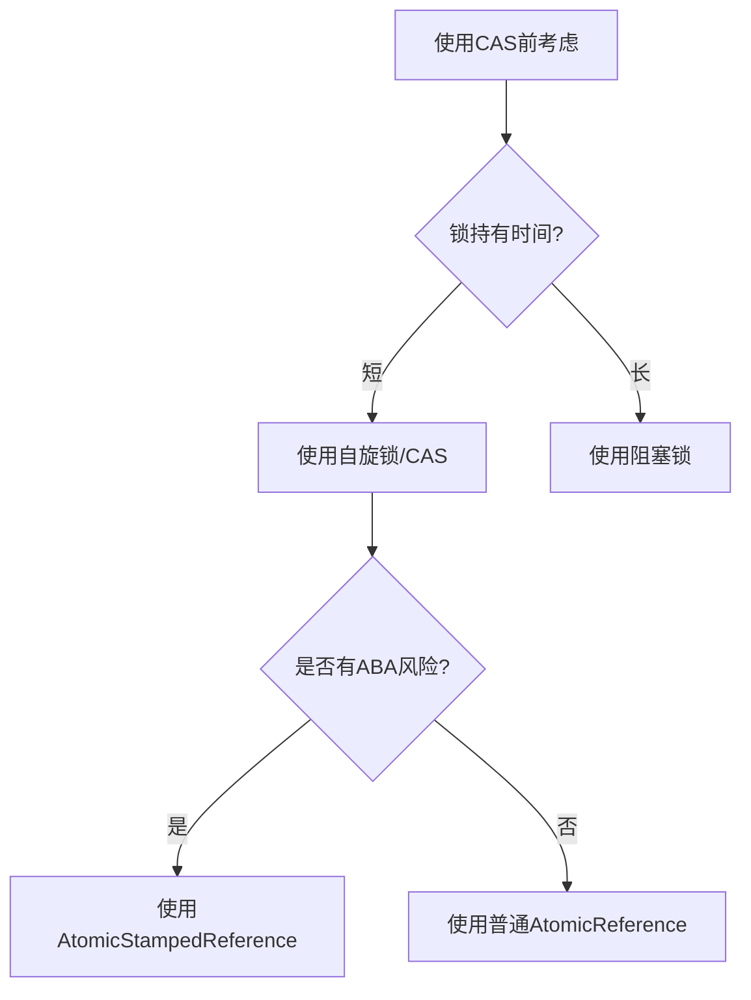

# CAS自旋锁

## 一、CAS原理

### 1.1 什么是CAS

CAS（Compare-And-Swap）是一种**原子操作**，用于实现无锁并发控制。它的核心思想是：**比较并交换**。

### 1.2 CAS的三个参数

CAS操作包含三个参数：

| 参数 | 说明 | 示例 |
|------|------|------|
| **V** | 内存地址（要修改的变量） | `atomicReference` |
| **E** | 预期值（期望当前内存中的值） | `null` |
| **N** | 新值（要设置的新值） | `thread` |

### 1.3 CAS执行流程



### 1.4 CAS的原子性保证

CAS操作是**原子的**，由CPU指令`cmpxchg`保证：
- 整个比较-交换过程不可中断
- 多个线程同时执行CAS时，只有一个会成功

---

## 二、Unsafe类与compareAndSwap方法

### 2.1 Unsafe类介绍

`sun.misc.Unsafe`是Java中的一个特殊类，提供了直接访问底层内存和执行原子操作的能力。

### 2.2 compareAndSwap方法签名

```java
// 比较并交换对象字段
public final native boolean compareAndSwapObject(Object obj, long offset, 
                                                Object expected, Object update);

// 比较并交换int字段
public final native boolean compareAndSwapInt(Object obj, long offset, 
                                             int expected, int update);

// 比较并交换long字段
public final native boolean compareAndSwapLong(Object obj, long offset, 
                                              long expected, long update);
```

### 2.3 参数说明

| 参数 | 说明 |
|------|------|
| `obj` | 目标对象 |
| `offset` | 字段在对象中的内存偏移量 |
| `expected` | 预期值 |
| `update` | 新值 |

---

## 三、自旋锁实现

### 3.1 自旋锁的概念

自旋锁是一种**非阻塞锁**：
- 尝试获取锁的线程不会立即阻塞
- 而是采用**循环重试**的方式尝试获取锁
- 直到成功获取锁为止

### 3.2 自旋锁实现原理



### 3.3 完整实现代码

```java
import java.util.concurrent.atomic.AtomicReference;
import java.util.concurrent.TimeUnit;

/**
 * 自旋锁实现
 * 基于CAS操作实现无锁同步
 */
public class SpinLockDemo {

    /**
     * 原子引用，存储当前持有锁的线程
     * null表示锁未被持有
     */
    private final AtomicReference<Thread> atomicReference = new AtomicReference<>();

    /**
     * 获取锁
     * 采用自旋方式尝试获取锁，不会阻塞线程
     */
    public void lock() {
        Thread currentThread = Thread.currentThread();
        System.out.println(currentThread.getName() + " 尝试获取锁");
        
        // CAS自旋：直到成功将atomicReference从null设置为当前线程
        while (!atomicReference.compareAndSet(null, currentThread)) {
            // 自旋等待，线程处于RUNNABLE状态
            // System.out.println(currentThread.getName() + " 自旋等待中...");
        }
        
        System.out.println(currentThread.getName() + " 成功获取锁");
    }

    /**
     * 释放锁
     * 将atomicReference设置为null，表示锁已释放
     */
    public void unlock() {
        Thread currentThread = Thread.currentThread();
        
        // 只有持有锁的线程才能释放锁
        if (atomicReference.compareAndSet(currentThread, null)) {
            System.out.println(currentThread.getName() + " 成功释放锁");
        } else {
            System.err.println(currentThread.getName() + " 尝试释放不属于自己的锁");
        }
    }

    public static void main(String[] args) {
        SpinLockDemo spinLock = new SpinLockDemo();

        // 线程AA获取锁后持有5秒
        new Thread(() -> {
            spinLock.lock();
            try {
                System.out.println("AA 开始执行业务逻辑");
                TimeUnit.SECONDS.sleep(5);
            } catch (InterruptedException e) {
                Thread.currentThread().interrupt();
            } finally {
                spinLock.unlock();
            }
        }, "AA").start();

        // 等待1秒后，线程BB尝试获取锁
        try {
            TimeUnit.SECONDS.sleep(1);
        } catch (InterruptedException e) {
            Thread.currentThread().interrupt();
        }

        // 线程BB会自旋等待，直到AA释放锁
        new Thread(() -> {
            spinLock.lock();
            try {
                System.out.println("BB 开始执行业务逻辑");
                TimeUnit.SECONDS.sleep(1);
            } catch (InterruptedException e) {
                Thread.currentThread().interrupt();
            } finally {
                spinLock.unlock();
            }
        }, "BB").start();
    }
}
```

### 3.4 自旋锁与阻塞锁对比

| 特性 | 自旋锁 | 阻塞锁（如synchronized） |
|------|--------|-------------------------|
| **线程状态** | RUNNABLE（自旋） | BLOCKED（阻塞） |
| **CPU消耗** | 高（持续占用CPU） | 低（阻塞时不消耗CPU） |
| **上下文切换** | 无 | 有 |
| **适用场景** | 锁持有时间短 | 锁持有时间长 |
| **公平性** | 非公平 | 可配置公平/非公平 |

### 3.5 自旋锁的优缺点

**优点：**
- 避免线程上下文切换的开销
- 适用于锁持有时间短的场景
- 实现简单，无死锁风险

**缺点：**
- 自旋时消耗CPU资源
- 可能导致线程饥饿（某些线程一直获取不到锁）
- 不适合锁持有时间长的场景

---

## 四、CAS的问题与优化

### 4.1 CAS可能造成的问题

| 问题 | 描述 | 影响 |
|------|------|------|
| **CPU占用过高** | 自旋循环消耗CPU | 系统性能下降 |
| **ABA问题** | 值被修改后又改回原值 | 可能导致错误的CAS成功 |
| **只能保证单个变量的原子性** | CAS只能操作一个变量 | 无法实现复合操作的原子性 |

### 4.2 ABA问题深入分析

#### 4.2.1 什么是ABA问题



#### 4.2.2 ABA问题的危害

在某些场景下，ABA问题会导致数据不一致：

```java
// 假设有一个栈结构：top -> A -> B -> C
// 线程T1: 弹出A，准备设置top=B
// 线程T2: 弹出A，弹出B，压入A，此时top -> A -> C
// 线程T1: CAS设置top=B，导致栈结构错误！
```

#### 4.2.3 解决方案：版本号机制

使用`AtomicStampedReference`引入版本号：

```java
import java.util.concurrent.atomic.AtomicStampedReference;

/**
 * 解决ABA问题 - 使用版本号机制
 */
public class ABADemo {

    /**
     * 普通原子引用 - 存在ABA问题
     */
    static AtomicReference<Integer> atomicReference = new AtomicReference<>(100);

    /**
     * 带版本号的原子引用 - 解决ABA问题
     * 参数1: 初始值，参数2: 初始版本号
     */
    static AtomicStampedReference<Integer> atomicStampedReference = 
        new AtomicStampedReference<>(100, 1);

    public static void main(String[] args) {
        System.out.println("========================= 产生ABA问题 ===========================");
        
        // 线程T1: 将100→101→100
        new Thread(() -> {
            atomicReference.compareAndSet(100, 101);
            System.out.println("T1: 100 -> 101");
            atomicReference.compareAndSet(101, 100);
            System.out.println("T1: 101 -> 100");
        }, "T1").start();

        // 线程T2: 尝试将100→2019
        new Thread(() -> {
            // 等待T1完成一次ABA操作
            try {
                Thread.sleep(100);
            } catch (InterruptedException e) {
                Thread.currentThread().interrupt();
            }
            
            // 虽然值回到了100，但这是错误的CAS成功
            boolean result = atomicReference.compareAndSet(100, 2019);
            System.out.println("T2: CAS(100, 2019) = " + result 
                + ", 当前值 = " + atomicReference.get());
        }, "T2").start();

        // 等待以上线程完成
        try {
            Thread.sleep(500);
        } catch (InterruptedException e) {
            Thread.currentThread().interrupt();
        }

        System.out.println("\n========================= 解决ABA问题 ===========================");

        // 线程T3: 将100→101→100，每次操作版本号+1
        new Thread(() -> {
            int stamp = atomicStampedReference.getStamp();
            System.out.println("T3: 初始版本号 = " + stamp);

            try {
                Thread.sleep(100);
            } catch (InterruptedException e) {
                Thread.currentThread().interrupt();
            }

            // 第一次修改: 100→101，版本号从1→2
            atomicStampedReference.compareAndSet(100, 101, stamp, stamp + 1);
            System.out.println("T3: 100 -> 101，版本号 = " + atomicStampedReference.getStamp());

            stamp = atomicStampedReference.getStamp();
            // 第二次修改: 101→100，版本号从2→3
            atomicStampedReference.compareAndSet(101, 100, stamp, stamp + 1);
            System.out.println("T3: 101 -> 100，版本号 = " + atomicStampedReference.getStamp());
        }, "T3").start();

        // 线程T4: 使用版本号进行CAS
        new Thread(() -> {
            int stamp = atomicStampedReference.getStamp();
            System.out.println("T4: 初始版本号 = " + stamp);

            // 等待T3完成两次修改
            try {
                Thread.sleep(300);
            } catch (InterruptedException e) {
                Thread.currentThread().interrupt();
            }

            // 虽然值是100，但版本号已改变，CAS失败！
            boolean result = atomicStampedReference.compareAndSet(100, 2019, stamp, stamp + 1);
            System.out.println("T4: CAS(100, 2019) = " + result 
                + ", 当前值 = " + atomicStampedReference.getReference()
                + ", 当前版本号 = " + atomicStampedReference.getStamp());
        }, "T4").start();
    }
}
```

#### 4.2.4 AtomicStampedReference方法说明

| 方法 | 说明 |
|------|------|
| `getReference()` | 获取当前值 |
| `getStamp()` | 获取当前版本号 |
| `get(int[] stampHolder)` | 同时获取值和版本号 |
| `compareAndSet(expectedReference, newReference, expectedStamp, newStamp)` | 带版本号的CAS |

---

## 五、应用场景与最佳实践

### 5.1 CAS的应用场景

| 场景 | 说明 | 示例 |
|------|------|------|
| **原子计数器** | 无锁实现计数 | `AtomicInteger.incrementAndGet()` |
| **无锁数据结构** | 实现高效的并发数据结构 | 无锁队列、无锁栈 |
| **乐观锁** | 数据库乐观锁实现 | 版本号+CAS更新 |
| **自旋锁** | 实现非阻塞锁 | 本节示例 |

### 5.2 使用建议



### 5.3 最佳实践总结

| 原则 | 说明 |
|------|------|
| **锁持有时间短** | 自旋锁适合锁持有时间短的场景 |
| **避免无限自旋** | 可添加自旋次数限制或超时机制 |
| **处理ABA问题** | 在有ABA风险的场景使用版本号 |
| **考虑公平性** | 自旋锁是非公平的，可能导致线程饥饿 |
| **结合其他机制** | 可与`LockSupport.park()`结合实现更高效的锁 |

---

## 六、总结

CAS自旋锁是一种高效的无锁同步机制：

| 核心要点 | 说明 |
|----------|------|
| **CAS原理** | 比较并交换，原子操作 |
| **自旋锁** | 循环重试获取锁，避免上下文切换 |
| **ABA问题** | 值被修改后又改回原值，可通过版本号解决 |
| **适用场景** | 锁持有时间短、高并发低冲突场景 |
| **注意事项** | CPU消耗、线程饥饿、ABA风险 |

理解CAS和自旋锁是掌握Java并发编程的关键，它们是Java原子类和并发容器的基础。
