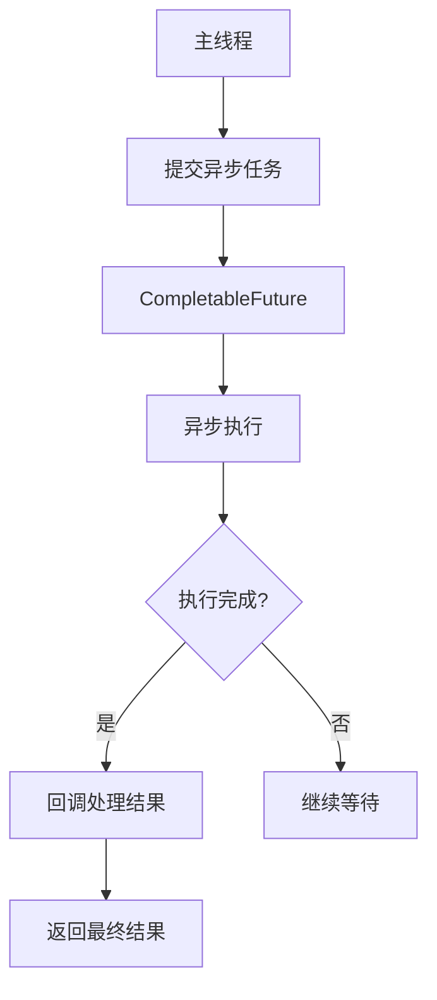
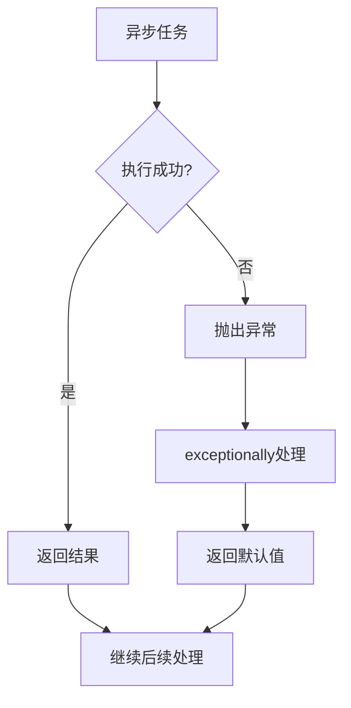
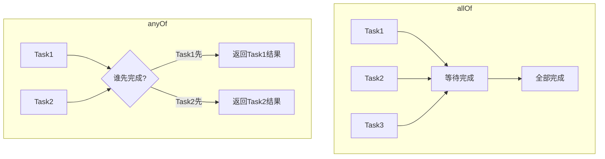

# CompletableFuture详解

## 一、概念概述

### 1.1 什么是CompletableFuture

**CompletableFuture**是Java 8引入的异步编程工具，实现了`Future`和`CompletionStage`接口，提供了强大的异步任务组合能力。



### 1.2 设计思想

CompletableFuture采用**链式调用**和**函数式编程**思想，支持任务的串行、并行组合：

| 特性 | 说明 |
|------|------|
| **异步执行** | 任务在后台线程执行，不阻塞主线程 |
| **链式调用** | 通过`thenApply`、`thenCompose`等方法链式组合 |
| **任务组合** | 支持多个任务的串行、并行组合 |
| **异常处理** | 提供`exceptionally`、`handle`等异常处理方法 |

### 1.3 核心接口

```java
public class CompletableFuture<T> implements Future<T>, CompletionStage<T> {
    // Future接口方法
    boolean cancel(boolean mayInterruptIfRunning);
    boolean isCancelled();
    boolean isDone();
    T get() throws InterruptedException, ExecutionException;
    T get(long timeout, TimeUnit unit) throws ...;
    
    // CompletionStage接口方法（核心）
    <U> CompletionStage<U> thenApply(Function<? super T, ? extends U> fn);
    <U> CompletionStage<U> thenCompose(Function<? super T, ? extends CompletionStage<U>> fn);
    CompletionStage<Void> thenAccept(Consumer<? super T> action);
    CompletionStage<Void> thenRun(Runnable action);
    // ...
}
```

---

## 二、创建异步任务

### 2.1 创建CompletableFuture的方式

| 方法 | 说明 |
|------|------|
| `CompletableFuture.completedFuture(T value)` | 创建已完成的CompletableFuture |
| `CompletableFuture.supplyAsync(Supplier<T> supplier)` | 异步执行Supplier |
| `CompletableFuture.supplyAsync(Supplier<T> supplier, Executor executor)` | 指定执行器执行 |
| `CompletableFuture.runAsync(Runnable runnable)` | 异步执行Runnable |
| `CompletableFuture.runAsync(Runnable runnable, Executor executor)` | 指定执行器执行 |

### 2.2 代码示例

```java
// 1. 创建已完成的CompletableFuture
CompletableFuture<String> completed = CompletableFuture.completedFuture("Hello");

// 2. 异步执行Supplier（使用默认线程池）
CompletableFuture<String> future1 = CompletableFuture.supplyAsync(() -> {
    // 模拟耗时操作
    try {
        Thread.sleep(1000);
    } catch (InterruptedException e) {
        Thread.currentThread().interrupt();
    }
    return "Async Result";
});

// 3. 指定执行器
ExecutorService executor = Executors.newFixedThreadPool(4);
CompletableFuture<String> future2 = CompletableFuture.supplyAsync(() -> {
    return "Custom Executor Result";
}, executor);
```

### 2.3 获取结果的方式

```java
// 1. 阻塞获取（不推荐）
String result = future.get();

// 2. 带超时的阻塞获取
String result = future.get(5, TimeUnit.SECONDS);

// 3. 非阻塞获取
if (future.isDone()) {
    String result = future.getNow("default");
}
```

---

## 三、任务组合

### 3.1 串行组合

#### thenApply - 转换结果

```java
CompletableFuture<String> future = CompletableFuture.supplyAsync(() -> "hello")
    .thenApply(str -> str.toUpperCase())
    .thenApply(str -> str + " world");

// 结果: "HELLO world"
```

#### thenCompose - 组合两个CompletableFuture

```java
CompletableFuture<String> future = CompletableFuture.supplyAsync(() -> "hello")
    .thenCompose(str -> CompletableFuture.supplyAsync(() -> str + " world"));

// 结果: "hello world"
```

**注意**：`thenApply` vs `thenCompose`

| 方法 | 返回值 | 适用场景 |
|------|--------|----------|
| `thenApply` | `CompletableFuture<CompletableFuture<T>>` | 同步转换 |
| `thenCompose` | `CompletableFuture<T>` | 异步组合 |

### 3.2 消费结果

#### thenAccept - 消费结果但不返回

```java
CompletableFuture.supplyAsync(() -> "hello")
    .thenAccept(result -> System.out.println("Result: " + result));
```

#### thenRun - 执行不依赖结果的任务

```java
CompletableFuture.supplyAsync(() -> "hello")
    .thenRun(() -> System.out.println("Task completed"));
```

### 3.3 两个任务组合

#### thenCombine - 组合两个独立任务

```java
CompletableFuture<String> future1 = CompletableFuture.supplyAsync(() -> "Hello");
CompletableFuture<String> future2 = CompletableFuture.supplyAsync(() -> "World");

CompletableFuture<String> combined = future1.thenCombine(future2, (s1, s2) -> s1 + " " + s2);

// 结果: "Hello World"
```

#### thenAcceptBoth - 消费两个任务的结果

```java
future1.thenAcceptBoth(future2, (s1, s2) -> {
    System.out.println("Result: " + s1 + " " + s2);
});
```

---

## 四、异常处理

### 4.1 exceptionally - 捕获异常并返回默认值

```java
CompletableFuture<String> future = CompletableFuture.supplyAsync(() -> {
    if (true) {
        throw new RuntimeException("Something went wrong");
    }
    return "Success";
}).exceptionally(ex -> {
    System.out.println("Exception: " + ex.getMessage());
    return "Fallback Value";
});

// 结果: "Fallback Value"
```

### 4.2 handle - 处理正常结果和异常

```java
CompletableFuture<String> future = CompletableFuture.supplyAsync(() -> {
    if (Math.random() > 0.5) {
        throw new RuntimeException("Random failure");
    }
    return "Success";
}).handle((result, ex) -> {
    if (ex != null) {
        return "Handled: " + ex.getMessage();
    }
    return "Handled: " + result;
});
```

### 4.3 whenComplete - 无论成功失败都执行

```java
CompletableFuture<String> future = CompletableFuture.supplyAsync(() -> "Success")
    .whenComplete((result, ex) -> {
        if (ex != null) {
            System.out.println("Failed: " + ex.getMessage());
        } else {
            System.out.println("Succeeded: " + result);
        }
    });
```

### 4.4 异常处理流程图



---

## 五、并行组合

### 5.1 allOf - 等待所有任务完成

```java
CompletableFuture<String> future1 = CompletableFuture.supplyAsync(() -> "Task1");
CompletableFuture<String> future2 = CompletableFuture.supplyAsync(() -> "Task2");
CompletableFuture<String> future3 = CompletableFuture.supplyAsync(() -> "Task3");

// 等待所有任务完成
CompletableFuture<Void> allFutures = CompletableFuture.allOf(future1, future2, future3);

// 获取所有结果
allFutures.thenRun(() -> {
    String result1 = future1.join();
    String result2 = future2.join();
    String result3 = future3.join();
    System.out.println("All completed: " + result1 + ", " + result2 + ", " + result3);
});
```

### 5.2 anyOf - 等待任意一个任务完成

```java
CompletableFuture<String> fastTask = CompletableFuture.supplyAsync(() -> {
    try {
        Thread.sleep(100);
    } catch (InterruptedException e) {}
    return "Fast";
});

CompletableFuture<String> slowTask = CompletableFuture.supplyAsync(() -> {
    try {
        Thread.sleep(1000);
    } catch (InterruptedException e) {}
    return "Slow";
});

// 获取第一个完成的结果
CompletableFuture<Object> first = CompletableFuture.anyOf(fastTask, slowTask);
// 结果: "Fast"
```

### 5.3 并行组合流程图



---

## 六、线程池选择

### 6.1 默认线程池

```java
// 默认使用ForkJoinPool.commonPool()
CompletableFuture.supplyAsync(() -> "Async");
```

### 6.2 自定义线程池

```java
// 创建自定义线程池
ExecutorService executor = Executors.newFixedThreadPool(4);

// 使用自定义线程池
CompletableFuture.supplyAsync(() -> "Custom Pool", executor);

// 注意：使用完后关闭线程池
executor.shutdown();
```

### 6.3 线程池选择建议

| 场景 | 推荐线程池 |
|------|----------|
| **CPU密集型** | `Executors.newFixedThreadPool(Runtime.getRuntime().availableProcessors())` |
| **IO密集型** | `Executors.newCachedThreadPool()` 或自定义更大线程池 |
| **默认场景** | `ForkJoinPool.commonPool()` |

---

## 七、完整示例

### 7.1 异步调用链示例

```java
public class CompletableFutureExample {
    
    public static void main(String[] args) throws Exception {
        // 模拟用户服务
        CompletableFuture<String> userFuture = CompletableFuture.supplyAsync(() -> {
            System.out.println("Fetching user...");
            try { Thread.sleep(500); } catch (InterruptedException e) {}
            return "User123";
        });
        
        // 模拟订单服务（依赖用户）
        CompletableFuture<String> orderFuture = userFuture.thenCompose(userId -> 
            CompletableFuture.supplyAsync(() -> {
                System.out.println("Fetching orders for " + userId);
                try { Thread.sleep(300); } catch (InterruptedException e) {}
                return "Order456";
            })
        );
        
        // 模拟支付服务（依赖订单）
        CompletableFuture<Double> paymentFuture = orderFuture.thenApply(orderId -> {
            System.out.println("Calculating payment for " + orderId);
            return 99.99;
        });
        
        // 最终处理
        paymentFuture.whenComplete((amount, ex) -> {
            if (ex != null) {
                System.out.println("Error: " + ex.getMessage());
            } else {
                System.out.println("Payment completed: $" + amount);
            }
        });
        
        // 等待完成
        paymentFuture.get();
    }
}
```

### 7.2 并行请求示例

```java
public class ParallelRequests {
    
    public static void main(String[] args) throws Exception {
        // 并行获取多个服务数据
        CompletableFuture<String> weather = fetchWeather();
        CompletableFuture<String> news = fetchNews();
        CompletableFuture<String> stocks = fetchStocks();
        
        // 等待所有完成
        CompletableFuture.allOf(weather, news, stocks).get();
        
        // 汇总结果
        System.out.println("Weather: " + weather.join());
        System.out.println("News: " + news.join());
        System.out.println("Stocks: " + stocks.join());
    }
    
    private static CompletableFuture<String> fetchWeather() {
        return CompletableFuture.supplyAsync(() -> {
            try { Thread.sleep(200); } catch (InterruptedException e) {}
            return "Sunny, 25°C";
        });
    }
    
    private static CompletableFuture<String> fetchNews() {
        return CompletableFuture.supplyAsync(() -> {
            try { Thread.sleep(300); } catch (InterruptedException e) {}
            return "Breaking news: Java 21 released!";
        });
    }
    
    private static CompletableFuture<String> fetchStocks() {
        return CompletableFuture.supplyAsync(() -> {
            try { Thread.sleep(150); } catch (InterruptedException e) {}
            return "AAPL: $195.50";
        });
    }
}
```

---

## 八、总结

### 8.1 核心要点

| 要点 | 说明 |
|------|------|
| **创建** | `supplyAsync()`、`runAsync()` |
| **串行组合** | `thenApply()`、`thenCompose()` |
| **并行组合** | `allOf()`、`anyOf()` |
| **异常处理** | `exceptionally()`、`handle()`、`whenComplete()` |
| **线程池** | 默认使用ForkJoinPool，可自定义 |

### 8.2 使用场景

| 场景 | 使用方式 |
|------|----------|
| **异步调用** | `supplyAsync()` |
| **任务链** | `thenApply()` + `thenCompose()` |
| **并行请求** | `allOf()` |
| **竞态条件** | `anyOf()` |
| **异常恢复** | `exceptionally()` |

### 8.3 最佳实践

1. **避免阻塞调用**：尽量使用回调而不是`get()`阻塞
2. **使用自定义线程池**：避免默认线程池被耗尽
3. **正确处理异常**：使用`exceptionally`或`handle`捕获异常
4. **资源清理**：记得关闭自定义线程池
5. **避免过度并行**：根据系统资源合理设置并发度

### 8.4 注意事项

| 注意点 | 说明 |
|--------|------|
| **线程泄漏** | 未关闭的线程池会导致资源泄漏 |
| **异常传播** | 未处理的异常会被静默忽略 |
| **死锁风险** | 不当的任务组合可能导致死锁 |
| **性能考虑** | 过多的异步任务会增加调度开销 |
