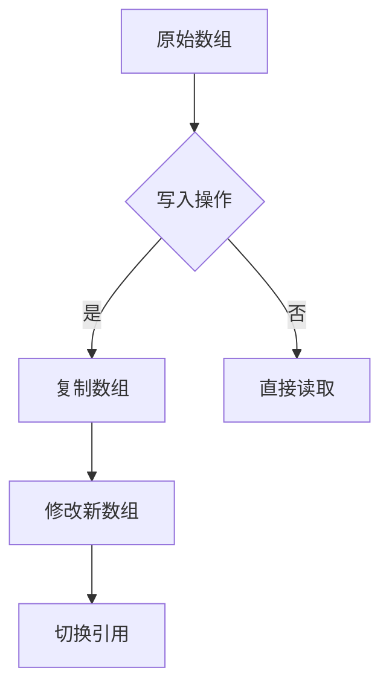
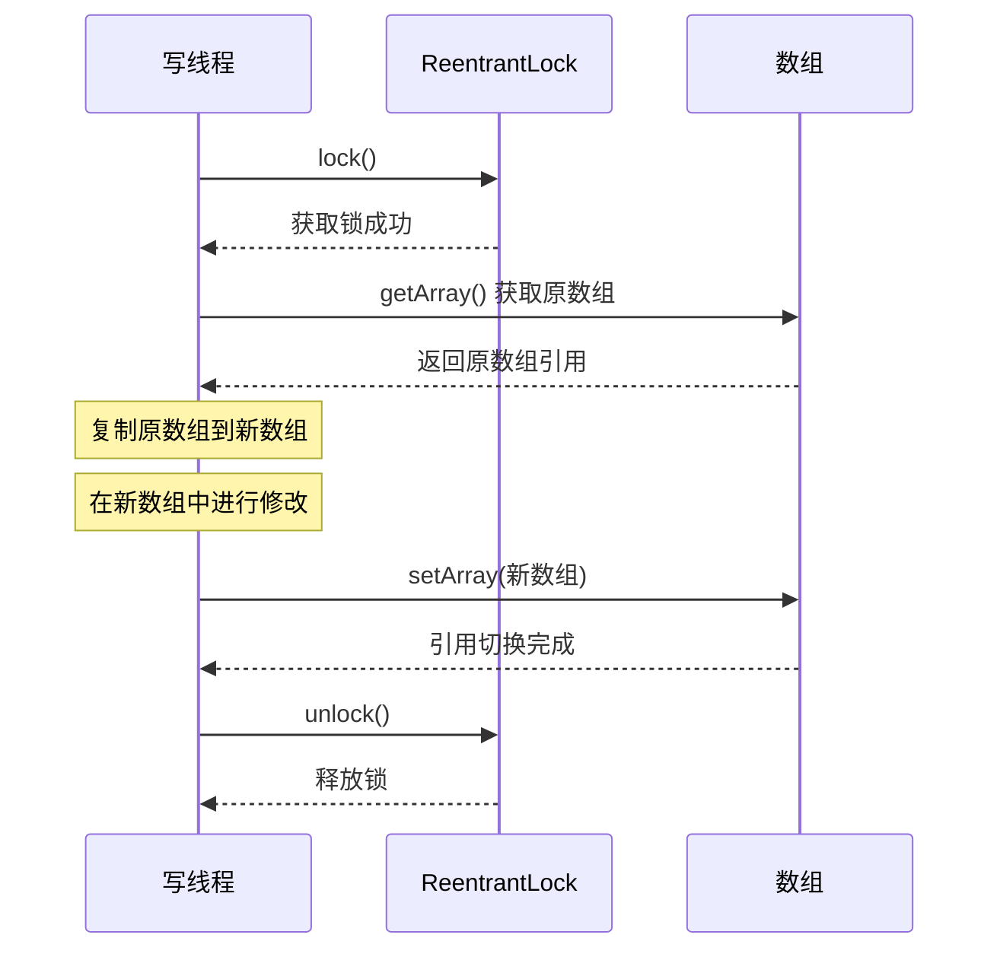
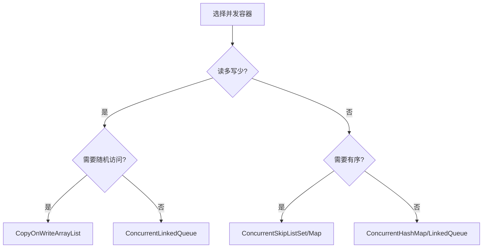

# CopyOnWrite详解

## 一、概念概述

### 1.1 什么是CopyOnWrite

**CopyOnWrite**（写时复制）是一种并发设计模式，核心思想是：**当需要修改容器时，先复制一份新的容器进行修改，修改完成后再将引用指向新容器**。



### 1.2 设计思想

CopyOnWrite采用**读写分离**策略，实现无锁读操作：

| 特性 | 说明 |
|------|------|
| **读操作** | 无需加锁，直接读取，性能极高 |
| **写操作** | 需要加锁，复制数组后修改，性能较低 |
| **一致性** | 最终一致性，读操作可能读到旧数据 |
| **内存开销** | 写操作时需要双倍内存 |

### 1.3 适用场景

| 场景 | 是否适用 | 原因 |
|------|---------|------|
| **读多写少** | ✅ 适用 | 写操作少，内存开销可控 |
| **实时性要求高** | ❌ 不适用 | 可能读到过期数据 |
| **数据量小** | ✅ 适用 | 复制开销小 |
| **写操作频繁** | ❌ 不适用 | 频繁复制导致性能差 |

---

## 二、CopyOnWriteArrayList实现原理

### 2.1 核心结构

```java
public class CopyOnWriteArrayList<E> implements List<E>, RandomAccess, Cloneable, java.io.Serializable {
    // 重入锁，保护写操作
    final transient ReentrantLock lock = new ReentrantLock();
    
    // volatile数组，保证可见性
    private transient volatile Object[] array;
    
    // 获取当前数组
    final Object[] getArray() {
        return array;
    }
    
    // 设置新数组
    final void setArray(Object[] a) {
        array = a;
    }
}
```

### 2.2 写操作实现

#### add() 方法

```java
public boolean add(E e) {
    final ReentrantLock lock = this.lock;
    lock.lock();  // 获取锁
    try {
        Object[] elements = getArray();
        int len = elements.length;
        // 复制原数组到新数组（长度+1）
        Object[] newElements = Arrays.copyOf(elements, len + 1);
        newElements[len] = e;  // 在新数组中添加元素
        setArray(newElements); // 切换引用
        return true;
    } finally {
        lock.unlock();  // 释放锁
    }
}
```

#### remove() 方法

```java
public E remove(int index) {
    final ReentrantLock lock = this.lock;
    lock.lock();
    try {
        Object[] elements = getArray();
        int len = elements.length;
        E oldValue = get(elements, index);
        int numMoved = len - index - 1;
        if (numMoved == 0)
            // 删除最后一个元素
            setArray(Arrays.copyOf(elements, len - 1));
        else {
            // 复制前半部分和后半部分
            Object[] newElements = new Object[len - 1];
            System.arraycopy(elements, 0, newElements, 0, index);
            System.arraycopy(elements, index + 1, newElements, index, numMoved);
            setArray(newElements);
        }
        return oldValue;
    } finally {
        lock.unlock();
    }
}
```

### 2.3 读操作实现

```java
public E get(int index) {
    return get(getArray(), index);  // 无需加锁，直接读取
}

private E get(Object[] a, int index) {
    return (E) a[index];
}
```

### 2.4 写操作流程图



---

## 三、CopyOnWriteArraySet实现原理

### 3.1 核心结构

```java
public class CopyOnWriteArraySet<E> extends AbstractSet<E>
        implements java.io.Serializable {
    
    // 内部使用CopyOnWriteArrayList存储元素
    private final CopyOnWriteArrayList<E> al;
    
    public CopyOnWriteArraySet() {
        al = new CopyOnWriteArrayList<E>();
    }
}
```

### 3.2 add() 方法

```java
public boolean add(E e) {
    return al.addIfAbsent(e);  // 调用CopyOnWriteArrayList的addIfAbsent
}
```

### 3.3 addIfAbsent() 实现

```java
public boolean addIfAbsent(E e) {
    Object[] snapshot = getArray();
    // 先检查是否存在（无锁）
    return indexOf(e, snapshot, 0, snapshot.length) >= 0 ? false :
        addIfAbsent(e, snapshot);
}

private boolean addIfAbsent(E e, Object[] snapshot) {
    final ReentrantLock lock = this.lock;
    lock.lock();
    try {
        Object[] current = getArray();
        int len = current.length;
        // 双重检查：加锁后再次检查
        if (snapshot != current) {
            // 数组已被其他线程修改，重新检查
            int common = Math.min(snapshot.length, len);
            for (int i = 0; i < common; i++)
                if (current[i] != snapshot[i] && eq(e, current[i]))
                    return false;
            if (indexOf(e, current, common, len) >= 0)
                    return false;
        }
        // 复制并添加
        Object[] newElements = Arrays.copyOf(current, len + 1);
        newElements[len] = e;
        setArray(newElements);
        return true;
    } finally {
        lock.unlock();
    }
}
```

---

## 四、特性对比

### 4.1 CopyOnWriteArrayList vs ArrayList

| 特性 | CopyOnWriteArrayList | ArrayList |
|------|---------------------|-----------|
| **线程安全** | ✅ 线程安全 | ❌ 非线程安全 |
| **读操作锁** | ❌ 无需锁 | ❌ 无需锁 |
| **写操作锁** | ✅ 需要锁 | ❌ 无锁（但不安全） |
| **内存开销** | 高（写时复制） | 低 |
| **一致性** | 最终一致性 | 强一致性 |
| **适用场景** | 读多写少 | 单线程或外部同步 |

### 4.2 CopyOnWriteArrayList vs ConcurrentLinkedQueue

| 特性 | CopyOnWriteArrayList | ConcurrentLinkedQueue |
|------|---------------------|---------------------|
| **数据结构** | 数组 | 链表 |
| **随机访问** | ✅ O(1) | ❌ O(n) |
| **内存局部性** | 好 | 差 |
| **写操作开销** | 高（复制数组） | 低（CAS操作） |
| **适用场景** | 读多写少，需随机访问 | 高并发读写 |

### 4.3 CopyOnWriteArraySet vs ConcurrentSkipListSet

| 特性 | CopyOnWriteArraySet | ConcurrentSkipListSet |
|------|---------------------|---------------------|
| **数据结构** | 数组（底层） | 跳表 |
| **有序性** | ❌ 无序 | ✅ 有序 |
| **contains()** | O(n) | O(log n) |
| **内存开销** | 高 | 中等 |
| **适用场景** | 读多写少，数据量小 | 高并发，需有序 |

---

## 五、代码示例

### 5.1 CopyOnWriteArrayList基本使用

```java
import java.util.concurrent.CopyOnWriteArrayList;

public class CopyOnWriteArrayListExample {
    
    public static void main(String[] args) {
        // 创建CopyOnWriteArrayList
        CopyOnWriteArrayList<String> list = new CopyOnWriteArrayList<>();
        
        // 添加元素
        list.add("Apple");
        list.add("Banana");
        list.add("Cherry");
        
        // 读取元素（无需同步）
        System.out.println("Element at index 1: " + list.get(1));
        
        // 遍历元素（即使有其他线程修改也安全）
        for (String fruit : list) {
            System.out.println(fruit);
        }
        
        // 删除元素
        list.remove("Banana");
        
        // 批量添加
        list.addAll(java.util.Arrays.asList("Date", "Elderberry"));
        
        System.out.println("Final size: " + list.size());
    }
}
```

### 5.2 并发读写示例

```java
import java.util.concurrent.CopyOnWriteArrayList;

public class ConcurrentReadWriteExample {
    
    private static final CopyOnWriteArrayList<String> list = new CopyOnWriteArrayList<>();
    
    public static void main(String[] args) throws InterruptedException {
        // 初始化数据
        for (int i = 0; i < 10; i++) {
            list.add("Item " + i);
        }
        
        // 启动多个读线程
        for (int i = 0; i < 5; i++) {
            new Thread(() -> {
                while (true) {
                    for (String item : list) {
                        System.out.println("Reader " + Thread.currentThread().getId() + ": " + item);
                        try {
                            Thread.sleep(100);
                        } catch (InterruptedException e) {
                            Thread.currentThread().interrupt();
                        }
                    }
                }
            }).start();
        }
        
        // 启动写线程
        new Thread(() -> {
            int counter = 10;
            while (true) {
                list.add("Item " + counter++);
                System.out.println("Writer added: Item " + (counter - 1));
                try {
                    Thread.sleep(500);
                } catch (InterruptedException e) {
                    Thread.currentThread().interrupt();
                }
            }
        }).start();
        
        Thread.sleep(3000);
    }
}
```

### 5.3 CopyOnWriteArraySet使用

```java
import java.util.concurrent.CopyOnWriteArraySet;

public class CopyOnWriteArraySetExample {
    
    public static void main(String[] args) {
        CopyOnWriteArraySet<String> set = new CopyOnWriteArraySet<>();
        
        // 添加元素
        set.add("A");
        set.add("B");
        set.add("C");
        
        // 重复添加（无效）
        boolean added = set.add("A");
        System.out.println("Added A again: " + added);  // false
        
        // 遍历
        for (String element : set) {
            System.out.println(element);
        }
        
        // 移除
        set.remove("B");
        
        // 批量添加
        set.addAll(java.util.Arrays.asList("D", "E", "A"));  // A已存在，不会重复添加
        
        System.out.println("Final size: " + set.size());  // 4
    }
}
```

---

## 六、使用场景与最佳实践

### 6.1 推荐使用场景

| 场景 | 说明 |
|------|------|
| **配置管理** | 配置项读取频繁，修改很少 |
| **缓存数据** | 数据不经常变化，查询频繁 |
| **事件监听器列表** | 注册/注销少，触发频繁 |
| **只读数据共享** | 初始化后很少修改的数据 |

### 6.2 不推荐使用场景

| 场景 | 原因 |
|------|------|
| **写操作频繁** | 每次写都复制数组，性能差 |
| **大数据量** | 复制开销大，内存压力大 |
| **实时性要求高** | 读可能读到过期数据 |
| **需要索引操作** | 数组复制开销大 |

### 6.3 最佳实践

1. **初始化时加载数据**：避免运行时频繁修改
2. **控制数据量**：数据量过大时复制开销不可接受
3. **批量修改**：合并多次写操作，减少复制次数
4. **配合其他容器使用**：写操作多的部分使用其他并发容器

### 6.4 注意事项

| 注意点 | 说明 |
|--------|------|
| **弱一致性** | 迭代器可能看不到最新修改 |
| **内存占用** | 写操作时内存占用翻倍 |
| **迭代器不支持修改** | 迭代器是快照，remove/add会抛异常 |
| **性能特性** | 读操作极快，写操作较慢 |

---

## 七、总结

### 7.1 核心要点

| 要点 | 说明 |
|------|------|
| **设计思想** | 读写分离，写时复制 |
| **读操作** | 无需加锁，性能极高 |
| **写操作** | 需要加锁，复制数组 |
| **一致性** | 最终一致性 |
| **内存开销** | 写时双倍内存 |

### 7.2 选择建议



### 7.3 关键原理

1. **volatile数组**：保证引用的可见性
2. **ReentrantLock**：保证写操作的原子性
3. **写时复制**：实现读写分离，读操作无锁
4. **最终一致性**：牺牲强一致性换取高性能

### 7.4 性能总结

| 操作 | CopyOnWriteArrayList | 普通ArrayList（同步） |
|------|---------------------|---------------------|
| **get()** | O(1) 无锁 | O(1) 需同步 |
| **add()** | O(n) 复制数组 | O(1) 均摊需同步 |
| **remove()** | O(n) 复制数组 | O(n) 需同步 |
| **contains()** | O(n) 无锁 | O(n) 需同步 |
