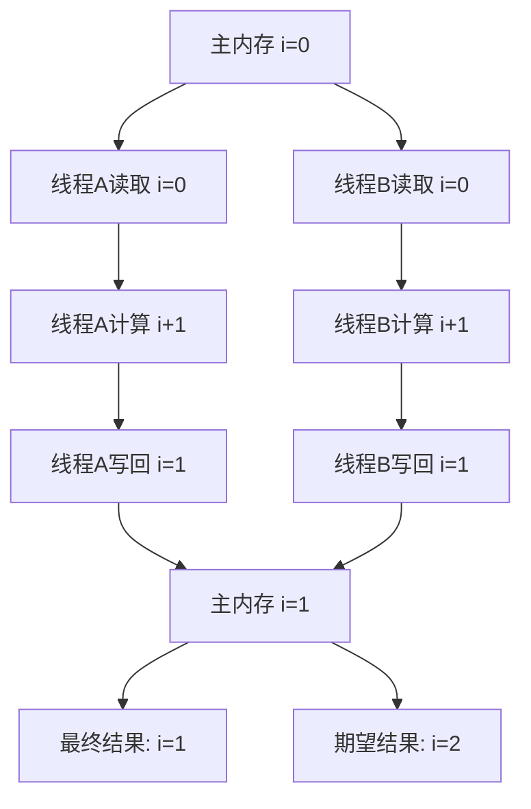
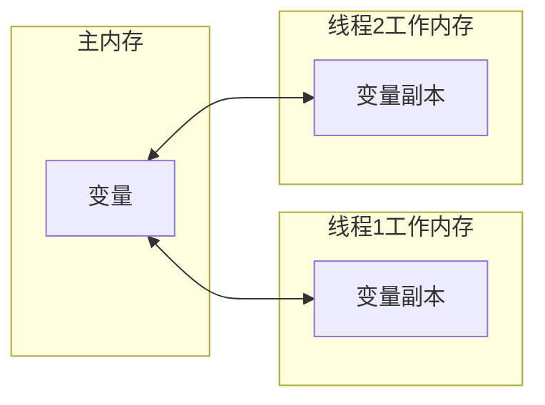
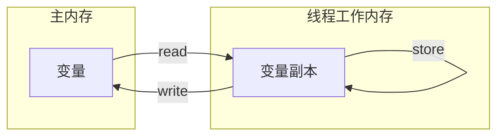
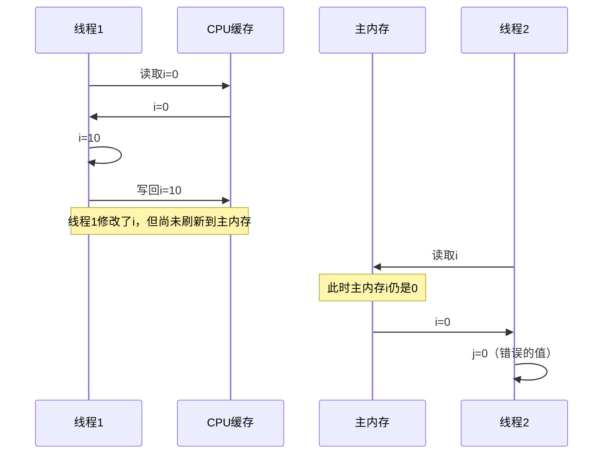
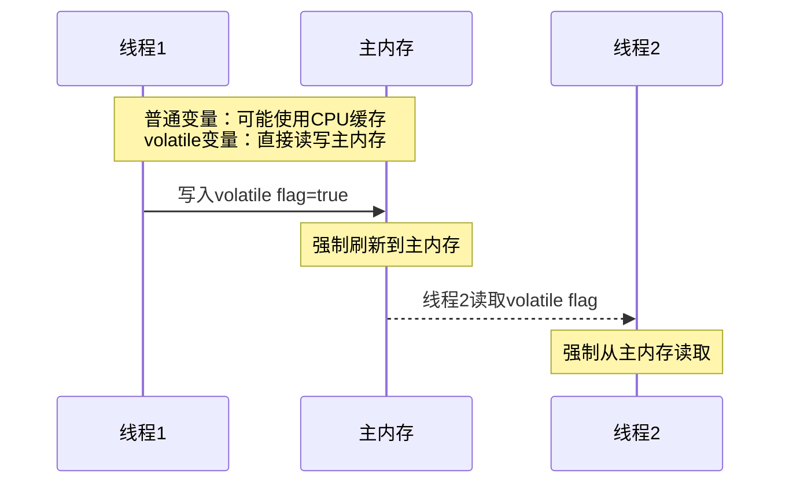
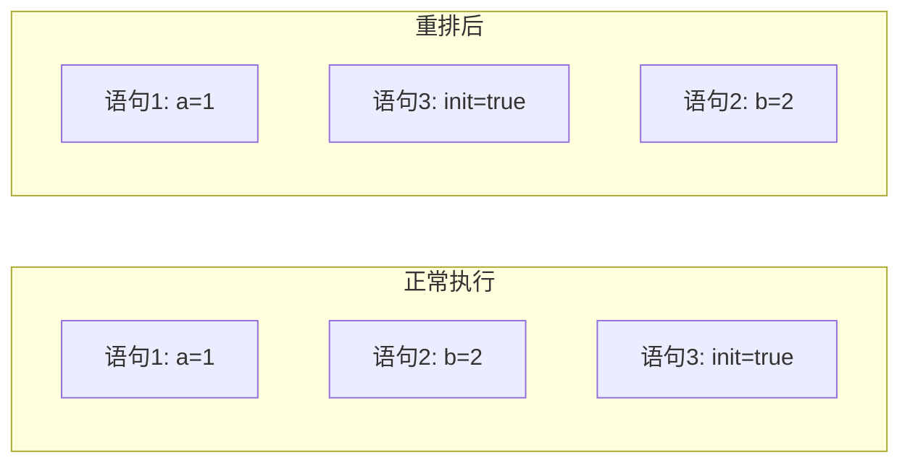
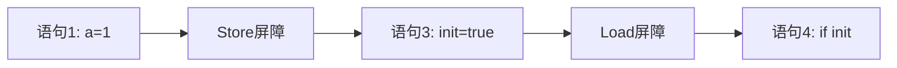
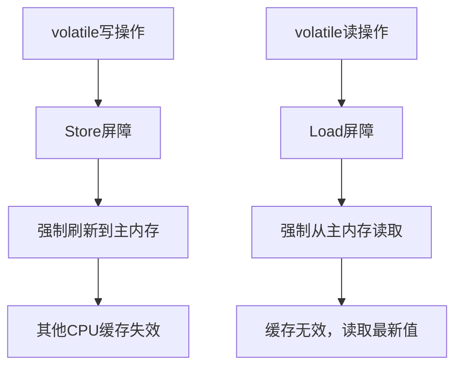
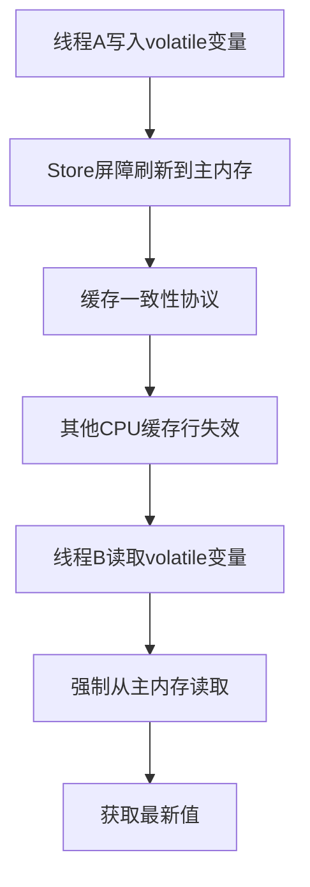
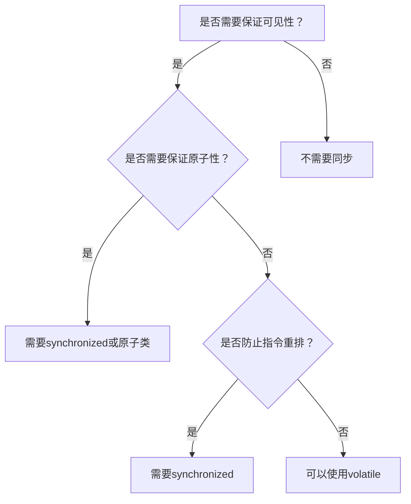

# JMM内存模型与Volatile关键字

## 一、并发编程的问题

### 1.1 并发编程基础

在现代多核CPU架构下，并发编程是提升程序性能的关键技术。然而，并发也带来了三大核心问题：

| 问题 | 描述 | 影响 |
|------|------|------|
| **原子性** | 操作是否不可分割 | 数据竞争导致结果错误 |
| **可见性** | 线程间能否看到共享变量 | 线程看到过期数据 |
| **有序性** | 程序执行顺序是否按代码顺序 | 指令重排导致逻辑错误 |

### 1.2 并发问题的产生过程



### 1.3 代码示例

```java
public class VisibilityProblem {
    
    private int count = 0;  // 共享变量
    
    public void increment() {
        count++;  // 非原子操作
    }
    
    public int getCount() {
        return count;
    }
}
```

**问题分析**：`count++` 看似是单个操作，实际上包含三个步骤：
1. 从主内存读取 `count` 到CPU缓存
2. CPU执行 `+1` 操作
3. 将结果写回主内存

---

## 二、Java内存模型（JMM）

### 2.1 JMM概述

Java内存模型（Java Memory Model，简称JMM）是一种规范，定义了Java程序中各种变量（共享变量）的访问规则。



### 2.2 JMM的核心概念

| 概念 | 说明 |
|------|------|
| **主内存（Main Memory）** | 所有线程共享的内存区域，存储实例字段、静态字段等 |
| **工作内存（Working Memory）** | 每个线程独有的内存区域，存储线程私有的本地变量等 |
| **交互操作** | lock、unlock、read、load、use、assign、store、write |

### 2.3 JMM的八种交互操作



| 操作 | 说明 |
|------|------|
| **read** | 从主内存读取变量到工作内存 |
| **load** | 将read的变量值载入工作内存的副本 |
| **use** | 将工作内存中变量值传递给CPU执行 |
| **assign** | 将CPU计算结果赋值给工作内存变量 |
| **store** | 将工作内存变量传送到主内存 |
| **write** | 将store的变量值写入主内存变量 |

### 2.4 JMM的三大特性

#### 原子性（Atomicity）

指一个操作要么全部执行，要么全部不执行：

```java
// 原子操作
x = 10;        // 原子：直接赋值
y = x;         // 原子：读取+赋值
x++;           // 非原子：读取+修改+写回
x = x + 1;     // 非原子：同上
```

| 操作 | 原子性 |
|------|--------|
| 基本类型赋值 | ✅ |
| 引用类型赋值 | ✅ |
| long/double赋值（JDK 1.8+ 64位JVM） | ✅ |
| `i++` | ❌ |
| `x = x + 1` | ❌ |

#### 可见性（Visibility）

指一个线程修改了共享变量的值，其他线程能够立即看到这个修改：



#### 有序性（Ordering）

指程序执行的顺序按照代码的先后顺序执行。JMM允许编译器和处理器对指令进行重排序，但会保证程序执行结果的一致性。

### 2.5 happens-before规则

JMM通过happens-before规则保证多线程操作的有序性和可见性：

| 规则 | 说明 |
|------|------|
| **程序顺序规则** | 一个线程中的每个操作，happens-before该线程中后续的操作 |
| **监视器锁规则** | 对一个锁的解锁操作，happens-before后续对这个锁的加锁操作 |
| **volatile变量规则** | 对volatile变量的写操作，happens-before后续对这个变量的读操作 |
| **线程启动规则** | Thread.start()调用happens-before被启动线程中的任何操作 |
| **线程终止规则** | 线程中所有操作happens-before其他线程检测到该线程终止 |

---

## 三、Volatile关键字

### 3.1 Volatile的两层语义

当一个变量被`volatile`修饰后，具备两层语义：

| 语义 | 说明 |
|------|------|
| **可见性** | 保证线程对变量的读取和写入都是直接操作主内存 |
| **有序性** | 禁止指令重排序优化 |

### 3.2 可见性保证

#### 问题场景

```java
public class VisibilityDemo {
    
    private boolean flag = false;  // 普通变量
    
    public void writer() {
        flag = true;  // 线程1执行
    }
    
    public void reader() {
        if (flag) {   // 线程2执行
            System.out.println("flag is true");
        }
    }
}
```

#### Volatile解决方案



### 3.3 有序性保证 - 指令重排问题

#### 问题场景

```java
public class ReorderDemo {
    
    private int a = 0;
    private int b = 0;
    private volatile boolean init = false;
    
    public void writer() {
        a = 1;        // 语句1
        b = 2;        // 语句2
        init = true;   // 语句3 - volatile写
    }
    
    public void reader() {
        if (init) {   // 语句4 - volatile读
            System.out.println("a=" + a);
            System.out.println("b=" + b);
        }
    }
}
```

#### 问题分析

如果发生指令重排，可能的执行顺序是：



**危险场景**：如果按情况2执行，当线程2检测到`init=true`时，线程1的语句2可能还未执行，导致`b=0`。

#### Volatile如何禁止重排

`volatile`通过**内存屏障**（Memory Barrier）技术，禁止指令重排序：



### 3.4 Volatile的实现原理

#### 内存屏障

内存屏障是一种CPU指令，用于：

| 屏障类型 | 说明 |
|----------|------|
| **Load屏障** | 强制从主内存读取数据 |
| **Store屏障** | 强制将数据刷新到主内存 |

#### Volatile的读写流程



### 3.5 Volatile不能保证原子性

**重要**：Volatile不能替代synchronized，因为它不能保证原子性：

```java
public class VolatileNotAtomic {
    
    private volatile int count = 0;
    
    public void increment() {
        count++;  // 非原子操作！
    }
}
```

`count++` 包含三个步骤：
1. **read**：读取count当前值
2. **add**：计算count+1
3. **write**：写回count

即使`count`是volatile，也只能保证读取和写入是原子的，但不能保证`count++`这个复合操作的原子性。

### 3.6 Volatile的使用场景

| 场景 | 适用 | 示例 |
|------|------|------|
| **状态标志** | ✅ | `volatile boolean running = true;` |
| **双重检查锁定** | ✅ | `private volatile Singleton instance;` |
| **计数器** | ❌ | 需要使用AtomicInteger |
| **复杂复合操作** | ❌ | 需要使用synchronized |

#### 典型使用：状态标志

```java
public class Server {
    
    private volatile boolean running = true;
    
    public void start() {
        while (running) {
            // 处理请求
        }
    }
    
    public void stop() {
        running = false;  // 立即被其他线程看到
    }
}
```

#### 典型使用：双重检查锁定

```java
public class Singleton {
    
    private static volatile Singleton instance;
    
    public static Singleton getInstance() {
        if (instance == null) {              // 第一次检查
            synchronized (Singleton.class) {
                if (instance == null) {      // 第二次检查
                    instance = new Singleton();
                }
            }
        }
        return instance;
    }
}
```

**为什么要用volatile？** 防止`instance = new Singleton()`指令重排，导致其他线程获取到未完全初始化的对象。

---

## 四、Volatile与内存屏障详解

### 4.1 内存屏障的四种类型

| 屏障类型 | 指令 | 说明 |
|----------|------|------|
| **LoadLoad** | `load1; loadload; load2` | 确保load1先于load2加载 |
| **StoreStore** | `store1; storestore; store2` | 确保store1先于store2刷新 |
| **LoadStore** | `load1; loadstore; store2` | 确保load1先于store2 |
| **StoreLoad** | `store1; storeload; load2` | 确保store1刷新后load2才加载 |

### 4.2 Volatile的屏障插入策略

#### volatile写的屏障插入

```
在volatile写操作之前插入StoreStore屏障
StoreStoreBarrier
volatile write
在volatile写操作之后插入StoreLoad屏障
StoreLoadBarrier
```

#### volatile读的屏障插入

```
在volatile读操作之后插入LoadLoad屏障
LoadLoadBarrier
volatile read
在volatile读操作之后插入LoadStore屏障
LoadStoreBarrier
```

### 4.3 可见性保证流程图



---

## 五、总结

### 5.1 核心对比

| 特性 | synchronized | volatile |
|------|-------------|----------|
| **原子性** | ✅ 保证 | ❌ 不保证 |
| **可见性** | ✅ 保证 | ✅ 保证 |
| **有序性** | ✅ 保证 | ✅ 保证（针对volatile变量） |
| **性能** | 较低 | 较高 |
| **使用场景** | 复杂复合操作 | 简单状态标志 |

### 5.2 Volatile使用决策流程



### 5.3 最佳实践

1. **适用于Volatile的场景**：
   - 布尔状态标志
   - 单次读写操作
   - 配合双重检查锁定

2. **不适用于Volatile的场景**：
   - 计数器（使用AtomicInteger）
   - 需要复合操作的情况（使用synchronized）

3. **性能考虑**：
   - volatile比synchronized性能高
   - 但不应滥用volatile替代synchronized
