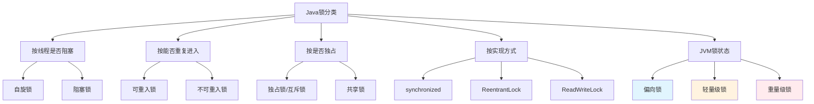
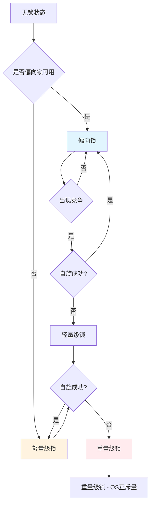
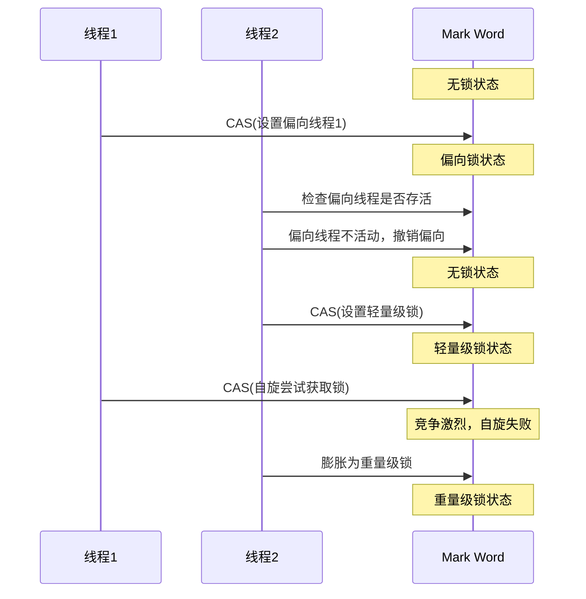
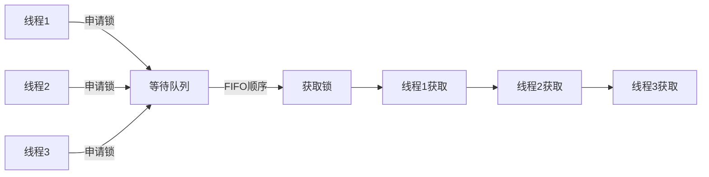
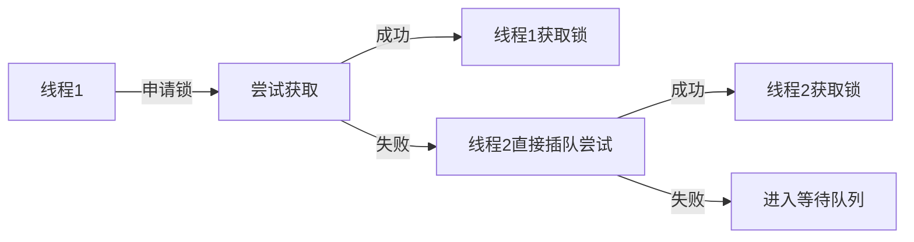
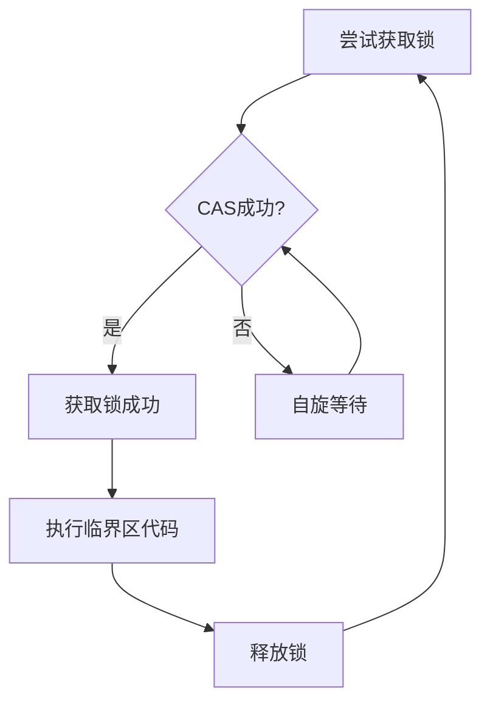
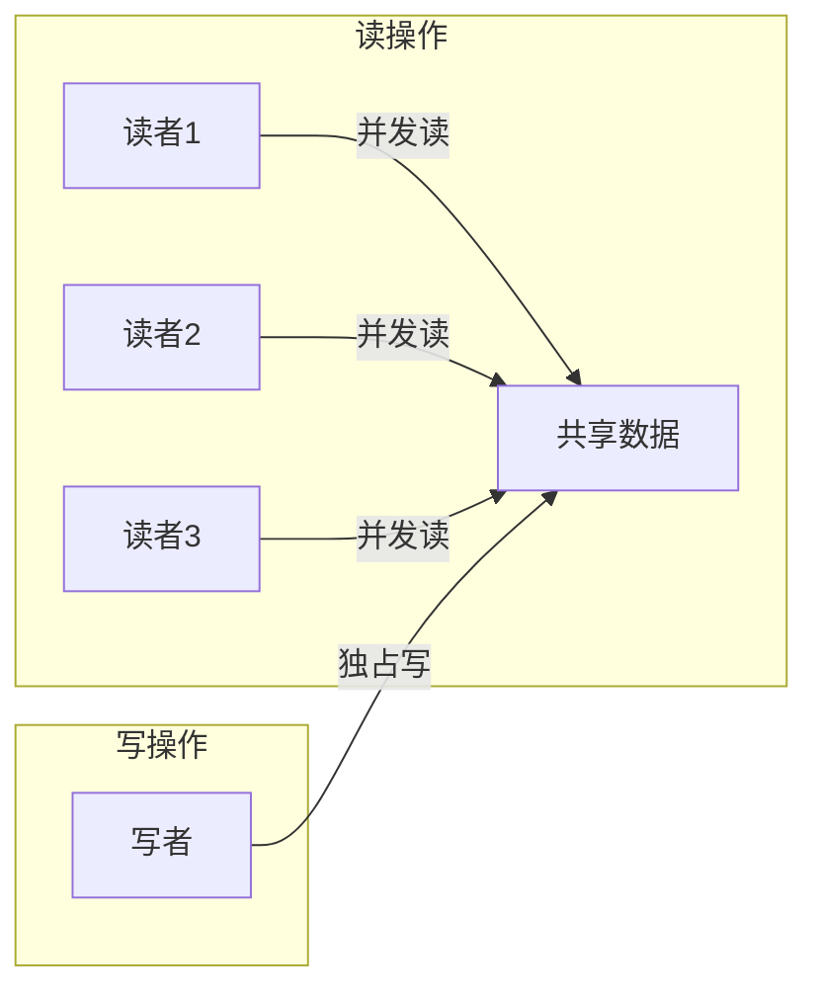
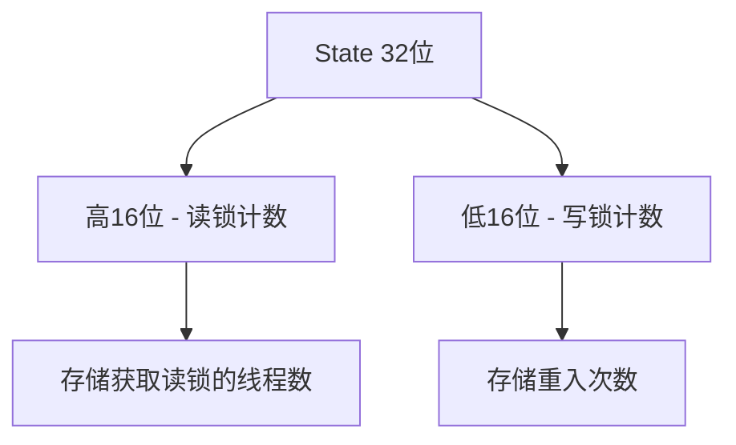
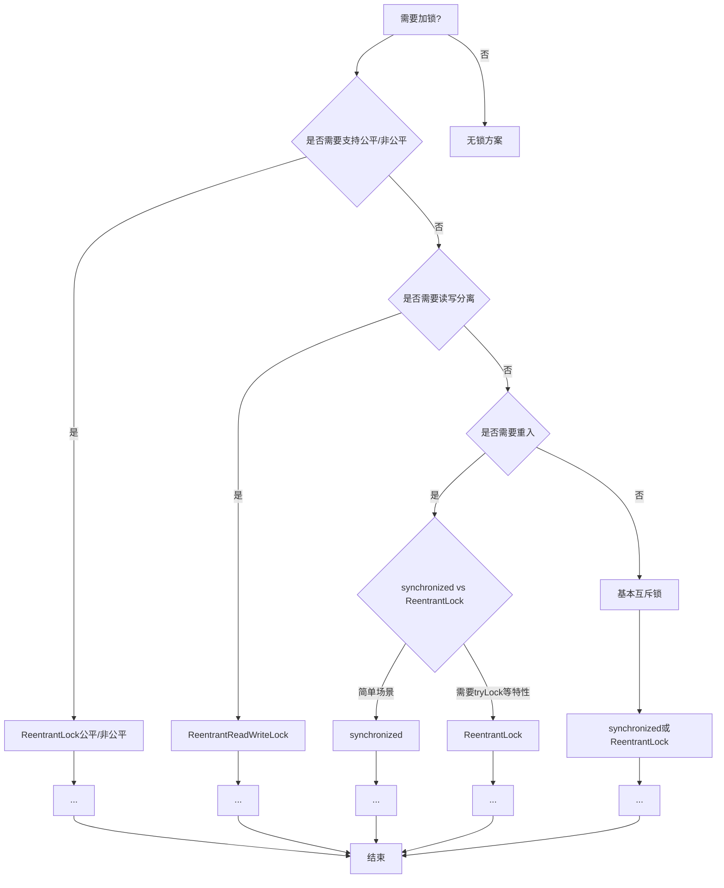

# Java中的锁

## 锁分类体系



## 一、Synchronized锁状态（偏向锁 → 轻量级锁 → 重量级锁）

JVM为了提高synchronized的 performance，设计了偏向锁、轻量级锁、重量级锁三种锁状态。这三种锁会随着竞争情况逐步升级，且升级过程不可逆。



### 1.1 偏向锁

**原理**：

- 当一个线程访问同步块并获取锁时，在对象头和栈帧中的锁记录里记录偏向的线程ID
- 之后该线程再次进入同步块时，不需要再次进行CAS操作来加锁和解锁
- 只有出现竞争时，偏向锁才会撤销

**适用场景**：单线程访问同步块的场景

**JVM参数**：
- `-XX:+UseBiasedLocking` 启用偏向锁（默认启用）
- `-XX:BiasedLockingStartupDelay=0` 延迟时间为0

**特点**：
- 消除了重入开销
- 无需原子操作
- Mark Word存储偏向线程ID

### 1.2 轻量级锁

**原理**：

- 线程在进入同步块前，在栈帧中创建锁记录（Lock Record）
- 将Mark Word复制到锁记录中
- 使用CAS将Mark Word更新为指向锁记录的指针
- 如果更新成功，则获取轻量级锁
- 如果更新失败，说明有竞争，膨胀为重量级锁

**适用场景**：少量线程竞争同步块的场景

**特点**：
- 使用CAS操作替代互斥量
- 线程自旋等待锁释放
- 避免线程切换开销

### 1.3 重量级锁

**原理**：

- 依赖操作系统的Mutex Lock实现
- 当竞争加剧，自旋超过阈值后，锁膨胀为重量级锁
- 未获取锁的线程会被阻塞，涉及用户态到内核态的切换

**特点**：
- 线程阻塞，不消耗CPU
- 但有线程切换开销
- Mark Word存储指向互斥量的指针

### 1.4 锁膨胀过程



## 二、公平锁与非公平锁

### 2.1 公平锁

**定义**：多个线程按照申请锁的顺序来获取锁，队列先来后到。

**特点**：
- 线程按FIFO顺序获取锁
- 不会产生饥饿现象
- 但需要维护有序队列，有一定开销

**示例**：

```java
ReentrantLock fairLock = new ReentrantLock(true);
```



### 2.2 非公平锁

**定义**：多个线程获取锁的顺序并不是按照申请锁的顺序，有可能后申请的线程比先申请的线程优先获取锁。

**特点**：
- 允许插队，提高吞吐量
- 可能造成优先级反转或饥饿现象
- 是synchronized和ReentrantLock的默认实现

**示例**：

```java
ReentrantLock nonFairLock = new ReentrantLock(false);
// 或者默认就是非公平锁
ReentrantLock nonFairLock = new ReentrantLock();
```



### 2.3 公平锁 vs 非公平锁对比

| 特性 | 公平锁 | 非公平锁 |
|------|--------|----------|
| 获取顺序 | FIFO | 随机/插队 |
| 吞吐量 | 较低 | 较高 |
| 饥饿问题 | 无 | 可能 |
| 复杂度 | 较复杂 | 较简单 |

```java
public class FairAndUnfairDemo {
    private static final ReentrantLock fairLock = new ReentrantLock(true);
    private static final ReentrantLock unfairLock = new ReentrantLock(false);

    public static void fairTask() {
        fairLock.lock();
        try {
            System.out.println(Thread.currentThread().getName() + " 获取了锁");
        } finally {
            fairLock.unlock();
        }
    }

    public static void unfairTask() {
        unfairLock.lock();
        try {
            System.out.println(Thread.currentThread().getName() + " 获取了锁");
        } finally {
            unfairLock.unlock();
        }
    }

    public static void main(String[] args) {
        System.out.println("==========公平锁测试==========");
        for (int i = 1; i <= 3; i++) {
            new Thread(() -> fairTask(), "T" + i).start();
        }

        try {
            Thread.sleep(1000);
        } catch (InterruptedException e) {
            e.printStackTrace();
        }

        System.out.println("==========非公平锁测试==========");
        for (int i = 1; i <= 3; i++) {
            new Thread(() -> unfairTask(), "T" + i).start();
        }
    }
}
```

## 三、可重入锁（递归锁）

### 3.1 概念

同一线程外层函数获得锁之后，内层递归函数仍然能获取该锁的代码。在同一个线程在外层方法获取锁的时候，在进入内层方法会自动获取锁。

**作用**：避免死锁

**典型实现**：
- `synchronized`
- `ReentrantLock`

### 3.2 ReentrantLock可重入锁

```java
public class ReentrantLockTest {
    public static void main(String[] args) {
        ReentrantLockTest reentrantLockTest = new ReentrantLockTest();
        new Thread(() -> {
            reentrantLockTest.b();
        }, "b1").start();

        Thread thread = new Thread(() -> {
            reentrantLockTest.a();
        }, "a1");
        thread.start();
        try {
            TimeUnit.SECONDS.sleep(2);
        } catch (InterruptedException e) {
            e.printStackTrace();
        }
        System.out.println(thread.getState());
    }

    synchronized void a() {
        System.out.println(Thread.currentThread().getName() + "进入A方法");
        try {
            Thread.sleep(5000);
        } catch (InterruptedException e) {
            e.printStackTrace();
        }
        b();
    }

    synchronized void b() {
        System.out.println(Thread.currentThread().getName() + "进入B方法");
        try {
            Thread.sleep(10000);
        } catch (InterruptedEvent e) {
            e.printStackTrace();
        }
        System.out.println(Thread.currentThread().getName() + "退出b方法");
    }
}
```

### 3.3 ReentrantLock实现原理

ReentrantLock内部包含三个内部类：

```java
public class ReentrantLock implements Lock, java.io.Serializable {
    private final Sync sync;

    abstract static class Sync extends AbstractQueuedSynchronizer {}

    static final class NonfairSync extends Sync {}
    static final class FairSync extends Sync {}
}
```

- `Sync`：抽象同步器，提供模板方法
- `NonfairSync`：非公平锁实现
- `FairSync`：公平锁实现

**可重入实现**：通过AQS的state计数器实现，每次加锁state+1，每次解锁state-1

### 3.4 可重入锁代码示例

```java
public class ReentrantLockDemo {
    private final ReentrantLock lock = new ReentrantLock();

    public void outer() {
        lock.lock();
        try {
            System.out.println("outer方法获取锁");
            inner();
        } finally {
            lock.unlock();
        }
    }

    public void inner() {
        lock.lock();
        try {
            System.out.println("inner方法获取锁");
        } finally {
            lock.unlock();
        }
    }

    public static void main(String[] args) {
        ReentrantLockDemo demo = new ReentrantLockDemo();
        demo.outer();
    }
}
```

## 四、自旋锁

### 4.1 概念

尝试获取锁的线程不会立即阻塞，而是采用循环的方式去尝试获取锁。

**好处**：减少线程上下文切换的消耗

**缺点**：会消耗CPU资源

```java
public class SpinLock {
    private final AtomicReference<Thread> holder = new AtomicReference<>();

    public void lock() {
        Thread current = Thread.currentThread();
        while (!holder.compareAndSet(null, current)) {
            // 空循环，等待锁释放
        }
    }

    public void unlock() {
        Thread current = Thread.currentThread();
        holder.compareAndSet(current, null);
    }
}
```

### 4.2 自旋次数选择

- JVM参数 `-XX:PreBlockSpin` 设置自旋次数（Java 11已移除）
- JDK 6之后引入了自适应自旋技术，根据上一次自旋成功率动态调整

### 4.3 自旋锁原理图



## 五、独占锁与共享锁

### 5.1 独占锁（互斥锁）

指该锁一次只能被一个线程持有。

**实现**：
- `synchronized`
- `ReentrantLock`

```java
public class ExclusiveLockDemo {
    private final ReentrantLock lock = new ReentrantLock();
    private int count = 0;

    public void increment() {
        lock.lock();
        try {
            count++;
        } finally {
            lock.unlock();
        }
    }

    public int getCount() {
        lock.lock();
        try {
            return count;
        } finally {
            lock.unlock();
        }
    }
}
```

### 5.2 共享锁

可以被多个线程所持有。

**实现**：`ReadWriteLock` 中的读锁是共享锁

```java
public class ShareLockDemo {
    private final ReadWriteLock rwLock = new ReentrantReadWriteLock();
    private int value = 0;

    public void write(int newValue) {
        rwLock.writeLock().lock();
        try {
            value = newValue;
            System.out.println(Thread.currentThread().getName() + "写入值: " + value);
        } finally {
            rwLock.writeLock().unlock();
        }
    }

    public int read() {
        rwLock.readLock().lock();
        try {
            System.out.println(Thread.currentThread().getName() + "读取值: " + value);
            return value;
        } finally {
            rwLock.readLock().unlock();
        }
    }
}
```

## 六、读写锁（ReadWriteLock）

### 6.1 概念

读写锁是一种支持并发读操作的锁机制，区分了读和写操作。

**规则**：
- 读操作：多个线程可以同时读取（共享）
- 写操作：独占访问，互斥



### 6.2 ReentrantReadWriteLock

```java
public class ReadWriteLockDemo {
    private final Map<String, Object> cache = new HashMap<>();
    private final ReadWriteLock rwLock = new ReentrantReadWriteLock();

    public void put(String key, Object value) {
        rwLock.writeLock().lock();
        try {
            cache.put(key, value);
            System.out.println(Thread.currentThread().getName() + "写入: " + key);
        } finally {
            rwLock.writeLock().unlock();
        }
    }

    public Object get(String key) {
        rwLock.readLock().lock();
        try {
            System.out.println(Thread.currentThread().getName() + "读取: " + key);
            return cache.get(key);
        } finally {
            rwLock.readLock().unlock();
        }
    }

    public static void main(String[] args) {
        ReadWriteLockDemo demo = new ReadWriteLockDemo();

        // 写入操作
        for (int i = 0; i < 3; i++) {
            final int j = i;
            new Thread(() -> demo.put("key" + j, "value" + j), "Writer-" + j).start();
        }

        // 读取操作
        for (int i = 0; i < 5; i++) {
            final int j = i;
            new Thread(() -> demo.get("key" + j), "Reader-" + j).start();
        }
    }
}
```

### 6.3 读写锁状态分析

ReentrantReadWriteLock通过AQS的state的高16位存储读锁计数，低16位存储写锁计数：



### 6.4 读写锁锁降级

写锁可以降级为读锁，但读锁不能升级为写锁。

```java
public class LockDowngradeDemo {
    private final ReentrantReadWriteLock rwLock = new ReentrantReadWriteLock();

    public void downgrade() {
        rwLock.writeLock().lock();
        try {
            System.out.println("获取写锁");
            // 业务操作
            rwLock.readLock().lock();
            try {
                System.out.println("降级为读锁");
            } finally {
                // 不释放写锁
            }
        } finally {
            rwLock.writeLock().unlock();
            // 写锁释放后，仍持有读锁
        }
    }
}
```

## 七、CountDownLatch（倒计时锁）

### 7.1 概念

允许一个或多个线程等待其他线程完成操作。

```java
public class CountDownLatchDemo {
    public static void main(String[] args) throws InterruptedException {
        CountDownLatch latch = new CountDownLatch(3);

        for (int i = 0; i < 3; i++) {
            final int j = i;
            new Thread(() -> {
                try {
                    Thread.sleep(1000 * (j + 1));
                    System.out.println("任务" + j + "完成");
                } catch (InterruptedException e) {
                    e.printStackTrace();
                } finally {
                    latch.countDown();
                }
            }).start();
        }

        latch.await();
        System.out.println("所有任务完成，主线程继续执行");
    }
}
```

## 八、CyclicBarrier（循环栅栏）

### 8.1 概念

让一组线程相互等待，当达到某个共同点时，所有线程同时开始执行。

```java
public class CyclicBarrierDemo {
    public static void main(String[] args) {
        CyclicBarrier barrier = new CyclicBarrier(3, () -> {
            System.out.println("所有运动员已就位，发令枪响！");
        });

        for (int i = 0; i < 3; i++) {
            final int j = i;
            new Thread(() -> {
                try {
                    System.out.println("运动员" + j + "准备中...");
                    barrier.await();
                    System.out.println("运动员" + j + "出发！");
                } catch (InterruptedException | BrokenBarrierException e) {
                    e.printStackTrace();
                }
            }).start();
        }
    }
}
```

## 九、Semaphore（信号量）

### 9.1 概念

控制同时访问特定资源的线程数量。

```java
public class SemaphoreDemo {
    public static void main(String[] args) {
        Semaphore semaphore = new Semaphore(3);

        for (int i = 0; i < 6; i++) {
            final int j = i;
            new Thread(() -> {
                try {
                    semaphore.acquire();
                    System.out.println("线程" + j + "获取许可");
                    Thread.sleep(2000);
                    System.out.println("线程" + j + "释放许可");
                    semaphore.release();
                } catch (InterruptedException e) {
                    e.printStackTrace();
                }
            }).start();
        }
    }
}
```

## 十、锁选用指南

### 10.1 锁选择决策图



### 10.2 锁选用对照表

| 场景 | 推荐锁 | 原因 |
|------|--------|------|
| 简单同步，无需额外功能 | `synchronized` | JVM内置，无需手动释放 |
| 需要tryLock特性 | `ReentrantLock` | 支持超时、非阻塞获取 |
| 需要公平锁 | `ReentrantLock(true)` | 支持公平锁 |
| 读多写少场景 | `ReentrantReadWriteLock` | 读写分离，提高并发 |
| 限流场景 | `Semaphore` | 控制并发数量 |
| 线程等待场景 | `CountDownLatch`/`CyclicBarrier` | 线程同步 |

### 10.3 synchronized vs ReentrantLock对比

| 特性 | synchronized | ReentrantLock |
|------|--------------|---------------|
| 释放方式 | 自动释放 | 手动释放 |
| 等待可中断 | 否 | 是（tryLock(long timeout)） |
| 公平锁 | 否 | 是 |
| 锁投票 | 否 | 是（getQueuedThreads） |
| 条件condition | 否 | 是（newCondition） |
| 批量操作 | 否 | 是（getWaitingThreads等） |

### 10.4 性能优化建议

1. **减少锁粒度**：将大对象拆分为小对象，分别加锁
2. **读写分离**：读多写少场景使用ReadWriteLock
3. **避免锁嵌套**：减少死锁风险
4. **使用Concurrent集合**：如ConcurrentHashMap、CopyOnWriteArrayList
5. **考虑无锁算法**：CAS、原子类

```java
// 锁优化示例 - 锁分段
public class SegmentLockDemo {
    private final Segment[] segments;

    public SegmentLockDemo(int segmentCount) {
        this.segments = new Segment[segmentCount];
        for (int i = 0; i < segmentCount; i++) {
            segments[i] = new Segment();
        }
    }

    static class Segment extends ReentrantLock {
        Object data;
    }

    public Object get(Object key) {
        int hash = key.hashCode();
        segments[hash % segments.length].lock();
        try {
            return segments[hash % segments.length].data;
        } finally {
            segments[hash % segments.length].unlock();
        }
    }
}
```
