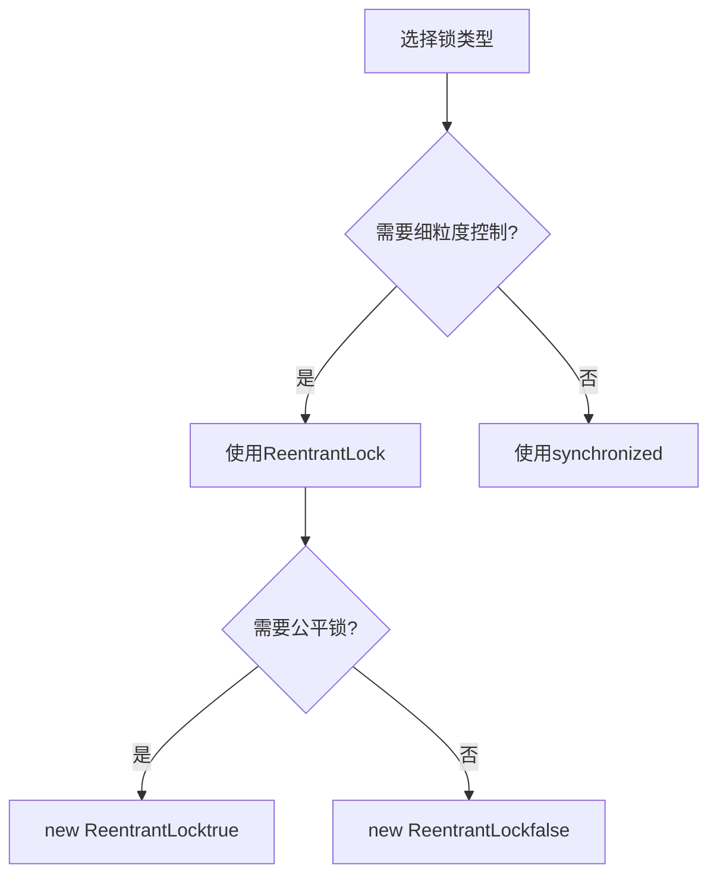
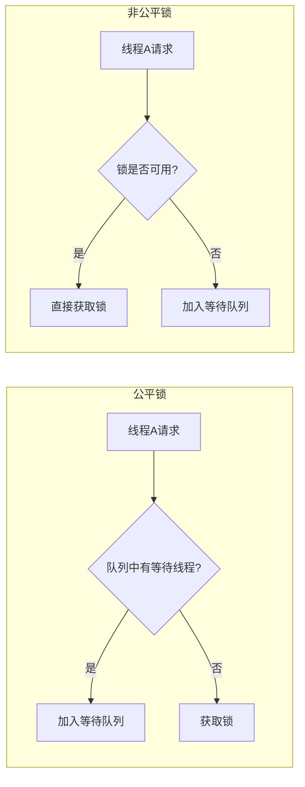
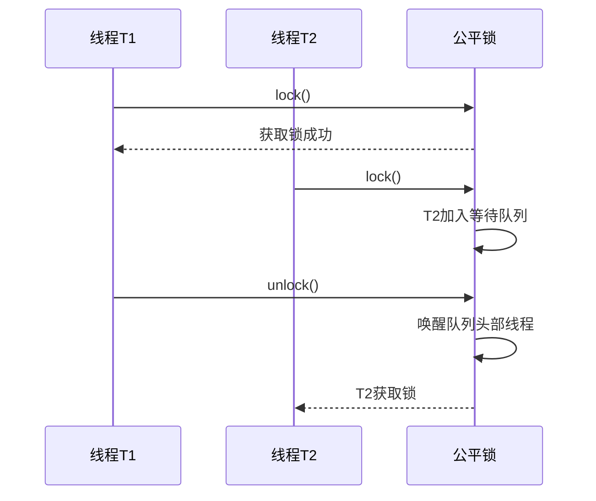
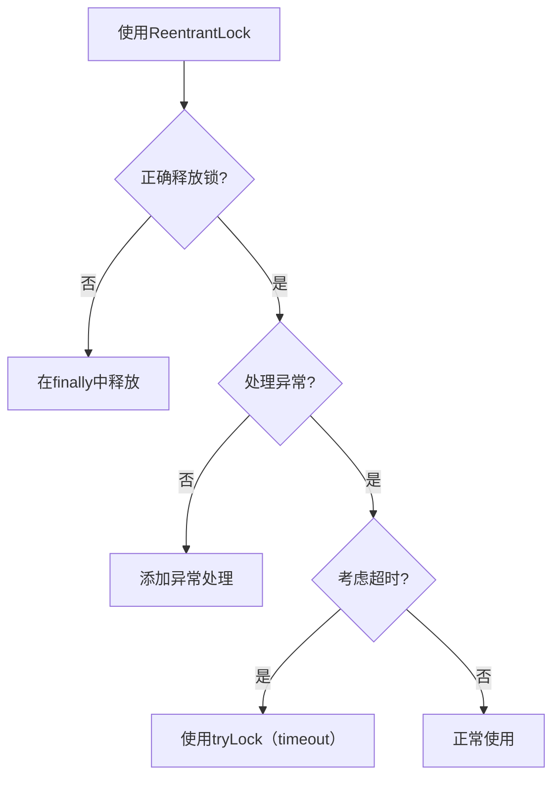

# ReentrantLock详解

## 一、ReentrantLock基本概念

### 1.1 什么是ReentrantLock

`ReentrantLock`是Java `java.util.concurrent.locks`包中的核心锁实现，是一种**可重入锁**，支持以下特性：

- **可重入性**：同一线程可以多次获取同一把锁
- **公平/非公平模式**：支持公平锁和非公平锁两种模式
- **显式锁**：需要手动获取和释放锁
- **条件变量**：支持多个条件变量实现线程间协调

### 1.2 基本用法

```java
import java.util.concurrent.locks.ReentrantLock;

public class ReentrantLockDemo {
    
    private final ReentrantLock lock = new ReentrantLock();
    
    public void doSomething() {
        // 获取锁
        lock.lock();
        try {
            // 临界区代码
            System.out.println("执行临界区代码: " + Thread.currentThread().getName());
        } finally {
            // 释放锁（必须在finally中释放）
            lock.unlock();
        }
    }
}
```

### 1.3 核心方法

| 方法 | 说明 |
|------|------|
| `lock()` | 获取锁，阻塞等待 |
| `lockInterruptibly()` | 获取锁，可被中断 |
| `tryLock()` | 尝试获取锁，立即返回，不阻塞 |
| `tryLock(long timeout, TimeUnit unit)` | 尝试获取锁，超时返回 |
| `unlock()` | 释放锁 |
| `newCondition()` | 创建条件变量 |

### 1.4 可重入性示例

```java
public class ReentrantLockReentrantDemo {
    private final ReentrantLock lock = new ReentrantLock();
    
    public void outer() {
        lock.lock();
        try {
            System.out.println("外层方法");
            inner(); // 同一线程可以再次获取锁
        } finally {
            lock.unlock();
        }
    }
    
    public void inner() {
        lock.lock();
        try {
            System.out.println("内层方法");
        } finally {
            lock.unlock();
        }
    }
}
```

---

## 二、ReentrantLock vs synchronized

### 2.1 对比表格

| 特性 | ReentrantLock | synchronized |
|------|--------------|-------------|
| **锁获取方式** | 显式调用lock() | 隐式获取 |
| **锁释放方式** | 显式调用unlock() | 自动释放 |
| **可中断性** | 支持lockInterruptibly() | 不支持 |
| **超时获取** | 支持tryLock(timeout) | 不支持 |
| **公平锁** | 支持 | 不支持 |
| **条件变量** | 支持多个Condition | 只有一个条件队列 |
| **锁状态查询** | 支持isLocked()、getHoldCount() | 不支持 |
| **性能** | 高并发下性能更优 | 中等 |

### 2.2 关键区别说明



---

## 三、公平锁与非公平锁

### 3.1 概念对比



### 3.2 两种模式的区别

| 特性 | 公平锁 | 非公平锁 |
|------|--------|----------|
| **获取方式** | 按顺序获取 | 可插队获取 |
| **公平性** | 保证公平 | 不保证公平 |
| **性能** | 较低（队列开销） | 较高（减少上下文切换） |
| **适用场景** | 对公平性要求高的场景 | 追求性能的场景 |

### 3.3 创建方式

```java
// 非公平锁（默认）
ReentrantLock nonFairLock = new ReentrantLock();
ReentrantLock nonFairLock2 = new ReentrantLock(false);

// 公平锁
ReentrantLock fairLock = new ReentrantLock(true);
```

### 3.4 公平锁执行流程



---

## 四、Condition条件变量

### 4.1 什么是Condition

`Condition`是`Lock`接口提供的条件变量机制，用于线程间的协调通信：

- 一个Lock可以有多个Condition
- 每个Condition维护一个等待队列
- 支持await()、signal()、signalAll()操作

### 4.2 Condition核心方法

| 方法 | 说明 |
|------|------|
| `await()` | 使线程等待，释放锁 |
| `await(long time, TimeUnit unit)` | 超时等待 |
| `awaitNanos(long nanosTimeout)` | 纳秒级超时等待 |
| `awaitUntil(Date deadline)` | 等待到指定时间 |
| `signal()` | 唤醒一个等待线程 |
| `signalAll()` | 唤醒所有等待线程 |

### 4.3 生产者-消费者示例

```java
import java.util.concurrent.locks.Condition;
import java.util.concurrent.locks.ReentrantLock;

public class ProducerConsumer {
    private final ReentrantLock lock = new ReentrantLock();
    private final Condition notFull = lock.newCondition();  // 队列不满条件
    private final Condition notEmpty = lock.newCondition(); // 队列不空条件
    
    private final Object[] queue = new Object[10];
    private int count = 0;
    private int putIndex = 0;
    private int takeIndex = 0;
    
    // 生产者
    public void put(Object item) throws InterruptedException {
        lock.lock();
        try {
            // 队列满时等待
            while (count == queue.length) {
                notFull.await();
            }
            
            queue[putIndex] = item;
            putIndex = (putIndex + 1) % queue.length;
            count++;
            
            // 通知消费者队列不为空
            notEmpty.signal();
        } finally {
            lock.unlock();
        }
    }
    
    // 消费者
    public Object take() throws InterruptedException {
        lock.lock();
        try {
            // 队列空时等待
            while (count == 0) {
                notEmpty.await();
            }
            
            Object item = queue[takeIndex];
            takeIndex = (takeIndex + 1) % queue.length;
            count--;
            
            // 通知生产者队列不满
            notFull.signal();
            
            return item;
        } finally {
            lock.unlock();
        }
    }
}
```

### 4.4 Condition与Object监视器方法对比

| 特性 | Condition | Object的wait/notify |
|------|-----------|-------------------|
| **锁绑定** | 绑定到Lock | 绑定到synchronized |
| **条件数量** | 多个Condition | 只有一个条件队列 |
| **灵活性** | 更高 | 较低 |
| **使用方式** | lock.newCondition() | 直接调用wait/notify |

---

## 五、ReentrantLock高级特性

### 5.1 可中断锁获取

```java
public class InterruptibleLockDemo {
    private final ReentrantLock lock = new ReentrantLock();
    
    public void doWork() throws InterruptedException {
        // 可被中断的锁获取
        lock.lockInterruptibly();
        try {
            // 临界区代码
        } finally {
            lock.unlock();
        }
    }
}
```

### 5.2 超时锁获取

```java
public class TimeoutLockDemo {
    private final ReentrantLock lock = new ReentrantLock();
    
    public boolean tryDoWork(long timeout, TimeUnit unit) throws InterruptedException {
        // 尝试在指定时间内获取锁
        if (lock.tryLock(timeout, unit)) {
            try {
                // 临界区代码
                return true;
            } finally {
                lock.unlock();
            }
        }
        return false; // 获取锁失败
    }
}
```

### 5.3 锁状态查询

```java
public class LockStatusDemo {
    private final ReentrantLock lock = new ReentrantLock();
    
    public void checkLockStatus() {
        System.out.println("锁是否被持有: " + lock.isLocked());
        System.out.println("当前线程持有锁的次数: " + lock.getHoldCount());
        System.out.println("是否有线程在等待锁: " + lock.hasQueuedThreads());
        System.out.println("队列中等待线程数: " + lock.getQueueLength());
    }
}
```

---

## 六、使用场景与最佳实践

### 6.1 适用场景

| 场景 | 说明 | 推荐锁类型 |
|------|------|------------|
| **需要细粒度控制** | 可中断、超时获取 | ReentrantLock |
| **需要公平性保证** | 按顺序获取锁 | ReentrantLock(true) |
| **需要多个条件变量** | 复杂线程协调 | ReentrantLock + Condition |
| **简单同步需求** | 方法级同步 | synchronized |
| **高并发场景** | 追求性能 | ReentrantLock(false) |

### 6.2 最佳实践



### 6.3 使用建议

| 原则 | 说明 |
|------|------|
| **始终在finally中释放锁** | 防止异常导致锁泄漏 |
| **避免锁嵌套** | 减少死锁风险 |
| **合理选择公平性** | 非公平锁性能更好 |
| **使用tryLock处理超时** | 避免无限等待 |
| **避免在锁内调用阻塞方法** | 减少锁持有时间 |

---

## 七、总结

ReentrantLock是Java并发编程中强大的锁实现：

| 核心要点 | 说明 |
|----------|------|
| **可重入性** | 同一线程可多次获取同一锁 |
| **公平/非公平** | 默认非公平，可配置公平锁 |
| **显式锁** | 需要手动lock()和unlock() |
| **Condition** | 支持多个条件变量 |
| **灵活性** | 支持中断、超时、状态查询 |

**选择建议**：
- 简单场景使用`synchronized`
- 需要细粒度控制使用`ReentrantLock`
- 需要公平性使用`ReentrantLock(true)`
- 需要复杂线程协调使用`ReentrantLock + Condition`
