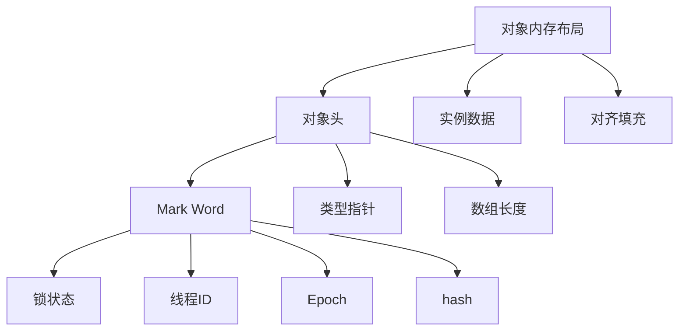
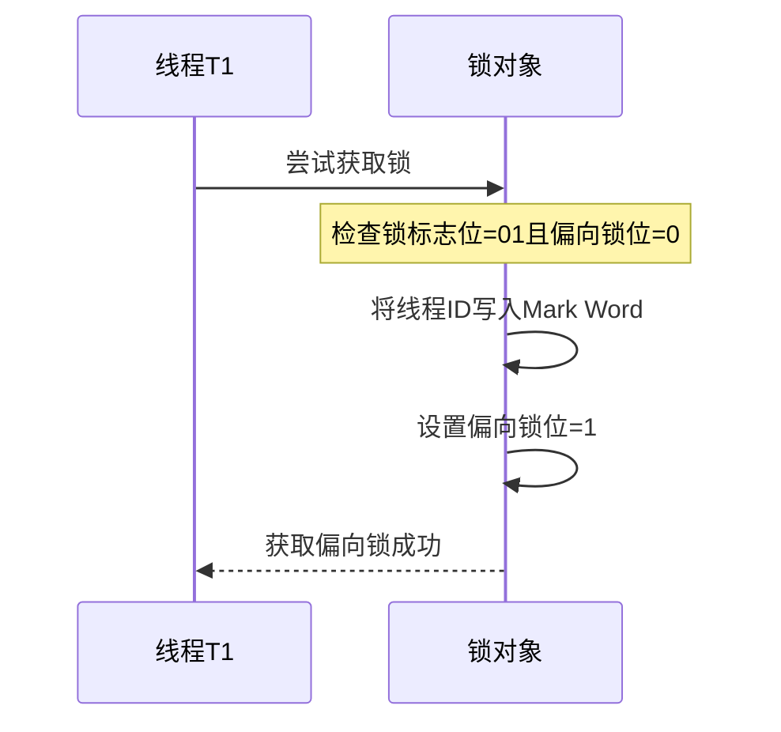
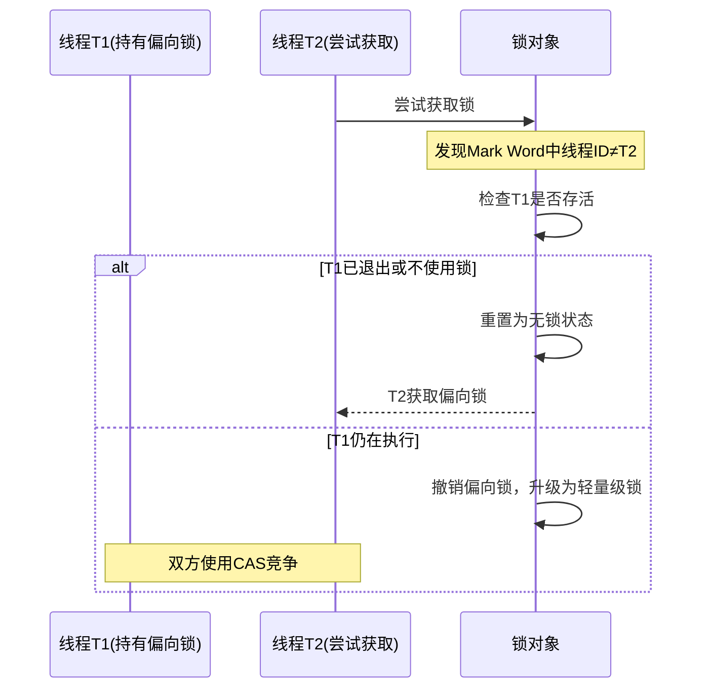
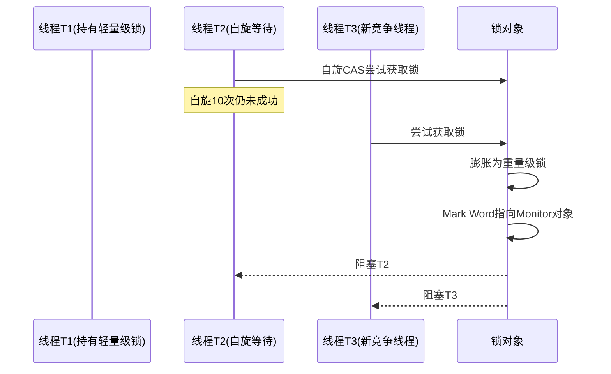
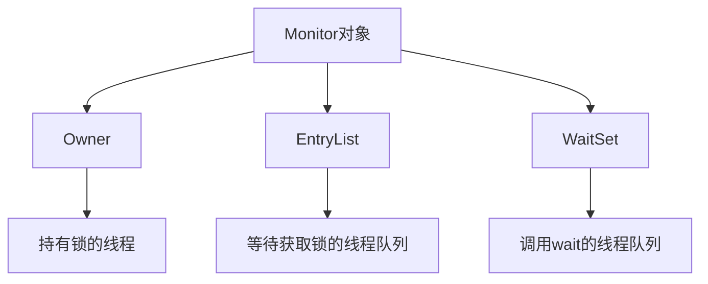
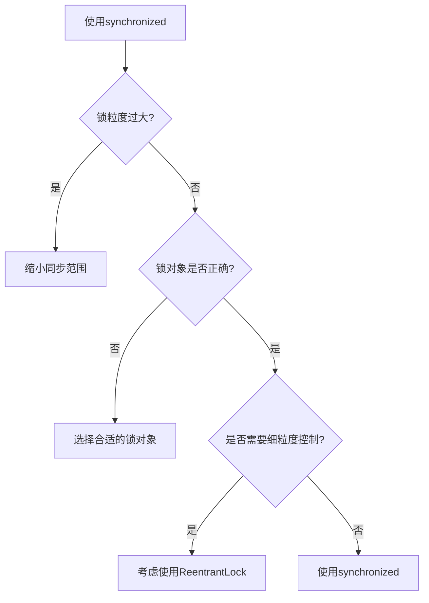

# Synchronized锁详解

## 一、Synchronized基本用法

### 1.1 Synchronized的三种用法

Synchronized是Java中最基本的同步机制，可以修饰**实例方法**、**静态方法**或**代码块**。

#### 1.1.1 修饰实例方法

```java
public class SynchronizedDemo {
    
    /**
     * 修饰实例方法
     * 锁对象是当前实例 this
     */
    public synchronized void instanceMethod() {
        // 临界区代码
        System.out.println("实例方法锁: " + Thread.currentThread().getName());
    }
}
```

#### 1.1.2 修饰静态方法

```java
public class SynchronizedDemo {
    
    /**
     * 修饰静态方法
     * 锁对象是当前类的Class对象
     */
    public static synchronized void staticMethod() {
        // 临界区代码
        System.out.println("静态方法锁: " + Thread.currentThread().getName());
    }
}
```

#### 1.1.3 修饰代码块

```java
public class SynchronizedDemo {
    private final Object lock = new Object();
    
    /**
     * 修饰代码块 - 使用自定义锁对象
     */
    public void blockMethod() {
        synchronized (lock) {
            // 临界区代码
            System.out.println("代码块锁: " + Thread.currentThread().getName());
        }
    }
    
    /**
     * 修饰代码块 - 使用this作为锁对象
     */
    public void blockMethodThis() {
        synchronized (this) {
            // 临界区代码
            System.out.println("this锁: " + Thread.currentThread().getName());
        }
    }
    
    /**
     * 修饰代码块 - 使用Class对象作为锁对象
     */
    public void blockMethodClass() {
        synchronized (SynchronizedDemo.class) {
            // 临界区代码
            System.out.println("Class锁: " + Thread.currentThread().getName());
        }
    }
}
```

### 1.2 关键注意点

| 特性       | 说明                     |
| -------- | ---------------------- |
| **互斥性**  | 一把锁只能同时被一个线程获取，其他线程需等待 |
| **锁粒度**  | 实例方法锁是实例级别，静态方法锁是类级别   |
| **自动释放** | 方法正常执行完或抛出异常时，都会自动释放锁  |
| **可重入性** | 同一线程可以多次获取同一把锁         |

***

## 二、Java对象头结构

### 2.1 对象头组成

Java对象在内存中由三部分组成：



### 2.2 Mark Word结构

Mark Word是对象头中存储锁信息的部分，其结构随锁状态变化：

| 锁状态      | 占用位 | 存储内容                                                         |
| -------- | --- | ------------------------------------------------------------ |
| **无锁**   | 64位 | 对象哈希码(25位) + 分代年龄(4位) + 是否偏向锁(1位) + 锁标志位(2位=01)              |
| **偏向锁**  | 64位 | 线程ID(54位) + Epoch(2位) + 分代年龄(4位) + 是否偏向锁(1位=1) + 锁标志位(2位=01) |
| **轻量级锁** | 64位 | 指向栈帧中锁记录的指针(62位) + 锁标志位(2位=00)                               |
| **重量级锁** | 64位 | 指向Monitor对象的指针(62位) + 锁标志位(2位=10)                            |

### 2.3 锁标志位说明

| 锁标志位 | 锁状态                |
| ---- | ------------------ |
| `01` | 无锁或偏向锁（根据是否偏向锁位判断） |
| `00` | 轻量级锁               |
| `10` | 重量级锁               |
| `11` | GC标记               |

***

## 三、锁升级过程

### 3.1 锁升级方向


**注意**：锁升级是**单向的**，只能从低级向高级升级，不能降级。但偏向锁可以被重置为无锁状态。

### 3.2 各阶段详细说明

#### 3.2.1 无锁 → 偏向锁

**触发条件**：第一次有线程获取锁，且无其他线程竞争。

**执行过程**：



**特点**：

- 偏向锁不会主动释放锁
- 后续同一线程再次获取锁时，只需比较线程ID即可
- 如果其他线程尝试获取锁，才会考虑撤销偏向锁

#### 3.2.2 偏向锁 → 轻量级锁

**触发条件**：有其他线程尝试获取已偏向的锁。

**执行过程**：



**轻量级锁原理**：

1. 线程获取锁时，将Mark Word复制到栈帧的**Displaced Mark Word**
2. 使用CAS将对象头替换为指向Displaced Mark Word的指针
3. 如果CAS成功，获取锁；失败则自旋等待

#### 3.2.3 轻量级锁 → 重量级锁

**触发条件**：

- 自旋次数达到阈值（默认10次）
- 自旋期间有新线程加入竞争
- 自旋线程数超过CPU核心数的一半

**执行过程**：



**重量级锁原理**：

- 使用操作系统的互斥量实现
- 未获取锁的线程进入阻塞状态
- 锁释放时唤醒等待线程

***

## 四、各种锁的特点对比

| 特性       | 无锁       | 偏向锁      | 轻量级锁     | 重量级锁        |
| -------- | -------- | -------- | -------- | ----------- |
| **锁标志位** | 01       | 01       | 00       | 10          |
| **适用场景** | 无竞争      | 单线程重复获取  | 多线程交替执行  | 高并发竞争       |
| **性能开销** | 无        | 极低       | 低（自旋）    | 高（系统调用）     |
| **线程状态** | RUNNABLE | RUNNABLE | RUNNABLE | BLOCKED（阻塞） |
| **锁释放**  | 无需释放     | 不会主动释放   | 执行完毕释放   | 执行完毕释放      |
| **可重入性** | -        | 支持       | 支持       | 支持          |

***

## 五、锁的核心机制

### 5.1 Monitor（管程）

重量级锁依赖Monitor对象实现：



**Monitor工作原理**：

1. `Owner`：指向当前持有锁的线程
2. `EntryList`：等待获取锁的线程队列（阻塞状态）
3. `WaitSet`：调用`wait()`后等待的线程队列

### 5.2 synchronized注意点

```java
public class SynchronizedNotes {
    
    /**
     * 注意点1：不同实例的锁互不影响
     */
    public synchronized void method1() {
        // 锁是当前实例 this
    }
    
    /**
     * 注意点2：异常会自动释放锁
     */
    public synchronized void method2() {
        try {
            // 业务逻辑
            throw new RuntimeException("异常");
        } catch (Exception e) {
            // 锁已自动释放
        }
    }
    
    /**
     * 注意点3：避免锁粒度过大
     */
    public void method3() {
        // 不需要同步的代码
        synchronized (this) {
            // 需要同步的临界区
        }
        // 不需要同步的代码
    }
}
```

***

## 六、使用场景与最佳实践

### 6.1 适用场景

| 场景        | 说明        | 推荐锁类型          |
| --------- | --------- | -------------- |
| **单线程环境** | 无竞争       | 偏向锁（默认开启）      |
| **低并发**   | 多线程交替执行   | 轻量级锁           |
| **高并发**   | 频繁竞争      | 重量级锁           |
| **方法级同步** | 整个方法需要同步  | synchronized方法 |
| **代码块同步** | 仅部分代码需要同步 | synchronized块  |

### 6.2 最佳实践



### 6.3 使用建议

| 原则          | 说明                                      |
| ----------- | --------------------------------------- |
| **减小锁粒度**   | 只同步必要的代码块，避免锁住整个方法                      |
| **避免锁嵌套**   | 减少死锁风险                                  |
| **使用专用锁对象** | 避免使用this或Class作为锁对象，提高可维护性              |
| **注意锁的可见性** | 锁对象应为final，避免被意外修改                      |
| **考虑并发工具类** | 对于复杂场景，考虑使用`java.util.concurrent`包中的工具类 |

***

## 七、总结

Synchronized是Java并发编程的基础，其锁升级机制是性能优化的关键：

| 核心要点          | 说明                     |
| ------------- | ---------------------- |
| **锁升级**       | 无锁→偏向锁→轻量级锁→重量级锁（单向升级） |
| **Mark Word** | 存储锁状态信息，是锁升级的核心数据结构    |
| **偏向锁**       | 适用于单线程重复获取锁的场景         |
| **轻量级锁**      | 使用CAS+自旋实现，避免系统调用      |
| **重量级锁**      | 使用操作系统互斥量，线程进入阻塞状态     |
| **自动释放**      | 方法执行完毕或抛出异常时自动释放锁      |

