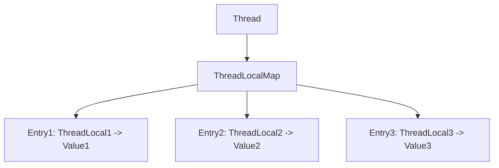
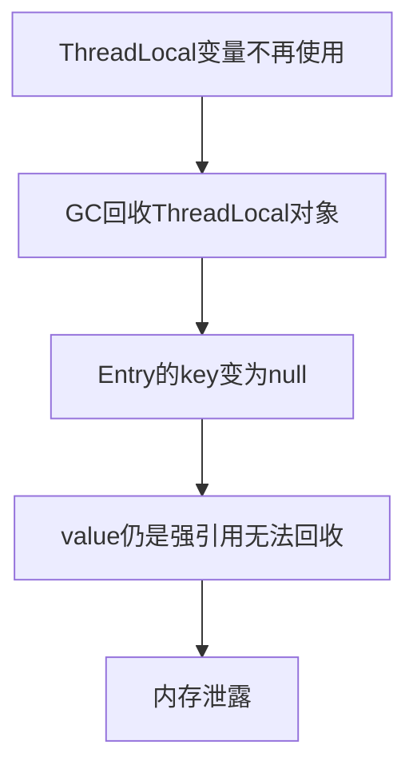

# ThreadLocal 详解

---

## 目录

1. [核心概念](#1-核心概念)
2. [核心方法详解](#2-核心方法详解)
3. [内存泄露问题深入分析](#3-内存泄露问题深入分析)
4. [使用场景与最佳实践](#4-使用场景与最佳实践)
5. [代码示例](#5-代码示例)
6. [InheritableThreadLocal](#6-inheritablethreadlocal)

---

## 1. 核心概念

### 1.1 什么是ThreadLocal

**ThreadLocal** 是Java提供的线程局部变量机制，它为每个线程提供独立的变量副本，使得每个线程都可以独立地修改自己的副本，而不会影响其他线程。

**核心特点：**
- **线程隔离**：每个线程拥有独立的变量副本
- **线程安全**：无需同步即可实现线程安全
- **简化代码**：避免将线程相关数据作为参数传递

### 1.2 ThreadLocal与线程的关系

```
每个 Thread 对象内部维护一个 ThreadLocalMap
ThreadLocalMap 是以 ThreadLocal 为key的Map结构
一个线程可以有多个 ThreadLocal 变量
```



### 1.3 ThreadLocal的应用场景

| 场景 | 说明 |
|------|------|
| **请求上下文传递** | 存储用户信息、请求ID等贯穿整个请求生命周期的数据 |
| **数据库连接管理** | 每个线程独立的数据库连接 |
| **事务管理** | 线程级别的事务上下文 |
| **日期格式化器** | 避免SimpleDateFormat线程安全问题 |
| **日志追踪** | 存储traceId等追踪信息 |

---

## 2. 核心方法详解

### 2.1 set(T value) - 设置值

```java
public void set(T value) {
    Thread t = Thread.currentThread();  // 获取当前线程
    ThreadLocalMap map = getMap(t);     // 获取线程的ThreadLocalMap
    if (map != null)
        map.set(this, value);           // 设置值，key为当前ThreadLocal实例
    else
        createMap(t, value);            // 首次使用时创建Map
}
```

**执行流程：**
1. 获取当前线程对象
2. 获取线程的ThreadLocalMap
3. 如果Map存在，直接设置值；否则创建新Map

### 2.2 get() - 获取值

```java
public T get() {
    Thread t = Thread.currentThread();
    ThreadLocalMap map = getMap(t);
    if (map != null) {
        ThreadLocalMap.Entry e = map.getEntry(this);
        if (e != null) {
            @SuppressWarnings("unchecked")
            T result = (T)e.value;
            return result;
        }
    }
    return setInitialValue();  // 如果Map不存在或未设置值，返回初始值
}
```

**执行流程：**
1. 获取当前线程对象
2. 获取线程的ThreadLocalMap
3. 如果Map存在且找到对应Entry，返回value
4. 否则调用setInitialValue()返回初始值

### 2.3 initialValue() - 获取初始值

```java
protected T initialValue() {
    return null;  // 默认返回null，子类可重写
}
```

**使用方式：**
```java
ThreadLocal<String> userName = ThreadLocal.withInitial(() -> "default");
```

### 2.4 remove() - 移除值

```java
public void remove() {
    ThreadLocalMap m = getMap(Thread.currentThread());
    if (m != null)
        m.remove(this);
}
```

**重要性：** 使用完毕后务必调用remove()，防止内存泄露

---

## 3. 内存泄露问题深入分析

### 3.1 引用类型回顾

| 引用类型 | GC行为 | 特点 |
|---------|--------|------|
| **强引用** | 不会被回收 | 默认引用方式 |
| **软引用** | 内存不足时回收 | 用于缓存 |
| **弱引用** | 每次GC都会回收 | 用于关联生命周期较短的对象 |
| **虚引用** | 随时可能回收 | 用于跟踪对象回收 |

### 3.2 ThreadLocalMap的Entry结构

```java
static class Entry extends WeakReference<ThreadLocal<?>> {
    Object value;  // 强引用
    Entry(ThreadLocal<?> k, Object v) {
        super(k);  // key是弱引用
        value = v; // value是强引用
    }
}
```

### 3.3 内存泄露原因分析



**根本原因：**
1. **Key是弱引用**：当ThreadLocal对象不再被引用时，GC会回收它，导致Entry的key变为null
2. **Value是强引用**：Value仍然被Entry强引用，无法被GC回收
3. **无法访问**：key为null后，无法通过正常方式访问到这个value

### 3.4 内存泄露的触发条件

```java
// 场景1：ThreadLocal定义为局部变量
public void process() {
    ThreadLocal<User> local = new ThreadLocal<>();
    local.set(user);
    // 方法结束后local变量消失，但线程池中线程的ThreadLocalMap仍持有该Entry
    // 如果不remove，value永远不会被回收
}

// 场景2：ThreadLocal定义为static但不再使用
public class Service {
    private static ThreadLocal<User> local = new ThreadLocal<>();
    
    // 业务变更后不再使用local，但线程池中的线程仍持有引用
}
```

### 3.5 解决方案

**方案一：使用完毕后调用remove()**
```java
try {
    threadLocal.set(value);
    // 业务逻辑
} finally {
    threadLocal.remove();  // 务必在finally中调用
}
```

**方案二：使用try-with-resources（Java 19+）**
```java
try (var tl = ThreadLocal.withInitial(() -> "default")) {
    tl.set("value");
    // 业务逻辑
}  // 自动调用remove()
```

**方案三：定期清理（弱引用的作用）**

ThreadLocalMap内部会在以下时机清理key为null的Entry：
- `get()` 方法查找时
- `set()` 方法插入时
- `remove()` 方法执行时

---

## 4. 使用场景与最佳实践

### 4.1 典型使用场景

#### 场景一：请求上下文传递
```java
public class RequestContext {
    private static final ThreadLocal<User> currentUser = new ThreadLocal<>();
    
    public static void setUser(User user) {
        currentUser.set(user);
    }
    
    public static User getUser() {
        return currentUser.get();
    }
    
    public static void clear() {
        currentUser.remove();
    }
}
```

#### 场景二：日期格式化器
```java
public class DateFormatter {
    private static final ThreadLocal<SimpleDateFormat> formatter = 
        ThreadLocal.withInitial(() -> new SimpleDateFormat("yyyy-MM-dd"));
    
    public static String format(Date date) {
        return formatter.get().format(date);
    }
}
```

#### 场景三：数据库连接管理
```java
public class ConnectionManager {
    private static final ThreadLocal<Connection> connectionHolder = new ThreadLocal<>();
    
    public static Connection getConnection() {
        Connection conn = connectionHolder.get();
        if (conn == null) {
            conn = DriverManager.getConnection(url, user, password);
            connectionHolder.set(conn);
        }
        return conn;
    }
    
    public static void closeConnection() {
        Connection conn = connectionHolder.get();
        if (conn != null) {
            conn.close();
            connectionHolder.remove();
        }
    }
}
```

### 4.2 最佳实践总结

| 实践 | 说明 |
|------|------|
| **务必remove** | 使用完毕后调用remove()，尤其是在线程池中 |
| **使用withInitial** | 使用ThreadLocal.withInitial()设置初始值 |
| **声明为private static final** | ThreadLocal通常声明为静态字段 |
| **避免在静态字段中存储可变对象** | 可能导致意外的状态共享 |
| **使用try-finally包裹** | 确保remove()一定被执行 |

---

## 5. 代码示例

### 5.1 基础使用示例

```java
public class ThreadLocalExample {
    private static final ThreadLocal<String> threadLocal = new ThreadLocal<>();
    
    public static void main(String[] args) throws InterruptedException {
        Thread t1 = new Thread(() -> {
            threadLocal.set("Thread-1 Value");
            System.out.println("Thread-1: " + threadLocal.get());
            threadLocal.remove();
        });
        
        Thread t2 = new Thread(() -> {
            threadLocal.set("Thread-2 Value");
            System.out.println("Thread-2: " + threadLocal.get());
            threadLocal.remove();
        });
        
        t1.start();
        t2.start();
        t1.join();
        t2.join();
    }
}
```

### 5.2 线程池中的正确使用

```java
public class ThreadPoolExample {
    private static final ThreadLocal<String> threadLocal = new ThreadLocal<>();
    private static final ExecutorService pool = Executors.newFixedThreadPool(2);
    
    public static void main(String[] args) {
        for (int i = 0; i < 5; i++) {
            pool.submit(() -> {
                try {
                    threadLocal.set(Thread.currentThread().getName());
                    // 业务逻辑
                    System.out.println("Current: " + threadLocal.get());
                } finally {
                    threadLocal.remove();  // 关键：避免内存泄露
                }
            });
        }
        pool.shutdown();
    }
}
```

### 5.3 自定义ThreadLocal（重写initialValue）

```java
public class CustomThreadLocal extends ThreadLocal<Integer> {
    @Override
    protected Integer initialValue() {
        return 0;  // 默认值为0
    }
}

// 使用
CustomThreadLocal counter = new CustomThreadLocal();
int value = counter.get();  // 返回0
counter.set(value + 1);     // 设置新值
```

---

## 6. InheritableThreadLocal

### 6.1 什么是InheritableThreadLocal

`InheritableThreadLocal` 是 `ThreadLocal` 的子类，允许子线程继承父线程的ThreadLocal值。

### 6.2 使用场景

```java
public class InheritableThreadLocalExample {
    private static final InheritableThreadLocal<String> parentValue = 
        new InheritableThreadLocal<>();
    
    public static void main(String[] args) {
        parentValue.set("Parent Value");
        
        Thread child = new Thread(() -> {
            System.out.println("Child sees: " + parentValue.get());  // 输出: Parent Value
        });
        
        child.start();
    }
}
```

### 6.3 注意事项

| 注意点 | 说明 |
|--------|------|
| **值继承时机** | 子线程创建时继承父线程的值 |
| **值修改隔离** | 子线程修改值不影响父线程 |
| **线程池问题** | 线程池中的线程复用，继承关系只在首次创建时生效 |

---

## 总结

| 要点 | 说明 |
|------|------|
| **核心作用** | 提供线程局部变量，实现线程隔离 |
| **数据结构** | 每个Thread维护ThreadLocalMap，key为ThreadLocal弱引用 |
| **内存泄露** | 未调用remove()可能导致value无法回收 |
| **正确用法** | 使用try-finally确保remove()被调用 |
| **继承传递** | 使用InheritableThreadLocal实现父子线程值传递 |

**核心口诀**：**用完即删，线程安全**
