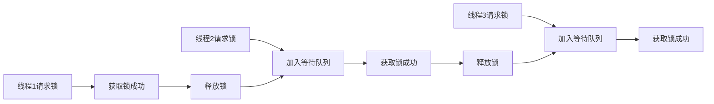
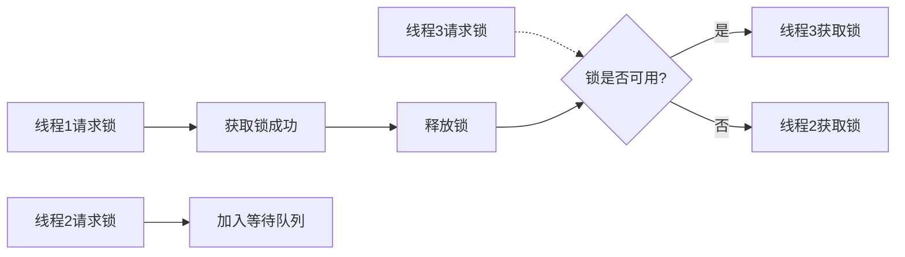
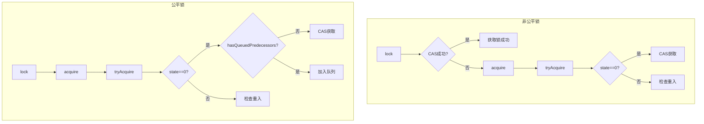
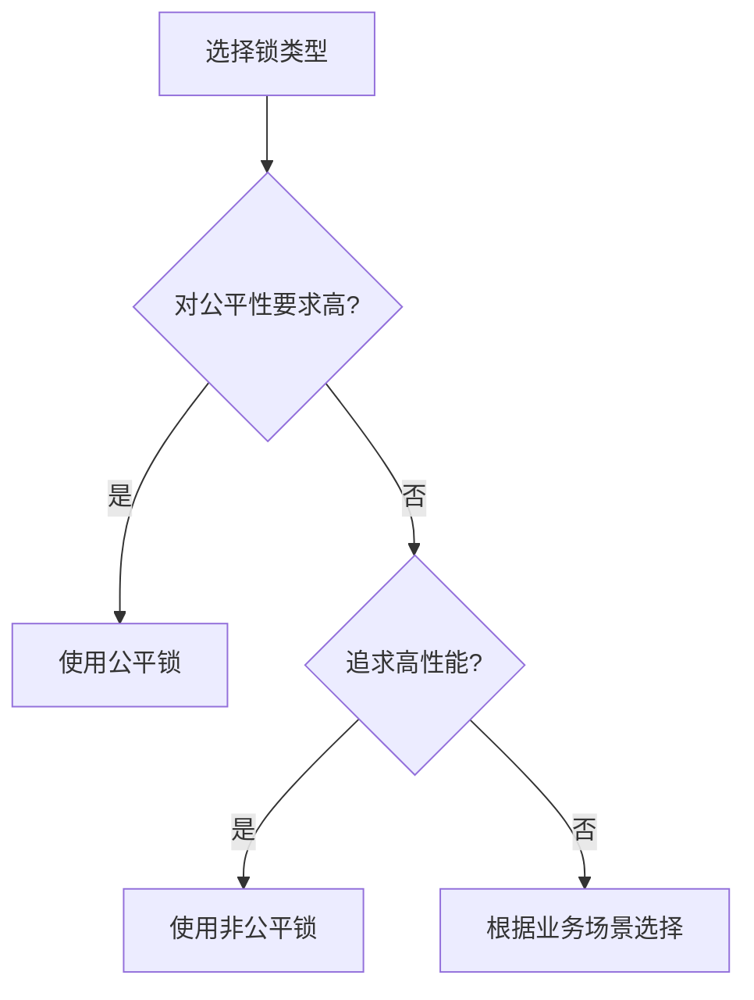
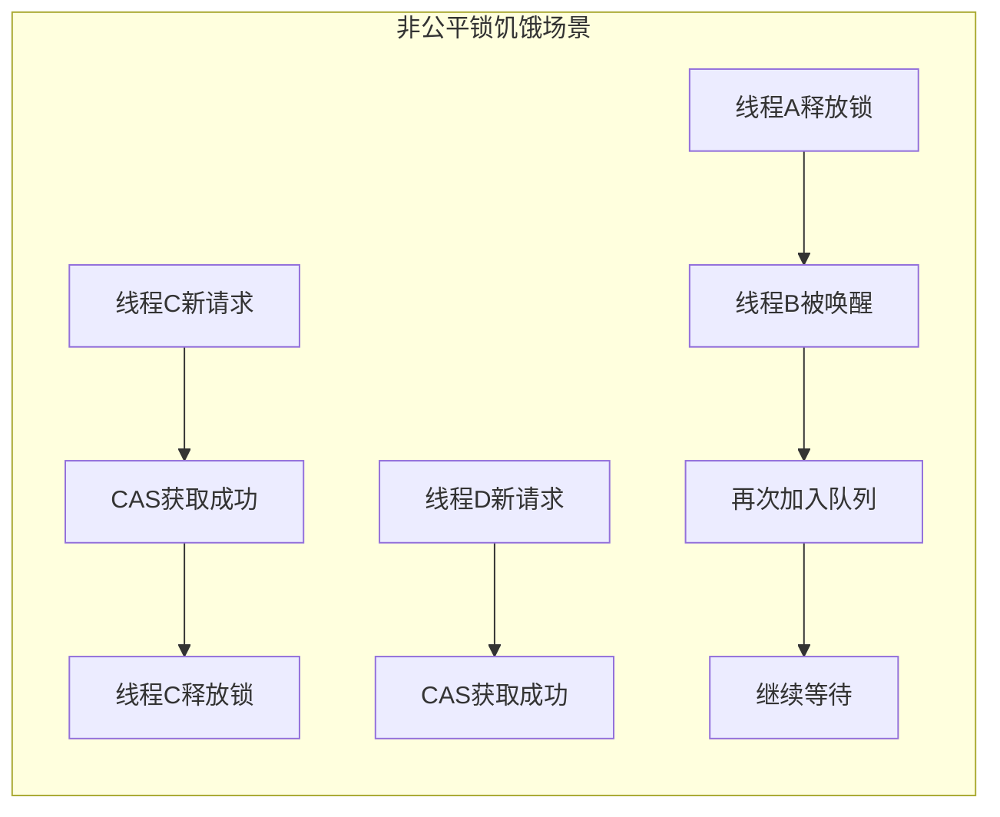
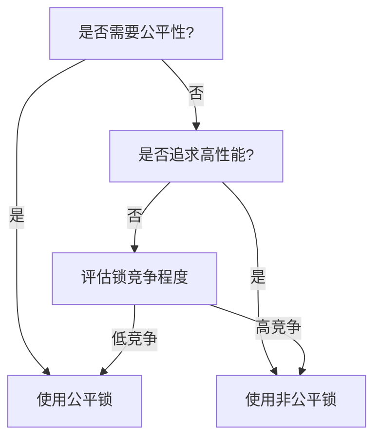

# 公平锁与非公平锁详解

## 一、概念概述

### 1.1 什么是公平锁

**公平锁**（Fair Lock）是指多个线程按照申请锁的顺序来获取锁，遵循\*\*先来先出服务（FIFO）\*\*原则：



### 1.2 什么是非公平锁

**非公平锁**（Unfair Lock）是指线程获取锁的顺序不遵循申请顺序，可能存在**插队**现象：



### 1.3 核心区别

| 特性       | 公平锁          | 非公平锁        |
| -------- | ------------ | ----------- |
| **获取顺序** | FIFO顺序       | 无固定顺序       |
| **公平性**  | 高            | 低           |
| **性能**   | 较低（需要维护队列顺序） | 较高（减少上下文切换） |
| **饥饿问题** | 无            | 可能出现        |
| **适用场景** | 对公平性要求高的场景   | 追求性能的场景     |

***

## 二、实现原理（基于ReentrantLock）

### 2.1 ReentrantLock构造函数

```java
public class ReentrantLock implements Lock, java.io.Serializable {
    
    // 默认非公平锁
    public ReentrantLock() {
        sync = new NonfairSync();
    }
    
    // 公平锁
    public ReentrantLock(boolean fair) {
        sync = fair ? new FairSync() : new NonfairSync();
    }
}
```

### 2.2 非公平锁实现

```java
static final class NonfairSync extends Sync {
    final void lock() {
        // 1. 直接尝试CAS获取锁
        if (compareAndSetState(0, 1))
            setExclusiveOwnerThread(Thread.currentThread());
        else
            // 2. 获取失败，调用acquire
            acquire(1);
    }
    
    protected final boolean tryAcquire(int acquires) {
        return nonfairTryAcquire(acquires);
    }
}

final boolean nonfairTryAcquire(int acquires) {
    final Thread current = Thread.currentThread();
    int c = getState();
    
    // 1. 如果锁未被持有
    if (c == 0) {
        // 直接CAS获取，不检查队列
        if (compareAndSetState(0, acquires)) {
            setExclusiveOwnerThread(current);
            return true;
        }
    }
    // 2. 可重入判断
    else if (current == getExclusiveOwnerThread()) {
        int nextc = c + acquires;
        if (nextc < 0) // overflow
            throw new Error("Maximum lock count exceeded");
        setState(nextc);
        return true;
    }
    return false;
}
```

### 2.3 公平锁实现

```java
static final class FairSync extends Sync {
    final void lock() {
        // 直接调用acquire，不尝试插队
        acquire(1);
    }
    
    protected final boolean tryAcquire(int acquires) {
        final Thread current = Thread.currentThread();
        int c = getState();
        
        if (c == 0) {
            // 关键区别：检查队列中是否有等待的线程
            if (!hasQueuedPredecessors() &&
                compareAndSetState(0, acquires)) {
                setExclusiveOwnerThread(current);
                return true;
            }
        }
        else if (current == getExclusiveOwnerThread()) {
            int nextc = c + acquires;
            if (nextc < 0)
                throw new Error("Maximum lock count exceeded");
            setState(nextc);
            return true;
        }
        return false;
    }
}

// 检查是否有线程在队列中等待（比当前线程先申请）
public final boolean hasQueuedPredecessors() {
    Node t = tail;
    Node h = head;
    Node s;
    
    // 队列不为空 && 头节点的后继存在 && 后继不是当前线程
    return h != t &&
        ((s = h.next) == null || s.thread != Thread.currentThread());
}
```

### 2.4 获取锁流程对比



***

## 三、性能对比

### 3.1 性能差异原因

| 因素        | 公平锁          | 非公平锁       |
| --------- | ------------ | ---------- |
| **队列检查**  | 每次获取前检查队列    | 直接尝试CAS    |
| **线程唤醒**  | 必须按顺序唤醒      | 可能被新线程抢占   |
| **上下文切换** | 较多（频繁唤醒等待线程） | 较少（减少唤醒次数） |
| **吞吐量**   | 较低           | 较高         |

### 3.2 场景对比



### 3.3 饥饿问题

**公平锁**：不会出现饥饿，所有线程按顺序获取锁

**非公平锁**：可能出现饥饿，某些线程长时间无法获取锁



***

## 四、适用场景

### 4.1 推荐使用公平锁的场景

| 场景          | 说明              |
| ----------- | --------------- |
| **对响应时间敏感** | 需要保证每个线程都能及时获得锁 |
| **避免饥饿**    | 要求所有线程都有机会执行    |
| **低并发场景**   | 线程数较少，性能差异不明显   |

### 4.2 推荐使用非公平锁的场景

| 场景         | 说明         |
| ---------- | ---------- |
| **高并发场景**  | 追求最大化吞吐量   |
| **锁持有时间短** | 减少上下文切换开销  |
| **批量操作**   | 大量短暂的锁获取操作 |

### 4.3 选择建议



***

## 五、代码示例

### 5.1 创建公平锁和非公平锁

```java
import java.util.concurrent.locks.ReentrantLock;

public class LockExample {
    
    // 非公平锁（默认）
    private final Lock unfairLock = new ReentrantLock();
    
    // 公平锁
    private final Lock fairLock = new ReentrantLock(true);
    
    public void useUnfairLock() {
        unfairLock.lock();
        try {
            // 临界区代码
            System.out.println("使用非公平锁");
        } finally {
            unfairLock.unlock();
        }
    }
    
    public void useFairLock() {
        fairLock.lock();
        try {
            // 临界区代码
            System.out.println("使用公平锁");
        } finally {
            fairLock.unlock();
        }
    }
}
```

### 5.2 公平锁

```java
public class FairLockDemo {
    
    private static final ReentrantLock fairLock = new ReentrantLock(true);
    
    public static void main(String[] args) {
        for (int i = 0; i < 5; i++) {
            final int threadId = i;
            new Thread(() -> {
                for (int j = 0; j < 2; j++) {
                    fairLock.lock();
                    try {
                        System.out.printf("线程%d 获取锁\n", threadId);
                        Thread.sleep(100);
                    } catch (InterruptedException e) {
                        Thread.currentThread().interrupt();
                    } finally {
                        fairLock.unlock();
                        System.out.printf("线程%d 释放锁\n", threadId);
                    }
                }
            }).start();
        }
    }
}
```

### 5.3 非公平锁

```java
public class UnfairLockDemo {
    
    private static final ReentrantLock unfairLock = new ReentrantLock(false);
    
    public static void main(String[] args) {
        for (int i = 0; i < 5; i++) {
            final int threadId = i;
            new Thread(() -> {
                for (int j = 0; j < 2; j++) {
                    unfairLock.lock();
                    try {
                        System.out.printf("线程%d 获取锁\n", threadId);
                        Thread.sleep(100);
                    } catch (InterruptedException e) {
                        Thread.currentThread().interrupt();
                    } finally {
                        unfairLock.unlock();
                        System.out.printf("线程%d 释放锁\n", threadId);
                    }
                }
            }).start();
        }
    }
}
```

***

## 六、总结

### 6.1 核心要点

| 要点       | 公平锁      | 非公平锁     |
| -------- | -------- | -------- |
| **获取顺序** | 按申请顺序    | 无序，可能插队  |
| **公平性**  | 高        | 低        |
| **性能**   | 较低       | 较高       |
| **饥饿风险** | 无        | 有        |
| **适用场景** | 低并发、追求公平 | 高并发、追求性能 |

### 6.2 选择策略

1. **默认选择非公平锁**：大多数场景下性能优先
2. **需要公平性时选择公平锁**：确保所有线程有机会执行
3. **评估锁竞争程度**：高竞争场景优先非公平锁

### 6.3 关键原理

- **公平锁**：通过`hasQueuedPredecessors()`检查队列顺序
- **非公平锁**：直接尝试CAS，不检查队列
- **性能差异**：公平锁的队列检查和顺序唤醒带来额外开销

### 6.4 最佳实践

| 实践           | 说明                               |
| ------------ | -------------------------------- |
| **优先使用非公平锁** | 默认选择，性能更好                        |
| **显式指定公平性**  | 使用`new ReentrantLock(true)`创建公平锁 |
| **避免长时间持有锁** | 减少锁竞争，提升整体性能                     |
| **考虑锁粒度**    | 细粒度锁比粗粒度锁更容易出现公平性问题              |

