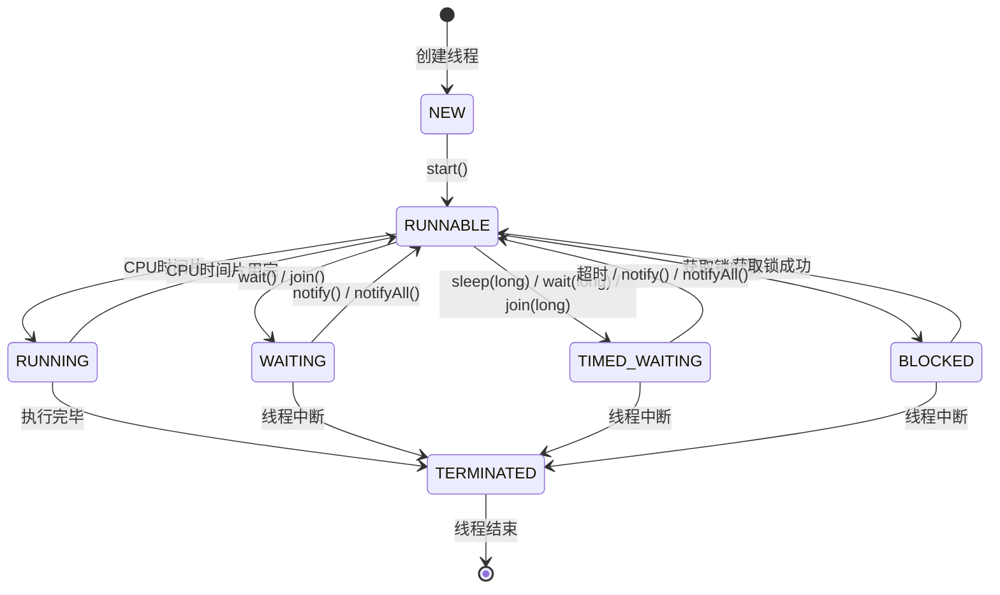
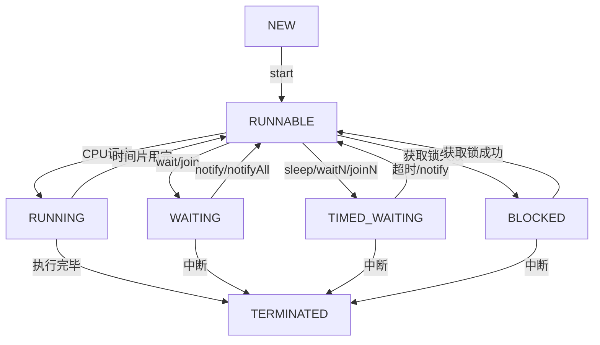

# 多线程面试题总结

***

## 目录

1. [为什么程序计数器、虚拟机栈和本地方法栈是线程私有的？为什么堆和方法区是线程共享的呢？](#1-为什么程序计数器虚拟机栈和本地方法栈是线程私有的为什么堆和方法区是线程共享的呢)
2. [Java线程的状态有哪些？](#2-java线程的状态有哪些)
3. [线程状态转换图](#3-线程状态转换图)

***

## 1. 为什么程序计数器、虚拟机栈和本地方法栈是线程私有的？为什么堆和方法区是线程共享的呢？

### 1.1 程序计数器为什么是私有的？

程序计数器的核心作用：

- **流程控制**：字节码解释器通过改变程序计数器来依次读取指令，实现顺序执行、选择、循环、异常处理
- **线程恢复**：多线程环境下，记录当前线程执行位置，线程切换后能恢复到正确位置

**总结**：程序计数器私有是为了支持线程的独立执行和正确恢复。

### 1.2 虚拟机栈和本地方法栈为什么是私有的？

| 类型        | 作用          | 说明                       |
| --------- | ----------- | ------------------------ |
| **虚拟机栈**  | 为Java方法服务   | 每个方法对应一个栈帧，存储局部变量表、操作数栈等 |
| **本地方法栈** | 为Native方法服务 | HotSpot中与虚拟机栈合二为一        |

**总结**：为保证线程局部变量不被其他线程访问，虚拟机栈和本地方法栈必须是线程私有的。

### 1.3 堆和方法区为什么是线程共享的？

| 区域      | 用途                         |
| ------- | -------------------------- |
| **堆**   | 进程中最大内存区域，存放新创建的对象         |
| **方法区** | 存放已加载的类信息、常量、静态变量、即时编译后的代码 |

**总结**：堆和方法区存储的是所有线程都需要访问的共享数据，因此设计为线程共享。

***

## 2. Java线程的状态有哪些？

Java线程共有 **6种状态**，定义在 `java.lang.Thread.State` 枚举中：

| 状态         | 英文名称           | 说明                          |
| ---------- | -------------- | --------------------------- |
| **初始状态**   | NEW            | 线程已创建但尚未启动                  |
| **可运行状态**  | RUNNABLE       | 线程正在JVM中执行（包含READY和RUNNING） |
| **阻塞状态**   | BLOCKED        | 线程等待获取对象监视器锁                |
| **等待状态**   | WAITING        | 线程等待其他线程的通知（无超时）            |
| **超时等待状态** | TIMED\_WAITING | 线程等待其他线程通知（有超时限制）           |
| **终止状态**   | TERMINATED     | 线程已执行完成                     |

### 状态转换触发条件

```java
// NEW → RUNNABLE
Thread thread = new Thread(() -> {});  // NEW
thread.start();                        // RUNNABLE

// RUNNABLE → WAITING
synchronized (lock) {
    lock.wait();                       // WAITING，需notify唤醒
}

// RUNNABLE → TIMED_WAITING
Thread.sleep(1000);                    // TIMED_WAITING，1秒后自动唤醒
LockSupport.parkNanos(1_000_000_000L);

// RUNNABLE → BLOCKED
synchronized (lock) {                  // 获取锁失败时进入BLOCKED
    // ...
}

// 任意状态 → TERMINATED
// 线程执行完毕或异常退出
```

***

## 3. 线程状态转换图

### 状态转换关系



### 状态转换流程图



### 触发状态转换的方法

| 方法                     | 触发转换                              |
| ---------------------- | --------------------------------- |
| `start()`              | NEW → RUNNABLE                    |
| `wait()`               | RUNNABLE → WAITING                |
| `wait(long)`           | RUNNABLE → TIMED\_WAITING         |
| `notify()/notifyAll()` | WAITING/TIMED\_WAITING → RUNNABLE |
| `sleep(long)`          | RUNNABLE → TIMED\_WAITING         |
| `join()`               | RUNNABLE → WAITING                |
| `join(long)`           | RUNNABLE → TIMED\_WAITING         |
| 获取锁失败                  | RUNNABLE → BLOCKED                |
| 获取锁成功                  | BLOCKED → RUNNABLE                |
| 执行完毕                   | 任意 → TERMINATED                   |

***

## 总结

| 问题     | 核心答案                                                      |
| ------ | --------------------------------------------------------- |
| 线程私有区域 | 程序计数器、虚拟机栈、本地方法栈（保证线程独立执行）                                |
| 线程共享区域 | 堆、方法区（存储共享数据）                                             |
| 线程状态数量 | 6种：NEW、RUNNABLE、BLOCKED、WAITING、TIMED\_WAITING、TERMINATED |
| 状态转换   | 通过`start()`、`wait()`、`notify()`、`sleep()`、`join()`等方法触发   |

