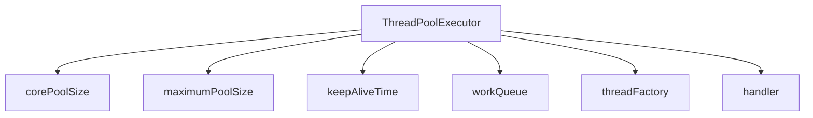
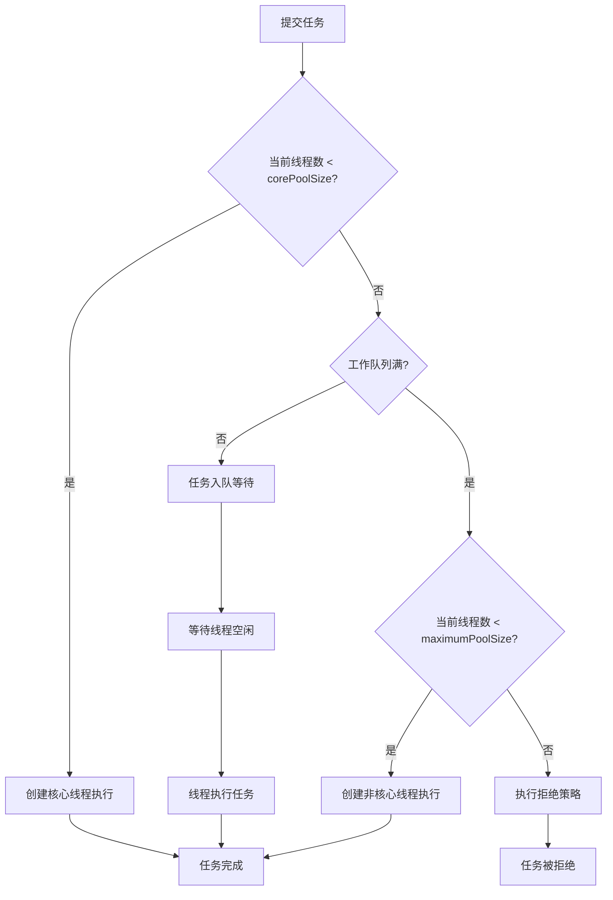
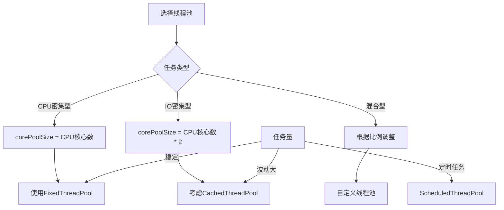

# 线程池核心参数详解

## 一、线程池核心参数概述

Java线程池的核心实现是`ThreadPoolExecutor`，其构造函数包含7个核心参数：

```java
public ThreadPoolExecutor(
    int corePoolSize,                              // 核心线程数
    int maximumPoolSize,                           // 最大线程数
    long keepAliveTime,                            // 空闲线程存活时间
    TimeUnit unit,                                 // 时间单位
    BlockingQueue<Runnable> workQueue,             // 工作队列
    ThreadFactory threadFactory,                   // 线程工厂
    RejectedExecutionHandler handler               // 拒绝策略
)
```



---

## 二、7个核心参数详解

### 2.1 corePoolSize - 核心线程数

**定义**：线程池维护的最小线程数，即使线程空闲也不会被回收。

**工作机制**：
- 当提交任务时，若当前线程数 < corePoolSize，创建新线程执行任务
- 核心线程默认不会被回收（可通过`allowCoreThreadTimeOut(true)`启用回收）

### 2.2 maximumPoolSize - 最大线程数

**定义**：线程池允许的最大线程数。

**工作机制**：
- 当工作队列满了，且当前线程数 < maximumPoolSize，创建新线程
- 当工作队列满了，且当前线程数 >= maximumPoolSize，触发拒绝策略

### 2.3 keepAliveTime - 空闲线程存活时间

**定义**：非核心线程空闲时的存活时间。

**工作机制**：
- 当线程数 > corePoolSize，且线程空闲时间超过keepAliveTime，线程会被回收
- 通过`allowCoreThreadTimeOut(true)`可让核心线程也遵循此规则

### 2.4 TimeUnit - 时间单位

**定义**：keepAliveTime的时间单位。

**可选值**：
- `TimeUnit.NANOSECONDS`
- `TimeUnit.MICROSECONDS`
- `TimeUnit.MILLISECONDS`
- `TimeUnit.SECONDS`
- `TimeUnit.MINUTES`
- `TimeUnit.HOURS`
- `TimeUnit.DAYS`

### 2.5 workQueue - 工作队列

**定义**：存放等待执行任务的阻塞队列。

**常见实现**：

| 队列类型 | 说明 | 特点 |
|----------|------|------|
| **ArrayBlockingQueue** | 有界数组队列 | 固定容量，FIFO |
| **LinkedBlockingQueue** | 无界链表队列 | 默认Integer.MAX_VALUE |
| **SynchronousQueue** | 同步移交队列 | 不存储任务，直接移交 |
| **PriorityBlockingQueue** | 优先级队列 | 按优先级排序 |

### 2.6 threadFactory - 线程工厂

**定义**：用于创建新线程的工厂。

**默认实现**：
```java
Executors.defaultThreadFactory()
```

**自定义线程工厂示例**：
```java
ThreadFactory customFactory = r -> {
    Thread thread = new Thread(r);
    thread.setName("CustomPool-" + thread.getId());
    thread.setDaemon(false);
    return thread;
};
```

### 2.7 RejectedExecutionHandler - 拒绝策略

**定义**：当工作队列满且线程数达到maximumPoolSize时的处理策略。

**4种内置策略**：

| 策略 | 说明 |
|------|------|
| **AbortPolicy** | 抛出RejectedExecutionException（默认） |
| **CallerRunsPolicy** | 由调用者线程执行任务 |
| **DiscardPolicy** | 丢弃任务，不做任何处理 |
| **DiscardOldestPolicy** | 丢弃队列中最老的任务，尝试重新提交 |

---

## 三、线程池工作流程



### 执行流程详解

1. **提交任务** → 检查核心线程池
2. **核心线程未满** → 创建核心线程执行
3. **核心线程已满** → 任务入队
4. **队列已满** → 创建非核心线程
5. **线程数达上限** → 执行拒绝策略

---

## 四、常见线程池类型

### 4.1 FixedThreadPool - 固定大小线程池

```java
ExecutorService fixedPool = Executors.newFixedThreadPool(5);
```

**特点**：
- corePoolSize = maximumPoolSize = nThreads
- 使用LinkedBlockingQueue（无界队列）
- 线程数固定，不会扩容

**适用场景**：任务量稳定的场景

### 4.2 CachedThreadPool - 可缓存线程池

```java
ExecutorService cachedPool = Executors.newCachedThreadPool();
```

**特点**：
- corePoolSize = 0，maximumPoolSize = Integer.MAX_VALUE
- 使用SynchronousQueue（同步队列）
- 线程空闲60秒后回收
- 可无限扩容

**适用场景**：大量短期任务

### 4.3 SingleThreadExecutor - 单线程线程池

```java
ExecutorService singlePool = Executors.newSingleThreadExecutor();
```

**特点**：
- corePoolSize = maximumPoolSize = 1
- 使用LinkedBlockingQueue
- 保证任务顺序执行

**适用场景**：需要顺序执行的任务

### 4.4 ScheduledThreadPool - 定时任务线程池

```java
ScheduledExecutorService scheduledPool = Executors.newScheduledThreadPool(3);
```

**特点**：
- 支持定时任务和周期性任务
- 使用DelayedWorkQueue

**适用场景**：定时任务、周期性任务

### 4.5 线程池类型对比

| 线程池类型 | corePoolSize | maximumPoolSize | 队列类型 | 适用场景 |
|-----------|--------------|-----------------|----------|----------|
| FixedThreadPool | n | n | LinkedBlockingQueue | 稳定任务量 |
| CachedThreadPool | 0 | Integer.MAX_VALUE | SynchronousQueue | 短期任务 |
| SingleThreadExecutor | 1 | 1 | LinkedBlockingQueue | 顺序执行 |
| ScheduledThreadPool | n | Integer.MAX_VALUE | DelayedWorkQueue | 定时任务 |

---

## 五、拒绝策略详解

### 5.1 AbortPolicy（默认）

```java
public void rejectedExecution(Runnable r, ThreadPoolExecutor e) {
    throw new RejectedExecutionException("Task " + r.toString() + 
        " rejected from " + e.toString());
}
```

**适用场景**：需要明确知道任务被拒绝的场景

### 5.2 CallerRunsPolicy

```java
public void rejectedExecution(Runnable r, ThreadPoolExecutor e) {
    if (!e.isShutdown()) {
        r.run();  // 调用者线程执行
    }
}
```

**适用场景**：需要保证任务一定执行的场景

### 5.3 DiscardPolicy

```java
public void rejectedExecution(Runnable r, ThreadPoolExecutor e) {
    // 什么都不做，直接丢弃
}
```

**适用场景**：任务可丢弃的场景

### 5.4 DiscardOldestPolicy

```java
public void rejectedExecution(Runnable r, ThreadPoolExecutor e) {
    if (!e.isShutdown()) {
        e.getQueue().poll();  // 移除队首任务
        e.execute(r);         // 重新提交当前任务
    }
}
```

**适用场景**：新任务比旧任务更重要的场景

---

## 六、代码示例

### 6.1 自定义线程池

```java
public class CustomThreadPool {
    public static void main(String[] args) {
        ThreadPoolExecutor executor = new ThreadPoolExecutor(
            2,                              // corePoolSize
            5,                              // maximumPoolSize
            60,                             // keepAliveTime
            TimeUnit.SECONDS,               // unit
            new ArrayBlockingQueue<>(10),   // workQueue
            Executors.defaultThreadFactory(),// threadFactory
            new ThreadPoolExecutor.CallerRunsPolicy()  // handler
        );

        // 提交任务
        for (int i = 0; i < 20; i++) {
            final int taskId = i;
            executor.execute(() -> {
                System.out.println("Task " + taskId + " executed by " + 
                    Thread.currentThread().getName());
                try {
                    Thread.sleep(1000);
                } catch (InterruptedException e) {
                    Thread.currentThread().interrupt();
                }
            });
        }

        // 关闭线程池
        executor.shutdown();
    }
}
```

### 6.2 定时任务线程池

```java
public class ScheduledThreadPoolDemo {
    public static void main(String[] args) {
        ScheduledExecutorService scheduler = Executors.newScheduledThreadPool(2);

        // 延迟1秒后执行
        scheduler.schedule(() -> {
            System.out.println("延迟任务执行");
        }, 1, TimeUnit.SECONDS);

        // 延迟2秒后，每3秒执行一次
        scheduler.scheduleAtFixedRate(() -> {
            System.out.println("定时任务执行: " + System.currentTimeMillis());
        }, 2, 3, TimeUnit.SECONDS);
    }
}
```

### 6.3 线程池状态监控

```java
public class ThreadPoolMonitor {
    public static void main(String[] args) {
        ThreadPoolExecutor executor = new ThreadPoolExecutor(
            2, 5, 60, TimeUnit.SECONDS, new ArrayBlockingQueue<>(10));

        // 提交任务
        for (int i = 0; i < 15; i++) {
            executor.execute(() -> {
                try {
                    Thread.sleep(2000);
                } catch (InterruptedException e) {}
            });
        }

        // 监控线程池状态
        new Thread(() -> {
            while (true) {
                System.out.println("========== ThreadPool Status ==========");
                System.out.println("Active Threads: " + executor.getActiveCount());
                System.out.println("Pool Size: " + executor.getPoolSize());
                System.out.println("Queue Size: " + executor.getQueue().size());
                System.out.println("Completed Tasks: " + executor.getCompletedTaskCount());
                System.out.println("=======================================");
                try {
                    Thread.sleep(1000);
                } catch (InterruptedException e) {}
            }
        }).start();
    }
}
```

---

## 七、线程池状态转换

```mermaid
flowchart TD
    A[RUNNING] -->|shutdown()| B[SHUTDOWN]
    A -->|shutdownNow()| C[STOP]
    B -->|任务完成| D[TIDYING]
    C -->|任务中断| D
    D -->|terminated()| E[TERMINATED]
    
    style A fill:#e8f5e9
    style B fill:#fff3e0
    style C fill:#ffebee
    style D fill:#e3f2fd
    style E fill:#f3e5f5
```

**状态说明**：

| 状态 | 说明 |
|------|------|
| **RUNNING** | 正常运行，接受新任务，处理队列任务 |
| **SHUTDOWN** | 不接受新任务，但处理队列任务 |
| **STOP** | 不接受新任务，中断正在执行的任务，清空队列 |
| **TIDYING** | 所有任务完成，工作线程为0 |
| **TERMINATED** | 线程池完全终止 |

---

## 八、线程池选用指南

### 8.1 选择建议



### 8.2 配置建议

| 场景 | corePoolSize | maximumPoolSize | 队列 | 拒绝策略 |
|------|-------------|-----------------|------|----------|
| CPU密集 | N | N | ArrayBlockingQueue | AbortPolicy |
| IO密集 | 2N | 2N | LinkedBlockingQueue | CallerRunsPolicy |
| 短期任务 | 0 | MAX_VALUE | SynchronousQueue | DiscardPolicy |
| 定时任务 | N | MAX_VALUE | DelayedWorkQueue | AbortPolicy |

> N = Runtime.getRuntime().availableProcessors()

### 8.3 最佳实践

1. **避免使用Executors静态工厂方法**（可能导致资源耗尽）
2. **自定义线程池**，明确指定参数
3. **设置合理的队列大小**，避免内存溢出
4. **选择合适的拒绝策略**
5. **正确关闭线程池**（shutdown() vs shutdownNow()）
6. **监控线程池状态**

---

## 九、总结

### 核心要点

| 参数 | 作用 | 关键配置 |
|------|------|----------|
| corePoolSize | 核心线程数 | CPU核心数或2倍 |
| maximumPoolSize | 最大线程数 | 根据任务类型调整 |
| keepAliveTime | 空闲存活时间 | 60秒左右 |
| workQueue | 任务队列 | 有界队列更安全 |
| handler | 拒绝策略 | 根据业务需求选择 |

### 选择策略

1. **任务性质**：CPU密集型 vs IO密集型
2. **任务量**：稳定 vs 波动
3. **任务优先级**：是否需要顺序执行
4. **资源限制**：内存、CPU核心数

### 注意事项

- **队列溢出**：无界队列可能导致OOM
- **线程泄漏**：未正确关闭线程池
- **拒绝策略**：默认策略会抛异常
- **监控**：定期监控线程池状态

---

## 参考资料

- [Java ThreadPoolExecutor 官方文档](https://docs.oracle.com/en/java/javase/17/docs/api/java.base/java/util/concurrent/ThreadPoolExecutor.html)
- [Java并发编程实战](https://book.douban.com/subject/10484692/)
