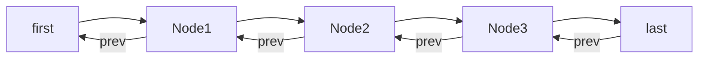
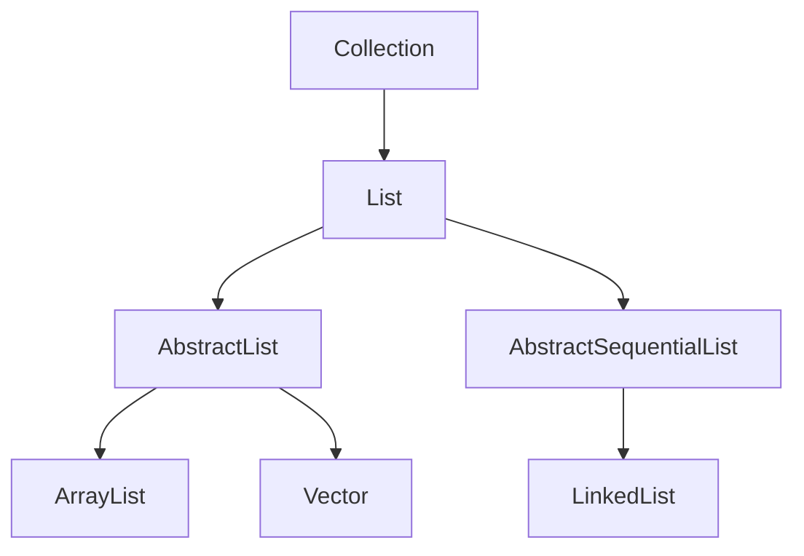
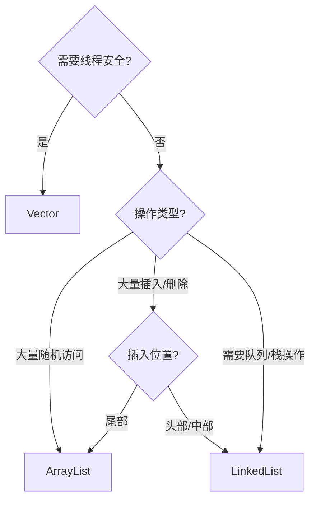

# List 详解：ArrayList、LinkedList、Vector

---

## 目录

1. [ArrayList 底层实现](#1-arraylist-底层实现)
2. [LinkedList 底层实现](#2-linkedlist-底层实现)
3. [Vector 底层实现](#3-vector-底层实现)
4. [三种 List 对比分析](#4-三种-list-对比分析)
5. [选择建议](#5-选择建议)

---

## 1. ArrayList 底层实现

### 1.1 核心结构

**ArrayList** 是基于 **动态数组** 实现的，底层使用 `Object[]` 数组存储元素。

```java
public class ArrayList<E> extends AbstractList<E>
    implements List<E>, RandomAccess, Cloneable, java.io.Serializable {
    
    // 默认初始容量
    private static final int DEFAULT_CAPACITY = 10;
    
    // 空数组（用于初始化）
    private static final Object[] EMPTY_ELEMENTDATA = {};
    
    // 默认空数组（用于延迟初始化）
    private static final Object[] DEFAULTCAPACITY_EMPTY_ELEMENTDATA = {};
    
    // 存储元素的数组
    transient Object[] elementData;
    
    // 实际元素数量
    private int size;
}
```

### 1.2 扩容机制

```java
// 添加元素时检查容量
public boolean add(E e) {
    ensureCapacityInternal(size + 1);  // Increments modCount!!
    elementData[size++] = e;
    return true;
}

// 确保容量足够
private void ensureCapacityInternal(int minCapacity) {
    ensureExplicitCapacity(calculateCapacity(elementData, minCapacity));
}

// 计算容量
private static int calculateCapacity(Object[] elementData, int minCapacity) {
    if (elementData == DEFAULTCAPACITY_EMPTY_ELEMENTDATA) {
        return Math.max(DEFAULT_CAPACITY, minCapacity);
    }
    return minCapacity;
}

// 扩容核心逻辑
private void grow(int minCapacity) {
    int oldCapacity = elementData.length;
    int newCapacity = oldCapacity + (oldCapacity >> 1);  // 扩容1.5倍
    if (newCapacity - minCapacity < 0)
        newCapacity = minCapacity;
    if (newCapacity - MAX_ARRAY_SIZE > 0)
        newCapacity = hugeCapacity(minCapacity);
    elementData = Arrays.copyOf(elementData, newCapacity);
}
```

### 1.3 元素访问

```java
// 随机访问（O(1)）
public E get(int index) {
    rangeCheck(index);
    return elementData(index);
}

// 设置元素（O(1)）
public E set(int index, E element) {
    rangeCheck(index);
    E oldValue = elementData(index);
    elementData[index] = element;
    return oldValue;
}
```

### 1.4 插入与删除

```java
// 在指定位置插入（O(n)）
public void add(int index, E element) {
    rangeCheckForAdd(index);
    ensureCapacityInternal(size + 1);
    // 数组复制，后续元素右移
    System.arraycopy(elementData, index, elementData, index + 1, size - index);
    elementData[index] = element;
    size++;
}

// 删除指定位置元素（O(n)）
public E remove(int index) {
    rangeCheck(index);
    modCount++;
    E oldValue = elementData(index);
    int numMoved = size - index - 1;
    if (numMoved > 0)
        // 数组复制，后续元素左移
        System.arraycopy(elementData, index + 1, elementData, index, numMoved);
    elementData[--size] = null;  // 帮助GC
    return oldValue;
}
```

### 1.5 特点总结

| 特性 | 说明 |
|------|------|
| **底层结构** | Object[] 动态数组 |
| **随机访问** | O(1) |
| **头部插入/删除** | O(n) |
| **尾部插入/删除** | O(1)（均摊） |
| **扩容策略** | 每次扩容1.5倍 |
| **初始容量** | 10 |
| **线程安全** | 非线程安全 |
| **允许null** | 是 |

---

## 2. LinkedList 底层实现

### 2.1 核心结构

**LinkedList** 是基于 **双向链表** 实现的，每个节点包含前驱和后继指针。

```java
public class LinkedList<E> extends AbstractSequentialList<E>
    implements List<E>, Deque<E>, Cloneable, java.io.Serializable {
    
    // 节点数量
    transient int size = 0;
    
    // 头节点
    transient Node<E> first;
    
    // 尾节点
    transient Node<E> last;
    
    // 节点内部类
    private static class Node<E> {
        E item;
        Node<E> next;
        Node<E> prev;
        
        Node(Node<E> prev, E element, Node<E> next) {
            this.item = element;
            this.next = next;
            this.prev = prev;
        }
    }
}
```

### 2.2 数据结构图示



### 2.3 插入操作

```java
// 在链表末尾添加
public boolean add(E e) {
    linkLast(e);
    return true;
}

void linkLast(E e) {
    final Node<E> l = last;
    final Node<E> newNode = new Node<>(l, e, null);
    last = newNode;
    if (l == null)
        first = newNode;
    else
        l.next = newNode;
    size++;
    modCount++;
}

// 在指定位置插入
public void add(int index, E element) {
    checkPositionIndex(index);
    
    if (index == size)
        linkLast(element);
    else
        linkBefore(element, node(index));
}

// 获取指定位置的节点（O(n)）
Node<E> node(int index) {
    // 优化：根据index靠近头部还是尾部选择遍历方向
    if (index < (size >> 1)) {
        Node<E> x = first;
        for (int i = 0; i < index; i++)
            x = x.next;
        return x;
    } else {
        Node<E> x = last;
        for (int i = size - 1; i > index; i--)
            x = x.prev;
        return x;
    }
}
```

### 2.4 删除操作

```java
// 删除指定位置元素
public E remove(int index) {
    checkElementIndex(index);
    return unlink(node(index));
}

E unlink(Node<E> x) {
    final E element = x.item;
    final Node<E> next = x.next;
    final Node<E> prev = x.prev;
    
    if (prev == null) {
        first = next;
    } else {
        prev.next = next;
        x.prev = null;
    }
    
    if (next == null) {
        last = prev;
    } else {
        next.prev = prev;
        x.next = null;
    }
    
    x.item = null;  // 帮助GC
    size--;
    modCount++;
    return element;
}
```

### 2.5 双端队列特性

LinkedList 同时实现了 `Deque` 接口，支持双端操作：

```java
// 队列操作
public E peek() { ... }      // 获取头元素
public E poll() { ... }      // 删除并返回头元素
public boolean offer(E e) { ... }  // 尾部添加

// 栈操作
public void push(E e) { ... }      // 头部添加
public E pop() { ... }             // 删除并返回头元素
```

### 2.6 特点总结

| 特性 | 说明 |
|------|------|
| **底层结构** | 双向链表 |
| **随机访问** | O(n) |
| **头部插入/删除** | O(1) |
| **尾部插入/删除** | O(1) |
| **扩容策略** | 无需扩容 |
| **线程安全** | 非线程安全 |
| **允许null** | 是 |
| **额外实现** | Deque（双端队列） |

---

## 3. Vector 底层实现

### 3.1 核心结构

**Vector** 是一个 **线程安全** 的动态数组，与 ArrayList 类似但所有方法都加了 `synchronized`。

```java
public class Vector<E> extends AbstractList<E>
    implements List<E>, RandomAccess, Cloneable, java.io.Serializable {
    
    // 存储元素的数组
    protected Object[] elementData;
    
    // 实际元素数量
    protected int elementCount;
    
    // 容量增量
    protected int capacityIncrement;
    
    // 序列化版本号
    private static final long serialVersionUID = -2767605614048989439L;
}
```

### 3.2 线程安全实现

```java
// 所有公共方法都加了 synchronized
public synchronized boolean add(E e) {
    modCount++;
    ensureCapacityHelper(elementCount + 1);
    elementData[elementCount++] = e;
    return true;
}

public synchronized E get(int index) {
    if (index >= elementCount)
        throw new ArrayIndexOutOfBoundsException(index);
    return elementData(index);
}

public synchronized E remove(int index) {
    modCount++;
    if (index >= elementCount)
        throw new ArrayIndexOutOfBoundsException(index);
    E oldValue = elementData(index);
    
    int numMoved = elementCount - index - 1;
    if (numMoved > 0)
        System.arraycopy(elementData, index + 1, elementData, index, numMoved);
    elementData[--elementCount] = null; // Let gc do its work
    
    return oldValue;
}
```

### 3.3 扩容策略

```java
private void grow(int minCapacity) {
    int oldCapacity = elementData.length;
    // 扩容策略：如果指定了capacityIncrement，则扩容capacityIncrement
    // 否则扩容2倍
    int newCapacity = oldCapacity + ((capacityIncrement > 0) ? 
                                     capacityIncrement : oldCapacity);
    if (newCapacity - minCapacity < 0)
        newCapacity = minCapacity;
    if (newCapacity - MAX_ARRAY_SIZE > 0)
        newCapacity = hugeCapacity(minCapacity);
    elementData = Arrays.copyOf(elementData, newCapacity);
}
```

### 3.4 与 ArrayList 的区别

| 特性 | ArrayList | Vector |
|------|-----------|--------|
| **线程安全** | 非线程安全 | 线程安全（synchronized） |
| **扩容策略** | 1.5倍 | 默认2倍（可配置） |
| **性能** | 较高 | 较低（锁开销） |
| **迭代器** | fail-fast | fail-fast |
| **枚举遍历** | 不支持 | 支持 Enumeration |

### 3.5 特点总结

| 特性 | 说明 |
|------|------|
| **底层结构** | Object[] 动态数组 |
| **随机访问** | O(1) |
| **线程安全** | 是（synchronized） |
| **扩容策略** | 默认2倍（可配置） |
| **初始容量** | 10 |
| **允许null** | 是 |
| **性能** | 较低（锁竞争） |

---

## 4. 三种 List 对比分析

### 4.1 核心对比

| 特性 | ArrayList | LinkedList | Vector |
|------|-----------|------------|--------|
| **底层结构** | Object[] 数组 | 双向链表 | Object[] 数组 |
| **随机访问** | O(1) | O(n) | O(1) |
| **头部插入/删除** | O(n) | O(1) | O(n) |
| **尾部插入/删除** | O(1)（均摊） | O(1) | O(1)（均摊） |
| **扩容策略** | 1.5倍 | 无需扩容 | 默认2倍 |
| **线程安全** | 否 | 否 | 是 |
| **空间开销** | 低（仅数组） | 高（每个节点额外存储指针） | 低 |
| **允许null** | 是 | 是 | 是 |
| **实现接口** | List, RandomAccess | List, Deque | List, RandomAccess |

### 4.2 继承关系



### 4.3 性能对比

```mermaid
graph LR
    subgraph 随机访问
        A1[ArrayList: O(1)]
        A2[Vector: O(1)]
        A3[LinkedList: O(n)]
    end
    
    subgraph 头部插入
        B1[ArrayList: O(n)]
        B2[Vector: O(n)]
        B3[LinkedList: O(1)]
    end
    
    subgraph 尾部插入
        C1[ArrayList: O(1)]
        C2[Vector: O(1)]
        C3[LinkedList: O(1)]
    end
```

---

## 5. 选择建议

### 5.1 选择决策树



### 5.2 场景匹配表

| 场景 | 推荐实现 | 理由 |
|------|---------|------|
| **大量随机访问** | ArrayList | O(1)访问性能 |
| **大量尾部插入** | ArrayList | 均摊O(1)性能 |
| **大量头部插入** | LinkedList | O(1)插入性能 |
| **需要双端队列** | LinkedList | 实现Deque接口 |
| **线程安全需求** | Vector / Collections.synchronizedList | 线程安全 |
| **高性能场景** | ArrayList | 无锁开销 |

### 5.3 使用示例

#### 示例1：ArrayList 随机访问
```java
List<String> list = new ArrayList<>();
list.add("apple");
list.add("banana");
String fruit = list.get(0);  // O(1)
```

#### 示例2：LinkedList 头部插入
```java
Deque<String> deque = new LinkedList<>();
deque.addFirst("first");    // O(1)
deque.addLast("last");      // O(1)
```

#### 示例3：Vector 线程安全
```java
Vector<String> vector = new Vector<>();
vector.add("thread-safe");  // synchronized
```

### 5.4 性能优化建议

| 优化点 | 建议 |
|--------|------|
| **ArrayList 初始化** | 预估容量，避免频繁扩容 |
| **批量添加** | 使用 `addAll()` 减少扩容次数 |
| **遍历方式** | ArrayList 使用普通for循环，LinkedList 使用迭代器 |
| **线程安全** | 优先使用 `Collections.synchronizedList()` 或 `CopyOnWriteArrayList` |

---

## 总结

| List类型 | 核心优势 | 适用场景 |
|----------|---------|---------|
| **ArrayList** | O(1)随机访问 | 大量读操作、尾部追加 |
| **LinkedList** | O(1)头尾操作 | 队列/栈、频繁插入删除 |
| **Vector** | 线程安全 | 需要线程安全的场景（不推荐，建议使用并发集合） |

**选择口诀**：  
- 读多写少选ArrayList，头尾操作选LinkedList  
- 线程安全别选Vector，并发集合更靠谱
