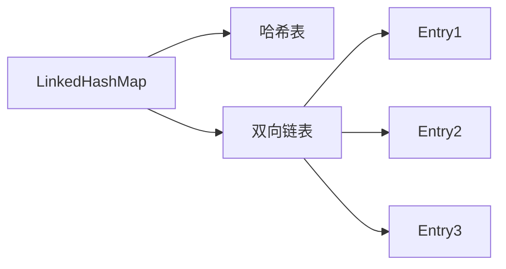
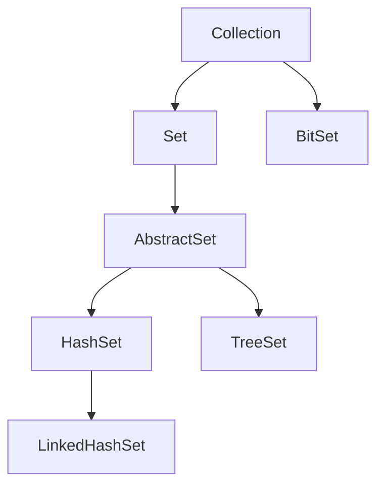
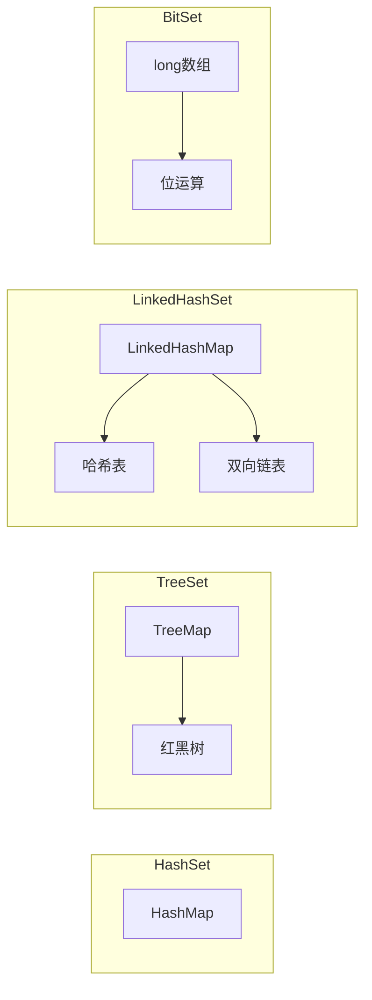
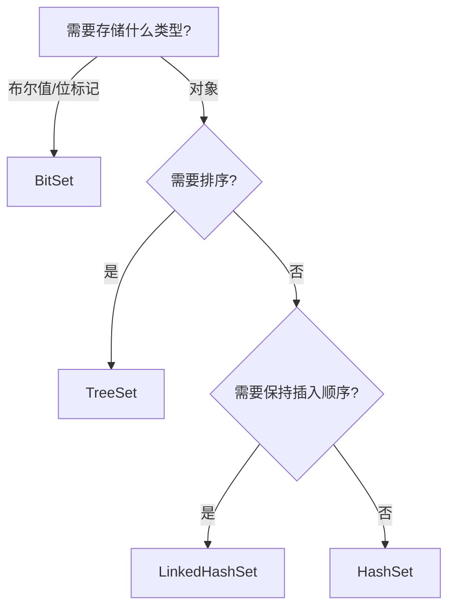

# Set 详解：HashSet、TreeSet、LinkedHashSet、BitSet

---

## 目录

1. [HashSet 底层实现](#1-hashset-底层实现)
2. [TreeSet 底层实现](#2-treeset-底层实现)
3. [LinkedHashSet 底层实现](#3-linkedhashset-底层实现)
4. [BitSet 底层实现](#4-bitset-底层实现)
5. [四种 Set 对比分析](#5-四种-set-对比分析)
6. [选择建议](#6-选择建议)

---

## 1. HashSet 底层实现

### 1.1 核心结构

**HashSet** 是基于 **HashMap** 实现的，底层使用 HashMap 来存储元素。

```java
public class HashSet<E> extends AbstractSet<E>
    implements Set<E>, Cloneable, java.io.Serializable {
    
    // 底层使用HashMap存储
    private transient HashMap<E, Object> map;
    
    // 所有元素对应的value都是同一个对象
    private static final Object PRESENT = new Object();
}
```

### 1.2 关键实现

```java
// 添加元素
public boolean add(E e) {
    // 将元素作为key存入HashMap，value固定为PRESENT
    return map.put(e, PRESENT) == null;
}

// 删除元素
public boolean remove(Object o) {
    return map.remove(o) == PRESENT;
}

// 判断是否包含
public boolean contains(Object o) {
    return map.containsKey(o);
}
```

### 1.3 特点总结

| 特性 | 说明 |
|------|------|
| **底层结构** | HashMap |
| **元素顺序** | 无序（基于hash值） |
| **允许null** | 允许一个null元素 |
| **线程安全** | 非线程安全 |
| **时间复杂度** | add/remove/contains: O(1)（平均） |
| **排序支持** | 不支持排序 |

### 1.4 去重原理

HashSet 的去重依赖于 `equals()` 和 `hashCode()` 方法：

1. 先调用 `hashCode()` 获取哈希值
2. 根据哈希值找到对应的桶位置
3. 在桶内遍历，调用 `equals()` 比较
4. 如果 `hashCode()` 相等且 `equals()` 返回 true，则视为重复元素

```java
// 正确实现equals和hashCode
public class Person {
    private String id;
    
    @Override
    public boolean equals(Object o) {
        if (this == o) return true;
        if (o == null || getClass() != o.getClass()) return false;
        Person person = (Person) o;
        return Objects.equals(id, person.id);
    }
    
    @Override
    public int hashCode() {
        return Objects.hash(id);
    }
}
```

---

## 2. TreeSet 底层实现

### 2.1 核心结构

**TreeSet** 是基于 **TreeMap** 实现的，底层使用红黑树来存储元素。

```java
public class TreeSet<E> extends AbstractSet<E>
    implements NavigableSet<E>, Cloneable, java.io.Serializable {
    
    // 底层使用TreeMap存储
    private transient NavigableMap<E, Object> m;
    
    private static final Object PRESENT = new Object();
}
```

### 2.2 关键实现

```java
// 添加元素
public boolean add(E e) {
    return m.put(e, PRESENT) == null;
}

// 获取第一个元素（最小）
public E first() {
    return m.firstKey();
}

// 获取最后一个元素（最大）
public E last() {
    return m.lastKey();
}
```

### 2.3 排序机制

TreeSet 支持两种排序方式：

**方式一：自然排序（实现 Comparable 接口）**
```java
public class User implements Comparable<User> {
    private int age;
    
    @Override
    public int compareTo(User o) {
        return Integer.compare(this.age, o.age);
    }
}

TreeSet<User> set = new TreeSet<>();
```

**方式二：定制排序（传入 Comparator）**
```java
TreeSet<User> set = new TreeSet<>(Comparator.comparingInt(User::getAge));
```

### 2.4 特点总结

| 特性 | 说明 |
|------|------|
| **底层结构** | TreeMap（红黑树） |
| **元素顺序** | 有序（自然排序或定制排序） |
| **允许null** | 不允许null元素 |
| **线程安全** | 非线程安全 |
| **时间复杂度** | add/remove/contains: O(log n) |
| **排序支持** | 支持排序 |

---

## 3. LinkedHashSet 底层实现

### 3.1 核心结构

**LinkedHashSet** 是基于 **LinkedHashMap** 实现的，底层使用哈希表 + 双向链表。

```java
public class LinkedHashSet<E> extends HashSet<E>
    implements Set<E>, Cloneable, java.io.Serializable {
    
    public LinkedHashSet(int initialCapacity, float loadFactor) {
        super(initialCapacity, loadFactor, true); // 第三个参数表示使用LinkedHashMap
    }
}
```

### 3.2 内部实现

```java
// HashSet的构造方法
HashSet(int initialCapacity, float loadFactor, boolean dummy) {
    map = new LinkedHashMap<>(initialCapacity, loadFactor);
}
```

### 3.3 数据结构



**双向链表维护插入顺序**，哈希表保证 O(1) 查找性能。

### 3.4 特点总结

| 特性 | 说明 |
|------|------|
| **底层结构** | LinkedHashMap（哈希表 + 双向链表） |
| **元素顺序** | 按插入顺序有序 |
| **允许null** | 允许一个null元素 |
| **线程安全** | 非线程安全 |
| **时间复杂度** | add/remove/contains: O(1)（平均） |
| **排序支持** | 不支持排序（但保持插入顺序） |

---

## 4. BitSet 底层实现

### 4.1 核心结构

**BitSet** 是一个位向量，用于高效存储布尔值（位）。

```java
public class BitSet implements Cloneable, java.io.Serializable {
    // 底层使用long数组存储
    private long[] words;
    
    // 使用的有效位数
    private int wordsInUse;
    
    // 每long包含64位
    private static final int ADDRESS_BITS_PER_WORD = 6;
    private static final int BITS_PER_WORD = 1 << ADDRESS_BITS_PER_WORD; // 64
}
```

### 4.2 位运算原理

```java
// 获取指定位置的位
public boolean get(int bitIndex) {
    checkIndex(bitIndex);
    int wordIndex = wordIndex(bitIndex);
    return (words[wordIndex] & (1L << bitIndex)) != 0;
}

// 设置指定位置的位
public void set(int bitIndex) {
    checkIndex(bitIndex);
    int wordIndex = wordIndex(bitIndex);
    words[wordIndex] |= (1L << bitIndex);
}

// 清除指定位置的位
public void clear(int bitIndex) {
    checkIndex(bitIndex);
    int wordIndex = wordIndex(bitIndex);
    words[wordIndex] &= ~(1L << bitIndex);
}
```

### 4.3 位运算操作

```java
// 按位与
public void and(BitSet set) { ... }

// 按位或
public void or(BitSet set) { ... }

// 按位异或
public void xor(BitSet set) { ... }

// 按位非
public void andNot(BitSet set) { ... }
```

### 4.4 特点总结

| 特性 | 说明 |
|------|------|
| **底层结构** | long[] 数组（每long存储64位） |
| **元素类型** | 仅存储位（0或1） |
| **允许null** | 不适用（位本身就是0/1） |
| **线程安全** | 非线程安全 |
| **空间效率** | 极高（1位/元素） |
| **适用场景** | 海量布尔值存储、位图索引 |

---

## 5. 四种 Set 对比分析

### 5.1 核心对比

| 特性 | HashSet | TreeSet | LinkedHashSet | BitSet |
|------|---------|---------|---------------|--------|
| **底层结构** | HashMap | TreeMap（红黑树） | LinkedHashMap | long[] 数组 |
| **元素顺序** | 无序 | 排序后有序 | 插入顺序 | - |
| **允许null** | 是（1个） | 否 | 是（1个） | 不适用 |
| **线程安全** | 否 | 否 | 否 | 否 |
| **添加复杂度** | O(1) | O(log n) | O(1) | O(1) |
| **查找复杂度** | O(1) | O(log n) | O(1) | O(1) |
| **排序支持** | 否 | 是 | 否（保持插入顺序） | 否 |
| **空间效率** | 中 | 高（树结构） | 中（额外链表） | 极高 |
| **元素类型** | 对象 | 对象（需Comparable） | 对象 | 仅位 |

### 5.2 继承关系



### 5.3 底层数据结构对比



---

## 6. 选择建议

### 6.1 选择决策树



### 6.2 场景匹配表

| 场景 | 推荐实现 | 理由 |
|------|---------|------|
| **一般去重** | HashSet | O(1)性能，空间适中 |
| **需要排序** | TreeSet | 自动排序，O(log n)性能 |
| **保持插入顺序** | LinkedHashSet | 兼顾顺序和O(1)性能 |
| **海量布尔值** | BitSet | 极高空间效率 |
| **频繁查找** | HashSet/LinkedHashSet | O(1)查找 |
| **范围查询** | TreeSet | 支持subSet、headSet、tailSet |

### 6.3 使用示例

#### 示例1：HashSet 去重
```java
Set<String> set = new HashSet<>();
set.add("apple");
set.add("banana");
set.add("apple"); // 重复，被忽略
```

#### 示例2：TreeSet 排序
```java
Set<Integer> set = new TreeSet<>();
set.add(3);
set.add(1);
set.add(2);
// 输出: [1, 2, 3]
```

#### 示例3：LinkedHashSet 保持顺序
```java
Set<String> set = new LinkedHashSet<>();
set.add("first");
set.add("second");
set.add("third");
// 输出: [first, second, third]
```

#### 示例4：BitSet 位图操作
```java
BitSet bitset = new BitSet(10);
bitset.set(0);
bitset.set(2);
bitset.set(5);
// bitset: {0, 2, 5}
```

---

## 总结

| Set类型 | 核心优势 | 适用场景 |
|---------|---------|---------|
| **HashSet** | O(1)性能 | 通用去重场景 |
| **TreeSet** | 自动排序 | 需要排序或范围查询 |
| **LinkedHashSet** | 保持插入顺序 | 需要顺序且O(1)性能 |
| **BitSet** | 极高空间效率 | 海量布尔值存储 |

**选择口诀**：  
- 去重选HashSet，排序选TreeSet  
- 保序选LinkedHashSet，海量布尔选BitSet
