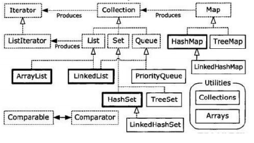

# 集合框架

Java集合框架是Java语言中用于存储和操作对象集合的一套类和接口。它提供了高效的数据结构和算法，是Java开发中最常用的API之一。

## 一、集合框架概述

### 1.1 集合框架的层次结构

Java集合框架主要包含两大接口体系：

```
Collection                          Map
    │                                 │
    ├── List                         ├── HashMap
    │     ├── ArrayList              ├── LinkedHashMap
    │     ├── LinkedList             ├── TreeMap
    │     └── Vector                 └── ConcurrentHashMap
    │
    ├── Set
    │     ├── HashSet
    │     ├── LinkedHashSet
    │     └── TreeSet
    │
    └── Queue
          ├── LinkedList
          ├── PriorityQueue
          └── ArrayDeque
```

### 1.2 为什么需要集合框架

虽然Java中的数组可以存储对象，但集合框架提供了更多优势：

- **动态大小**：数组初始化后大小固定，集合可以自动扩容
- **丰富的操作**：提供排序、查找、过滤等内置方法
- **类型安全**：泛型支持编译时类型检查
- **多种数据结构**：提供List、Set、Map等多种数据结构

### 1.3 集合框架的组成

| 组件 | 说明 |
|------|------|
| **接口** | 定义集合的抽象行为（Collection、List、Set、Map等） |
| **实现类** | 接口的具体实现（ArrayList、HashMap等） |
| **算法** | Collections工具类提供的排序、查找等算法 |
| **迭代器** | 遍历集合的统一方式 |

## 二、Collection接口

Collection是所有单列集合的根接口，定义了集合的基本操作：

### 2.1 核心方法

- `add(E e)` - 添加元素
- `remove(Object o)` - 删除元素
- `contains(Object o)` - 判断是否包含
- `size()` - 返回元素数量
- `isEmpty()` - 判断是否为空
- `iterator()` - 返回迭代器
- `clear()` - 清空集合

### 2.2 Collection的子接口

| 接口 | 特点 | 实现类 |
|------|------|--------|
| **List** | 有序、可重复 | ArrayList、LinkedList、Vector |
| **Set** | 无序、不可重复 | HashSet、LinkedHashSet、TreeSet |
| **Queue** | 先进先出 | LinkedList、PriorityQueue |

## 三、List接口

List是有序集合，元素可重复，支持通过索引访问。

### 3.1 ArrayList
- **底层实现**：动态数组
- **访问速度**：快，支持随机访问
- **插入删除**：慢，需要移动元素
- **适用场景**：读多写少的场景

### 3.2 LinkedList
- **底层实现**：双向链表
- **访问速度**：慢，需要遍历
- **插入删除**：快，只需修改指针
- **适用场景**：写多读少的场景

### 3.3 Vector
- **底层实现**：动态数组（线程安全）
- **性能**：较慢，因为有同步开销
- **适用场景**：需要线程安全的场景（推荐使用CopyOnWriteArrayList）

## 四、Set接口

Set是无序集合，元素不可重复。

### 4.1 HashSet
- **底层实现**：基于HashMap
- **特点**：无序、不保证顺序
- **性能**：添加、删除、查找O(1)

### 4.2 LinkedHashSet
- **底层实现**：基于LinkedHashMap
- **特点**：保持插入顺序
- **性能**：略低于HashSet

### 4.3 TreeSet
- **底层实现**：基于TreeMap（红黑树）
- **特点**：有序（自然排序或自定义排序）
- **性能**：添加、删除、查找O(log n)

## 五、Map接口

Map是键值对集合，键唯一，值可重复。

### 5.1 HashMap
- **底层实现**：数组+链表/红黑树
- **特点**：无序、非线程安全
- **性能**：O(1)平均复杂度
- **容量**：默认初始容量16，负载因子0.75

### 5.2 LinkedHashMap
- **底层实现**：HashMap+双向链表
- **特点**：保持插入顺序或访问顺序
- **应用场景**：LRU缓存

### 5.3 TreeMap
- **底层实现**：红黑树
- **特点**：键有序
- **性能**：O(log n)复杂度

### 5.4 ConcurrentHashMap
- **底层实现**：分段锁（JDK 7）/CAS+Synchronized（JDK 8）
- **特点**：线程安全、高并发
- **性能**：比Hashtable高得多

## 六、选择合适的集合

### 6.1 选择决策树

```
需要键值对存储？
    └── 是 → Map
        ├── 需要排序？ → TreeMap
        ├── 需要保持插入顺序？ → LinkedHashMap
        └── 其他 → HashMap
    └── 否 → Collection
        ├── 需要有序且可重复？ → List
        │     ├── 读多写少？ → ArrayList
        │     └── 写多读少？ → LinkedList
        ├── 需要不可重复？ → Set
        │     ├── 需要排序？ → TreeSet
        │     ├── 需要保持插入顺序？ → LinkedHashSet
        │     └── 其他 → HashSet
        └── 需要队列操作？ → Queue
```

### 6.2 线程安全集合

| 场景 | 推荐集合 |
|------|----------|
| List | CopyOnWriteArrayList |
| Set | CopyOnWriteArraySet |
| Map | ConcurrentHashMap |
| Queue | ConcurrentLinkedQueue |

## 七、集合操作技巧

### 7.1 遍历方式

```java
// 1. 增强for循环
for (String item : list) {
    System.out.println(item);
}

// 2. 迭代器
Iterator<String> iterator = list.iterator();
while (iterator.hasNext()) {
    String item = iterator.next();
    // 可安全删除元素
    iterator.remove();
}

// 3. Lambda表达式（Java 8+）
list.forEach(item -> System.out.println(item));

// 4. Stream API（Java 8+）
list.stream().filter(item -> item.startsWith("A")).forEach(System.out::println);
```

### 7.2 常见陷阱

- **ConcurrentModificationException**：在迭代时修改集合
- **空指针异常**：未检查null元素
- **性能问题**：在ArrayList中间频繁插入删除
- **内存泄漏**：静态集合持有对象引用

---

## 本目录包含的集合文档



- **Collection接口详解**
  - [ArrayList详解](Collection/ArrayList详解.md)
  - [CopyOnWriteArrayList详解](Collection/CopyOnWriteArrayList详解.md)
  - [HashSet详解](Collection/HashSet详解.md)
  - [Queue](Collection/Queue.md)
  - [Java集合面试题](Collection/Java集合面试.md)

- **Map接口详解**
  - [HashMap详解](Map/Map与HashMap详解.md)
  - [ConcurrentHashMap详解](Map/ConcurrentHashMap详解.md)

- **其他**
  - [Fail-Fast机制](Fail-Fast.md)
