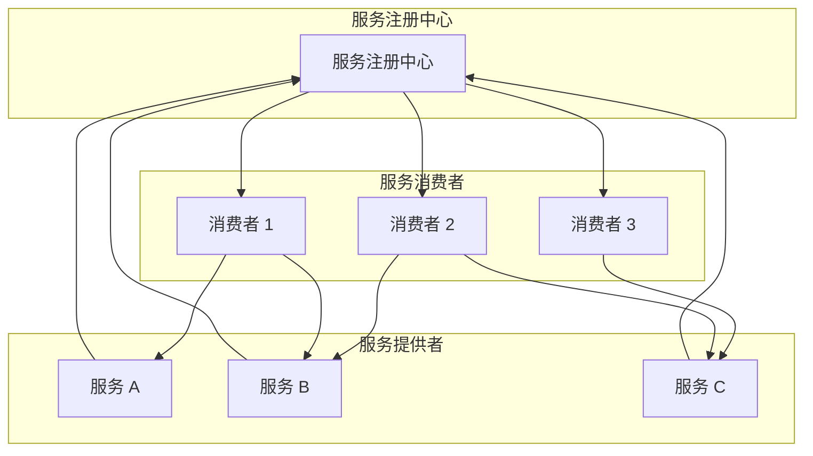
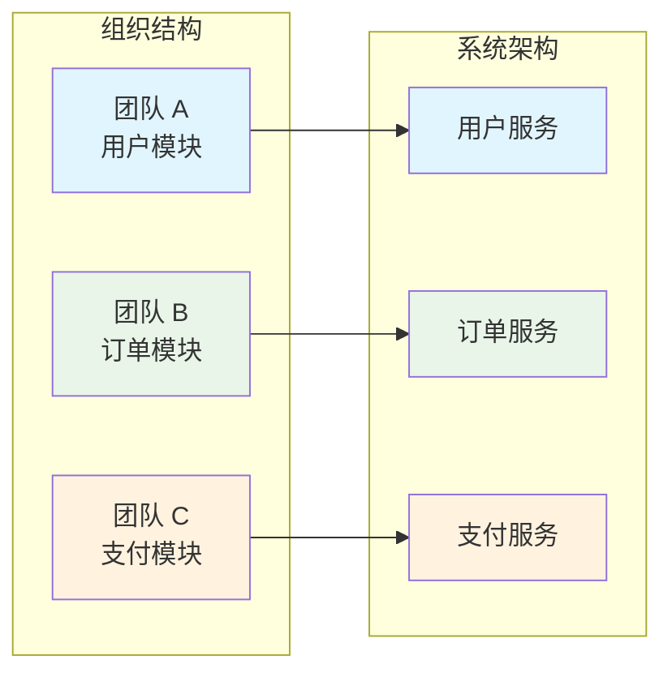

# 技术与业务共同驱动

## **(初次打开请耐心，github源加载较慢)**

[技术无止境-能解决问题才是时代所需](https://lviter-pri.github.io/professional/)，脱离了业务空谈技术都是耍流氓

**Java 语言的设计初衷：Write once, run anywhere。我的目标是：Design once, scale everywhere.**

## SOA（面向服务的架构）

SOA（Service-Oriented Architecture）是一种软件设计理念，将业务功能封装为可重用的服务。

### 核心原则

- **服务复用**：相同功能只实现一次，避免重复开发
- **松耦合**：服务间通过标准接口通信，独立演进，互不影响
- **标准化接口**：通过统一协议（如 SOAP、REST、gRPC）进行通信
- **服务治理**：包括服务注册、发现、监控、版本管理等

### 架构图

## 康威定律（Conway's Law）

> "If you have four groups working on a compiler, you will end up with a four-pass compiler.(四拨人一起写编译器，最后就会被拆成四个 pass)"
>
> — Melvin Conway, 1967

系统的架构往往反映出创建它的组织的沟通结构。

### 在软件架构中的应用

- 微服务架构往往需要对应的组织结构调整
- 团队边界应该与系统边界对齐
- 避免跨团队的大范围服务调用，减少沟通成本
- 独立团队负责独立服务，快速迭代

### 实际案例

- **亚马逊的"两个披萨原则"团队**：团队规模控制在两个披萨能喂饱的人数，确保沟通高效
- **Spotify 的 Squad 模式**：小规模自治团队，拥有端到端的责任
- **团队规模与系统复杂度**：大团队往往产生高耦合的系统，小团队更容易保持服务的独立性

### 康威定律示意图

## 1. 精深训练的理念

热爱 | 重复 | 坚持

不断重复，从不停止。

永远追求做一个极致的产品，关注细节。

深度，广度，高度，均能达到。

大事简单做，小事细心做

复杂的事建单化，建单的事流程化

## 2. 定义合理边界——版本

边界，代表一类训练的范围，同时也决定着训练能带来的效果。这里使用版本梯度来表示边界。

为每一类训练指定一个合理的版本以及版本内容的规划。

训练评测——能够分享，代表着对一个训练的掌握。常见的自话式分享，PPT式分享。

定义一个合理的版本目标。

## 3. 内容说明

学习别人优秀课程结合个人总结，只用于学习使用，无任何商业价值，转载请联系作者获得授权，并注明出处

## 4.共勉

有一个夜晚，我烧毁了所有的记忆，

从此我的梦就透明了；

有个早晨我扔掉了所有的昨天，

从此我的脚步就轻盈了！

越过山丘，才发现无人等候！

\-- 泰戈尔

***

## 有任何问题联系我

- **邮箱：<lviter@163.com>**
- **感谢大家，打赏码支持**
- **优秀的文档大家一起学习，推荐几个地址**：
  - **[美团技术团队](https://tech.meituan.com/)**
  - **[阿里云内核月报](https://www.bookstack.cn/read/aliyun-rds-core/summary.md)**

    

