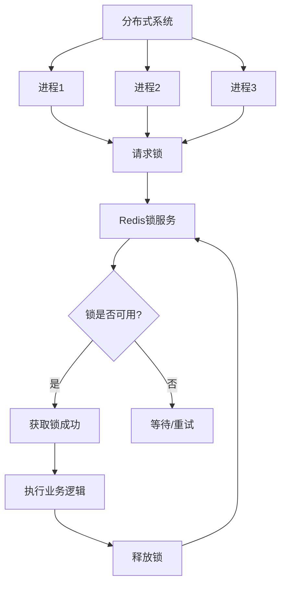
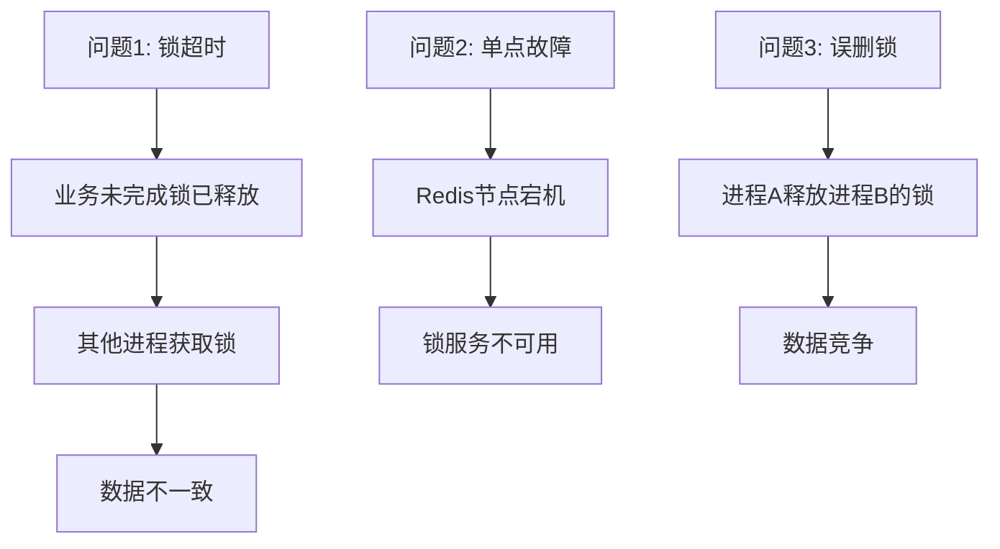
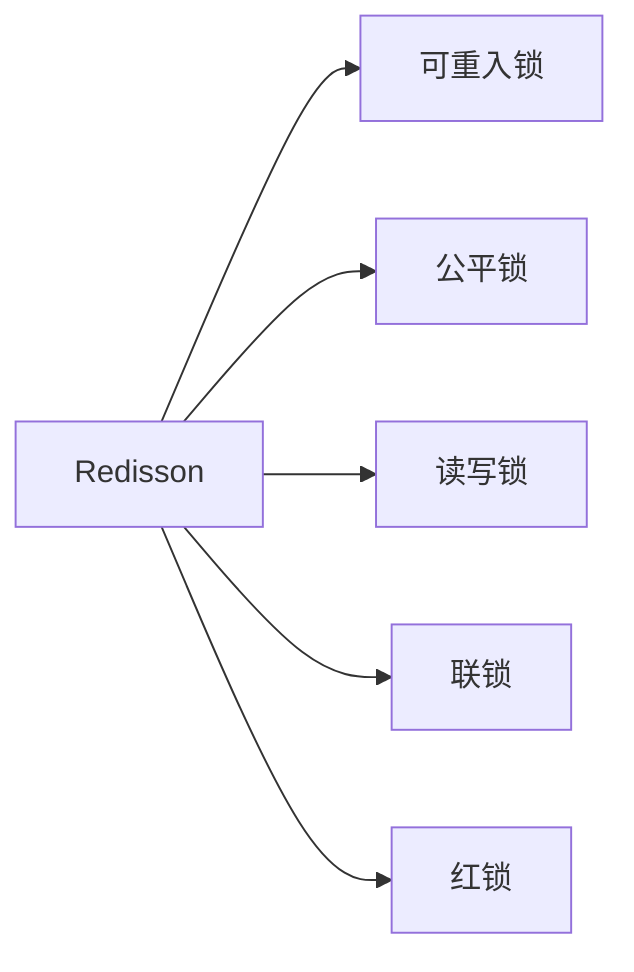
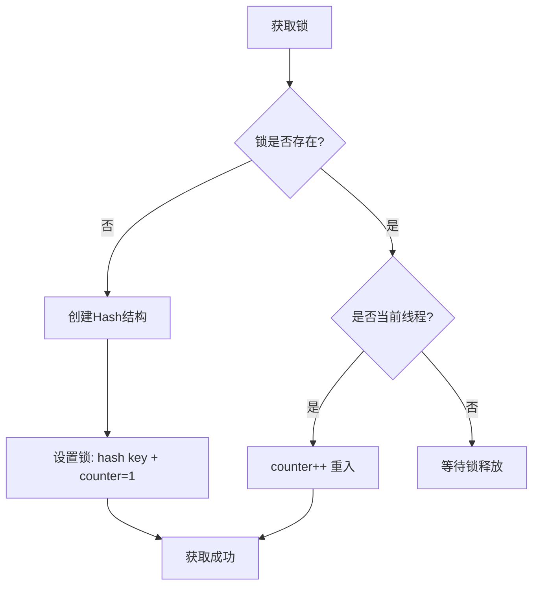
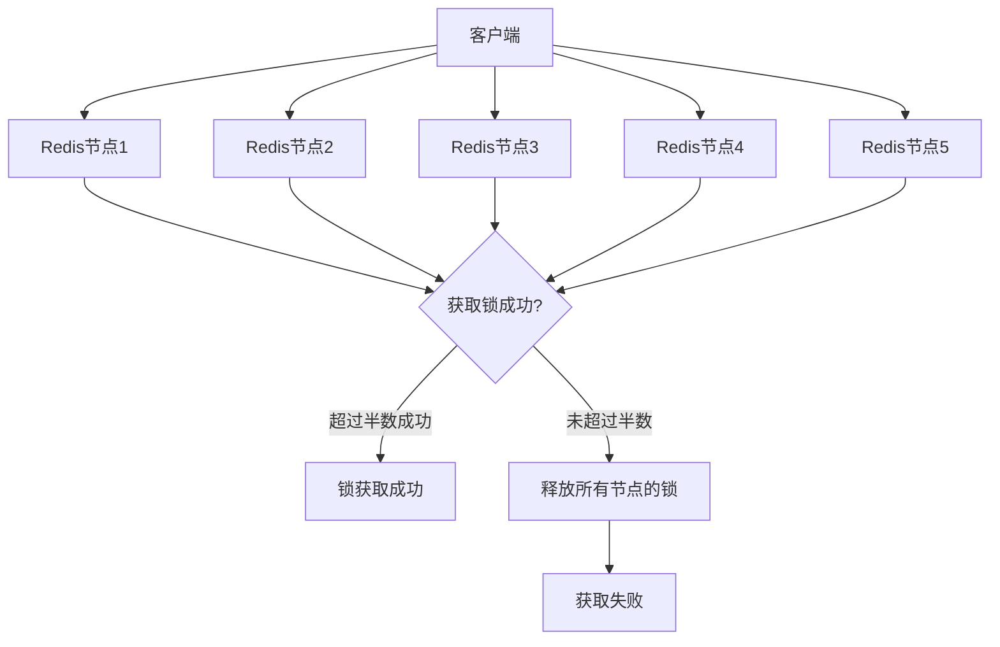
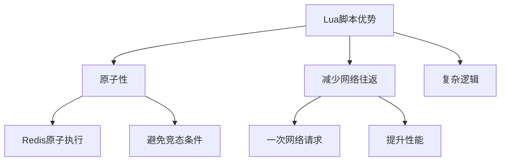
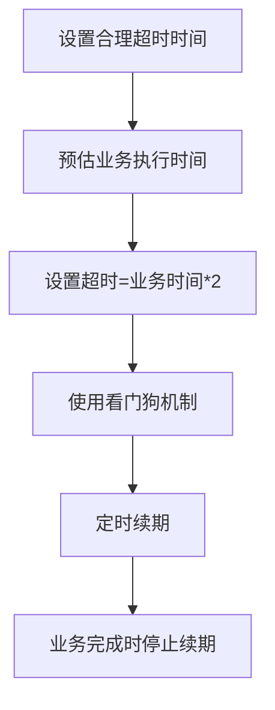
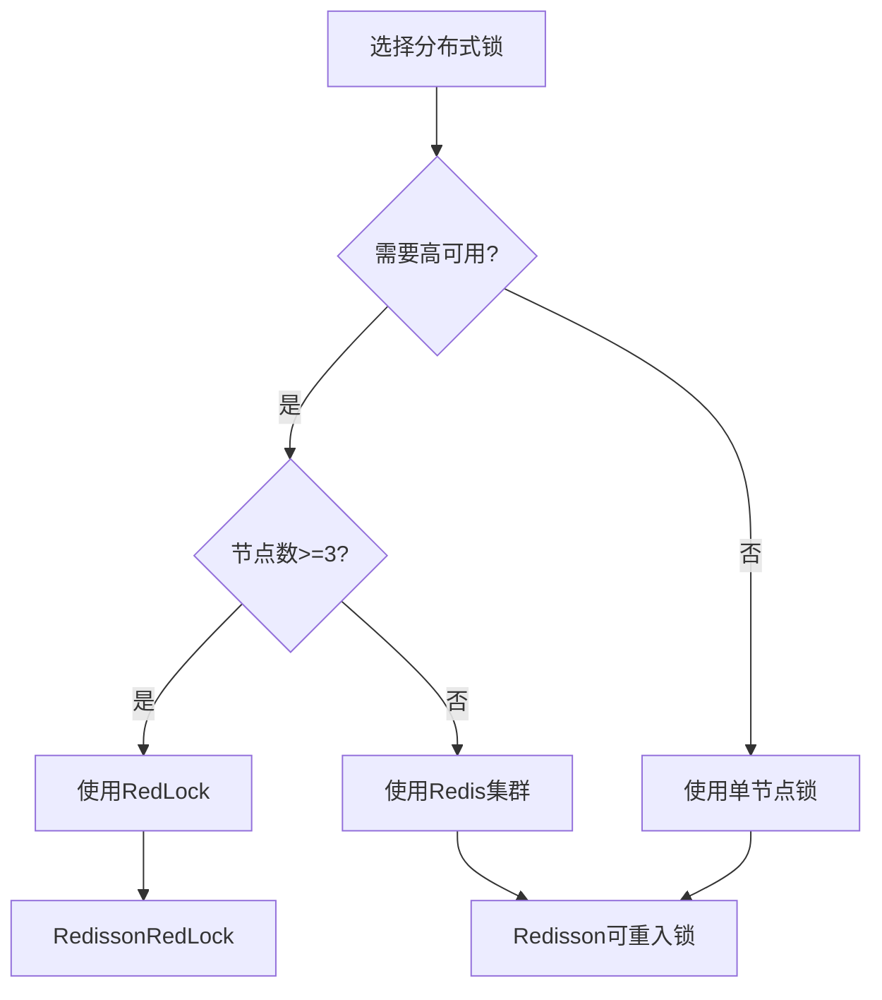

# Redis 分布式锁

## 目录

1. [分布式锁基础原理](#1-分布式锁基础原理)
2. [Redisson 分布式锁](#2-redisson-分布式锁)
3. [RedLock 算法](#3-redlock-算法)
4. [Lua 脚本实现](#4-lua-脚本实现)
5. [最佳实践与注意事项](#5-最佳实践与注意事项)

---

## 1. 分布式锁基础原理

### 1.1 分布式锁概念

分布式锁是一种在分布式系统中用于协调多个进程或服务对共享资源访问的机制。



### 1.2 分布式锁的特性

| 特性 | 说明 |
|------|------|
| **互斥性** | 同一时刻只有一个客户端持有锁 |
| **可重入性** | 同一个客户端可以重复获取同一把锁 |
| **超时机制** | 锁持有时间过长时自动释放，防止死锁 |
| **高可用性** | 锁服务需要高可用，防止单点故障 |
| **高性能** | 获取和释放锁的操作要快速 |

### 1.3 基于 Redis 的简单实现

#### 获取锁

```bash
SET lock_key unique_value NX PX 30000
```

- `NX`: 只有 key 不存在时才设置成功
- `PX 30000`: 设置 30 秒过期时间

#### 释放锁

```bash
if redis.call('get', KEYS[1]) == ARGV[1] then
    return redis.call('del', KEYS[1])
else
    return 0
end
```

### 1.4 基础实现的问题



---

## 2. Redisson 分布式锁

### 2.1 Redisson 简介

Redisson 是一个基于 Redis 的 Java 客户端，提供了丰富的分布式锁实现。



### 2.2 可重入锁（ReentrantLock）

#### 原理

Redisson 的可重入锁基于 Redis 的 Hash 数据结构实现：



#### 代码示例

```java
// 配置 Redisson
Config config = new Config();
config.useSingleServer().setAddress("redis://127.0.0.1:6379");
RedissonClient redisson = Redisson.create(config);

// 获取可重入锁
RLock lock = redisson.getLock("myLock");

try {
    // 尝试获取锁，最多等待100秒，持有锁10秒
    boolean locked = lock.tryLock(100, 10, TimeUnit.SECONDS);
    if (locked) {
        // 执行业务逻辑
        System.out.println("获取锁成功");
    }
} catch (InterruptedException e) {
    Thread.currentThread().interrupt();
} finally {
    // 释放锁
    lock.unlock();
}
```

### 2.3 公平锁（FairLock）

```java
// 获取公平锁
RLock fairLock = redisson.getFairLock("myFairLock");

try {
    fairLock.lock();
    // 执行业务逻辑
} finally {
    fairLock.unlock();
}
```

### 2.4 读写锁（ReadWriteLock）

```java
RReadWriteLock rwLock = redisson.getReadWriteLock("myRWLock");

// 读锁
RLock readLock = rwLock.readLock();
// 写锁
RLock writeLock = rwLock.writeLock();

// 读操作
readLock.lock();
try {
    // 读取数据
} finally {
    readLock.unlock();
}

// 写操作
writeLock.lock();
try {
    // 写入数据
} finally {
    writeLock.unlock();
}
```

### 2.5 联锁（MultiLock）

```java
RLock lock1 = redisson.getLock("lock1");
RLock lock2 = redisson.getLock("lock2");
RLock lock3 = redisson.getLock("lock3");

// 联锁：所有锁都获取成功才返回
RLock multiLock = redisson.getMultiLock(lock1, lock2, lock3);

try {
    multiLock.lock();
    // 执行业务逻辑
} finally {
    multiLock.unlock();
}
```

---

## 3. RedLock 算法

### 3.1 RedLock 原理

RedLock 是 Redis 官方推荐的分布式锁算法，通过多个独立的 Redis 节点来提高可靠性。



### 3.2 RedLock 步骤

#### 步骤 1: 获取当前时间
```java
long startTime = System.currentTimeMillis();
```

#### 步骤 2: 依次向所有节点获取锁
```java
int successCount = 0;
for (RedisNode node : nodes) {
    boolean success = node.tryLock(lockKey, requestId, ttl);
    if (success) {
        successCount++;
    }
}
```

#### 步骤 3: 判断是否成功
```java
long elapsedTime = System.currentTimeMillis() - startTime;
if (successCount >= (nodes.size() / 2 + 1) && elapsedTime < ttl) {
    // 锁获取成功
    return true;
} else {
    // 释放所有已获取的锁
    releaseAllLocks();
    return false;
}
```

### 3.3 RedLock 代码示例

```java
Config config1 = new Config();
config1.useSingleServer().setAddress("redis://127.0.0.1:6379");
RedissonClient redisson1 = Redisson.create(config1);

Config config2 = new Config();
config2.useSingleServer().setAddress("redis://127.0.0.1:6380");
RedissonClient redisson2 = Redisson.create(config2);

Config config3 = new Config();
config3.useSingleServer().setAddress("redis://127.0.0.1:6381");
RedissonClient redisson3 = Redisson.create(config3);

// 创建 RedLock
RLock lock1 = redisson1.getLock("redlock");
RLock lock2 = redisson2.getLock("redlock");
RLock lock3 = redisson3.getLock("redlock");

RedissonRedLock redLock = new RedissonRedLock(lock1, lock2, lock3);

try {
    // 尝试获取锁，最多等待100秒，持有锁10秒
    boolean locked = redLock.tryLock(100, 10, TimeUnit.SECONDS);
    if (locked) {
        // 执行业务逻辑
    }
} catch (InterruptedException e) {
    Thread.currentThread().interrupt();
} finally {
    redLock.unlock();
}
```

### 3.4 RedLock 容错机制

| 场景 | 处理方式 |
|------|---------|
| **节点宕机恢复** | 使用延迟过期，防止锁被重复获取 |
| **网络分区** | 客户端等待足够长的时间确保锁真正释放 |
| **时钟漂移** | 使用相对时间而非绝对时间 |

---

## 4. Lua 脚本实现

### 4.1 Lua 脚本的优势



### 4.2 获取锁的 Lua 脚本

```lua
-- 获取锁
-- KEYS[1]: 锁的key
-- ARGV[1]: 锁的唯一标识（UUID+线程ID）
-- ARGV[2]: 锁的过期时间（毫秒）

if redis.call('exists', KEYS[1]) == 0 then
    redis.call('hset', KEYS[1], ARGV[1], 1)
    redis.call('pexpire', KEYS[1], ARGV[2])
    return 1
end

if redis.call('hexists', KEYS[1], ARGV[1]) == 1 then
    redis.call('hincrby', KEYS[1], ARGV[1], 1)
    redis.call('pexpire', KEYS[1], ARGV[2])
    return 1
end

return 0
```

### 4.3 释放锁的 Lua 脚本

```lua
-- 释放锁
-- KEYS[1]: 锁的key
-- ARGV[1]: 锁的唯一标识（UUID+线程ID）

if redis.call('hexists', KEYS[1], ARGV[1]) == 0 then
    return nil
end

local counter = redis.call('hincrby', KEYS[1], ARGV[1], -1)

if counter > 0 then
    redis.call('pexpire', KEYS[1], ARGV[2])
    return 0
else
    redis.call('del', KEYS[1])
    return 1
end
```

### 4.4 Java 中调用 Lua 脚本

```java
// 获取锁脚本
String acquireScript = """
    if redis.call('exists', KEYS[1]) == 0 then
        redis.call('hset', KEYS[1], ARGV[1], 1)
        redis.call('pexpire', KEYS[1], ARGV[2])
        return 1
    end
    if redis.call('hexists', KEYS[1], ARGV[1]) == 1 then
        redis.call('hincrby', KEYS[1], ARGV[1], 1)
        redis.call('pexpire', KEYS[1], ARGV[2])
        return 1
    end
    return 0
    """;

// 执行脚本
Long result = (Long) jedis.eval(
    acquireScript,
    Collections.singletonList("myLock"),
    Arrays.asList(requestId, String.valueOf(expireTime))
);
```

---

## 5. 最佳实践与注意事项

### 5.1 锁超时处理



### 5.2 Redisson 看门狗机制

```java
// Redisson 默认开启看门狗
Config config = new Config();
config.useSingleServer()
    .setAddress("redis://127.0.0.1:6379")
    // 看门狗检查间隔，默认30秒
    .setLockWatchdogTimeout(30000);
```

### 5.3 锁的粒度

| 粒度 | 优点 | 缺点 |
|------|------|------|
| **粗粒度** | 简单，冲突少 | 并发度低 |
| **细粒度** | 并发度高 | 复杂度高 |

### 5.4 常见问题与解决方案

| 问题 | 解决方案 |
|------|---------|
| **锁误删** | 使用唯一标识 + Lua 脚本 |
| **死锁** | 设置超时时间 + 看门狗 |
| **单点故障** | 使用 RedLock 或 Redis 集群 |
| **性能瓶颈** | 合理设置锁粒度 |

### 5.5 选择建议



### 5.6 总结

| 实现方式 | 适用场景 | 优点 | 缺点 |
|---------|---------|------|------|
| **简单 SET NX** | 低并发、非关键业务 | 简单、高性能 | 单点故障、无重入 |
| **Redisson** | 生产环境、高并发 | 功能丰富、高可用 | 需要引入依赖 |
| **RedLock** | 高可用要求极高 | 多节点容错 | 部署复杂、性能稍低 |

---

## 参考资料

1. [Redis 官方文档 - 分布式锁](https://redis.io/docs/manual/patterns/distributed-locks/)
2. [Redisson 官方文档](https://redisson.org/)
3. [RedLock 算法论文](https://redis.io/docs/manual/patterns/distributed-locks/#redlock-algorithm)
