# Redis 有哪些数据结构

## 目录

1. [概述](#1-概述)
2. [String（字符串）](#2-string字符串)
3. [Hash（哈希）](#3-hash哈希)
4. [List（列表）](#4-list列表)
5. [Set（集合）](#5-set集合)
6. [ZSet（有序集合）](#6-zset有序集合)
7. [BitMap（位图）](#7-bitmap位图)
8. [GEO（地理空间）](#8-geo地理空间)
9. [数据结构对比与选择建议](#9-数据结构对比与选择建议)

***

## 1. 概述

### 1.1 Redis 数据结构分类

Redis 提供了丰富的数据结构，主要分为七种类型：

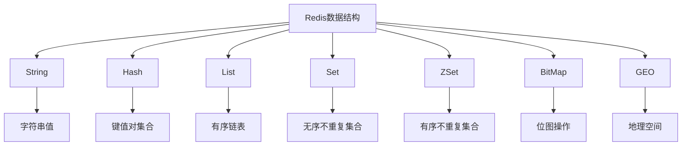

### 1.2 数据结构概览

| 数据结构       | 类型   | 特点    | 典型场景           |
| ---------- | ---- | ----- | -------------- |
| **String** | 字符串  | 简单键值对 | 缓存、计数器、Session |
| **Hash**   | 哈希表  | 键值对集合 | 对象存储、配置        |
| **List**   | 列表   | 有序可重复 | 消息队列、日志        |
| **Set**    | 集合   | 无序不重复 | 去重、交集/并集       |
| **ZSet**   | 有序集合 | 有序不重复 | 排行榜、优先级队列      |
| **BitMap** | 位图   | 位级操作  | 用户签到、UV统计      |
| **GEO**    | 地理空间 | 地理位置  | 附近搜索、LBS服务     |

***

## 2. String（字符串）

### 2.1 概述

String 是 Redis 最基础的数据结构，存储二进制安全的字符串。

### 2.2 内部实现：SDS

Redis 使用 **Simple Dynamic String（SDS）** 作为字符串的底层实现：

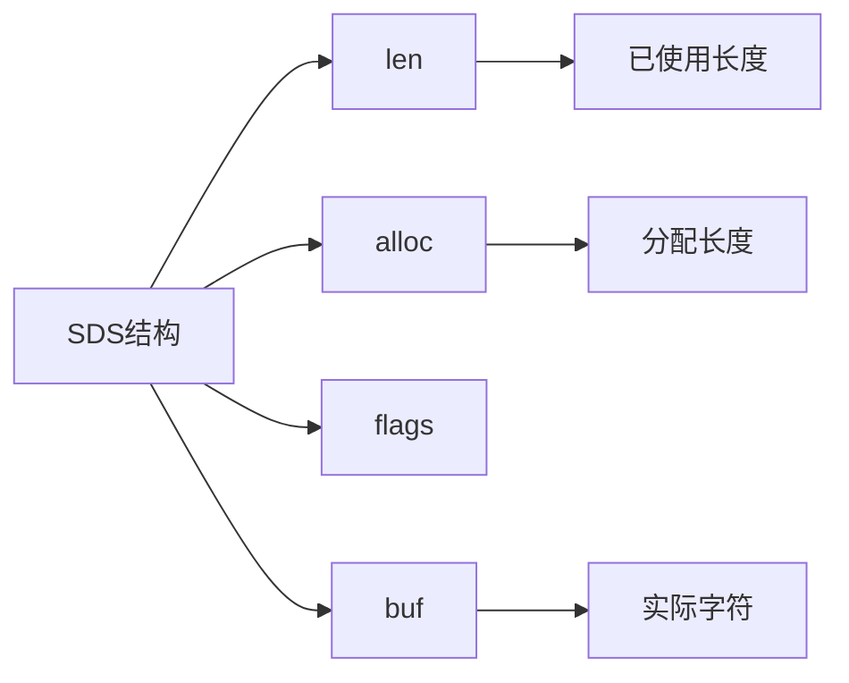

### 2.3 常用命令

```bash
SET key value [EX seconds]
GET key
APPEND key value
STRLEN key
INCR key
DECR key
```

### 2.4 代码示例

```java
Jedis jedis = new Jedis("localhost", 6379);
jedis.set("user:1:name", "张三");
jedis.expire("user:1:name", 3600);
jedis.incr("article:1:views");
```

***

## 3. Hash（哈希）

### 3.1 概述

Hash 是一个键值对的集合，适合存储对象。

### 3.2 内部实现

Hash 底层使用 **字典（Dict）** 实现：

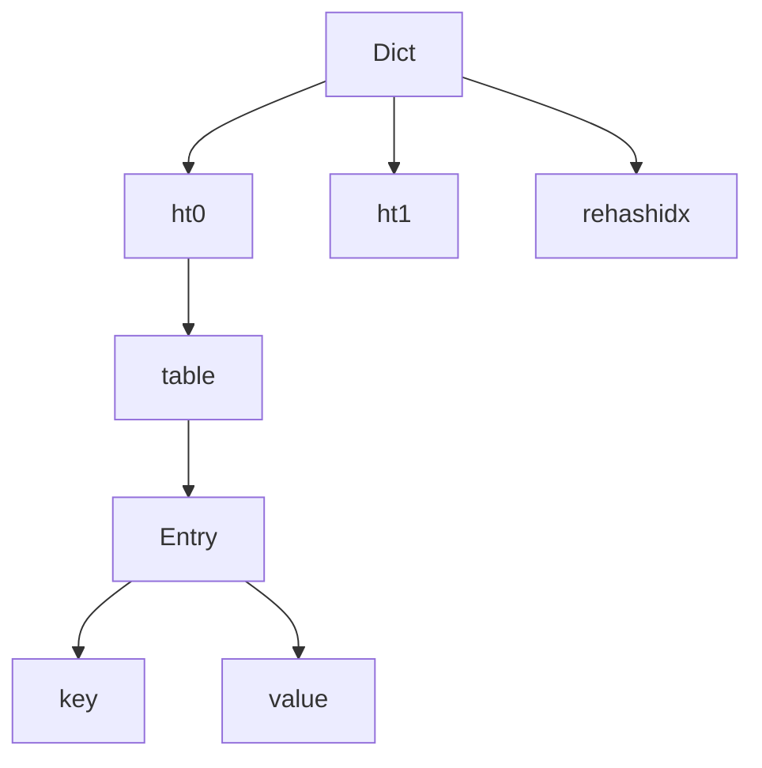

### 3.3 常用命令

```bash
HSET key field value
HGET key field
HMSET key field1 value1 field2 value2
HGETALL key
HLEN key
```

### 3.4 代码示例

```java
Map<String, String> user = new HashMap<>();
user.put("name", "张三");
user.put("age", "25");
jedis.hmset("user:1", user);
```

***

## 4. List（列表）

### 4.1 概述

List 是有序的字符串列表，支持重复元素。

### 4.2 内部实现

List 底层使用 **双向链表** 和 **压缩列表（ZipList）**：

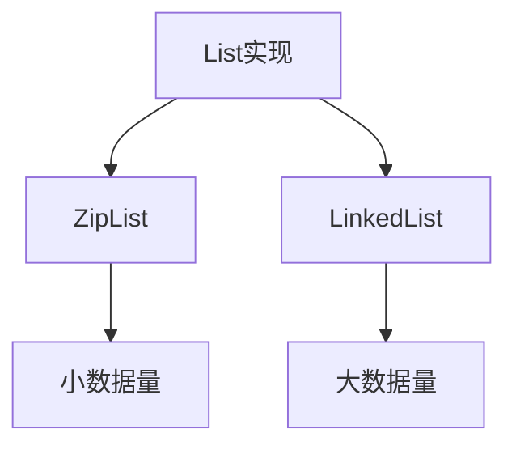

### 4.3 常用命令

```bash
LPUSH key value1 value2
RPUSH key value1 value2
LPOP key
RPOP key
LRANGE key start stop
```

### 4.4 代码示例

```java
jedis.rpush("queue:task", "task1");
String task = jedis.lpop("queue:task");
```

***

## 5. Set（集合）

### 5.1 概述

Set 是无序的字符串集合，不允许重复元素。

### 5.2 内部实现

Set 底层使用 **哈希表** 或 **整数集合（IntSet）**：

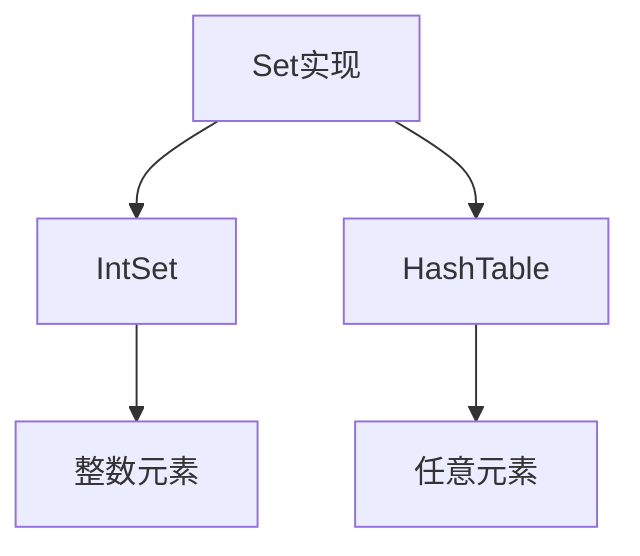

### 5.3 常用命令

```bash
SADD key member1 member2
SREM key member
SISMEMBER key member
SINTER key1 key2
SUNION key1 key2
```

### 5.4 代码示例

```java
jedis.sadd("user:1:tags", "Java", "Redis");
boolean isMember = jedis.sismember("user:1:tags", "Redis");
```

***

## 6. ZSet（有序集合）

### 6.1 概述

ZSet 是有序的字符串集合，每个元素关联一个分数（score）。

### 6.2 内部实现

ZSet 使用 **字典 + 跳跃表（SkipList）**：

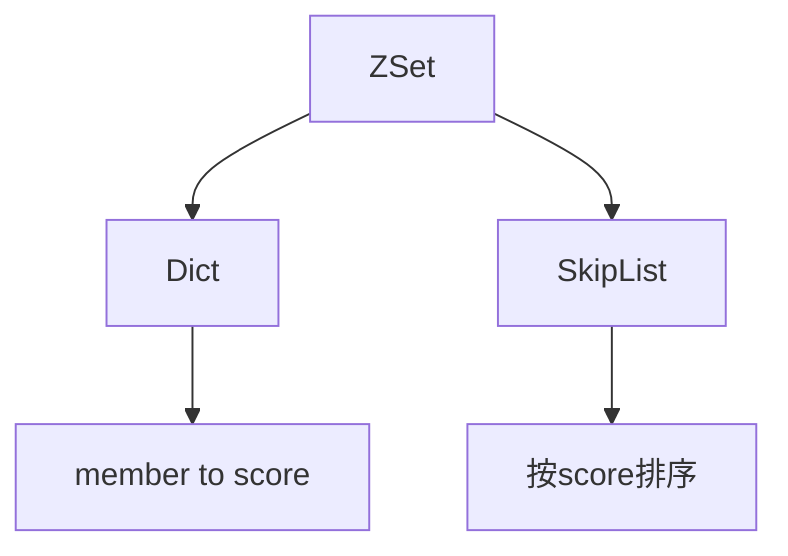

### 6.3 常用命令

```bash
ZADD key score1 member1
ZREM key member
ZSCORE key member
ZRANGE key start stop WITHSCORES
ZINCRBY key increment member
```

### 6.4 代码示例

```java
jedis.zadd("rank:game", 1000, "player:1");
Set<String> top3 = jedis.zrevrange("rank:game", 0, 2);
```

***

## 7. BitMap（位图）

### 7.1 概述

BitMap 是基于 String 类型实现的位操作数据结构，可以高效地处理大量布尔值。

### 7.2 内部实现

BitMap 底层使用 String 存储，每个字节包含 8 个位：

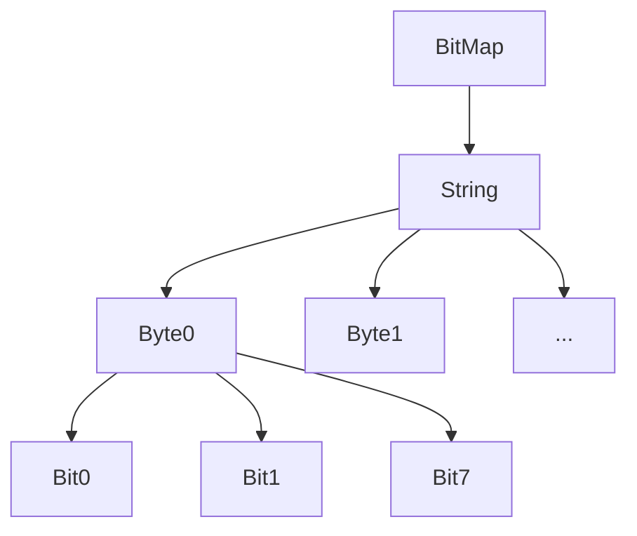

### 7.3 常用命令

```bash
SETBIT key offset value
GETBIT key offset
BITCOUNT key [start end]
BITOP AND destkey key1 key2
BITPOS key bit
```

### 7.4 使用场景

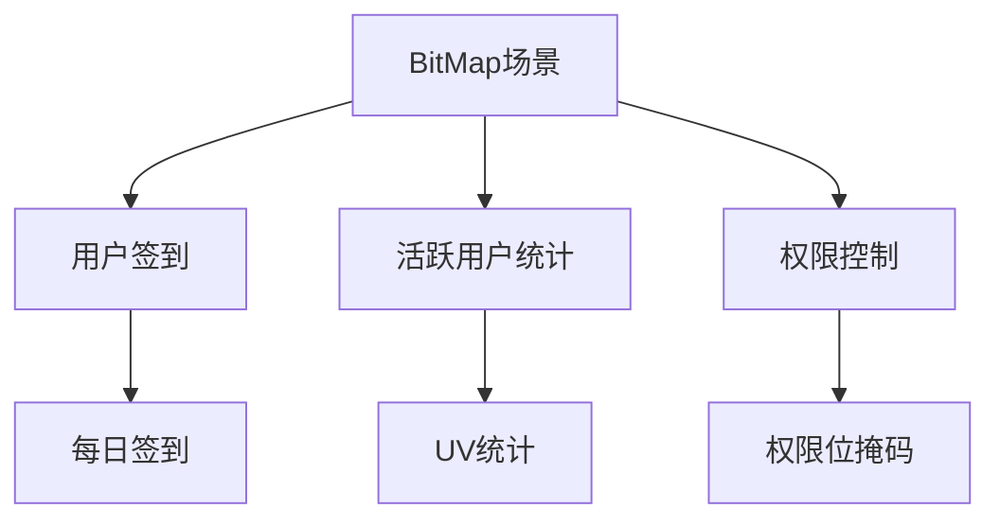

### 7.5 40亿qq号如何判断是否存在？

1. 将10位数的qq号，按位图存储，比如927843251这个号码，则只需要在位图上这个位置标识为1
2. 统计所有为1的位图数据，则可以判断

### 7.6 代码示例

```java
// 用户签到
jedis.setbit("user:1:sign", 0, true);  // 第1天
jedis.setbit("user:1:sign", 1, true);  // 第2天

// 统计签到天数
long count = jedis.bitcount("user:1:sign");

// 检查某天是否签到
boolean signed = jedis.getbit("user:1:sign", 0);
```

***

## 8. GEO（地理空间）

### 8.1 概述

GEO 是 Redis 3.2 引入的地理空间数据结构，用于存储和查询地理位置信息。

### 8.2 内部实现

GEO 底层使用 ZSet 实现，score 存储经纬度的 Geohash 编码：

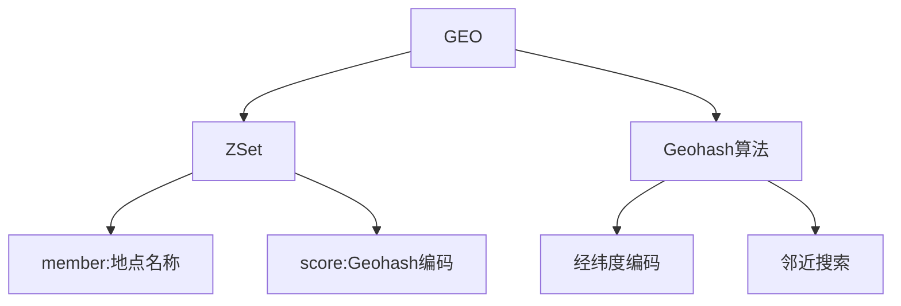

### 8.3 常用命令

```bash
GEOADD key longitude latitude member
GEOPOS key member
GEODIST key member1 member2 [unit]
GEORADIUS key longitude latitude radius km
GEORADIUSBYMEMBER key member radius km
GEOHASH key member
```

### 8.4 使用场景

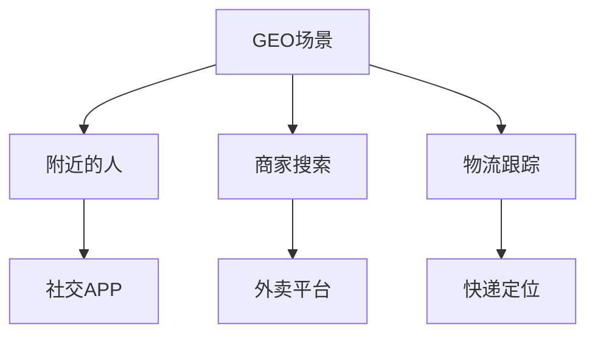

### 8.5 代码示例

```java
// 添加城市位置
jedis.geoadd("cities", 116.4074, 39.9042, "北京");
jedis.geoadd("cities", 121.4737, 31.2304, "上海");

// 获取城市坐标
List<GeoCoordinate> coords = jedis.geopos("cities", "北京", "上海");

// 计算两地距离
Double distance = jedis.geodist("cities", "北京", "上海", GeoUnit.KM);

// 查找附近的城市
List<GeoRadiusResponse> nearby = jedis.georadius("cities", 116.4074, 39.9042, 1000, GeoUnit.KM);
```

***

## 9. 数据结构对比与选择建议

### 9.1 特性对比

| 特性        | String | Hash | List | Set  | ZSet | BitMap | GEO  |
| --------- | ------ | ---- | ---- | ---- | ---- | ------ | ---- |
| **有序性**   | -      | -    | 有序   | 无序   | 有序   | -      | 有序   |
| **重复性**   | -      | -    | 可重复  | 不可重复 | 不可重复 | -      | 不可重复 |
| **索引访问**  | -      | -    | 支持   | -    | 支持   | 位索引    | -    |
| **范围查询**  | -      | -    | 支持   | -    | 支持   | -      | 支持   |
| **交集/并集** | -      | -    | -    | 支持   | -    | 位运算    | -    |
| **排序**    | -      | -    | -    | -    | 支持   | -      | 距离排序 |

### 9.2 典型场景总结

| 场景        | 推荐数据结构 | 原因         |
| --------- | ------ | ---------- |
| **缓存**    | String | 简单键值对      |
| **计数器**   | String | INCR 原子操作  |
| **对象存储**  | Hash   | 结构化数据      |
| **消息队列**  | List   | 先进先出       |
| **去重**    | Set    | 自动去重       |
| **好友关系**  | Set    | 交集/并集      |
| **排行榜**   | ZSet   | 分数排序       |
| **优先级队列** | ZSet   | 按score排序   |
| **延迟任务**  | ZSet   | score作为时间戳 |
| **用户签到**  | BitMap | 高效存储布尔值    |
| **UV统计**  | BitMap | 位运算快速统计    |
| **附近搜索**  | GEO    | 地理位置查询     |
| **LBS服务** | GEO    | 地理空间索引     |

***

## 总结

### Redis 数据结构核心要点

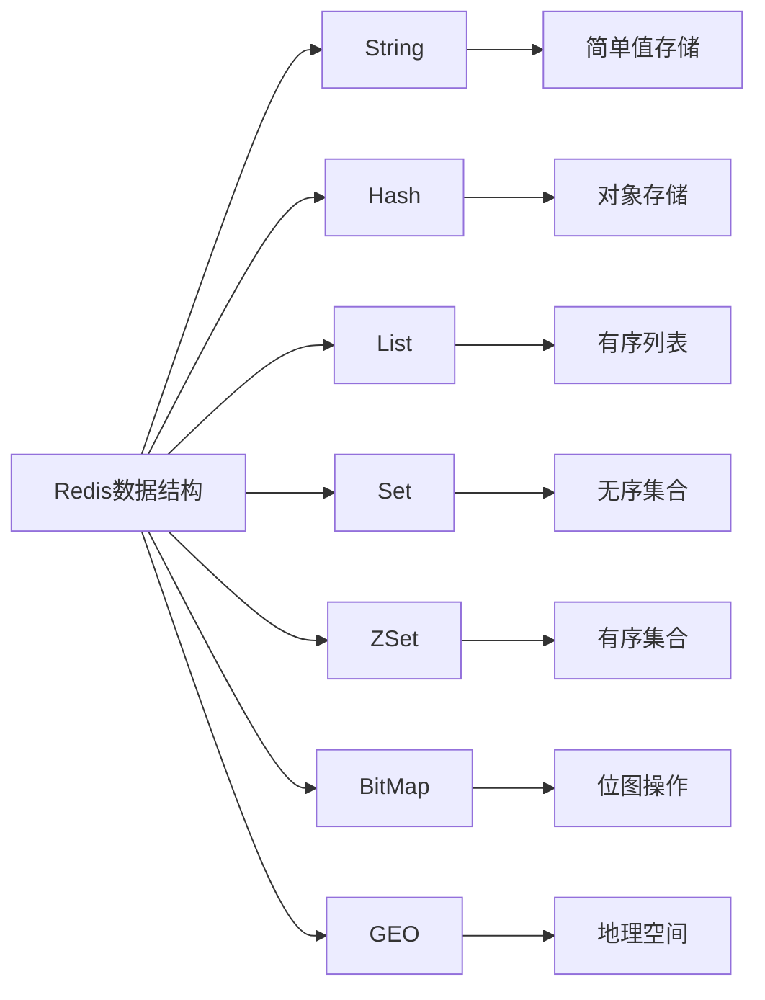

### 选择建议

1. **简单值存储**：使用 String
2. **对象/配置**：使用 Hash
3. **有序序列**：使用 List
4. **去重/关系运算**：使用 Set
5. **排序/排名**：使用 ZSet
6. **海量布尔值**：使用 BitMap
7. **地理位置**：使用 GEO

***

## 参考资料

1. [Redis 官方文档](https://redis.io/docs/data-types/)
2. [Redis 设计与实现](https://redisbook.readthedocs.io/)

