# Redis 的过期策略是怎样的

## 目录

1. [概述](#1-概述)
2. [过期时间设置](#2-过期时间设置)
3. [过期键判定](#3-过期键判定)
4. [过期删除策略](#4-过期删除策略)
5. [内存淘汰策略](#5-内存淘汰策略)
6. [过期策略与持久化](#6-过期策略与持久化)
7. [最佳实践](#7-最佳实践)

---

## 1. 概述

Redis 的过期策略分为两个层面：

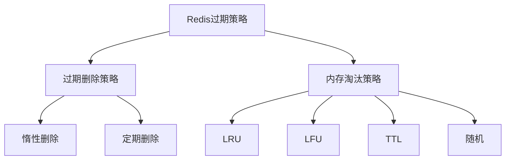

**过期删除策略**：处理已经过期的键
**内存淘汰策略**：当内存不足时，选择哪些键删除以释放内存

---

## 2. 过期时间设置

### 2.1 设置过期时间

```bash
# 设置键的过期时间（秒）
SET key value EX seconds

# 设置键的过期时间（毫秒）
SET key value PX milliseconds

# 设置过期时间戳（秒）
EXPIREAT key timestamp

# 设置过期时间戳（毫秒）
PEXPIREAT key milliseconds-timestamp

# 设置永不过期
PERSIST key

# 查看剩余过期时间（秒）
TTL key

# 查看剩余过期时间（毫秒）
PTTL key
```

### 2.2 过期时间的存储

Redis 在 `redisObject` 结构体中存储过期时间：

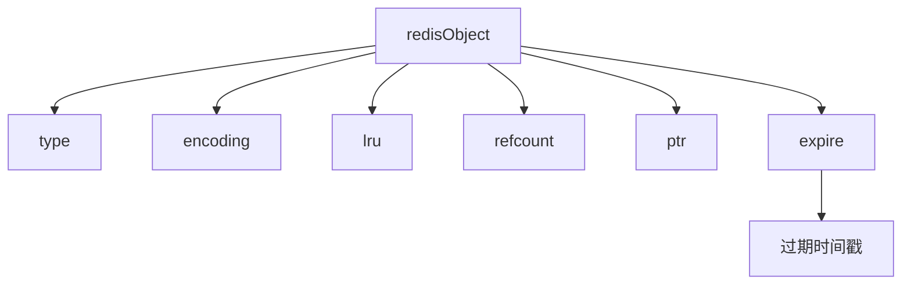

过期时间存储在独立的 **过期字典（expires dict）** 中，key 是指向键的指针，value 是过期时间戳。

---

## 3. 过期键判定

### 3.1 过期判定流程

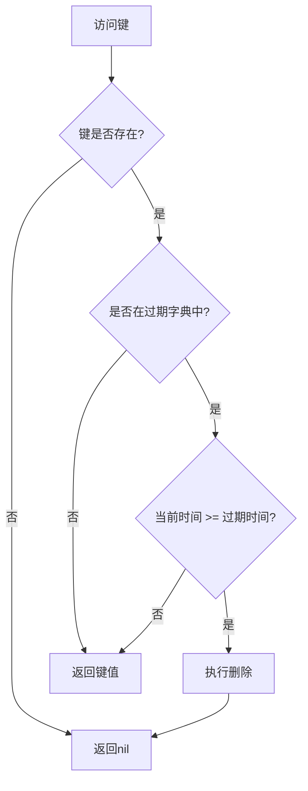

### 3.2 过期字典

过期字典是一个哈希表：

```mermaid
flowchart TD
DICT_A[expires dict] --> DICT_B[ht[0]]
DICT_A --> DICT_C[ht[1]]
DICT_A --> DICT_D[rehashidx]

DICT_B --> DICT_B1[table]
DICT_B1 --> DICT_B1a[key1指针]
DICT_B1a --> DICT_B1a1[value:过期时间戳]
DICT_B1 --> DICT_B1b[key2指针]
DICT_B1b --> DICT_B1b1[value:过期时间戳]
```

---

## 4. 过期删除策略

### 4.1 惰性删除（Lazy Deletion）

**原理**：只有在访问键时才检查是否过期，过期则删除。

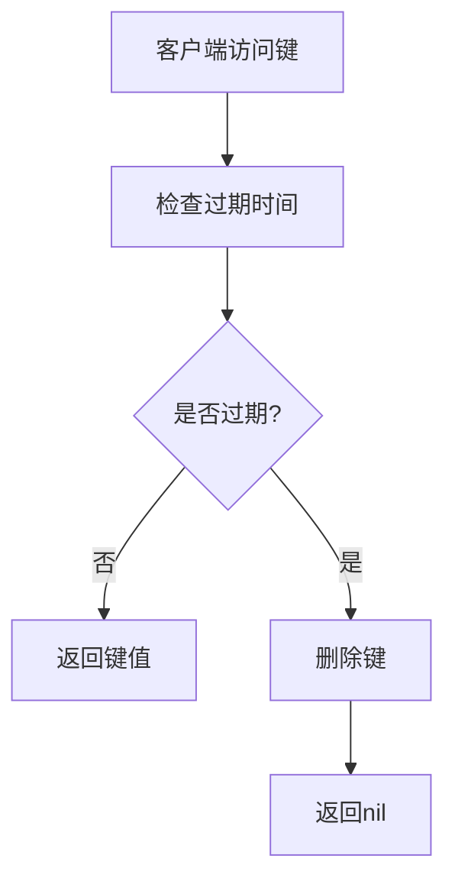

**优点**：
- CPU 友好，不占用额外资源
- 只在必要时执行删除

**缺点**：
- 内存不友好，过期键可能长时间占用内存
- 如果过期键永不被访问，会造成内存泄漏

### 4.2 定期删除（Periodic Deletion）

**原理**：Redis 定期（默认每 100ms）随机抽取一定数量的键检查并删除过期键。

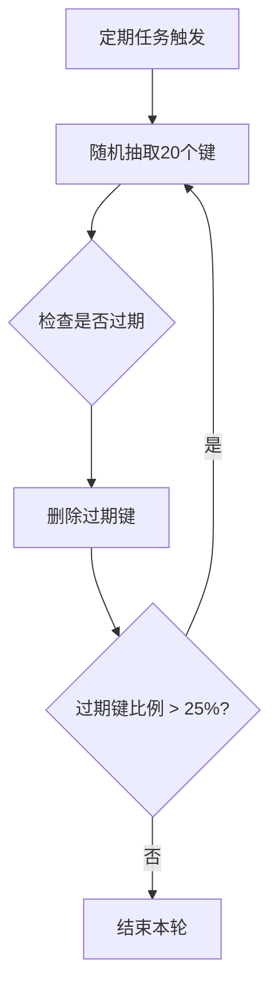

**执行流程**：

1. 从过期字典中随机抽取 20 个键
2. 删除其中过期的键
3. 如果过期键比例超过 25%，重复步骤 1
4. 单次执行时间不超过 25ms（避免阻塞）

**优点**：
- 主动清理过期键，释放内存
- 时间可控，不会长时间阻塞

**缺点**：
- 可能有遗漏，某些过期键未被抽取到
- 定期执行会消耗 CPU 资源

### 4.3 两种策略的结合

Redis 同时使用惰性删除和定期删除：

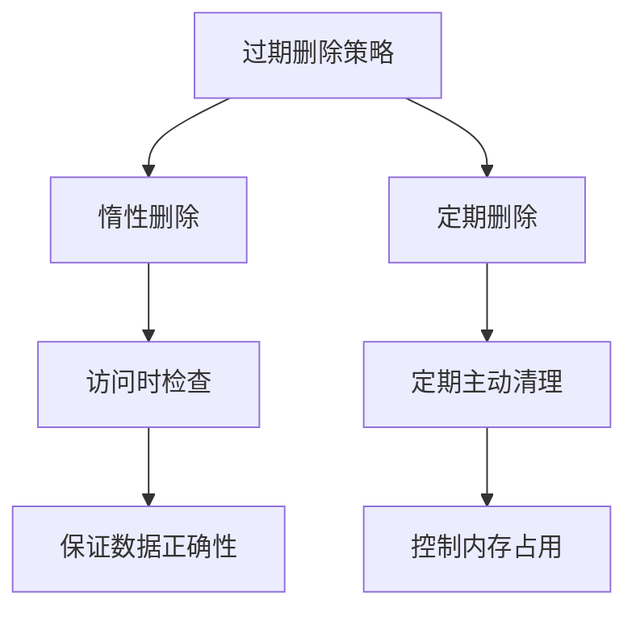

---

## 5. 内存淘汰策略

当 Redis 内存达到 `maxmemory` 限制时，触发内存淘汰策略。

### 5.1 可用策略

| 策略 | 说明 |
|------|------|
| **noeviction** | 默认策略，不删除键，写入操作返回错误 |
| **allkeys-lru** | 从所有键中选择最近最少使用的删除 |
| **allkeys-random** | 从所有键中随机选择删除 |
| **volatile-lru** | 从设置了过期时间的键中选择最近最少使用的删除 |
| **volatile-random** | 从设置了过期时间的键中随机选择删除 |
| **volatile-ttl** | 从设置了过期时间的键中选择过期时间最近的删除 |
| **allkeys-lfu** | 从所有键中选择最不常使用的删除（Redis 4.0+） |
| **volatile-lfu** | 从设置了过期时间的键中选择最不常使用的删除（Redis 4.0+） |

### 5.2 LRU 算法

**LRU（Least Recently Used）**：最近最少使用

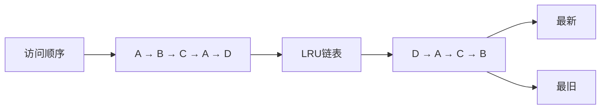

**Redis 的近似 LRU**：

Redis 不维护完整的 LRU 链表，而是使用 `redisObject` 中的 `lru` 字段记录访问时间，淘汰时随机抽取样本比较。

### 5.3 LFU 算法

**LFU（Least Frequently Used）**：最不常使用

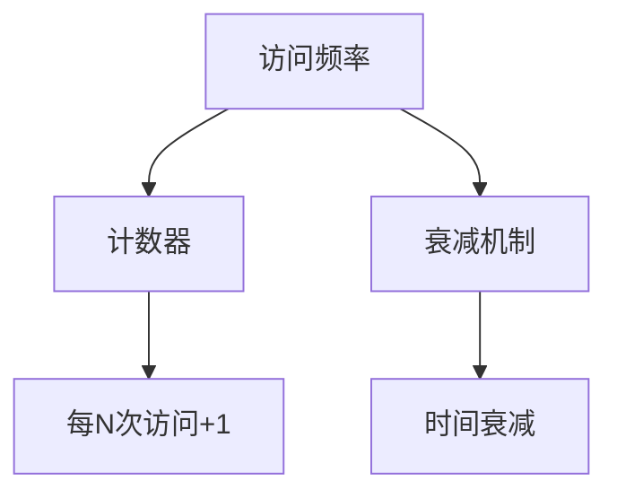

LFU 结合了访问频率和时间衰减，比 LRU 更精准。

### 5.4 策略选择建议

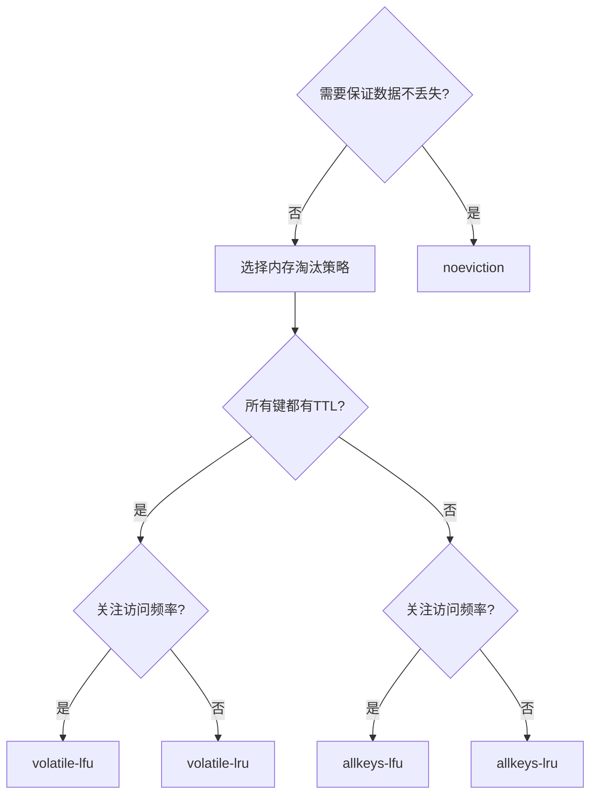

---

## 6. 过期策略与持久化

### 6.1 RDB 持久化

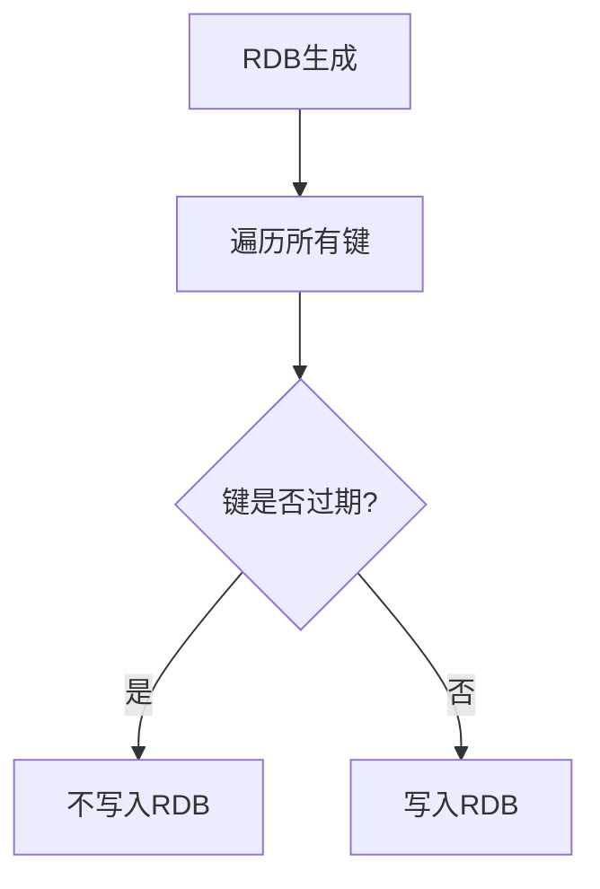

**特点**：过期键不会写入 RDB 文件，恢复时也不会加载过期键。

### 6.2 AOF 持久化

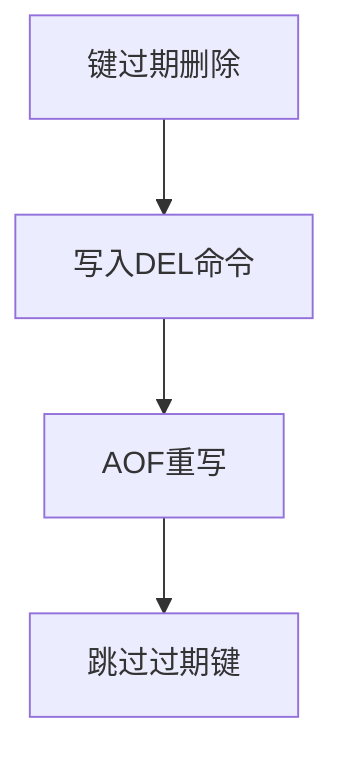

**特点**：
- 过期删除会记录到 AOF
- AOF 重写时会跳过过期键

### 6.3 主从同步

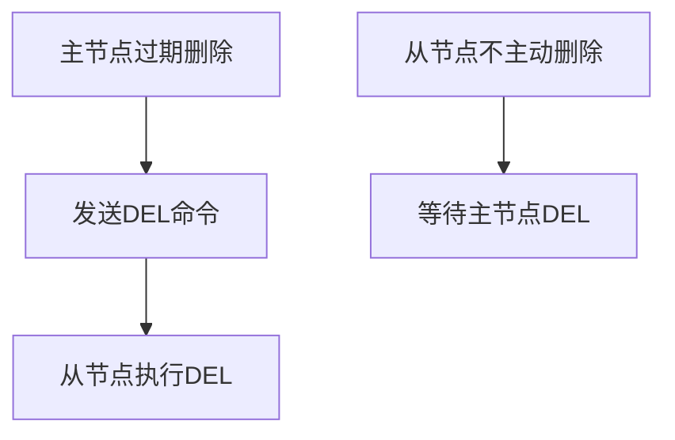

**特点**：从节点不主动删除过期键，只执行主节点发来的 DEL 命令。

---

## 7. 最佳实践

### 7.1 设置合理的过期时间

```java
// 场景1：缓存数据，设置较短过期时间
jedis.set("cache:user:1", userJson, "EX", 3600);

// 场景2：Session，设置中等过期时间
jedis.set("session:user:1", sessionId, "EX", 1800);

// 场景3：验证码，设置较短过期时间
jedis.set("captcha:13800138000", "1234", "EX", 120);
```

### 7.2 选择合适的内存淘汰策略

```bash
# 缓存场景：优先使用 LFU
maxmemory-policy allkeys-lfu

# 混合场景：只淘汰有过期时间的键
maxmemory-policy volatile-lru

# 数据安全优先：不淘汰
maxmemory-policy noeviction
```

### 7.3 监控过期键

```bash
# 查看过期键数量
info keyspace

# 查看内存使用
info memory

# 查看过期策略配置
config get maxmemory-policy
```

### 7.4 避免热点过期

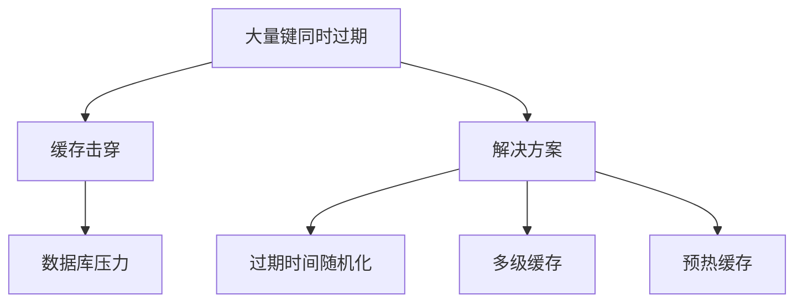

**解决方案**：给过期时间添加随机偏移量

```java
// 过期时间 = 基础时间 + 随机偏移
int baseExpire = 3600;
int randomOffset = ThreadLocalRandom.current().nextInt(600);
jedis.set(key, value, "EX", baseExpire + randomOffset);
```

---

## 总结

### Redis 过期策略要点

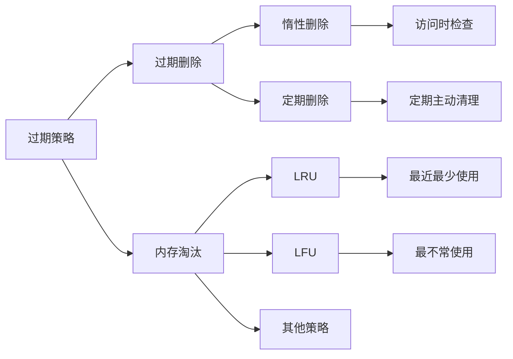

### 核心要点

1. **过期删除**：惰性删除 + 定期删除，兼顾 CPU 和内存
2. **内存淘汰**：根据业务场景选择合适策略（LFU > LRU）
3. **持久化**：RDB 和 AOF 都会过滤过期键
4. **主从同步**：从节点不主动删除，依赖主节点同步

---

## 参考资料

1. [Redis 官方文档 - Expires](https://redis.io/docs/commands/expire/)
2. [Redis 设计与实现](https://redisbook.readthedocs.io/)
