# 基于 ZSet 做排行榜更新

## 目录

1. [ZSet 数据结构基础](#1-zset-数据结构基础)
2. [排行榜核心功能实现](#2-排行榜核心功能实现)
3. [实时更新机制](#3-实时更新机制)
4. [数据同步与持久化](#4-数据同步与持久化)
5. [最佳实践与性能优化](#5-最佳实践与性能优化)

***

## 1. ZSet 数据结构基础

### 1.1 ZSet 概述

ZSet（Sorted Set）是 Redis 提供的有序集合数据结构，每个元素都关联一个分数（score），Redis 会根据分数自动排序。

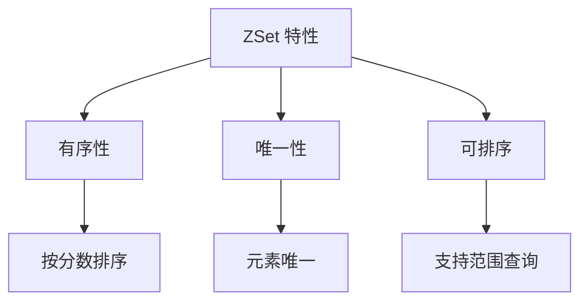

### 1.2 ZSet 内部结构

ZSet 底层使用两种数据结构实现：

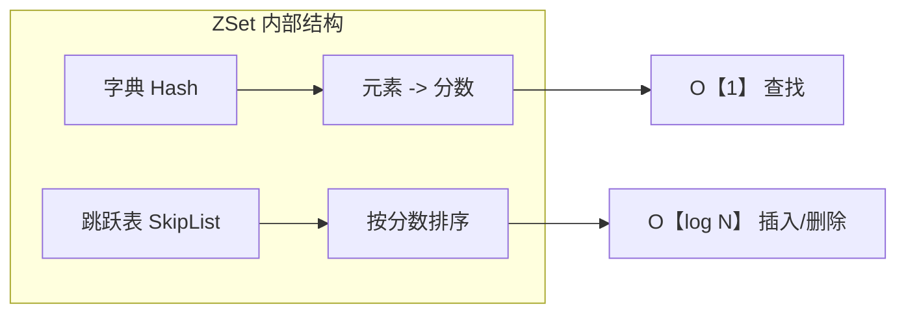

### 1.3 ZSet 核心特点

| 特点           | 说明             |
| ------------ | -------------- |
| **有序性**      | 元素按分数排序存储      |
| **唯一性**      | 每个元素只出现一次      |
| **O(log N)** | 插入、删除、查询的时间复杂度 |
| **范围查询**     | 支持按分数范围或排名范围查询 |
| **分数可重复**    | 不同元素可以有相同分数    |

### 1.4 为什么 ZSet 适合做排行榜

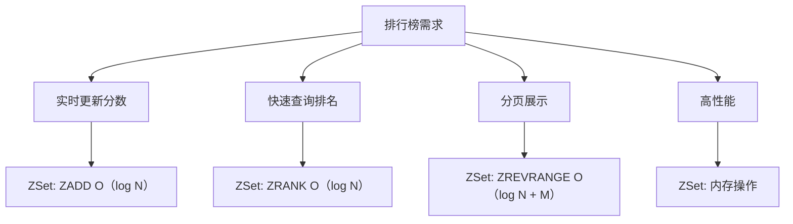

***

## 2. 排行榜核心功能实现

### 2.1 基础操作命令

#### 添加/更新分数

```bash
# 添加或更新元素分数
ZADD leaderboard 1000 user:1
ZADD leaderboard 950 user:2 880 user:3

# 增加分数
ZINCRBY leaderboard 50 user:1
```

#### 查询排名

```bash
# 获取用户排名（从0开始，升序）
ZRANK leaderboard user:1

# 获取用户排名（从0开始，降序）
ZREVRANK leaderboard user:1

# 获取用户分数
ZSCORE leaderboard user:1
```

#### 分页查询

```bash
# 获取前三名（降序）
ZREVRANGE leaderboard 0 2 WITHSCORES

# 获取第4-6名（降序）
ZREVRANGE leaderboard 3 5 WITHSCORES

# 获取分数范围（800-900）
ZRANGEBYSCORE leaderboard 800 900 WITHSCORES
```

### 2.2 Java 代码示例

#### 初始化连接

```java
// 使用 Jedis 客户端
Jedis jedis = new Jedis("localhost", 6379);

// 使用 Redisson 客户端
Config config = new Config();
config.useSingleServer().setAddress("redis://localhost:6379");
RedissonClient redisson = Redisson.create(config);
```

#### 添加/更新分数

```java
public void updateScore(String key, String member, double score) {
    // 方式1: 直接设置分数
    jedis.zadd(key, score, member);
    
    // 方式2: 增加分数
    jedis.zincrby(key, 50, member);
}
```

#### 查询排名

```java
public Long getRank(String key, String member) {
    // 降序排名（第一名是0）
    Long rank = jedis.zrevrank(key, member);
    if (rank != null) {
        return rank + 1; // 转换为从1开始
    }
    return null;
}
```

#### 分页查询

```java
public List<Map.Entry<String, Double>> getTopN(String key, int start, int end) {
    Set<Tuple> tuples = jedis.zrevrangeWithScores(key, start, end);
    List<Map.Entry<String, Double>> result = new ArrayList<>();
    
    for (Tuple tuple : tuples) {
        result.add(new AbstractMap.SimpleEntry<>(
            tuple.getElement(), 
            tuple.getScore()
        ));
    }
    return result;
}
```

### 2.3 完整排行榜服务示例

```java
public class LeaderboardService {
    
    private static final String LEADERBOARD_KEY = "game:leaderboard";
    private Jedis jedis;
    
    public LeaderboardService(Jedis jedis) {
        this.jedis = jedis;
    }
    
    // 更新分数
    public void updateScore(String userId, double score) {
        jedis.zadd(LEADERBOARD_KEY, score, userId);
    }
    
    // 增加分数
    public void incrementScore(String userId, double increment) {
        jedis.zincrby(LEADERBOARD_KEY, increment, userId);
    }
    
    // 获取排名
    public Long getRank(String userId) {
        Long rank = jedis.zrevrank(LEADERBOARD_KEY, userId);
        return rank != null ? rank + 1 : null;
    }
    
    // 获取分数
    public Double getScore(String userId) {
        return jedis.zscore(LEADERBOARD_KEY, userId);
    }
    
    // 获取前N名
    public List<Map.Entry<String, Double>> getTopN(int n) {
        return getTopN(0, n - 1);
    }
    
    // 获取指定范围
    public List<Map.Entry<String, Double>> getTopN(int start, int end) {
        Set<Tuple> tuples = jedis.zrevrangeWithScores(LEADERBOARD_KEY, start, end);
        List<Map.Entry<String, Double>> result = new ArrayList<>();
        
        for (Tuple tuple : tuples) {
            result.add(new AbstractMap.SimpleEntry<>(
                tuple.getElement(), 
                tuple.getScore()
            ));
        }
        return result;
    }
    
    // 获取用户周围的排名
    public List<Map.Entry<String, Double>> getAroundUser(String userId, int count) {
        Long rank = jedis.zrevrank(LEADERBOARD_KEY, userId);
        if (rank == null) {
            return Collections.emptyList();
        }
        
        int start = Math.max(0, rank.intValue() - count);
        int end = rank.intValue() + count;
        return getTopN(start, end);
    }
}
```

***

## 3. 实时更新机制

### 3.1 更新策略对比

| 策略       | 适用场景    | 优点     | 缺点      |
| -------- | ------- | ------ | ------- |
| **同步更新** | 实时性要求高  | 数据实时一致 | 影响主业务性能 |
| **异步更新** | 实时性要求不高 | 不影响主业务 | 数据有延迟   |
| **批量更新** | 高并发写入   | 减少网络开销 | 数据延迟更大  |

### 3.2 同步更新

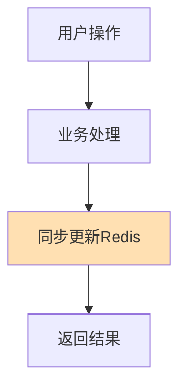

```java
// 同步更新示例
public void handleUserAction(String userId, double score) {
    // 业务处理
    processBusiness(userId);
    
    // 同步更新排行榜
    jedis.zadd(LEADERBOARD_KEY, score, userId);
}
```

### 3.3 异步更新

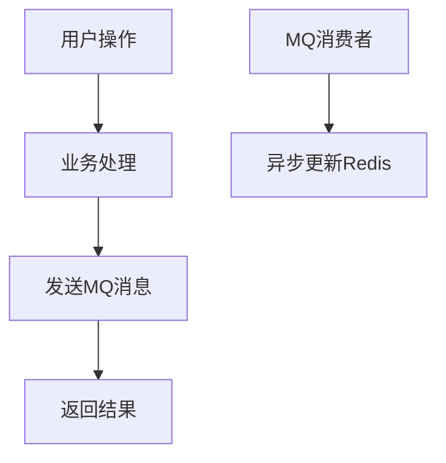

```java
// 发送消息
public void handleUserActionAsync(String userId, double score) {
    processBusiness(userId);
    
    // 发送到消息队列
    rabbitTemplate.convertAndSend("leaderboard.update", 
        new ScoreUpdateEvent(userId, score));
}

// 消费消息
@RabbitListener(queues = "leaderboard.update")
public void updateLeaderboard(ScoreUpdateEvent event) {
    jedis.zadd(LEADERBOARD_KEY, event.getScore(), event.getUserId());
}
```

### 3.4 批量更新

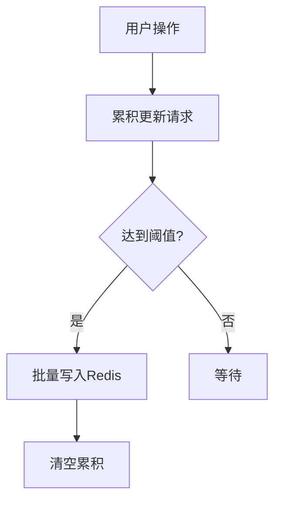

```java
public class BatchUpdateService {
    
    private Map<String, Double> pendingUpdates = new ConcurrentHashMap<>();
    private static final int BATCH_SIZE = 100;
    
    public void addUpdate(String userId, double score) {
        pendingUpdates.put(userId, score);
        
        if (pendingUpdates.size() >= BATCH_SIZE) {
            flushUpdates();
        }
    }
    
    private void flushUpdates() {
        Map<String, Double> updates = new HashMap<>(pendingUpdates);
        pendingUpdates.clear();
        
        // 批量写入
        ZParams params = new ZParams();
        Pipeline pipeline = jedis.pipelined();
        
        for (Map.Entry<String, Double> entry : updates.entrySet()) {
            pipeline.zadd(LEADERBOARD_KEY, entry.getValue(), entry.getKey());
        }
        
        pipeline.sync();
    }
}
```

***

## 4. 数据同步与持久化

### 4.1 数据同步策略

#### 方案一：双写模式

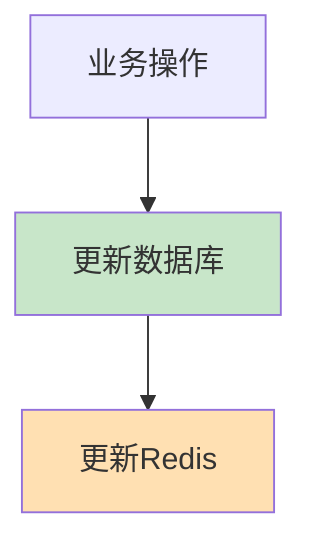

#### 方案二：MQ 异步同步

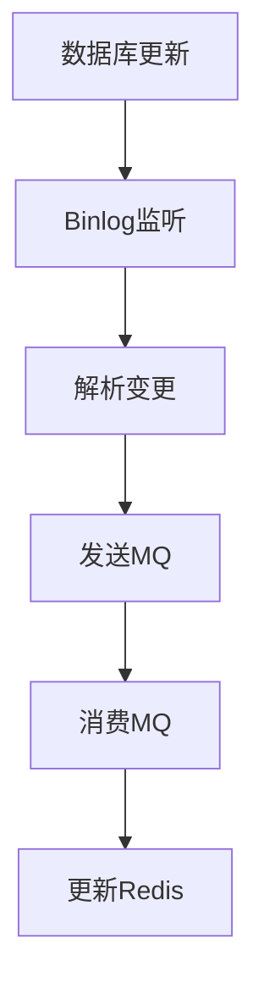

#### 方案三：定时同步

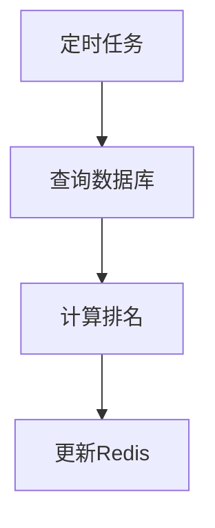

### 4.2 持久化方案

#### Redis 持久化配置

```bash
# RDB 快照持久化
save 60 10000

# AOF 日志持久化
appendonly yes
appendfsync everysec
```

#### 数据备份策略

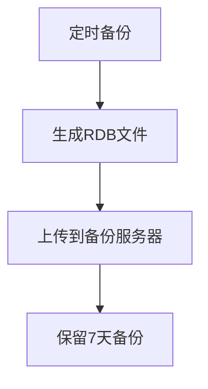

### 4.3 故障恢复

```java
public class RecoveryService {
    
    public void recoverFromDB() {
        // 从数据库读取所有用户分数
        List<UserScore> scores = userScoreRepository.findAll();
        
        // 清空旧数据
        jedis.del(LEADERBOARD_KEY);
        
        // 批量写入
        Pipeline pipeline = jedis.pipelined();
        for (UserScore score : scores) {
            pipeline.zadd(LEADERBOARD_KEY, score.getScore(), score.getUserId());
        }
        pipeline.sync();
    }
}
```

***

## 5. 最佳实践与性能优化

### 5.1 数据结构优化

#### 分桶策略

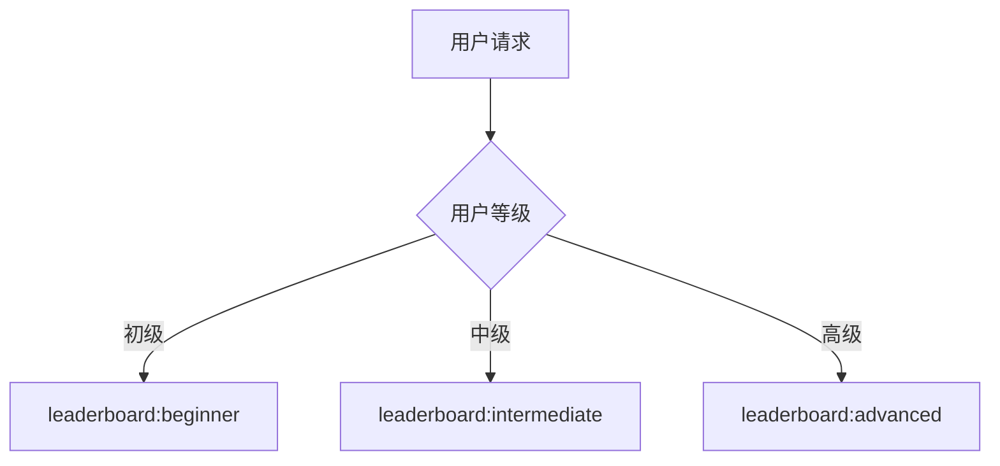

#### 时间维度分桶

```java
// 每日排行榜
String key = "leaderboard:" + LocalDate.now().format(DateTimeFormatter.BASIC_ISO_DATE);
```

### 5.2 查询优化

#### 缓存热点数据

```java
public class CachedLeaderboardService {
    
    private static final int CACHE_TTL = 60; // 60秒
    private Map<String, Object> cache = new ConcurrentHashMap<>();
    
    public List<Map.Entry<String, Double>> getTop100() {
        String cacheKey = "top100";
        Object cached = cache.get(cacheKey);
        
        if (cached != null) {
            return (List<Map.Entry<String, Double>>) cached;
        }
        
        List<Map.Entry<String, Double>> result = getTopN(100);
        cache.put(cacheKey, result);
        
        // 定时清理缓存
        scheduledExecutorService.schedule(() -> {
            cache.remove(cacheKey);
        }, CACHE_TTL, TimeUnit.SECONDS);
        
        return result;
    }
}
```

### 5.3 高并发优化

#### 使用 Pipeline

```java
public void batchUpdate(Map<String, Double> updates) {
    Pipeline pipeline = jedis.pipelined();
    for (Map.Entry<String, Double> entry : updates.entrySet()) {
        pipeline.zadd(LEADERBOARD_KEY, entry.getValue(), entry.getKey());
    }
    pipeline.sync();
}
```

#### 使用 Lua 脚本

```lua
-- 批量更新分数并返回排名
local key = KEYS[1]
local result = {}

for i = 1, #ARGV, 2 do
    local member = ARGV[i]
    local score = tonumber(ARGV[i+1])
    
    redis.call('ZADD', key, score, member)
    local rank = redis.call('ZREVRANK', key, member)
    
    table.insert(result, member)
    table.insert(result, tostring(rank + 1))
end

return result
```

### 5.4 内存优化

#### 设置过期时间

```java
// 保留最近7天的数据
String key = "leaderboard:" + date;
jedis.expire(key, 7 * 24 * 60 * 60);
```

#### 定期清理低频用户

```lua
-- 删除分数低于阈值的用户
local key = KEYS[1]
local minScore = tonumber(ARGV[1])
redis.call('ZREMRANGEBYSCORE', key, '-inf', minScore)
```

### 5.5 监控与告警

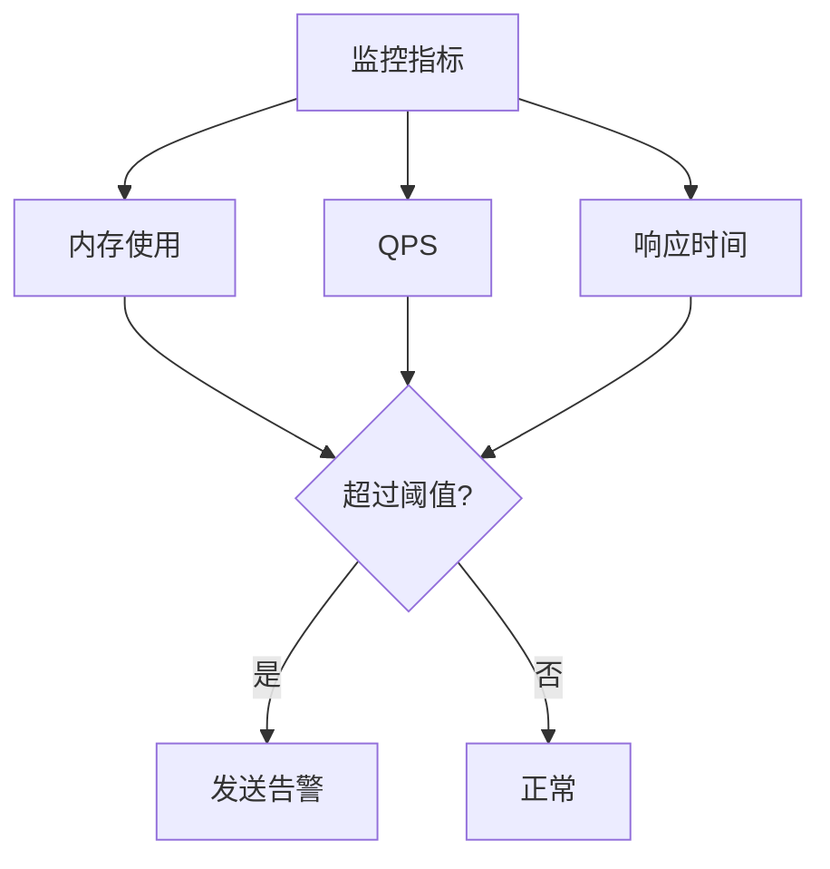

***

## 总结

### ZSet 排行榜核心要点

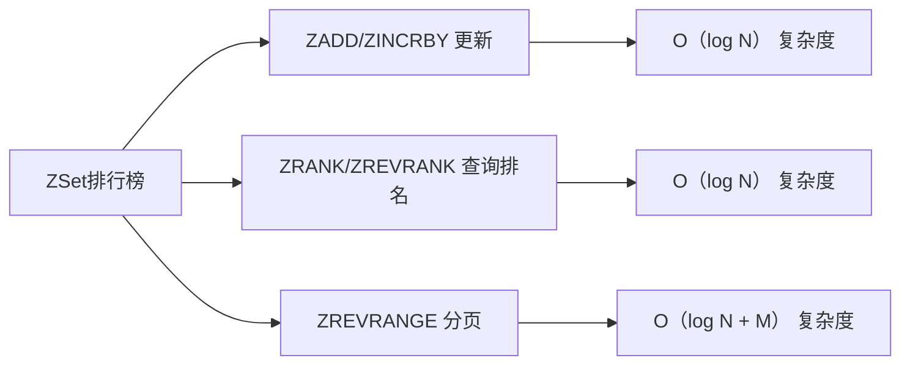

### 选择合适的更新策略

| 场景     | 推荐策略        |
| ------ | ----------- |
| 实时性要求高 | 同步更新        |
| 高并发写入  | 异步更新 + 批量写入 |
| 定时排行榜  | 定时任务同步      |

### 性能优化总结

1. **使用 Pipeline 减少网络往返**
2. **使用 Lua 脚本保证原子性**
3. **分桶策略减少单 Key 压力**
4. **缓存热点数据**
5. **定期清理无效数据**

***

## 参考资料

1. [Redis 官方文档 - ZSet](https://redis.io/docs/data-types/sorted-sets/)
2. [Redis 设计与实现](https://redis.io/topics/internals)

