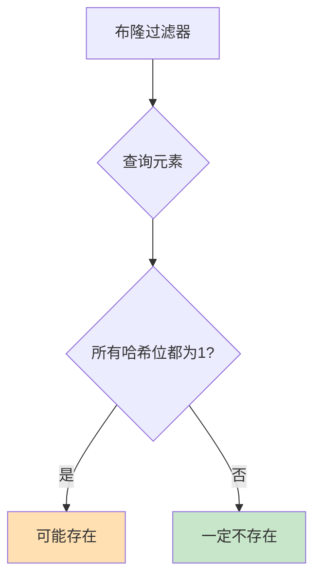
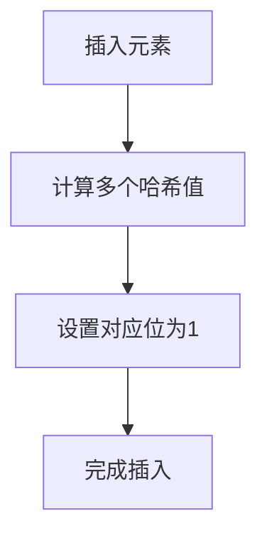
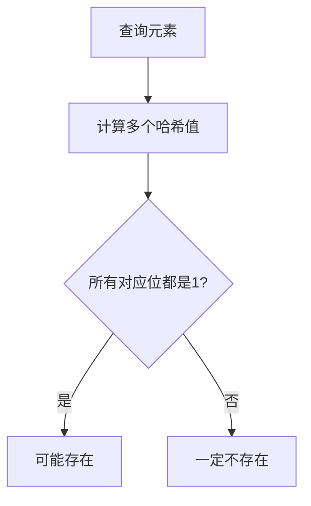
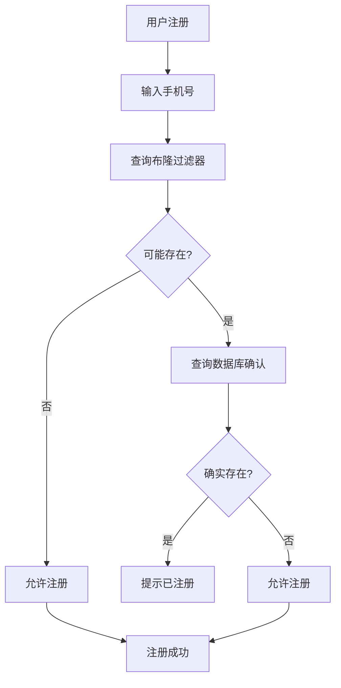
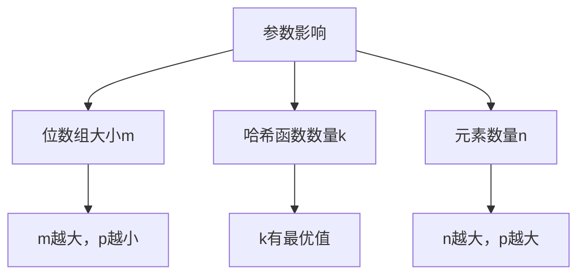
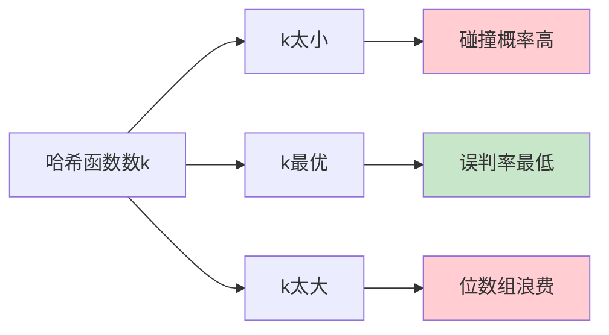
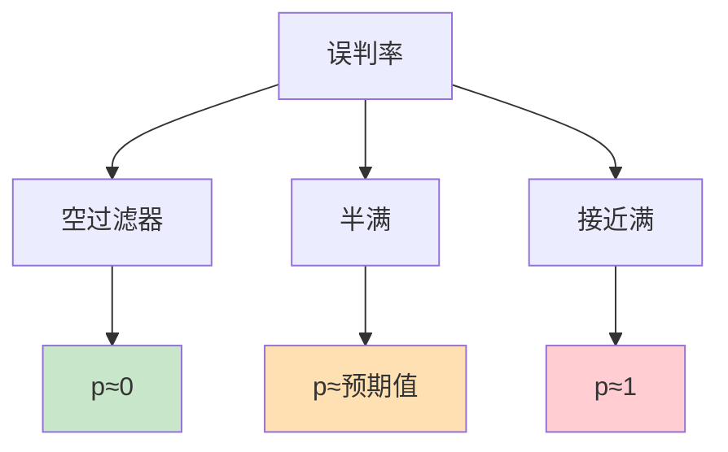
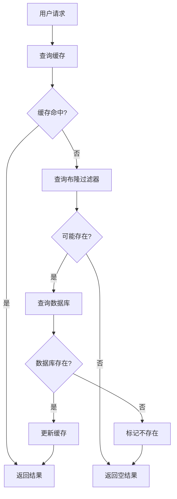
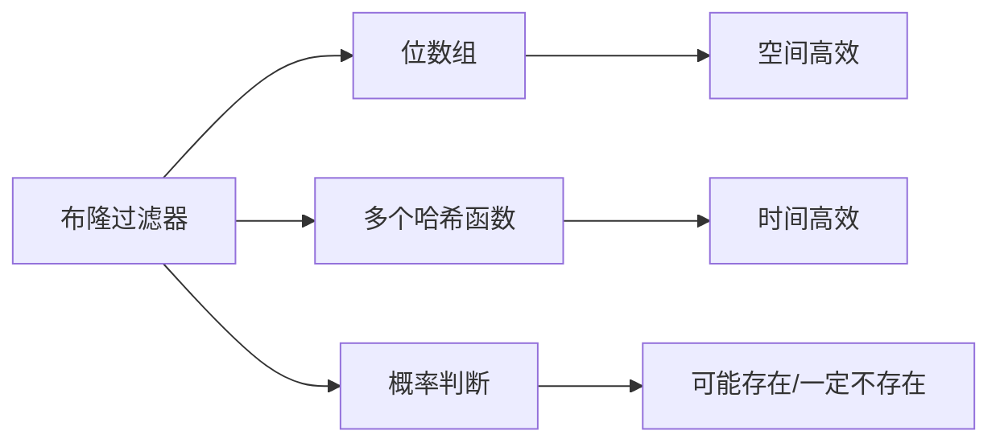
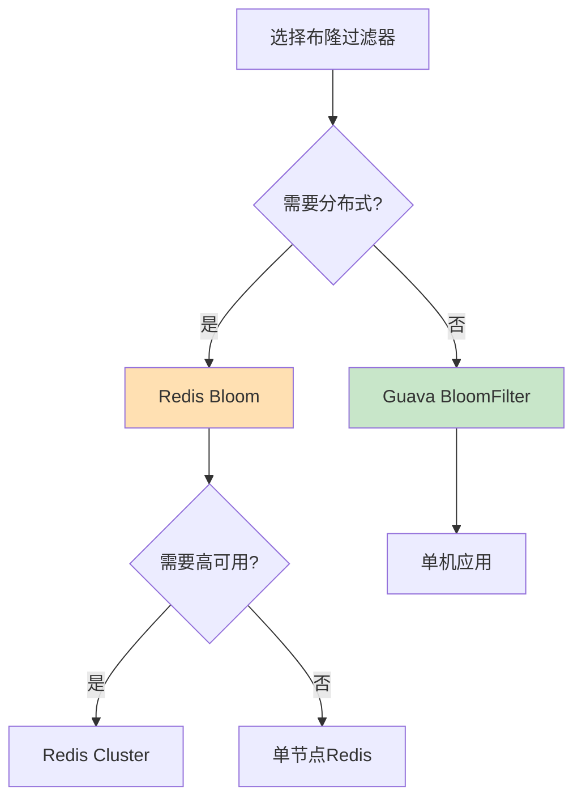

# 布隆过滤器

## 目录

1. [布隆过滤器原理](#1-布隆过滤器原理)
2. [哈希函数与位数组设计](#2-哈希函数与位数组设计)
3. [手机号注册查询示例](#3-手机号注册查询示例)
4. [误判率分析](#4-误判率分析)
5. [应用场景与最佳实践](#5-应用场景与最佳实践)

---

## 1. 布隆过滤器原理

### 1.1 什么是布隆过滤器

布隆过滤器（Bloom Filter）是一种空间高效的概率数据结构，用于判断元素是否存在于集合中。



### 1.2 核心特点

| 特点 | 说明 |
|------|------|
| **空间高效** | 使用位数组存储，占用空间小 |
| **时间高效** | 插入和查询都是 O(k)，k 为哈希函数数量 |
| **概率性** | 存在误判（False Positive），但不会漏判 |
| **不可逆** | 删除元素困难，通常不支持删除 |

### 1.3 工作原理

#### 插入流程



#### 查询流程



### 1.4 数据结构示意图

```mermaid
flowchart LR
    subgraph BF4_A[位数组]
        BF4_B[0] --> BF4_C[1] --> BF4_D[0] --> BF4_E[1] --> BF4_F[0] --> BF4_G[1] --> BF4_H[0] --> BF4_I[0]
    end
    
    BF4_J[元素"13812345678"] --> BF4_K[hash1=1]
    BF4_J --> BF4_L[hash2=3]
    BF4_J --> BF4_M[hash3=5]
    
    BF4_K --> BF4_C
    BF4_L --> BF4_E
    BF4_M --> BF4_G
```

---

## 2. 哈希函数与位数组设计

### 2.1 哈希函数选择原则

| 原则 | 说明 |
|------|------|
| **独立性** | 多个哈希函数相互独立 |
| **均匀性** | 哈希值均匀分布 |
| **高效性** | 计算速度快 |
| **低碰撞** | 减少哈希碰撞概率 |

### 2.2 常用哈希函数

```java
public class HashFunctions {
    
    // 基于 BKDRHash
    public static long hash1(String key) {
        long hash = 0;
        for (char c : key.toCharArray()) {
            hash = hash * 131 + c;
        }
        return Math.abs(hash);
    }
    
    // 基于 SDBMHash
    public static long hash2(String key) {
        long hash = 0;
        for (char c : key.toCharArray()) {
            hash = hash * 65599 + c;
        }
        return Math.abs(hash);
    }
    
    // 基于 DJBHash
    public static long hash3(String key) {
        long hash = 5381;
        for (char c : key.toCharArray()) {
            hash = (hash << 5) + hash + c;
        }
        return Math.abs(hash);
    }
}
```

### 2.3 位数组大小计算

```
m = -n * ln(p) / (ln(2))^2
```

其中：
- `m`: 位数组大小（bit）
- `n`: 预计元素数量
- `p`: 期望误判率

### 2.4 哈希函数数量计算

```
k = (m / n) * ln(2)
```

### 2.5 参数选择示例

| 预计元素数(n) | 期望误判率(p) | 位数组大小(m) | 哈希函数数(k) |
|-------------|-------------|--------------|--------------|
| 100万 | 0.01 | 9.58MB | 7 |
| 100万 | 0.001 | 14.37MB | 10 |
| 1000万 | 0.01 | 95.8MB | 7 |
| 1000万 | 0.001 | 143.7MB | 10 |

---

## 3. 手机号注册查询示例

### 3.1 场景描述

判断手机号是否已注册，用于：
- 注册时提示"该手机号已注册"
- 登录时快速判断手机号是否存在
- 防止缓存穿透攻击



### 3.2 Java 实现示例

```java
public class BloomFilter {
    
    private final BitSet bitSet;
    private final int size;
    private final int hashCount;
    
    // 构造函数
    public BloomFilter(int expectedSize, double falsePositiveRate) {
        this.size = calculateSize(expectedSize, falsePositiveRate);
        this.hashCount = calculateHashCount(this.size, expectedSize);
        this.bitSet = new BitSet(this.size);
    }
    
    // 计算位数组大小
    private int calculateSize(int n, double p) {
        return (int) (-n * Math.log(p) / Math.pow(Math.log(2), 2));
    }
    
    // 计算哈希函数数量
    private int calculateHashCount(int m, int n) {
        return (int) (m / n * Math.log(2));
    }
    
    // 插入元素
    public void add(String key) {
        for (int i = 0; i < hashCount; i++) {
            long hash = hash(key, i);
            int index = (int) (hash % size);
            bitSet.set(index);
        }
    }
    
    // 查询元素
    public boolean contains(String key) {
        for (int i = 0; i < hashCount; i++) {
            long hash = hash(key, i);
            int index = (int) (hash % size);
            if (!bitSet.get(index)) {
                return false;
            }
        }
        return true;
    }
    
    // 复合哈希函数
    private long hash(String key, int seed) {
        long hash = seed;
        for (char c : key.toCharArray()) {
            hash = hash * 13131 + c;
        }
        return Math.abs(hash);
    }
}
```

### 3.3 手机号注册服务示例

```java
public class PhoneRegisterService {
    
    private final BloomFilter bloomFilter;
    private final PhoneRepository phoneRepository;
    
    public PhoneRegisterService() {
        // 预计1000万手机号，误判率0.001
        this.bloomFilter = new BloomFilter(10_000_000, 0.001);
        this.phoneRepository = new PhoneRepository();
        
        // 初始化：从数据库加载已注册手机号
        initBloomFilter();
    }
    
    private void initBloomFilter() {
        List<String> registeredPhones = phoneRepository.getAllRegisteredPhones();
        for (String phone : registeredPhones) {
            bloomFilter.add(phone);
        }
    }
    
    // 检查手机号是否已注册
    public boolean isRegistered(String phone) {
        // 先查询布隆过滤器
        if (!bloomFilter.contains(phone)) {
            return false; // 一定不存在
        }
        
        // 布隆过滤器返回可能存在，需要查询数据库确认
        return phoneRepository.exists(phone);
    }
    
    // 注册新手机号
    public boolean register(String phone) {
        if (isRegistered(phone)) {
            return false;
        }
        
        // 添加到数据库
        phoneRepository.save(phone);
        
        // 添加到布隆过滤器
        bloomFilter.add(phone);
        
        return true;
    }
}
```

### 3.4 Redis 实现示例

```java
public class RedisBloomFilter {
    
    private static final String REDIS_KEY = "bloom:phone_register";
    private final Jedis jedis;
    
    public RedisBloomFilter(Jedis jedis) {
        this.jedis = jedis;
    }
    
    // 添加手机号
    public void add(String phone) {
        // 使用 Redis 的 BITFIELD 命令
        long[] hashes = calculateHashes(phone);
        for (long hash : hashes) {
            jedis.setbit(REDIS_KEY, hash, true);
        }
    }
    
    // 查询手机号
    public boolean contains(String phone) {
        long[] hashes = calculateHashes(phone);
        for (long hash : hashes) {
            if (!jedis.getbit(REDIS_KEY, hash)) {
                return false;
            }
        }
        return true;
    }
    
    private long[] calculateHashes(String key) {
        // 使用多个哈希函数
        return new long[]{
            HashFunctions.hash1(key) % 100000000,
            HashFunctions.hash2(key) % 100000000,
            HashFunctions.hash3(key) % 100000000
        };
    }
}
```

---

## 4. 误判率分析

### 4.1 误判率计算公式

```
p = (1 - e^(-kn/m))^k
```

其中：
- `p`: 误判率
- `k`: 哈希函数数量
- `n`: 已插入元素数量
- `m`: 位数组大小（bit）

### 4.2 参数影响分析



### 4.3 最优哈希函数数量



### 4.4 误判率曲线



---

## 5. 应用场景与最佳实践

### 5.1 常见应用场景

| 场景 | 说明 |
|------|------|
| **缓存穿透** | 防止查询不存在的数据穿透到数据库 |
| **黑名单过滤** | 快速判断IP/手机号是否在黑名单 |
| **去重** | 判断URL/内容是否已处理过 |
| **推荐系统** | 判断用户是否已看过某内容 |
| **网络爬虫** | 判断URL是否已爬取 |

### 5.2 缓存穿透防护



### 5.3 使用注意事项

| 注意事项 | 说明 |
|----------|------|
| **不支持删除** | 位数组只能设置为1，无法重置为0 |
| **误判处理** | 布隆过滤器返回存在时，需要进一步确认 |
| **数据同步** | 布隆过滤器需要与数据源同步 |
| **参数选择** | 根据预期数据量和误判率选择合适参数 |
| **定期重建** | 当过滤器接近满时，需要重建 |

### 5.4 最佳实践建议

```java
// 使用 Guava 的布隆过滤器
import com.google.common.hash.BloomFilter;
import com.google.common.hash.Funnels;

public class BestPractice {
    
    public static void main(String[] args) {
        // 创建布隆过滤器
        BloomFilter<String> bloomFilter = BloomFilter.create(
            Funnels.stringFunnel(StandardCharsets.UTF_8),
            10_000_000,  // 预计1000万元素
            0.001        // 误判率0.001
        );
        
        // 添加元素
        bloomFilter.put("13812345678");
        
        // 查询元素
        boolean mightContain = bloomFilter.mightContain("13812345678");
        
        // 注意：返回true只是可能存在，需要进一步确认
        if (mightContain) {
            // 查询数据库确认
        }
    }
}
```

### 5.5 Redis Bloom 模块

```bash
# 使用 Redis Bloom 模块
bf.add phone_register 13812345678
bf.exists phone_register 13812345678

# 设置过滤器参数
bf.reserve phone_register 0.001 10000000
```

---

## 总结

### 布隆过滤器核心要点



### 适用场景总结

| 场景 | 是否适合 | 原因 |
|------|---------|------|
| **大量数据去重** | 适合 | 空间效率高 |
| **缓存穿透防护** | 适合 | 快速过滤不存在数据 |
| **精确查询** | 不适合 | 存在误判 |
| **需要删除** | 不适合 | 不支持删除 |

### 选型建议



---

## 参考资料

1. [Guava BloomFilter](https://github.com/google/guava)
2. [Redis Bloom](https://redis.io/docs/data-types/probabilistic/bloom-filter/)
3. [Bloom Filter Wikipedia](https://en.wikipedia.org/wiki/Bloom_filter)
