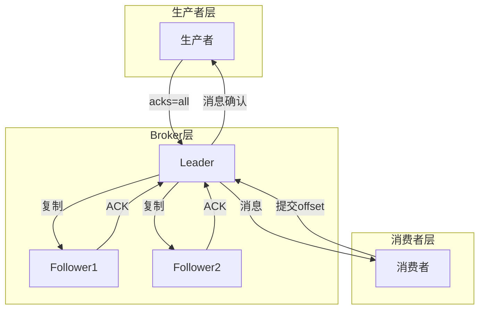
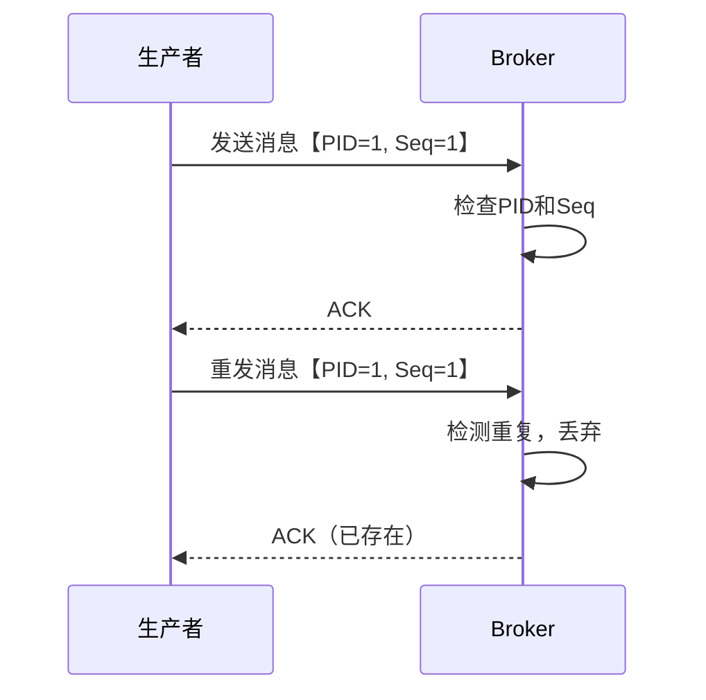
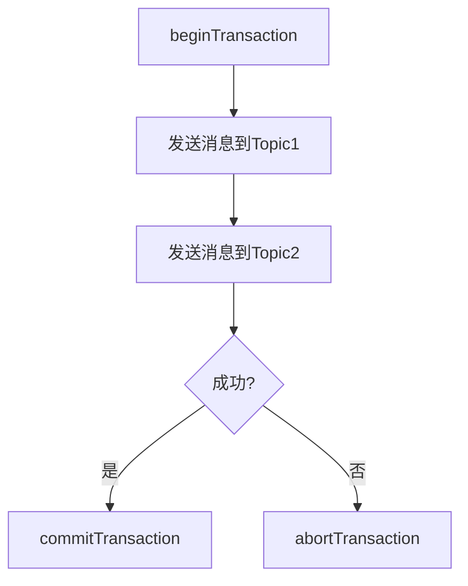
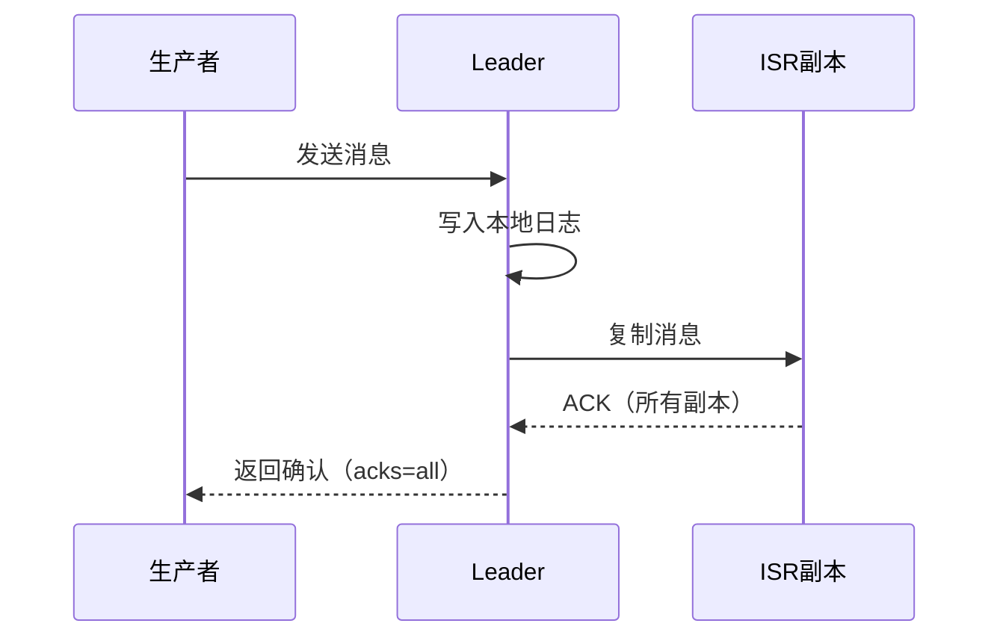
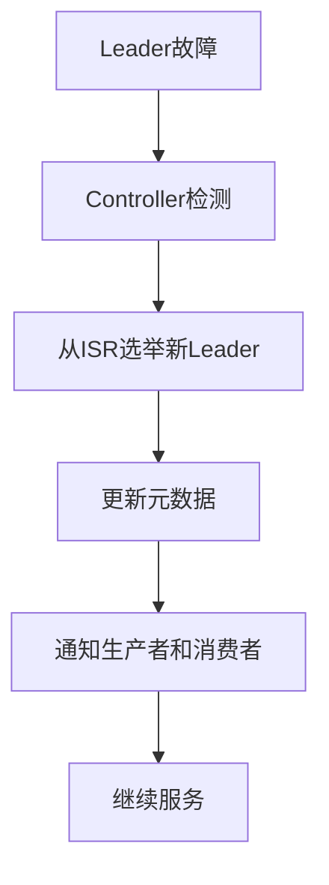
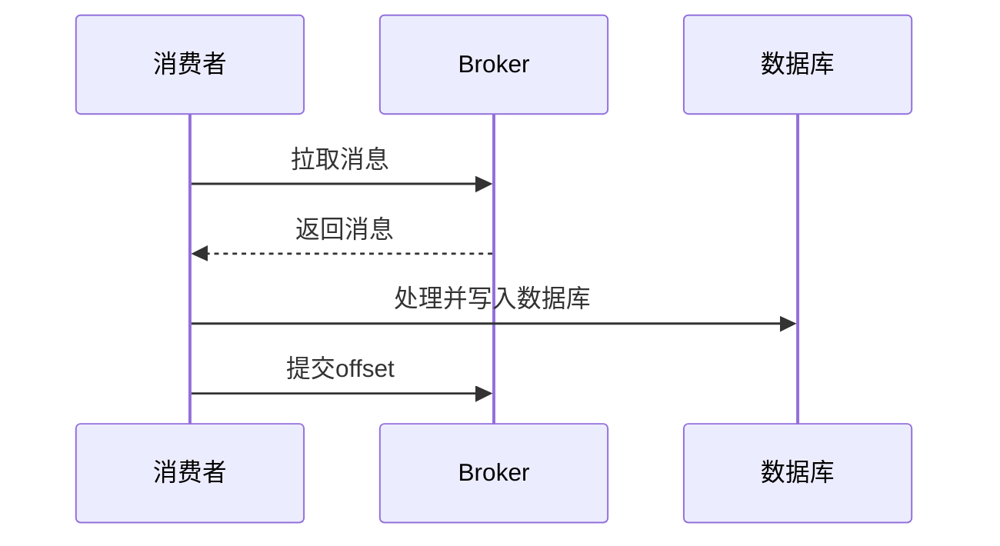
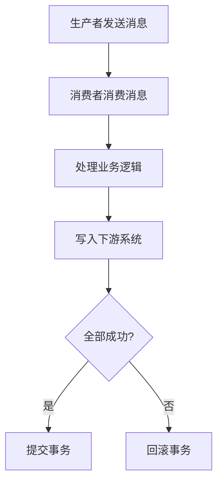
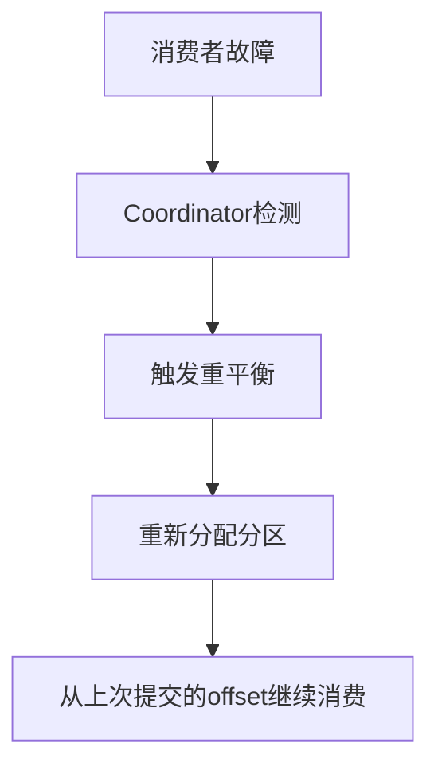
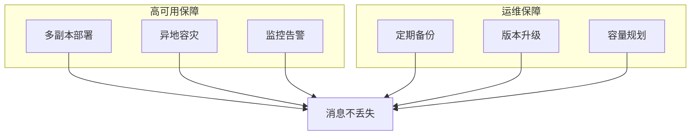
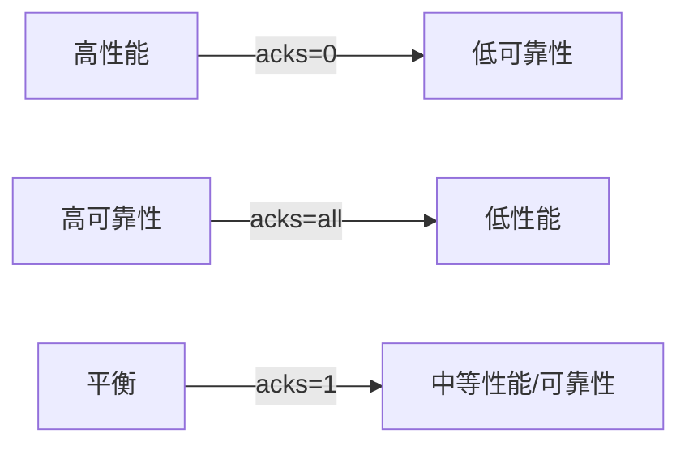

# Kafka 如何保证消息不丢失

## 一、概述

在分布式系统中，消息丢失是一个常见且严重的问题。Kafka 通过多层机制来保证消息的可靠性，主要分为三个层面：

1. **生产者层面**：确保消息成功发送到 Broker
2. **Broker 层面**：确保消息持久化并复制到多个副本
3. **消费者层面**：确保消息被正确消费并提交 offset

---

## 二、生产者层面：确保消息发送成功

### 2.1 acks 参数配置

生产者通过 `acks` 参数控制消息确认级别，这是保证消息不丢失的关键配置：

| 参数值 | 说明 | 可靠性 | 性能 |
| :--- | :--- | :--- | :--- |
| `acks=0` | 发送即返回，不等待确认 | 最低 | 最高 |
| `acks=1` | 只等待 Leader 写入成功 | 中等 | 中等 |
| `acks=all` | 等待 Leader 和所有 ISR 副本确认 | 最高 | 最低 |

**推荐配置**：`acks=all`

### 2.2 重试机制

当消息发送失败时，生产者会自动重试：

| 配置参数 | 说明 |
| :--- | :--- |
| `retries` | 重试次数，默认值为 2147483647 |
| `retry.backoff.ms` | 重试间隔时间（毫秒） |
| `max.in.flight.requests.per.connection` | 单个连接的最大未确认请求数 |

**关键配置**：
- `retries` 设置为较大值（如 10）
- `max.in.flight.requests.per.connection=1` 保证消息顺序性

### 2.3 幂等性 Producer

Kafka 0.11+ 支持幂等性 Producer，防止消息重复：

**配置**：`enable.idempotence=true`

### 2.4 事务 Producer

对于需要跨分区原子性的场景，使用事务 Producer：

**配置**：
- `transactional.id` 设置事务 ID
- `enable.idempotence=true`

---

## 三、Broker 层面：确保消息持久化和复制

### 3.1 副本机制（Replication Factor）

每个 Partition 可以有多个副本，确保数据冗余：

| 副本类型 | 职责 |
| :--- | :--- |
| **Leader** | 处理读写请求 |
| **Follower** | 复制 Leader 数据，提供故障转移 |

**推荐配置**：`replication.factor=3`

### 3.2 ISR 机制（In-Sync Replicas）

ISR 是与 Leader 保持同步的副本集合：

**关键配置**：
- `min.insync.replicas`：最小同步副本数，推荐设置为 2
- `unclean.leader.election.enable=false`：禁止非 ISR 副本成为 Leader

### 3.3 Leader 选举与故障恢复

当 Leader 故障时，从 ISR 中选举新 Leader：

### 3.4 消息持久化

Kafka 将消息持久化到磁盘，确保重启后数据不丢失：

| 配置参数 | 说明 |
| :--- | :--- |
| `log.dirs` | 日志存储目录 |
| `log.flush.interval.messages` | 多少消息后刷盘 |
| `log.flush.interval.ms` | 多少毫秒后刷盘 |

---

## 四、消费者层面：确保消息正确消费

### 4.1 Offset 提交策略

消费者通过提交 offset 记录消费位置：

| 提交时机 | 说明 | 可靠性 |
| :--- | :--- | :--- |
| **自动提交** | 定期自动提交 | 可能丢失消息 |
| **手动提交** | 消费成功后提交 | 最高可靠性 |

**推荐配置**：手动提交 `enable.auto.commit=false`

### 4.2 消费模式

| 模式 | 说明 | 适用场景 |
| :--- | :--- | :--- |
| **At Most Once** | 最多消费一次，可能丢失 | 允许数据丢失的场景 |
| **At Least Once** | 至少消费一次，可能重复 | 不允许数据丢失的场景 |
| **Exactly Once** | 精确消费一次 | 严格一致性要求 |

### 4.3 Exactly Once 语义

Kafka 支持两种 Exactly Once：

#### 4.3.1 消费者端 Exactly Once

通过幂等性和事务实现：

#### 4.3.2 端到端 Exactly Once

使用事务实现跨系统的原子性：

### 4.4 消费者故障恢复

当消费者故障时，其他消费者接管分区：

---

## 五、端到端消息不丢失方案

### 5.1 完整配置清单

| 层面 | 配置项 | 推荐值 |
| :--- | :--- | :--- |
| **生产者** | `acks` | `all` |
| **生产者** | `retries` | `10` |
| **生产者** | `enable.idempotence` | `true` |
| **Broker** | `replication.factor` | `3` |
| **Broker** | `min.insync.replicas` | `2` |
| **Broker** | `unclean.leader.election.enable` | `false` |
| **消费者** | `enable.auto.commit` | `false` |
| **消费者** | `isolation.level` | `read_committed`（事务场景） |

### 5.2 架构层面的保障

---

## 六、常见问题与解决方案

### 6.1 消息丢失场景分析

| 场景 | 原因 | 解决方案 |
| :--- | :--- | :--- |
| 生产者发送失败 | 网络抖动、Broker 宕机 | 设置 `acks=all` + 重试机制 |
| Leader 故障 | 数据未复制到 Follower | 配置 `min.insync.replicas=2` |
| 消费者崩溃 | offset 已提交但消息未处理 | 手动提交 offset |
| Broker 数据目录损坏 | 磁盘故障 | 定期备份 + 多副本 |

### 6.2 性能与可靠性的权衡

**建议**：根据业务场景选择合适的配置，关键业务使用 `acks=all`。

---

## 七、总结

### 7.1 核心要点

1. **生产者**：使用 `acks=all` + 重试 + 幂等性
2. **Broker**：配置足够的副本数和 ISR 机制
3. **消费者**：手动提交 offset，选择合适的消费模式
4. **监控**：实时监控 Broker 状态和 ISR 变化

### 7.2 最佳实践

| 实践 | 说明 |
| :--- | :--- |
| 生产环境至少 3 副本 | `replication.factor=3` |
| 关键业务使用 `acks=all` | 确保消息不丢失 |
| 禁止 unclean leader 选举 | 防止数据丢失 |
| 消费者手动提交 offset | 确保消费成功后提交 |
| 使用幂等性和事务 | 防止消息重复和保证原子性 |

### 7.3 配置检查清单

- [ ] `acks=all`
- [ ] `retries>0`
- [ ] `enable.idempotence=true`（需要时）
- [ ] `replication.factor>=3`
- [ ] `min.insync.replicas>=2`
- [ ] `unclean.leader.election.enable=false`
- [ ] `enable.auto.commit=false`（消费者）