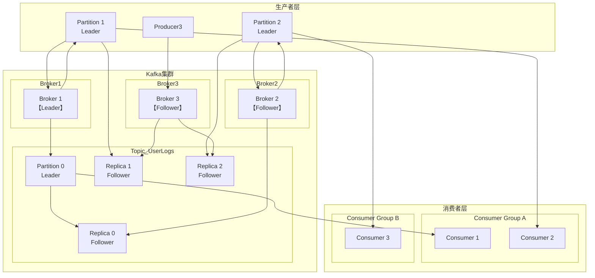
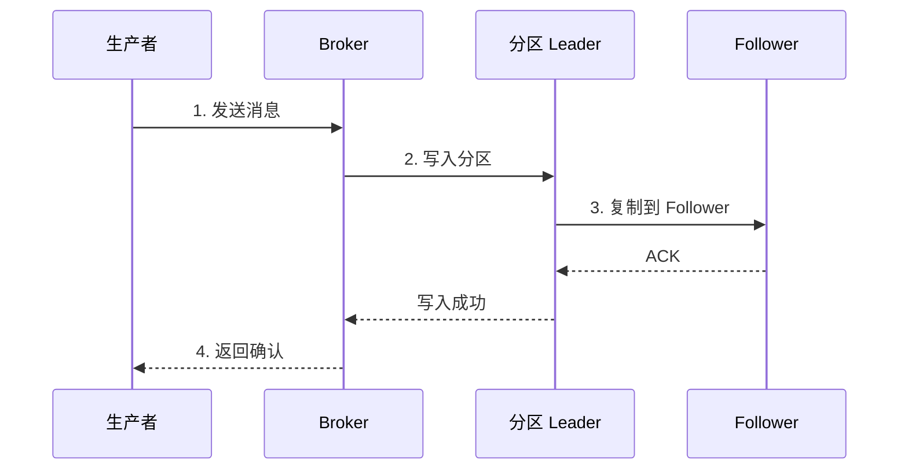
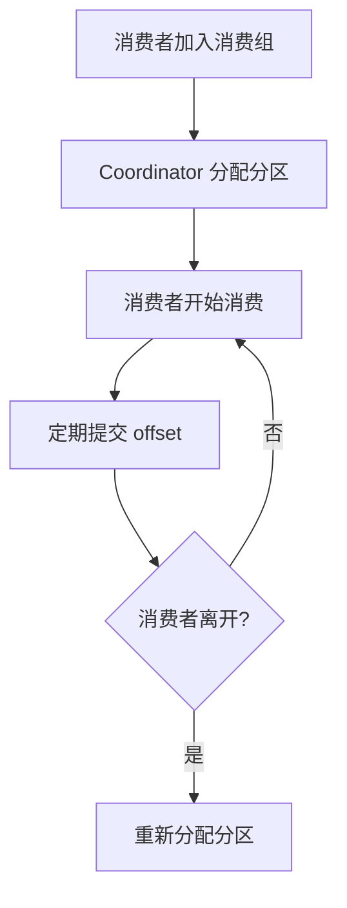
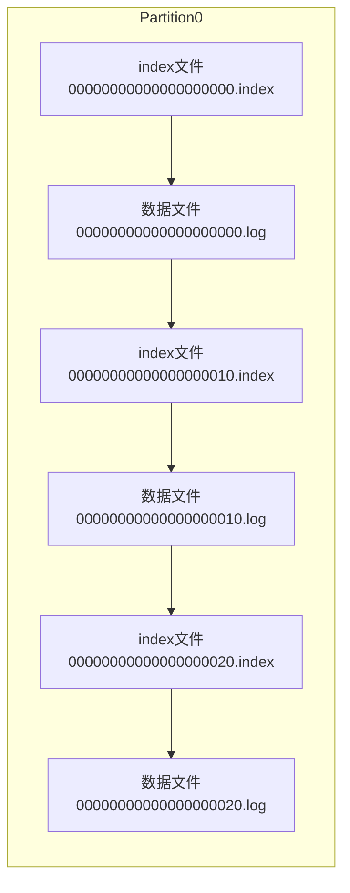
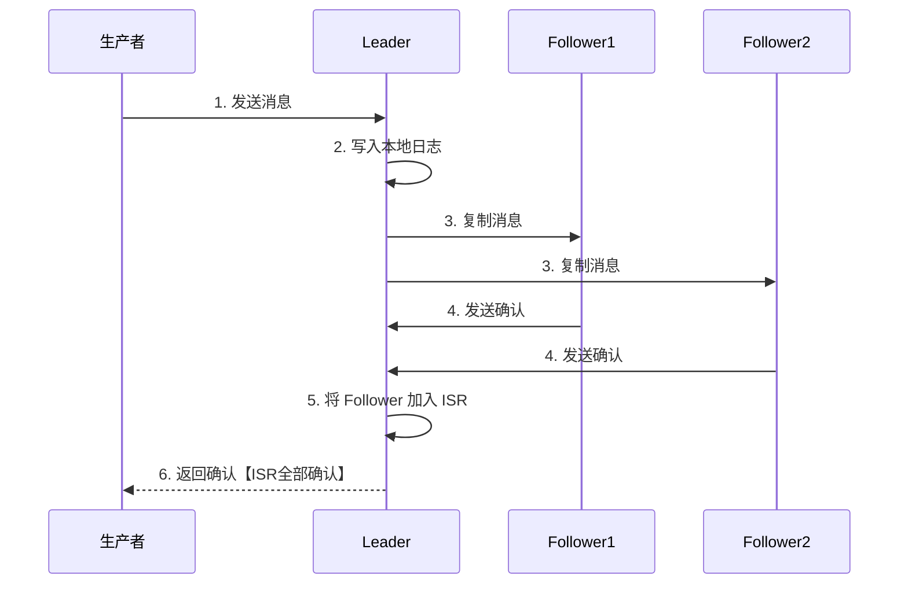
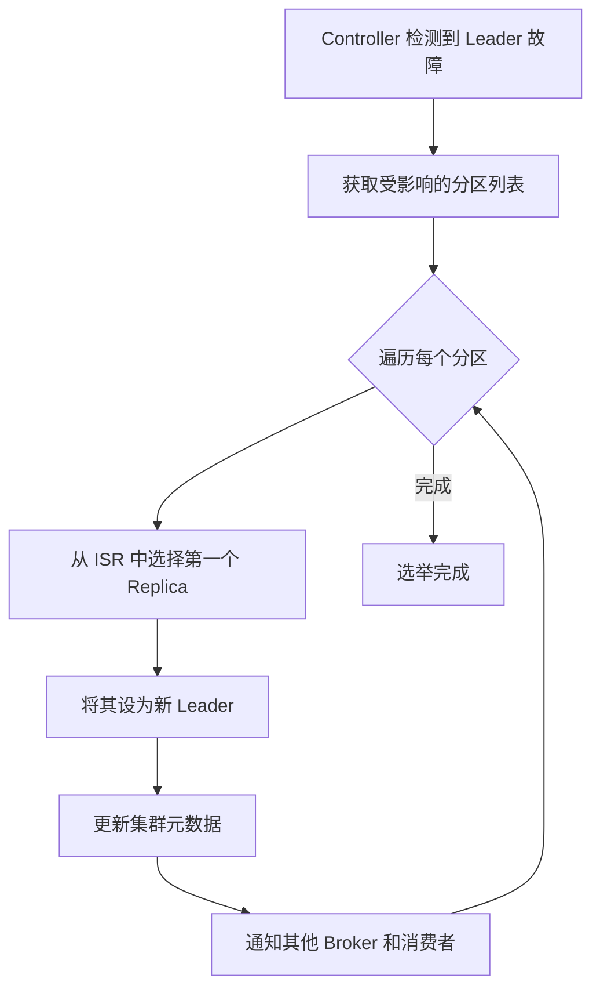
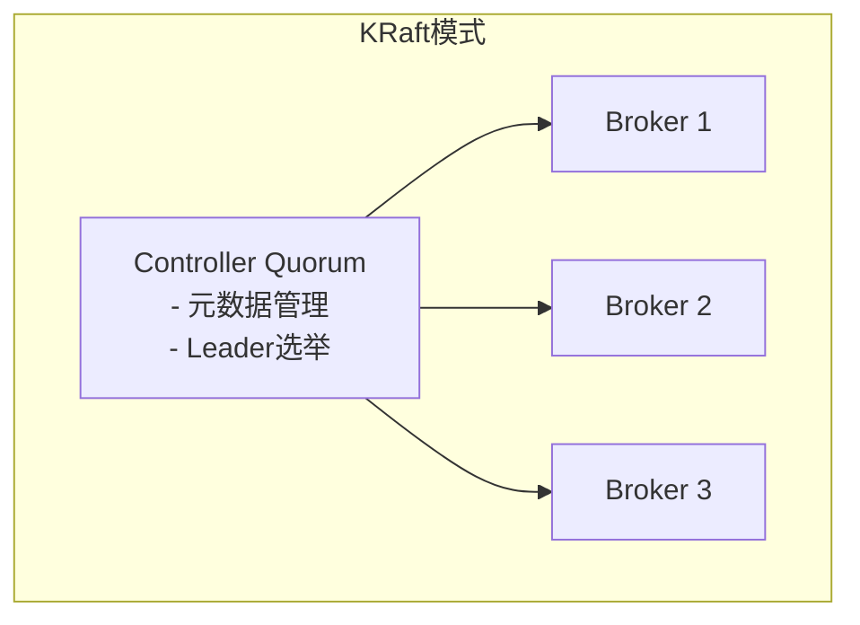
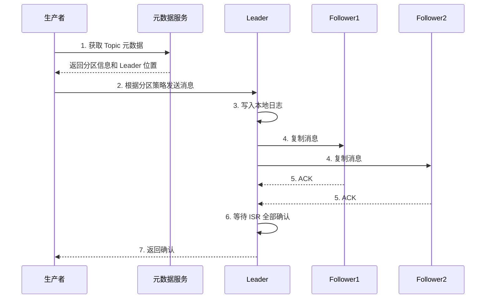
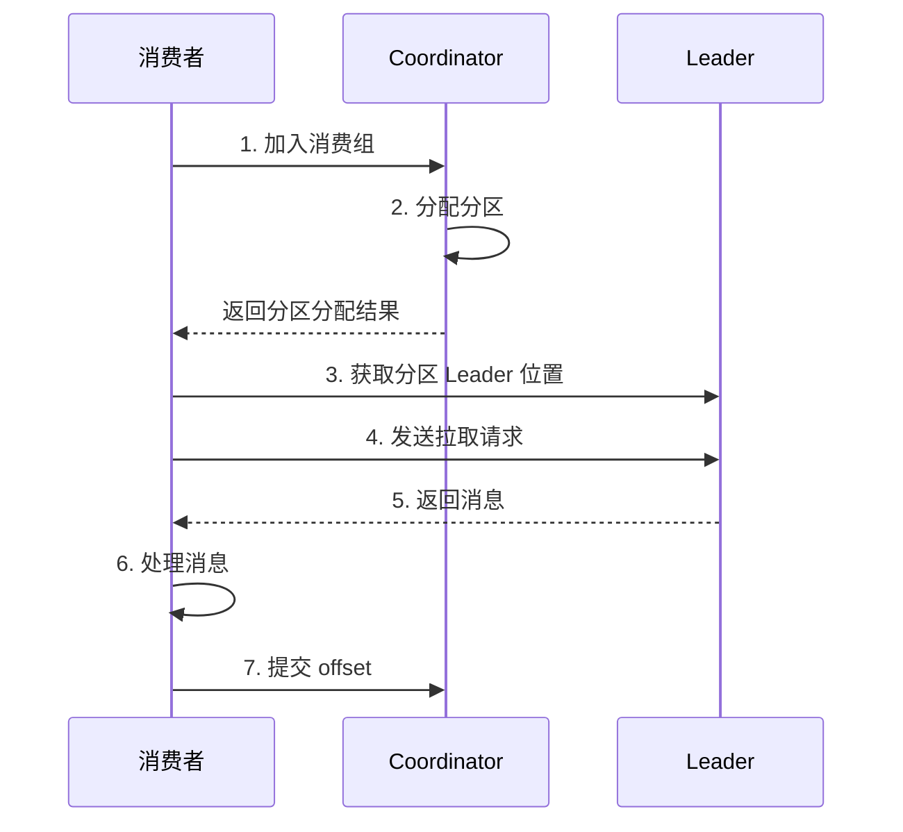
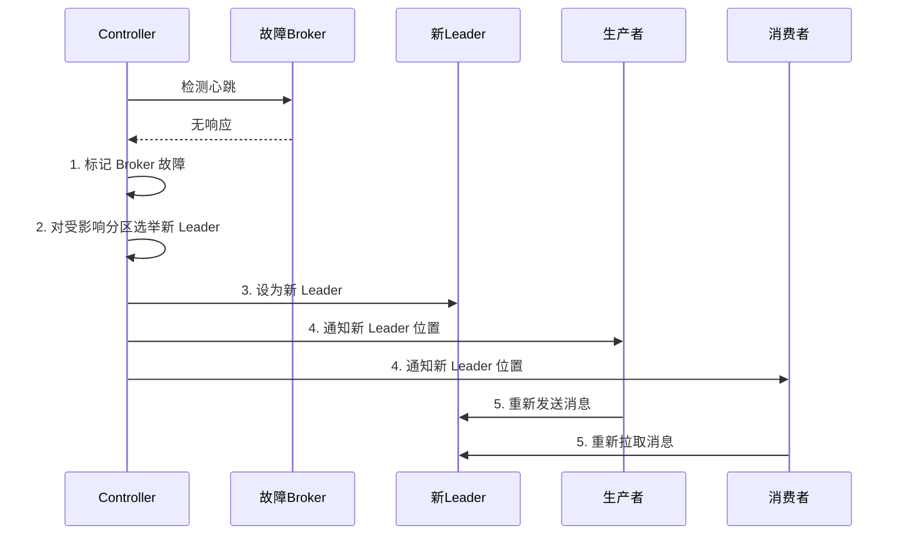

# Kafka 架构详解

## 一、Kafka 架构概述

Kafka 是一个分布式流处理平台，最初由 LinkedIn 开发并于 2011 年开源，后捐赠给 Apache 基金会。它以高吞吐量、低延迟、持久化存储和水平扩展能力为核心优势，广泛应用于日志收集、实时流处理、数据管道等场景。

### 1.1 核心设计理念

Kafka 的设计基于以下核心理念：

- **分布式架构**：集群化部署，支持水平扩展
- **分区存储**：消息按分区存储，提高并行处理能力
- **持久化存储**：消息持久化到磁盘，支持数据回放
- **高吞吐量**：通过批量写入和零拷贝技术实现百万级消息/秒
- **低延迟**：毫秒级延迟，满足实时处理需求

### 1.2 整体架构图

---

## 二、生产者消费者模型

### 2.1 生产者 (Producer)

生产者负责将消息发送到 Kafka 集群。

#### 2.1.1 分区策略

生产者在发送消息时需要决定将消息发送到哪个分区，主要有以下策略：

| 策略 | 说明 |
| :--- | :--- |
| **Round Robin** | 轮询策略，依次将消息发送到各个分区 |
| **Key-Based** | 根据消息的 key 进行哈希计算，相同 key 的消息发送到同一个分区 |
| **Custom** | 自定义分区策略 |

#### 2.1.2 消息发送流程

#### 2.1.3 发送确认机制

生产者可以通过 `acks` 参数控制消息确认级别：

| 参数值 | 说明 |
| :--- | :--- |
| `acks=0` | 发送即返回，不等待确认，性能最高但可靠性最低 |
| `acks=1` | 只等待 Leader 写入成功即返回 |
| `acks=all` | 等待 Leader 和所有 ISR 中的 Follower 写入成功才返回 |

---

### 2.2 消费者 (Consumer)

消费者负责从 Kafka 集群拉取消息并进行处理。

#### 2.2.1 消费组 (Consumer Group)

消费者以消费组为单位进行消费：

- **同一消费组内**：每个分区只能被一个消费者消费（负载均衡）
- **不同消费组间**：可以重复消费同一消息（广播模式）

#### 2.2.2 Offset 管理

消费者通过 offset 记录消费位置：

| Offset 类型 | 说明 |
| :--- | :--- |
| **Consumer Offset** | 消费者当前消费到的位置 |
| **Committed Offset** | 已提交的消费位置（用于故障恢复） |

#### 2.2.3 消费模式

| 模式 | 说明 |
| :--- | :--- |
| **At Most Once** | 最多消费一次，可能丢失消息 |
| **At Least Once** | 至少消费一次，可能重复消费 |
| **Exactly Once** | 精确消费一次（Kafka 0.11+ 支持） |

#### 2.2.4 消费者协调器 (Consumer Coordinator)

负责管理消费组的分区分配和 offset 提交：

---

## 三、集群架构

### 3.1 Broker

Broker 是 Kafka 集群中的节点，负责存储消息和处理客户端请求。

#### 3.1.1 Broker 角色

| 角色 | 职责 |
| :--- | :--- |
| **Leader** | 处理分区的读写请求 |
| **Follower** | 复制 Leader 的数据，提供故障转移能力 |

#### 3.1.2 Controller

集群中选举出的主 Broker，负责：

- 管理 Broker 加入/退出
- 分区 Leader 选举
- 集群元数据管理

### 3.2 Topic 与 Partition

#### 3.2.1 Topic

Topic 是消息的逻辑分类，类似于数据库中的表。

#### 3.2.2 Partition

Partition 是 Topic 的物理分区，每个 Topic 可以分为多个 Partition：

- **并行处理**：多个 Partition 可以并行读写，提高吞吐量
- **顺序保证**：同一 Partition 内的消息是有序的
- **分布存储**：不同 Partition 可以分布在不同 Broker 上

#### 3.2.3 Partition 结构

每个 Partition 包含多个 Segment 文件：

### 3.3 Replica 与 ISR

#### 3.3.1 Replica

每个 Partition 可以有多个副本（Replica）：

- **Leader Replica**：处理读写请求
- **Follower Replica**：复制 Leader 的数据

#### 3.3.2 ISR (In-Sync Replicas)

ISR 是与 Leader 保持同步的副本集合：

#### 3.3.3 Leader 选举

当 Leader 故障时，从 ISR 中选举新的 Leader：

### 3.4 ZooKeeper / KRaft

#### 3.4.1 ZooKeeper 模式（传统模式）

Kafka 早期依赖 ZooKeeper 进行：

- 集群元数据存储
- Controller 选举
- Broker 注册与发现

#### 3.4.2 KRaft 模式（Kafka Raft，推荐）

Kafka 2.8+ 引入 KRaft 协议，不再依赖 ZooKeeper：

- **优势**：减少依赖、提高性能、简化部署
- **核心组件**：
  - **Controller Quorum**：管理元数据和 Leader 选举
  - **Broker**：处理消息读写

---

## 四、核心组件交互流程

### 4.1 消息写入流程

### 4.2 消息消费流程

### 4.3 故障恢复流程

---

## 五、总结

### 5.1 架构优势

| 特性 | 说明 |
| :--- | :--- |
| **高吞吐量** | 分区并行处理 + 批量写入 + 零拷贝 |
| **低延迟** | 毫秒级延迟，满足实时需求 |
| **高可用** | 多副本 + ISR 机制 + 自动故障转移 |
| **水平扩展** | 支持动态添加 Broker 和分区 |
| **持久化** | 消息持久化到磁盘，支持数据回放 |

### 5.2 架构要点

1. **分区是核心**：提供并行处理能力，保证消息顺序
2. **副本保证可用性**：ISR 机制确保数据不丢失
3. **Leader/Follower 模式**：读写分离，提高性能
4. **Offset 管理**：支持精确一次语义和故障恢复
5. **KRaft 模式**：简化部署，提高可靠性