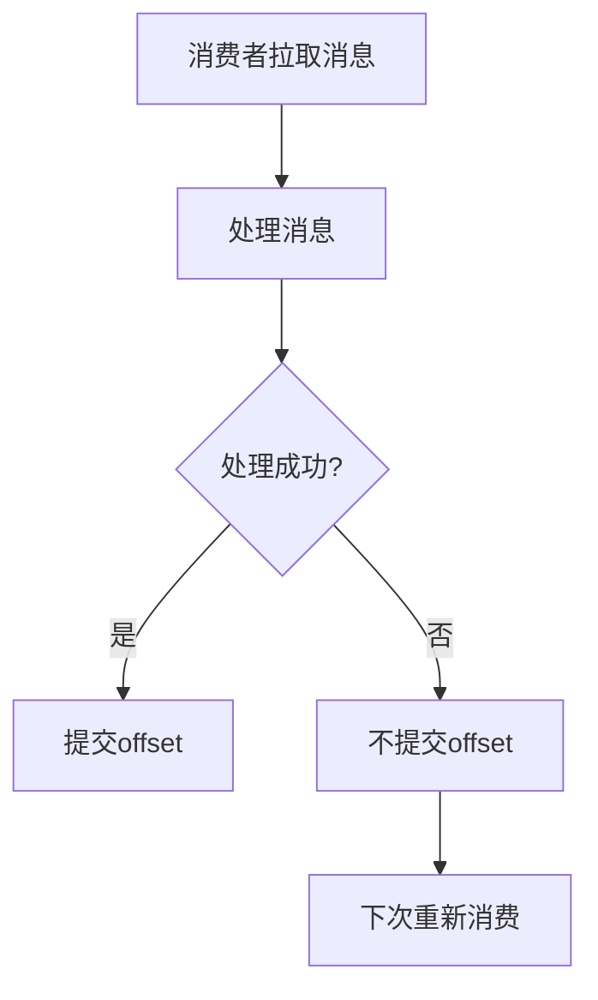
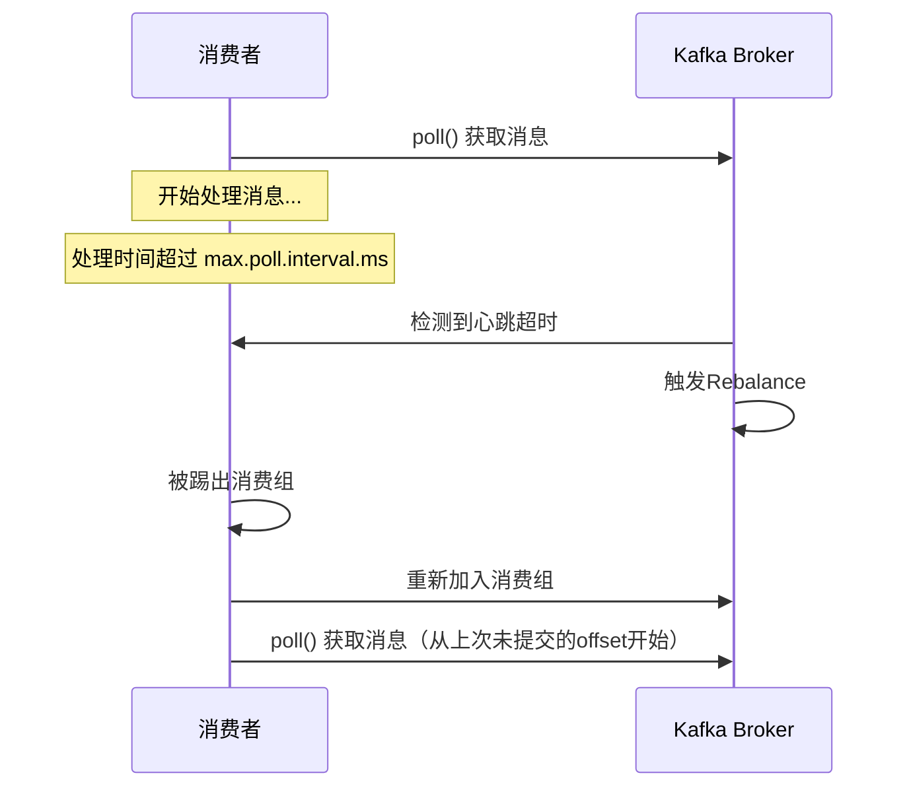
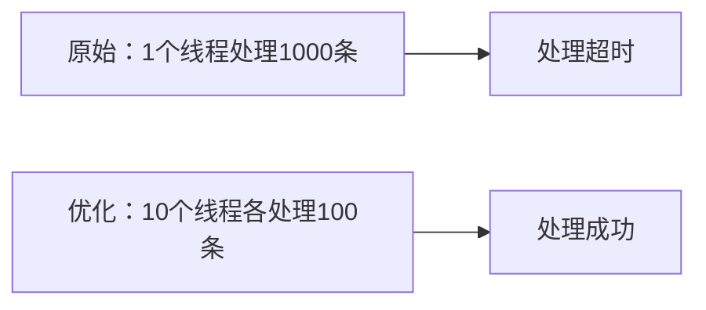

# Kafka消费超时导致重复消费

---

## 目录

1. [消费超时的根本原因](#1-消费超时的根本原因)
2. [重复消费的常见场景](#2-重复消费的常见场景)
3. [解决方案与最佳实践](#3-解决方案与最佳实践)
4. [代码示例](#4-代码示例)
5. [总结](#5-总结)

---

## 1. 消费超时的根本原因

### 1.1 Kafka消费者提交机制



### 1.2 超时相关配置

| 配置项 | 说明 | 默认值 |
|--------|------|--------|
| `max.poll.interval.ms` | 两次poll之间的最大间隔时间 | 300000ms（5分钟） |
| `session.timeout.ms` | 会话超时时间 | 10000ms |
| `heartbeat.interval.ms` | 心跳间隔时间 | 3000ms |
| `auto.offset.reset` | offset丢失时的重置策略 | latest |

### 1.3 超时触发条件

```
消费时间 > max.poll.interval.ms
    → Consumer认为消费者挂了
    → 触发Rebalance
    → 分区重新分配
    → 新消费者重新从头消费
```

### 1.4 超时流程分析



---

## 2. 重复消费的常见场景

### 2.1 场景一：消息处理时间过长

```java
// 问题代码：处理时间超过max.poll.interval.ms
consumer.poll(Duration.ofMillis(100));
for (ConsumerRecord<String, String> record : records) {
    // 处理时间可能超过5分钟
    processRecord(record);  // 可能超时！
}
consumer.commitAsync();
```

### 2.2 场景二：批量拉取过多消息

```java
// 问题代码：一次拉取太多消息
Properties props = new Properties();
props.put(ConsumerConfig.MAX_POLL_RECORDS_CONFIG, 10000);  // 一次拉1万条

Consumer<String, String> consumer = new KafkaConsumer<>(props);
consumer.poll(Duration.ofMillis(100));  // 拉取1万条，处理时间过长
```

### 2.3 场景三：异步处理未正确提交

```java
// 问题代码：异步处理但同步提交
consumer.poll(Duration.ofMillis(100));
for (ConsumerRecord<String, String> record : records) {
    // 异步处理，不等待完成
    executorService.submit(() -> processAsync(record));
}
consumer.commitSync();  // 立即提交，消息可能还没处理完
```

### 2.4 场景四：异常导致offset未提交

```java
// 问题代码：异常导致提交失败
try {
    consumer.poll(Duration.ofMillis(100));
    for (ConsumerRecord<String, String> record : records) {
        processRecord(record);
    }
    // 如果processRecord抛出异常，这里不会执行
    consumer.commitSync();
} catch (Exception e) {
    // 异常被捕获，但offset未提交
    log.error("处理失败", e);
}
```

### 2.5 场景五：网络抖动导致提交失败

```
网络抖动 → commitSync/commitAsync失败 → offset未提交 → 下次重复消费
```

---

## 3. 解决方案与最佳实践

### 3.1 方案一：增加超时时间

```java
Properties props = new Properties();
// 增加最大poll间隔时间
props.put(ConsumerConfig.MAX_POLL_INTERVAL_MS_CONFIG, "600000");  // 10分钟
props.put(ConsumerConfig.SESSION_TIMEOUT_MS_CONFIG, "30000");      // 30秒
props.put(ConsumerConfig.HEARTBEAT_INTERVAL_MS_CONFIG, "10000");   // 10秒
```

### 3.2 方案二：控制批量拉取数量

```java
Properties props = new Properties();
// 控制每次拉取的消息数量
props.put(ConsumerConfig.MAX_POLL_RECORDS_CONFIG, "100");  // 一次拉100条

// 配合较短的poll超时
consumer.poll(Duration.ofMillis(500));
```

### 3.3 方案三：手动提交offset

```java
// 逐条处理，逐条提交
consumer.poll(Duration.ofMillis(100));
for (ConsumerRecord<String, String> record : records) {
    try {
        processRecord(record);
        // 处理成功后立即提交当前offset
        consumer.commitSync(Map.of(
            new TopicPartition(record.topic(), record.partition()),
            new OffsetAndMetadata(record.offset() + 1)
        ));
    } catch (Exception e) {
        // 处理失败，不提交，下次重新消费
        log.error("处理消息失败", e);
    }
}
```

### 3.4 方案四：幂等性设计

```java
// 使用消息ID确保幂等性
public void processRecord(ConsumerRecord<String, String> record) {
    String messageId = extractMessageId(record);
    
    // 先检查是否已经处理过
    if (isProcessed(messageId)) {
        log.info("消息{}已处理，跳过", messageId);
        return;
    }
    
    // 处理消息
    doProcess(record);
    
    // 标记已处理
    markAsProcessed(messageId);
}
```

### 3.5 方案五：使用事务保证一致性

```java
// 消息处理和数据库更新在同一事务中
@Transactional
public void processWithTransaction(ConsumerRecord<String, String> record) {
    // 1. 解析消息
    Order order = parseOrder(record.value());
    
    // 2. 数据库操作
    orderRepository.save(order);
    
    // 3. 如果到这里都成功，消息处理完成
    // offset将在事务提交后再提交
}
```

### 3.6 方案六：异步处理配合手动提交

```java
// 异步处理，等待所有任务完成后提交
List<CompletableFuture<Void>> futures = new ArrayList<>();

consumer.poll(Duration.ofMillis(100));
for (ConsumerRecord<String, String> record : records) {
    CompletableFuture<Void> future = executorService.submitAsync(() -> {
        processRecord(record);
    });
    futures.add(future);
}

// 等待所有任务完成
CompletableFuture.allOf(futures.toArray(new CompletableFuture[0])).join();

// 全部成功后提交offset
consumer.commitSync();
```

### 3.7 方案七：调整消费线程数



---

## 4. 代码示例

### 4.1 正确的消费者配置

```java
public class KafkaConsumerConfig {
    
    public static Consumer<String, String> createConsumer() {
        Properties props = new Properties();
        
        // 基础配置
        props.put(ConsumerConfig.BOOTSTRAP_SERVERS_CONFIG, "localhost:9092");
        props.put(ConsumerConfig.GROUP_ID_CONFIG, "my-consumer-group");
        
        // 关键超时配置
        props.put(ConsumerConfig.MAX_POLL_INTERVAL_MS_CONFIG, "600000");      // 10分钟
        props.put(ConsumerConfig.SESSION_TIMEOUT_MS_CONFIG, "30000");          // 30秒
        props.put(ConsumerConfig.HEARTBEAT_INTERVAL_MS_CONFIG, "10000");       // 10秒
        
        // 批量配置
        props.put(ConsumerConfig.MAX_POLL_RECORDS_CONFIG, "100");             // 每次100条
        props.put(ConsumerConfig.FETCH_MIN_BYTES_CONFIG, "1");                 // 有数据就返回
        props.put(ConsumerConfig.FETCH_MAX_WAIT_MS_CONFIG, "500");             // 最多等500ms
        
        // offset配置
        props.put(ConsumerConfig.AUTO_OFFSET_RESET_CONFIG, "earliest");
        props.put(ConsumerConfig.ENABLE_AUTO_COMMIT_CONFIG, "false");          // 禁用自动提交
        
        return new KafkaConsumer<>(props, 
            new StringDeserializer(), 
            new StringDeserializer());
    }
}
```

### 4.2 安全的消息消费模式

```java
public class SafeKafkaConsumer {
    
    private final Consumer<String, String> consumer;
    private final ExecutorService executorService = Executors.newFixedThreadPool(10);
    
    public SafeKafkaConsumer(Consumer<String, String> consumer) {
        this.consumer = consumer;
    }
    
    public void startConsuming(String topic) {
        consumer.subscribe(Collections.singletonList(topic));
        
        while (true) {
            try {
                ConsumerRecords<String, String> records = consumer.poll(Duration.ofMillis(500));
                
                if (records.isEmpty()) {
                    continue;
                }
                
                // 异步处理，收集所有future
                List<CompletableFuture<Boolean>> futures = new ArrayList<>();
                
                for (ConsumerRecord<String, String> record : records) {
                    futures.add(processRecordAsync(record));
                }
                
                // 等待所有任务完成
                CompletableFuture.allOf(futures.toArray(new CompletableFuture[0])).join();
                
                // 检查是否全部成功
                boolean allSuccess = futures.stream()
                    .map(CompletableFuture::join)
                    .allMatch(result -> result);
                
                if (allSuccess) {
                    // 全部成功才提交offset
                    consumer.commitSync();
                    log.info("成功处理并提交{}条消息", records.count());
                } else {
                    // 有失败，不提交，下次重新消费
                    log.warn("部分消息处理失败，不提交offset");
                }
                
            } catch (WakeupException e) {
                // 正常关闭
                break;
            } catch (Exception e) {
                log.error("消费异常", e);
                // 不提交offset，下次重新消费
            }
        }
    }
    
    private CompletableFuture<Boolean> processRecordAsync(ConsumerRecord<String, String> record) {
        return CompletableFuture.supplyAsync(() -> {
            try {
                // 幂等性检查
                String messageId = extractMessageId(record);
                if (isAlreadyProcessed(messageId)) {
                    log.info("消息{}已处理，跳过", messageId);
                    return true;
                }
                
                // 实际处理逻辑
                doBusinessLogic(record);
                
                // 标记已处理
                markAsProcessed(messageId);
                
                return true;
            } catch (Exception e) {
                log.error("处理消息失败: {}", record.offset(), e);
                return false;
            }
        }, executorService);
    }
}
```

### 4.3 幂等性服务示例

```java
@Component
public class IdempotentService {
    
    @Autowired
    private RedisTemplate<String, String> redisTemplate;
    
    private static final String PREFIX = "kafka:processed:";
    private static final long EXPIRATION = 86400;  // 24小时
    
    public boolean isAlreadyProcessed(String messageId) {
        String key = PREFIX + messageId;
        return Boolean.TRUE.equals(redisTemplate.hasKey(key));
    }
    
    public void markAsProcessed(String messageId) {
        String key = PREFIX + messageId;
        redisTemplate.opsForValue().set(key, "true", EXPIRATION, TimeUnit.SECONDS);
    }
    
    public String extractMessageId(ConsumerRecord<String, String> record) {
        // 从消息头或消息体中提取messageId
        Headers headers = record.headers();
        for (Header header : headers) {
            if ("message-id".equals(header.key())) {
                return new String(header.value());
            }
        }
        // 如果没有messageId，使用offset作为标识
        return record.topic() + "-" + record.partition() + "-" + record.offset();
    }
}
```

---

## 5. 总结

### 5.1 超时原因总结

| 原因 | 说明 |
|------|------|
| **处理时间过长** | 单条消息处理时间超过max.poll.interval.ms |
| **批量过大** | 一次拉取太多消息，总处理时间超时 |
| **异步处理** | 异步处理但同步提交，导致offset提前提交 |
| **异常中断** | 处理过程中抛出异常，offset未提交 |
| **网络问题** | 提交offset时网络抖动导致失败 |

### 5.2 解决方案对比

| 方案 | 适用场景 | 优点 | 缺点 |
|------|---------|------|------|
| **增加超时时间** | 处理确实需要长时间 | 简单易行 | 可能隐藏真正问题 |
| **控制批量大小** | 批量过大导致超时 | 见效快 | 需要调优 |
| **手动提交** | 需要精确控制 | 精确控制 | 代码复杂 |
| **幂等性设计** | 无法避免重复消费 | 最可靠 | 需要额外存储 |
| **事务保证** | 需要强一致性 | 数据一致 | 性能开销 |

### 5.3 最佳实践建议

1. **设置合理的超时时间**：根据业务处理时间调整`max.poll.interval.ms`
2. **控制拉取数量**：通过`max.poll.records`控制单次拉取量
3. **禁用自动提交**：使用手动提交获得更好的控制
4. **实现幂等性**：确保消息处理结果不受重复消费影响
5. **监控告警**：监控消费延迟和超时情况

### 5.4 关键配置清单

| 配置 | 建议值 | 说明 |
|------|-------|------|
| `max.poll.interval.ms` | 600000 | 根据业务调整 |
| `session.timeout.ms` | 30000 | 3倍心跳间隔 |
| `heartbeat.interval.ms` | 10000 | 心跳频率 |
| `max.poll.records` | 100-1000 | 控制批量大小 |
| `enable.auto.commit` | false | 禁用自动提交 |
