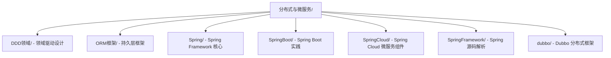

# 分布式与微服务

分布式与微服务是构建大型企业级系统的核心技术体系，涵盖服务治理、分布式协调、高可用架构等关键领域。

---

## 一、概述

### 1.1 架构演进

| 阶段 | 特点 | 技术栈 |
|------|------|--------|
| **单体应用** | 单一代码库，部署简单 | Spring MVC + MySQL |
| **垂直拆分** | 按业务模块拆分 | 多个独立单体应用 |
| **分布式服务** | 服务化拆分 | Dubbo + Zookeeper |
| **微服务架构** | 细粒度服务治理 | Spring Cloud / Dubbo |
| **云原生架构** | 容器化、自动化运维 | Kubernetes + Docker |

### 1.2 核心关注点

| 关注点 | 说明 |
|--------|------|
| **高可用** | 服务容错、故障转移、负载均衡 |
| **高性能** | 缓存策略、异步处理、优化数据库 |
| **可扩展** | 水平扩展、弹性伸缩、服务网格 |
| **安全性** | 认证授权、数据加密、访问控制 |
| **可观测性** | 日志、监控、链路追踪 |

---

## 二、目录结构

---

## 三、核心技术栈

### 3.1 Spring 全家桶

| 框架 | 定位 | 核心特性 |
|------|------|----------|
| **Spring Framework** | 基础框架 | IoC、AOP、事务管理 |
| **Spring Boot** | 快速开发 | 自动配置、起步依赖 |
| **Spring Cloud** | 微服务治理 | 服务发现、负载均衡、熔断 |

### 3.2 Dubbo RPC 框架

高性能 RPC 框架，专注于服务治理：
- 服务注册与发现
- 负载均衡策略
- 服务熔断与降级
- 多协议支持

### 3.3 ORM 框架

- **MyBatis**：灵活的 SQL 映射框架
- 支持动态 SQL、结果映射、缓存机制

### 3.4 DDD 领域驱动设计

核心概念：
- **领域**：问题空间
- **实体**：具有唯一标识的对象
- **值对象**：无标识的对象
- **聚合**：一组相关对象的集合
- **领域服务**：跨实体的业务逻辑

---

## 四、文档导航

### Spring Framework
- [Spring概述](Spring/README.md)
- [Spring AOP](Spring/SpringAOP.md)
- [Spring事务](Spring/Spring事务.md)
- [循环依赖](Spring/循环依赖.md)
- [大事务处理优化](Spring/大事务处理优化.md)
- [InitillizingBean](Spring/InitillizingBean.md)
- [TransactionSynchronizationManager](Spring/TransactionSynchronizationManager.md)

### Spring Boot
- [SpringApplication解析](SpringBoot/SpringApplication解析.md)
- [SpringBoot-Arthas](SpringBoot/SpringBoot-Arthas.md)
- [SpringBoot理解](SpringBoot/SpringBoot理解.md)
- [Spring与SpringBoot对比](SpringBoot/Spring与SpringBoot对比.md)
- [可执行Jar原理](SpringBoot/可执行Jar原理.md)
- [启动原理解析](SpringBoot/启动原理解析.md)
- [并发请求处理](SpringBoot/并发请求处理.md)
- [循环依赖问题](SpringBoot/循环依赖问题.md)
- [自动配置原理](SpringBoot/自动配置原理.md)
- [自定义Starter](SpringBoot/自定义Starter.md)
- [配置文件加密](SpringBoot/配置文件加密.md)
- [CGLIB使用原理](SpringBoot/CGLIB使用原理.md)

### Spring Cloud
- [微服务SpringCloud](SpringCloud/微服务SpringCloud.md)
- [Eureka](SpringCloud/Eureka.md)
- [Feign](SpringCloud/Feign.md)
- [Hystrix](SpringCloud/Hystrix.md)

### Spring Framework 源码
- [源码解析之ApplicationContext](SpringFramework/源码解析之ApplicationContext.md)

### Dubbo
- [Dubbo概述](dubbo/README.md)
- [Dubbo详解](dubbo/Dubbo.md)
- [分布式服务框架](dubbo/分布式服务框架.md)

### ORM框架
- [MyBatis详解](ORM框架/Mybatis详解.md)

### DDD领域
- [传统分包](DDD领域/传统分包.md)

---

## 五、设计原则

### 5.1 微服务设计原则

1. **单一职责**：每个服务只负责一个业务领域
2. **服务自治**：独立开发、部署、运行
3. **轻量级通信**：基于 HTTP/REST 或 RPC
4. **数据隔离**：每个服务有独立的数据库
5. **去中心化**：避免单点故障

### 5.2 分布式事务策略

| 策略 | 适用场景 | 特点 |
|------|----------|------|
| **2PC** | 强一致性要求 | 性能开销大 |
| **TCC** | 高并发场景 | 业务侵入式 |
| **Saga** | 长事务场景 | 最终一致性 |
| **消息队列** | 异步场景 | 最终一致性 |

---

## 六、最佳实践

1. **服务拆分**：按业务域拆分，避免过细或过粗
2. **API 网关**：统一入口，认证授权
3. **配置中心**：集中管理配置，支持动态刷新
4. **服务熔断**：防止级联故障
5. **分布式追踪**：全链路监控
6. **优雅降级**：保障核心服务可用
