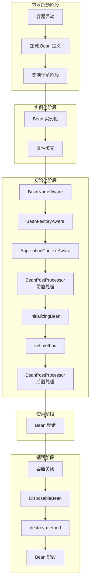
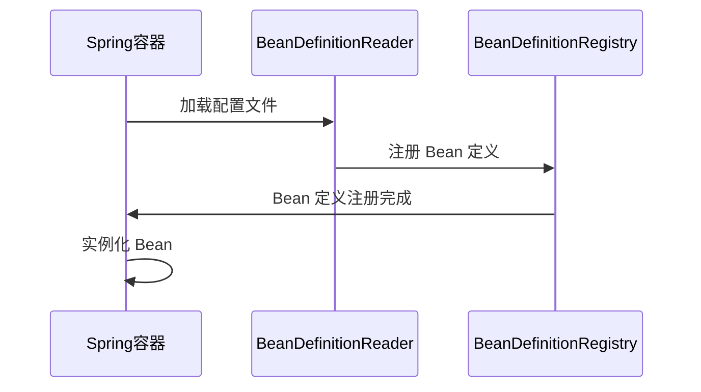
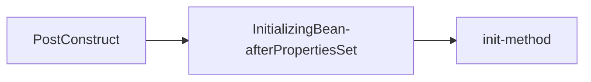
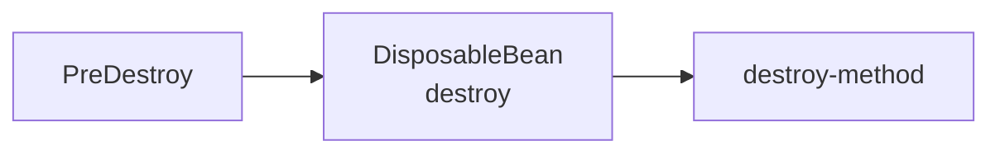
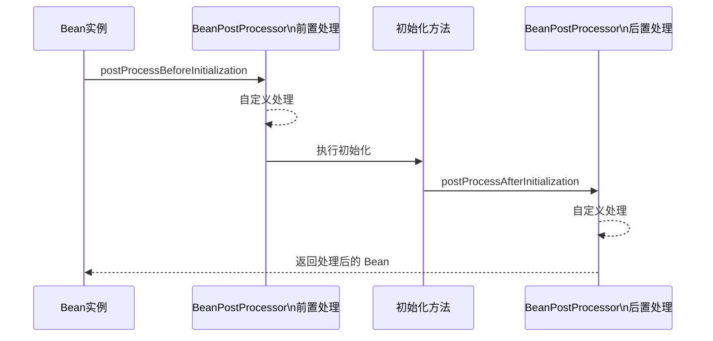
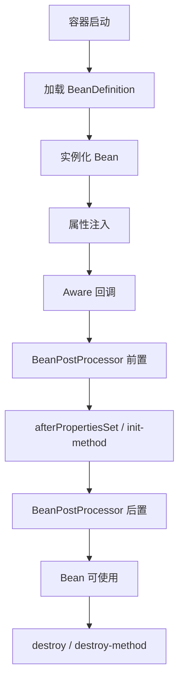
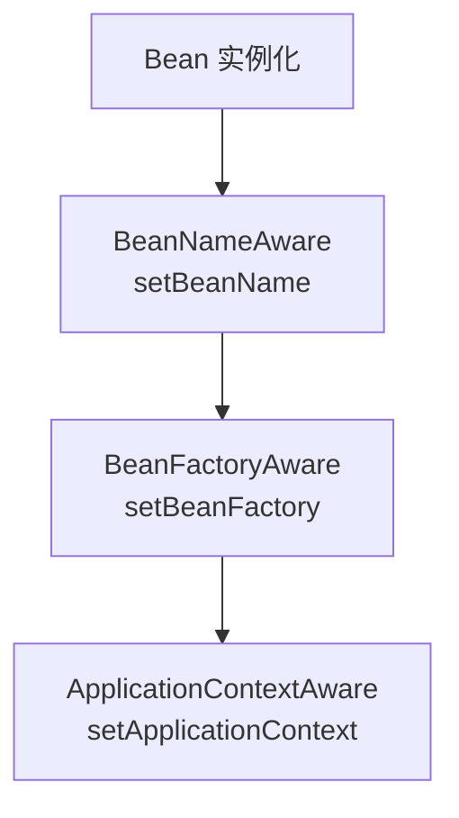

# Spring Bean 生命周期详解

## 一、概述

Spring Bean 是 Spring 容器中管理的对象，了解 Bean 的生命周期对于深入理解 Spring 框架至关重要。Bean 的生命周期指的是从 Spring 容器启动、Bean 实例化、属性填充、初始化到销毁的完整过程。

理解 Bean 生命周期的意义：

- **资源管理**：了解何时该释放资源、关闭连接
- **扩展点**：利用生命周期钩子进行自定义初始化和销毁逻辑
- **问题排查**：当 Bean 初始化失败时，能够快速定位问题
- **最佳实践**：遵循 Spring 官方推荐的方式进行开发



***

## 二、Bean 生命周期核心阶段

### 2.1 容器启动阶段

Spring 容器启动时，会经历以下步骤：



| 阶段             | 说明                                              |
| :------------- | :---------------------------------------------- |
| **加载配置**       | 从 XML、注解或 Java 配置中加载 Bean 定义                    |
| **解析 Bean 定义** | 将配置转换为 `BeanDefinition` 对象                      |
| **注册 Bean 定义** | 将 `BeanDefinition` 注册到 `BeanDefinitionRegistry` |

### 2.2 实例化阶段

Bean 实例化是创建 Bean 对象的过程：

| 步骤             | 说明                |
| :------------- | :---------------- |
| **实例化**        | 通过构造函数创建 Bean 实例  |
| **属性填充**       | 注入依赖的 Bean 和基本属性值 |
| **Aware 接口回调** | 注入容器相关的资源         |

### 2.3 初始化阶段

初始化阶段是 Bean 准备就绪前的最后准备：

| 步骤                         | 说明                                       |
| :------------------------- | :--------------------------------------- |
| **Aware 接口回调**             | 注入容器资源（如 BeanFactory、ApplicationContext） |
| **BeanPostProcessor 前置处理** | 在初始化前对 Bean 进行处理                         |
| **初始化方法**                  | 执行自定义初始化逻辑                               |
| **BeanPostProcessor 后置处理** | 在初始化后对 Bean 进行处理                         |

### 2.4 销毁阶段

当容器关闭时，会触发 Bean 的销毁：

| 步骤          | 说明                                          |
| :---------- | :------------------------------------------ |
| **容器关闭**    | 调用 `ConfigurableApplicationContext.close()` |
| **销毁回调**    | 执行自定义销毁逻辑                                   |
| **Bean 销毁** | 释放 Bean 占用的资源                               |

***

## 三、初始化回调

Spring 提供了三种方式来实现初始化回调：

### 3.1 @PostConstruct 注解

使用 `@PostConstruct` 注解标记初始化方法：

```java
@Component
public class UserService {
    
    @PostConstruct
    public void init() {
        System.out.println("UserService 初始化完成");
    }
}
```

**特点**：

- 基于 JSR-250 规范
- 需要添加 `jakarta.annotation-api` 依赖
- 推荐使用，代码简洁

### 3.2 InitializingBean 接口

实现 `InitializingBean` 接口：

```java
@Component
public class OrderService implements InitializingBean {
    
    @Override
    public void afterPropertiesSet() throws Exception {
        System.out.println("OrderService 初始化完成");
    }
}
```

**特点**：

- Spring 框架原生接口
- 不推荐使用，会与 Spring 框架耦合
- 优先级高于 `@PostConstruct`

### 3.3 init-method 配置

通过 `@Bean` 注解的 `initMethod` 属性指定：

```java
@Configuration
public class AppConfig {
    
    @Bean(initMethod = "init")
    public ProductService productService() {
        return new ProductService();
    }
}
```

```java
public class ProductService {
    
    public void init() {
        System.out.println("ProductService 初始化完成");
    }
}
```

**特点**：

- 配置与代码分离
- 适用于第三方类
- 不需要修改源代码

### 3.4 执行顺序

当三种方式同时存在时，执行顺序为：



***

## 四、销毁回调

Spring 提供了三种方式来实现销毁回调：

### 4.1 @PreDestroy 注解

使用 `@PreDestroy` 注解标记销毁方法：

```java
@Component
public class UserService {
    
    @PreDestroy
    public void cleanup() {
        System.out.println("UserService 资源释放");
    }
}
```

**特点**：

- 基于 JSR-250 规范
- 推荐使用
- 用于释放数据库连接、关闭线程池等

### 4.2 DisposableBean 接口

实现 `DisposableBean` 接口：

```java
@Component
public class OrderService implements DisposableBean {
    
    @Override
    public void destroy() throws Exception {
        System.out.println("OrderService 资源释放");
    }
}
```

**特点**：

- Spring 框架原生接口
- 不推荐使用
- 优先级高于 `@PreDestroy`

### 4.3 destroy-method 配置

通过 `@Bean` 注解的 `destroyMethod` 属性指定：

```java
@Configuration
public class AppConfig {
    
    @Bean(destroyMethod = "cleanup")
    public ProductService productService() {
        return new ProductService();
    }
}
```

```java
public class ProductService {
    
    public void cleanup() {
        System.out.println("ProductService 资源释放");
    }
}
```

**特点**：

- 配置与代码分离
- 适用于第三方类
- 自动检测 close 方法

### 4.4 执行顺序

当三种方式同时存在时，执行顺序为：



***

## 五、BeanPostProcessor 机制

`BeanPostProcessor` 是 Spring 框架提供的扩展点，允许在 Bean 初始化前后进行自定义处理。

### 5.1 接口定义

```java
public interface BeanPostProcessor {
    
    // 初始化前回调
    default Object postProcessBeforeInitialization(Object bean, String beanName) 
            throws BeansException {
        return bean;
    }
    
    // 初始化后回调
    default Object postProcessAfterInitialization(Object bean, String beanName) 
            throws BeansException {
        return bean;
    }
}
```

### 5.2 工作原理



### 5.3 常见应用场景

| 应用场景           | 说明                                           |
| :------------- | :------------------------------------------- |
| **@Autowired** | 通过 `AutowiredAnnotationBeanPostProcessor` 实现 |
| **@Required**  | 通过 `RequiredAnnotationBeanPostProcessor` 实现  |
| **@Value**     | 通过 `AutowiredAnnotationBeanPostProcessor` 实现 |
| **@Async**     | 通过 `AsyncAnnotationBeanPostProcessor` 实现     |
| **AOP**        | 通过 `AbstractAutoProxyCreator` 实现代理           |

### 5.4 自定义 BeanPostProcessor 示例

```java
@Component
public class MyBeanPostProcessor implements BeanPostProcessor {
    
    @Override
    public Object postProcessBeforeInitialization(Object bean, String beanName) 
            throws BeansException {
        System.out.println("初始化前: " + beanName);
        return bean;
    }
    
    @Override
    public Object postProcessAfterInitialization(Object bean, String beanName) 
            throws BeansException {
        System.out.println("初始化后: " + beanName);
        return bean;
    }
}
```

***

## 六、完整生命周期流程图



***

## 七、Aware 接口详解

Spring 提供了多个 Aware 接口，用于获取容器内部资源：

| 接口                                 | 注入内容                  |
| :--------------------------------- | :-------------------- |
| **BeanNameAware**                  | Bean 的名称              |
| **BeanFactoryAware**               | BeanFactory 实例        |
| **ApplicationContextAware**        | ApplicationContext 实例 |
| **ApplicationEventPublisherAware** | 事件发布器                 |
| **ResourceLoaderAware**            | 资源加载器                 |
| **MessageSourceAware**             | 国际化消息源                |
| **ServletContextAware**            | Servlet 上下文（Web 应用）   |
| **ServletConfigAware**             | Servlet 配置（Web 应用）    |

### 7.1 使用示例

```java
@Component
public class UserService implements BeanNameAware, ApplicationContextAware {
    
    private String beanName;
    private ApplicationContext applicationContext;
    
    @Override
    public void setBeanName(String name) {
        this.beanName = name;
        System.out.println("Bean 名称: " + beanName);
    }
    
    @Override
    public void setApplicationContext(ApplicationContext context) {
        this.applicationContext = context;
        System.out.println("ApplicationContext 已注入");
    }
}
```

### 7.2 执行顺序

Aware 接口的执行顺序：



***

## 八、最佳实践

### 8.1 推荐使用方式

| 类型      | 推荐方式             | 原因              |
| :------ | :--------------- | :-------------- |
| **初始化** | `@PostConstruct` | JSR-250 标准、代码简洁 |
| **销毁**  | `@PreDestroy`    | JSR-250 标准、代码简洁 |

### 8.2 配置建议

```java
@Configuration
public class AppConfig {
    
    @Bean(initMethod = "init", destroyMethod = "cleanup")
    public ThirdPartyService thirdPartyService() {
        return new ThirdPartyService();
    }
}
```

### 8.3 注意事项

1. **避免在初始化方法中抛出异常**：可能导致 Bean 创建失败
2. **销毁方法需要幂等**：可能多次调用，确保可以安全重复执行
3. **注意线程安全**：初始化和销毁方法可能是多线程调用
4. **合理使用 BeanPostProcessor**：大量使用会影响性能

### 8.4 生命周期配置总结

```java
@Component
@Scope("singleton")
public class UserService {
    
    // 初始化
    @PostConstruct
    public void init() {
        // 初始化逻辑
    }
    
    // 销毁
    @PreDestroy
    public void destroy() {
        // 资源释放逻辑
    }
}
```

***

## 九、总结

### 9.1 核心要点

1. **Bean 生命周期是 Spring 框架的核心机制**
2. **初始化回调推荐使用** **`@PostConstruct`**
3. **销毁回调推荐使用** **`@PreDestroy`**
4. **BeanPostProcessor 是框架扩展的重要机制**
5. **Aware 接口用于获取容器内部资源**

### 9.2 回调方式对比

| 类型       | @PostConstruct | InitializingBean | init-method |
| :------- | :------------- | :--------------- | :---------- |
| **标准**   | JSR-250        | Spring 特有        | Spring 特有   |
| **耦合性**  | 低              | 高                | 低           |
| **推荐度**  | ⭐⭐⭐⭐⭐          | ⭐⭐               | ⭐⭐⭐⭐        |
| **执行顺序** | 1              | 2                | 3           |

| 类型       | @PreDestroy | DisposableBean | destroy-method |
| :------- | :---------- | :------------- | :------------- |
| **标准**   | JSR-250     | Spring 特有      | Spring 特有      |
| **耦合性**  | 低           | 高              | 低              |
| **推荐度**  | ⭐⭐⭐⭐⭐       | ⭐⭐             | ⭐⭐⭐⭐           |
| **执行顺序** | 1           | 2              | 3              |

### 9.3 完整生命周期检查清单

- [ ] Bean 实例化
- [ ] 属性填充
- [ ] Aware 接口回调
- [ ] BeanPostProcessor 前置处理
- [ ] 初始化方法（@PostConstruct / InitializingBean / init-method）
- [ ] BeanPostProcessor 后置处理
- [ ] Bean 就绪
- [ ] 销毁方法（@PreDestroy / DisposableBean / destroy-method）

