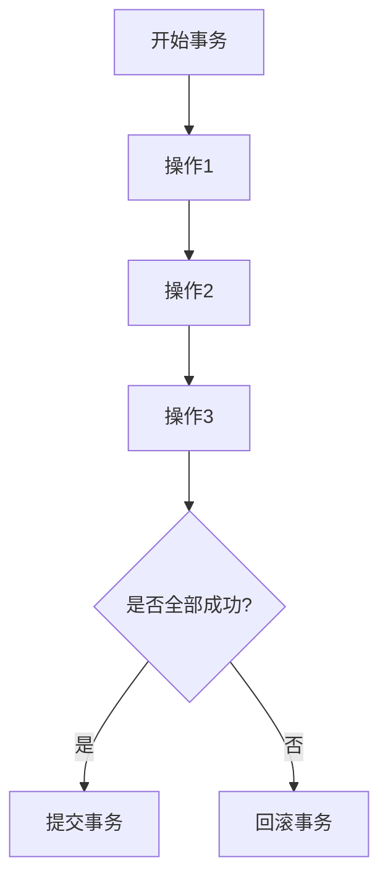

# Spring @Transactional 详解

## 一、事务概念

事务是用户的一系列数据库操作（增删改查），这些操作可视为一个完整的逻辑处理工作单元，**要么全部执行，要么全部不执行**，是不可分割的工作单元。



## 二、Spring 事务管理方式

### 2.1 编程式事务

类似于 JDBC 编程实现事务管理，使用 `TransactionTemplate` 或 `PlatformTransactionManager`。

```java
@Autowired
private TransactionTemplate transactionTemplate;

public void saveUser(User user) {
    transactionTemplate.execute(status -> {
        // 数据库操作
        userRepository.save(user);
        return null;
    });
}
```

### 2.2 声明式事务

建立在 AOP 之上，通过 `@Transactional` 注解实现。

```java
@Service
public class UserService {
    
    @Autowired
    private UserRepository userRepository;
    
    @Transactional
    public void createUser(User user) {
        userRepository.save(user);
    }
}
```

### 2.3 @Transactional 注解属性

| 属性 | 说明 | 默认值 |
| :--- | :--- | :--- |
| `rollbackFor` | 指定哪些异常触发回滚 | RuntimeException 和 Error |
| `noRollbackFor` | 指定哪些异常不触发回滚 | 无 |
| `timeout` | 事务超时时间（秒） | -1（永不超时） |
| `readOnly` | 是否只读事务 | false |
| `propagation` | 事务传播机制 | REQUIRED |
| `isolation` | 事务隔离级别 | 数据库默认 |

## 三、Spring 事务需要解决的问题

1. **serviceA 调用 serviceB，两者都有事务**：serviceB 异常，是回滚 serviceB 还是两个一起回滚？
2. **serviceA 有事务，serviceB 无事务**：serviceB 是否加入 serviceA 的事务？
3. **serviceA 调用 serviceB，两者都有事务**：serviceB 执行完后 serviceA 异常，是否回滚 serviceB？

## 四、事务传播机制（7种）

### 4.1 传播机制概述

Spring 使用 AOP 代理事务控制，**同一个类中方法互相调用时传播机制不生效**！

**原因**：Spring 事务通过代理对象实现，同一类内部方法调用是直接调用原始对象方法，不走代理。

**解决方案**：
- 注入自身 bean 调用
- 使用 `AopContext.currentProxy()`（需配置 `@EnableAspectJAutoProxy(exposeProxy = true)`）

### 4.2 7种传播机制详解

#### PROPAGATION_REQUIRED（默认）

```java
@Transactional(propagation = Propagation.REQUIRED)
public void methodA() {
    // 如果当前没有事务，新建事务
    // 如果已有事务，加入当前事务
    methodB();
}

@Transactional(propagation = Propagation.REQUIRED)
public void methodB() {
    // 与 methodA 在同一事务中
}
```

**场景**：最常用，大部分业务方法使用。

#### PROPAGATION_REQUIRES_NEW

```java
@Transactional(propagation = Propagation.REQUIRED)
public void methodA() {
    try {
        methodB(); // 独立事务
    } catch (Exception e) {
        // methodB 失败不影响 methodA
    }
    // methodA 继续执行
}

@Transactional(propagation = Propagation.REQUIRES_NEW)
public void methodB() {
    // 新建独立事务，挂起 methodA 的事务
}
```

**场景**：日志记录、审计日志等需要独立提交的操作。

#### PROPAGATION_NESTED

```java
@Transactional(propagation = Propagation.REQUIRED)
public void methodA() {
    try {
        methodB(); // 子事务
    } catch (Exception e) {
        // 捕获异常，methodA 可以继续提交
    }
}

@Transactional(propagation = Propagation.NESTED)
public void methodB() {
    // 作为 methodA 的子事务
}
```

**场景**：需要部分回滚的场景。

#### PROPAGATION_SUPPORTS

```java
@Transactional(propagation = Propagation.SUPPORTS)
public void methodA() {
    // 如果当前有事务，加入事务
    // 如果没有事务，以非事务方式运行
}
```

**场景**：查询方法，可选事务支持。

#### PROPAGATION_NOT_SUPPORTED

```java
@Transactional(propagation = Propagation.NOT_SUPPORTED)
public void methodA() {
    // 以非事务方式运行
    // 如果当前有事务，挂起事务
}
```

**场景**：不需要事务的操作，如纯读取。

#### PROPAGATION_MANDATORY

```java
@Transactional(propagation = Propagation.MANDATORY)
public void methodA() {
    // 必须在事务中运行
    // 如果没有事务，抛出异常
}
```

**场景**：必须在事务上下文执行的关键操作。

#### PROPAGATION_NEVER

```java
@Transactional(propagation = Propagation.NEVER)
public void methodA() {
    // 必须以非事务方式运行
    // 如果有事务，抛出异常
}
```

**场景**：明确不允许在事务中执行的操作。

### 4.3 传播机制对比表

| 传播机制 | 无事务时 | 有事务时 | 适用场景 |
| :--- | :--- | :--- | :--- |
| REQUIRED | 新建事务 | 加入当前事务 | 默认，通用场景 |
| REQUIRES_NEW | 新建事务 | 挂起当前，新建事务 | 独立事务 |
| NESTED | 新建事务 | 作为子事务 | 部分回滚 |
| SUPPORTS | 非事务运行 | 加入当前事务 | 可选事务 |
| NOT_SUPPORTED | 非事务运行 | 挂起当前事务 | 纯读取 |
| MANDATORY | 抛出异常 | 加入当前事务 | 必须事务 |
| NEVER | 非事务运行 | 抛出异常 | 禁止事务 |

---

## 五、事务失效的 11 种场景及示例

### 5.1 访问权限问题（private/protected）

```java
@Service
public class UserService {
    
    // ❌ 失效：private 方法不支持事务
    @Transactional
    private void saveUser(User user) {
        userRepository.save(user);
    }
    
    // ✅ 正确：必须是 public
    @Transactional
    public void createUser(User user) {
        userRepository.save(user);
    }
}
```

**原因**：Spring AOP 默认只拦截 public 方法，源码中 `TransactionAttribute` 返回 null。

### 5.2 方法用 final 修饰

```java
@Service
public class UserService {
    
    // ❌ 失效：final 方法无法被代理
    @Transactional
    public final void saveUser(User user) {
        userRepository.save(user);
    }
}
```

**原因**：Spring 事务底层是 AOP，需要生成代理类覆盖方法，final 方法无法被覆盖。

### 5.3 方法用 static 修饰

```java
@Service
public class UserService {
    
    // ❌ 失效：static 方法属于类，不属于对象
    @Transactional
    public static void saveUser(User user) {
        // ...
    }
}
```

**原因**：静态方法不属于实例，无法被代理。

### 5.4 同一类内部方法调用

```java
@Service
public class UserService {
    
    @Transactional
    public void createOrder(Order order) {
        // 调用同一类的方法，事务不生效
        updateInventory(); // ❌ 事务失效
    }
    
    @Transactional(propagation = Propagation.REQUIRES_NEW)
    public void updateInventory() {
        // 库存更新
    }
}
```

**解决方案**：

```java
@Service
public class UserService {
    
    // 方案1：注入自身
    @Autowired
    private UserService userService;
    
    @Transactional
    public void createOrder(Order order) {
        userService.updateInventory(); // ✅ 使用代理对象
    }
    
    @Transactional(propagation = Propagation.REQUIRES_NEW)
    public void updateInventory() {
        // 库存更新
    }
}

// 方案2：使用 AopContext
@Service
public class UserService {
    
    @Transactional
    public void createOrder(Order order) {
        UserService proxy = (UserService) AopContext.currentProxy();
        proxy.updateInventory(); // ✅ 使用代理对象
    }
    
    @Transactional(propagation = Propagation.REQUIRES_NEW)
    public void updateInventory() {
        // 库存更新
    }
}
```

### 5.5 未被 Spring 管理

```java
// ❌ 失效：不是 Spring Bean
public class UserService {
    
    @Transactional
    public void saveUser(User user) {
        // ...
    }
}

// 使用时直接 new，不是从 Spring 容器获取
UserService service = new UserService(); // ❌
```

**原因**：只有 Spring 管理的 Bean 才能使用事务。

### 5.6 多线程调用

```java
@Service
public class UserService {
    
    @Autowired
    private OrderService orderService;
    
    @Transactional
    public void createUserWithOrder(User user) {
        userRepository.save(user);
        
        // ❌ 新线程中事务失效
        new Thread(() -> {
            orderService.createOrder(user.getId()); // 独立事务
        }).start();
    }
}
```

**原因**：Spring 事务通过 ThreadLocal 绑定数据库连接，新线程获取不到同一个连接。

### 5.7 数据库存储引擎不支持事务

```sql
-- ❌ MyISAM 不支持事务
CREATE TABLE users (
    id INT PRIMARY KEY,
    name VARCHAR(100)
) ENGINE=MyISAM;

-- ✅ InnoDB 支持事务
CREATE TABLE users (
    id INT PRIMARY KEY,
    name VARCHAR(100)
) ENGINE=InnoDB;
```

### 5.8 事务没有开启

```java
// Spring Boot 默认开启事务
// 如果是 Spring MVC 需要配置
@Configuration
@EnableTransactionManagement // ✅ 必须添加此注解
public class TransactionConfig {
    // ...
}
```

### 5.9 错误的事务传播特性

```java
@Service
public class UserService {
    
    // ❌ SUPPORTS 在无事务上下文时不开启事务
    @Transactional(propagation = Propagation.SUPPORTS)
    public void saveUser(User user) {
        userRepository.save(user);
    }
}
```

**只有以下三种传播机制会创建新事务**：
- `REQUIRED`
- `REQUIRES_NEW`
- `NESTED`

### 5.10 try-catch 捕获异常

```java
@Service
public class UserService {
    
    @Transactional
    public void createUser(User user) {
        try {
            userRepository.save(user);
            // 其他操作...
            throw new RuntimeException("异常");
        } catch (Exception e) {
            // ❌ 捕获异常，事务不会回滚
            log.error("保存失败", e);
        }
    }
}
```

**正确做法**：

```java
@Transactional
public void createUser(User user) {
    try {
        userRepository.save(user);
        throw new RuntimeException("异常");
    } catch (Exception e) {
        log.error("保存失败", e);
        throw e; // ✅ 重新抛出异常
    }
}
```

### 5.11 抛出非受检异常（不配置 rollbackFor）

```java
@Service
public class UserService {
    
    // ❌ 默认只回滚 RuntimeException 和 Error
    @Transactional
    public void createUser(User user) throws Exception {
        userRepository.save(user);
        throw new Exception("业务异常"); // 不会回滚！
    }
}
```

**正确做法**：

```java
// ✅ 指定 rollbackFor
@Transactional(rollbackFor = Exception.class)
public void createUser(User user) throws Exception {
    userRepository.save(user);
    throw new Exception("业务异常"); // 会回滚
}
```

---

## 六、事务隔离级别

### 6.1 隔离级别说明

| 隔离级别 | 说明 | 脏读 | 不可重复读 | 幻读 |
| :--- | :--- | :--- | :--- | :--- |
| READ_UNCOMMITTED | 读未提交 | ✅ | ✅ | ✅ |
| READ_COMMITTED | 读已提交 | ❌ | ✅ | ✅ |
| REPEATABLE_READ | 可重复读 | ❌ | ❌ | ✅ |
| SERIALIZABLE | 串行化 | ❌ | ❌ | ❌ |

### 6.2 使用示例

```java
@Transactional(isolation = Isolation.READ_COMMITTED)
public void queryUser(Long id) {
    // 使用读已提交隔离级别
}
```

---

## 七、最佳实践

### 7.1 事务配置建议

```java
// 推荐配置
@Transactional(
    propagation = Propagation.REQUIRED,
    isolation = Isolation.DEFAULT,
    rollbackFor = Exception.class,
    timeout = 30
)
public void doBusiness() {
    // 业务逻辑
}
```

### 7.2 注意事项

1. **避免大事务**：事务范围越小越好，不要在事务中执行耗时操作
2. **避免循环依赖**：事务方法相互调用可能导致循环依赖
3. **正确处理异常**：不要吞掉异常，需要回滚时要抛出异常
4. **使用合适的传播机制**：根据业务需求选择传播机制
5. **事务方法粒度**：一个事务方法只做一件事

### 7.3 常见错误配置

| 错误配置 | 问题 | 正确做法 |
| :--- | :--- | :--- |
| 不指定 rollbackFor | 非 RuntimeException 不回滚 | `rollbackFor = Exception.class` |
| 大事务 | 占用资源时间长 | 拆分事务 |
| 事务中调用外部系统 | 网络延迟导致事务超时 | 使用消息队列异步处理 |

---

## 八、总结

### 8.1 事务失效检查清单

- [ ] 方法是否为 public
- [ ] 方法是否被 final 或 static 修饰
- [ ] 是否通过 Spring Bean 调用
- [ ] 是否在同一类内部调用
- [ ] 是否正确配置了事务注解
- [ ] 是否吞掉了异常
- [ ] 是否抛出了正确的异常类型
- [ ] 数据库引擎是否支持事务
- [ ] 事务是否已开启（@EnableTransactionManagement）
- [ ] 传播机制是否正确

### 8.2 核心要点

1. **Spring 事务基于 AOP 代理实现**
2. **同一类内部方法调用不走代理**
3. **默认只回滚 RuntimeException**
4. **事务通过数据库连接实现，依赖 ThreadLocal**
5. **合理选择传播机制和隔离级别**