# Spring 设计模式详解

## 一、概述

Spring 框架是 Java 领域最流行的企业级开发框架，其设计蕴含了大量的设计模式。理解这些设计模式不仅有助于深入理解 Spring 源码，还能提升我们的架构设计能力。

Spring 中使用的主要设计模式：

| 类别 | 设计模式 |
| :--- | :--- |
| **创建型** | 单例模式、工厂模式、抽象工厂模式、建造者模式 |
| **结构型** | 代理模式、装饰器模式、适配器模式、组合模式 |
| **行为型** | 模板方法模式、策略模式、观察者模式、责任链模式 |
| **核心模式** | IOC/DI 容器、AOP 代理、模板模式、回调模式 |

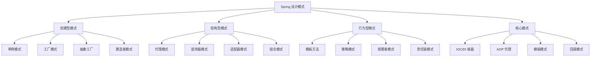

---

## 二、创建型模式

### 2.1 单例模式（Singleton）

Spring 默认将 Bean 作用域设置为单例，意味着每个 Bean 只会被创建一次。

#### 2.1.1 Spring 单例与普通单例的区别

| 类型 | 创建方式 | 线程安全 | 适用场景 |
| :--- | :--- | :--- | :--- |
| **饿汉式** | 类加载时创建 | 安全 | 需要预加载 |
| **懒汉式** | 首次调用时创建 | 不安全（需同步） | 延迟加载 |
| **Spring 单例** | IOC 容器管理 | 安全（由容器保证） | 企业应用 |

#### 2.1.2 Spring Bean 作用域

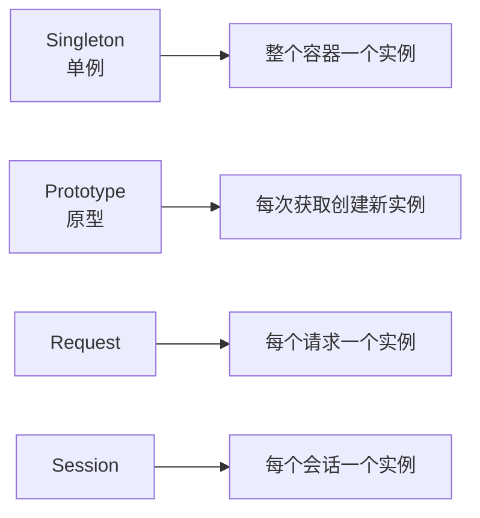

| 作用域 | 说明 |
| :--- | :--- |
| **singleton** | 默认作用域，整个容器一个实例 |
| **prototype** | 每次获取创建新实例 |
| **request** | 每个 HTTP 请求一个实例 |
| **session** | 每个 HTTP 会话一个实例 |
| **application** | 每个 ServletContext 一个实例 |
| **websocket** | 每个 WebSocket 一个实例 |

### 2.2 工厂模式（Factory）

Spring 使用 BeanFactory 作为工厂来创建 Bean 实例。

#### 2.2.1 工厂模式结构

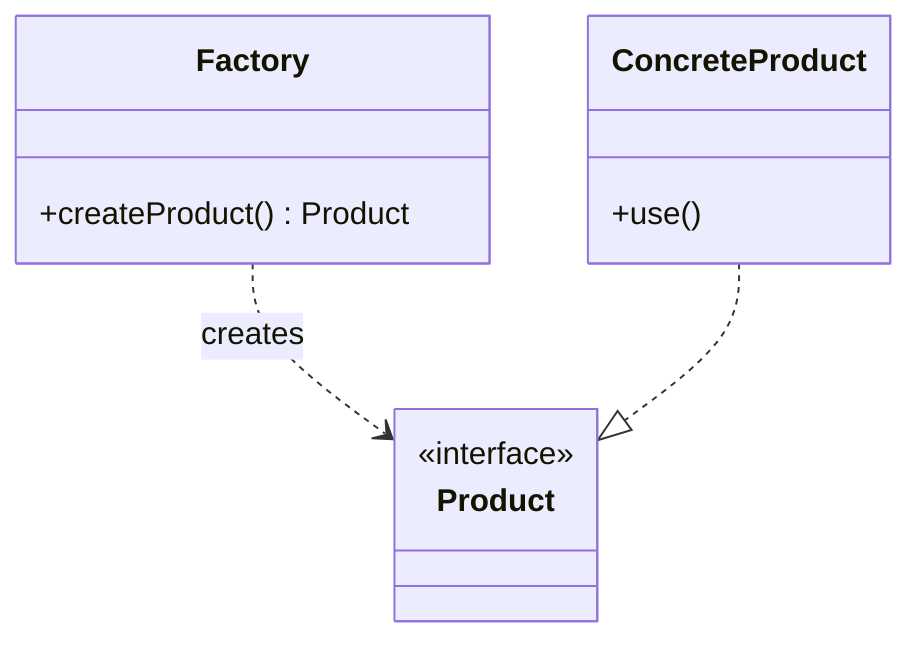

#### 2.2.2 Spring BeanFactory 体系

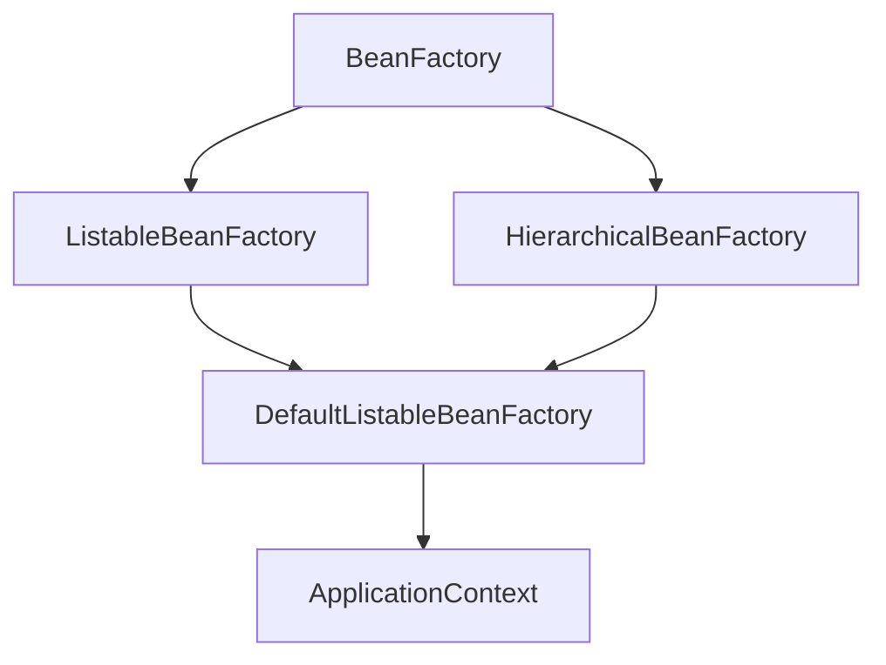

| 接口 | 说明 |
| :--- | :--- |
| **BeanFactory** | 最基础的工厂接口 |
| **ListableBeanFactory** | 可枚举的 Bean 工厂 |
| **HierarchicalBeanFactory** | 层级 Bean 工厂 |
| **ApplicationContext** | 应用上下文 |

### 2.3 抽象工厂模式（Abstract Factory）

Spring 的 `BeanFactory` 层次结构体现了抽象工厂模式的思想。

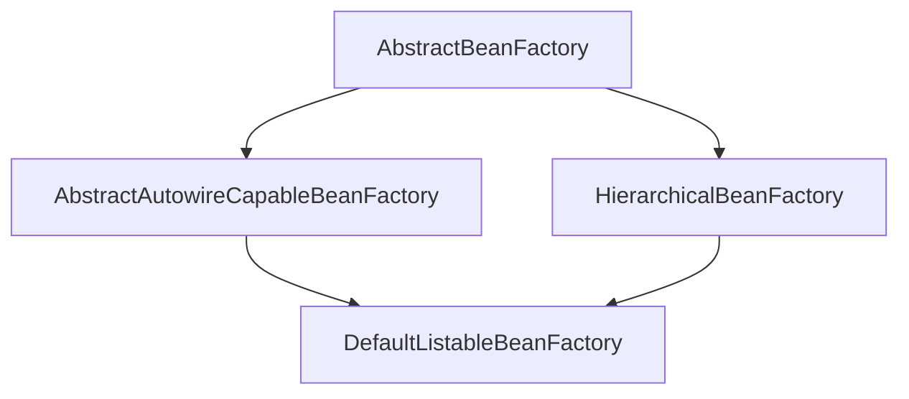

### 2.4 建造者模式（Builder）

Spring 使用 `BeanDefinitionBuilder` 来构建 Bean 定义。

```java
BeanDefinitionBuilder builder = BeanDefinitionBuilder.genericBeanDefinition(UserService.class);
builder.addPropertyValue("name", "张三");
builder.setScope(BeanDefinition.SCOPE_SINGLETON);
BeanDefinition definition = builder.getBeanDefinition();
```

---

## 三、结构型模式

### 3.1 代理模式（Proxy）

Spring AOP 的核心就是代理模式，包括 JDK 动态代理和 CGLIB 代理。

#### 3.1.1 代理模式结构

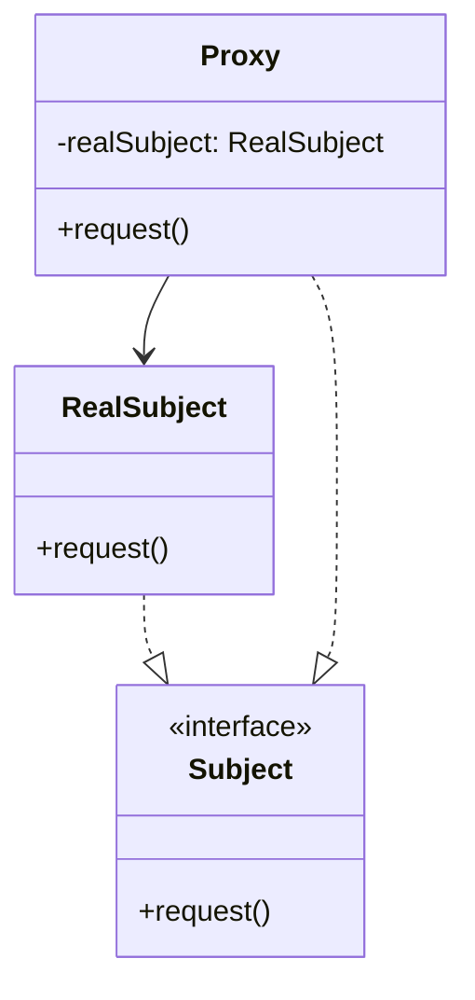

#### 3.1.2 JDK 动态代理 vs CGLIB

| 代理方式 | 实现方式 | 适用场景 | 性能 |
| :--- | :--- | :--- | :--- |
| **JDK 动态代理** | 实现接口 | 有接口的类 | 较快 |
| **CGLIB 代理** | 继承类 | 无接口的类 | 稍慢 |

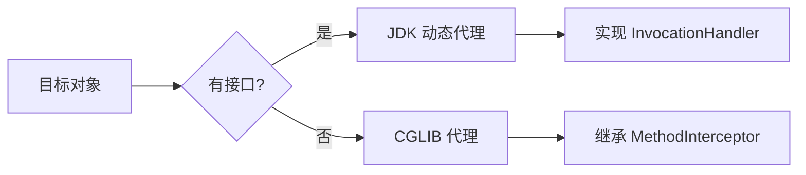

### 3.2 装饰器模式（Decorator）

Spring 使用装饰器模式增强 InputStream、Reader 等类。

#### 3.2.1 装饰器模式结构

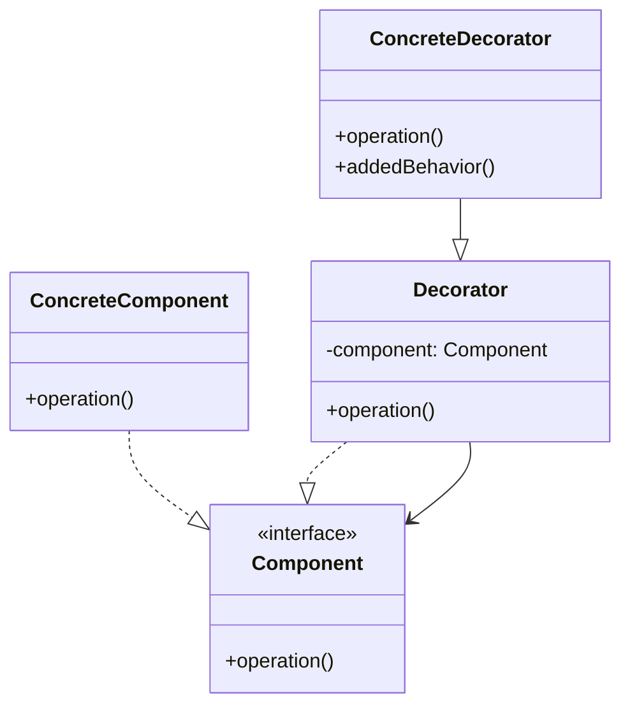

#### 3.2.2 Spring 中的应用

- `BufferedInputStream` 装饰 `InputStream`
- `DataInputStream` 装饰 `InputStream`
- `Reader` 的各种装饰器类

### 3.3 适配器模式（Adapter）

Spring MVC 的 `HandlerAdapter` 使用适配器模式来处理不同类型的处理器。

#### 3.3.1 适配器模式结构

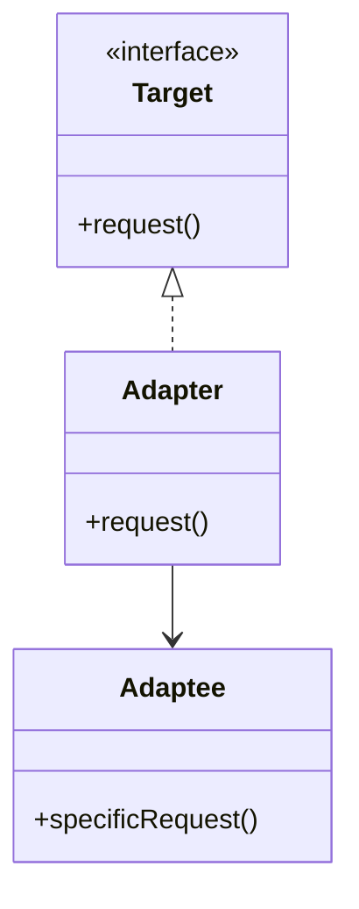

#### 3.3.2 Spring HandlerAdapter

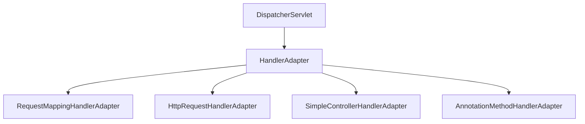

### 3.4 组合模式（Composite）

Spring 使用组合模式来处理资源文件，如 `ClassPathResource`、`FileSystemResource` 等。

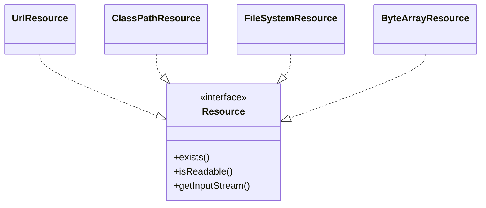

---

## 四、行为型模式

### 4.1 模板方法模式（Template Method）

Spring 的 `AbstractApplicationContext` 使用模板方法模式定义容器初始化的骨架。

#### 4.1.1 模板方法模式结构

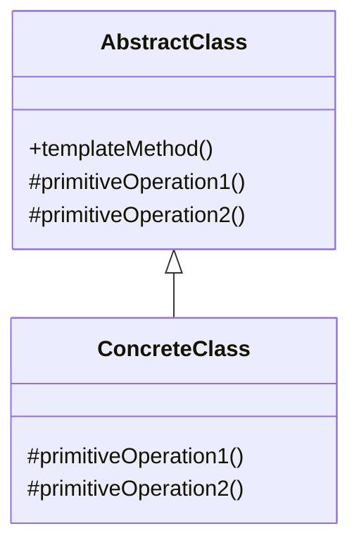

#### 4.1.2 AbstractApplicationContext

```java
public abstract class AbstractApplicationContext {
    
    // 模板方法
    public void refresh() throws BeansException {
        prepareRefresh();
        // ... 其他步骤
        finishBeanFactoryInitialization(beanFactory);
    }
    
    // 钩子方法 - 子类实现
    protected abstract void postProcessBeanFactory(ConfigurableListableBeanFactory beanFactory);
}
```

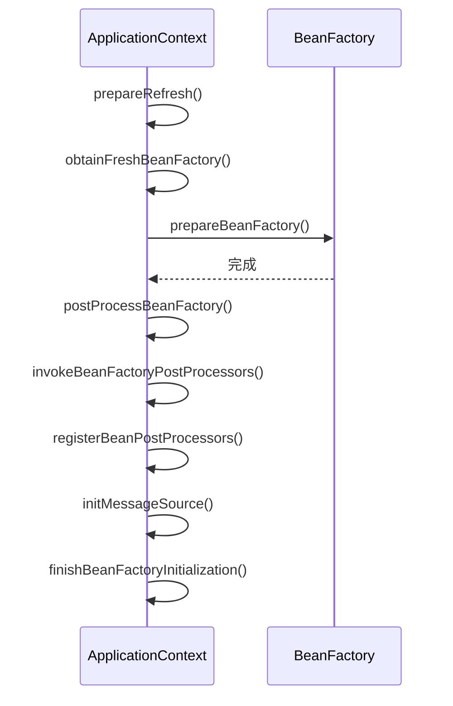

### 4.2 策略模式（Strategy）

Spring 的 `Resource` 接口使用策略模式来处理不同类型的资源。

#### 4.2.1 策略模式结构

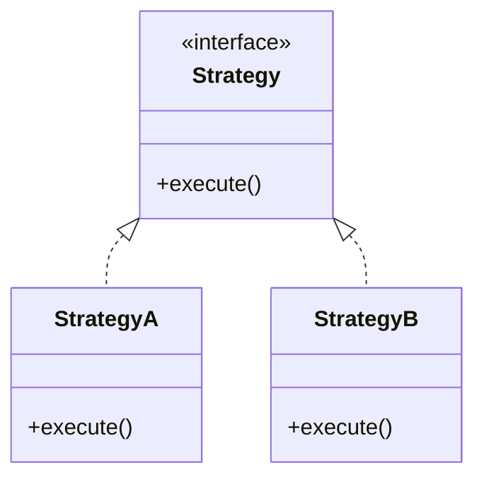

#### 4.2.2 Spring Resource 策略体系

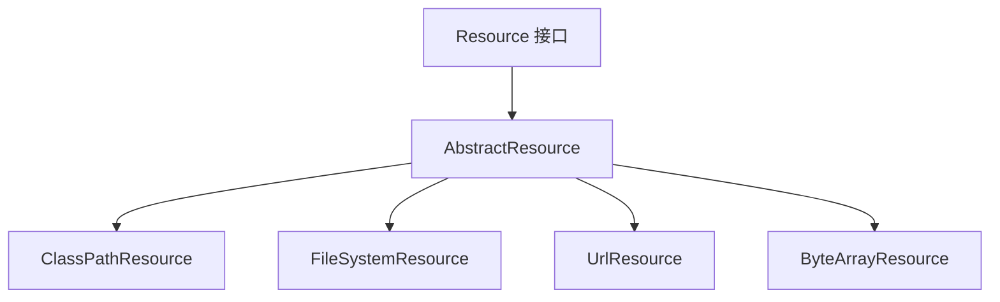

### 4.3 观察者模式（Observer）

Spring 事件机制基于观察者模式，实现应用组件间的解耦。

#### 4.3.1 观察者模式结构

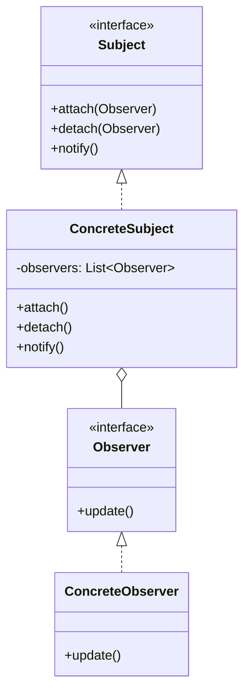

#### 4.3.2 Spring 事件机制

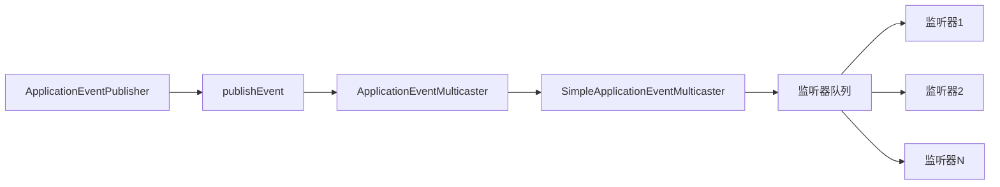

| 组件 | 说明 |
| :--- | :--- |
| **ApplicationEvent** | 事件基类 |
| **ApplicationListener** | 事件监听器接口 |
| **ApplicationEventPublisher** | 事件发布器 |
| **ApplicationEventMulticaster** | 事件多播器 |

### 4.4 责任链模式（Chain of Responsibility）

Spring Security 使用责任链模式处理安全过滤。

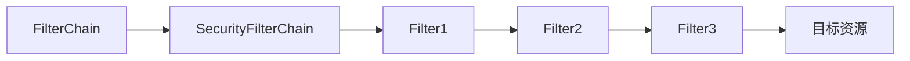

#### Spring Security Filter Chain

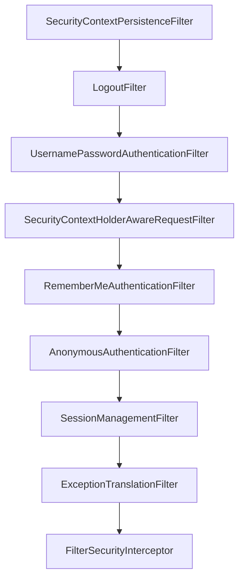

---

## 五、核心模式

### 5.1 IOC/DI 容器

IOC（控制反转）和 DI（依赖注入）是 Spring 的核心。

#### 5.1.1 IOC 原理

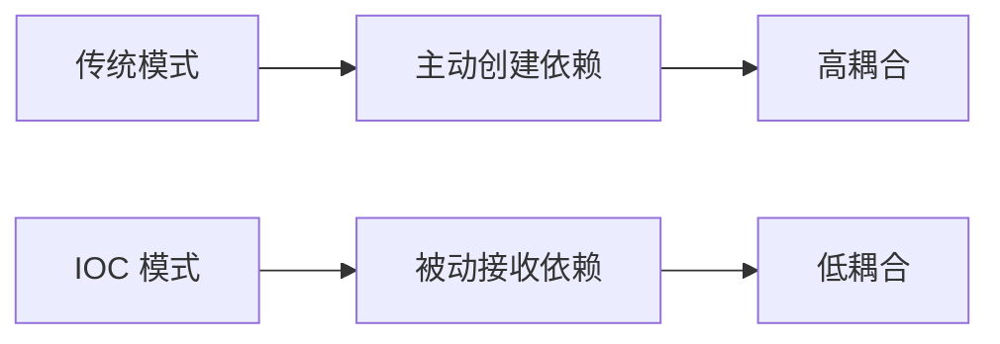

| 注入方式 | 说明 |
| :--- | :--- |
| **构造器注入** | 通过构造函数注入 |
| **Setter 注入** | 通过 setter 方法注入 |
| **字段注入** | 直接注入字段（不推荐） |

#### 5.1.2 Spring 容器初始化流程

```mermaid
flowchart TD
    A[加载配置] --> B[解析 Bean 定义]
    B --> C[注册 Bean 定义]
    C --> D[实例化 Bean]
    D --> E[属性填充]
    E --> F[初始化]
    F --> G[Bean 就绪]
    G --> H[容器关闭]
    H --> I[销毁 Bean]
```

### 5.2 AOP 代理模式

AOP（面向切面编程）基于代理模式实现。

#### 5.2.1 AOP 核心概念

| 概念 | 说明 |
| :--- | :--- |
| **Join Point** | 连接点，可被拦截的方法 |
| **Pointcut** | 切点，定义拦截规则 |
| **Advice** | 通知，拦截后的处理逻辑 |
| **Aspect** | 切面，Pointcut + Advice |
| **Weaving** | 织入，将切面应用到目标对象 |

```mermaid
flowchart TD
    A[目标对象] --> B[代理对象]
    B --> C[前置通知]
    C --> D[目标方法]
    D --> E[返回通知]
    E --> F[后置通知]
    F --> G[结果]
```

#### 5.2.2 通知类型

| 通知类型 | 说明 | 执行时机 |
| :--- | :--- | :--- |
| **@Before** | 前置通知 | 方法执行前 |
| **@AfterReturning** | 返回通知 | 方法正常返回后 |
| **@AfterThrowing** | 异常通知 | 方法抛出异常后 |
| **@After** | 后置通知 | 方法执行后（finally） |
| **@Around** | 环绕通知 | 方法执行前后 |

### 5.3 模板模式应用

Spring 大量使用模板模式，如 `JdbcTemplate`、`RestTemplate`、`RabbitTemplate` 等。

```mermaid
classDiagram
    class JdbcAccessor {
        <<abstract>>
        -dataSource: DataSource
        +setDataSource()
    }
    class JdbcTemplate {
        +query()
        +update()
        +execute()
    }
    
    JdbcAccessor <|-- JdbcTemplate
```

### 5.4 回调模式（Template Callback）

Spring 的模板方法模式与回调模式结合使用。

```java
// JdbcTemplate 的回调模式
List<User> users = jdbcTemplate.query(sql, (rs, rowNum) -> {
    User user = new User();
    user.setId(rs.getLong("id"));
    user.setName(rs.getString("name"));
    return user;
});
```

---

## 六、总结

### 6.1 设计模式总览

| 模式类型 | 设计模式 | Spring 应用 |
| :--- | :--- | :--- |
| **创建型** | 单例模式 | Bean 默认作用域 |
| **创建型** | 工厂模式 | BeanFactory |
| **创建型** | 抽象工厂 | BeanFactory 层次结构 |
| **创建型** | 建造者模式 | BeanDefinitionBuilder |
| **结构型** | 代理模式 | AOP 动态代理 |
| **结构型** | 装饰器模式 | InputStream 装饰器 |
| **结构型** | 适配器模式 | HandlerAdapter |
| **结构型** | 组合模式 | Resource 接口体系 |
| **行为型** | 模板方法 | AbstractApplicationContext |
| **行为型** | 策略模式 | Resource 接口体系 |
| **行为型** | 观察者模式 | 事件监听机制 |
| **行为型** | 责任链模式 | FilterChain |
| **核心型** | IOC/DI | 依赖注入容器 |
| **核心型** | AOP | 面向切面编程 |
| **核心型** | 模板+回调 | JdbcTemplate 等 |

### 6.2 设计模式的价值

1. **代码复用**：通用模式可复用
2. **易于维护**：结构清晰，易于理解
3. **解耦**：降低组件间耦合
4. **扩展性**：便于功能扩展

### 6.3 学习建议

1. 理解每种模式的核心思想
2. 结合 Spring 源码理解实现
3. 在实际项目中应用设计模式
4. 避免过度设计，适度使用