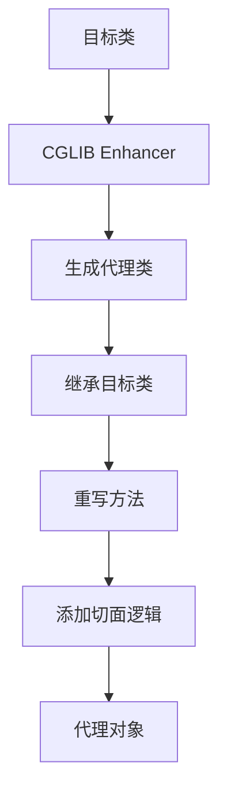
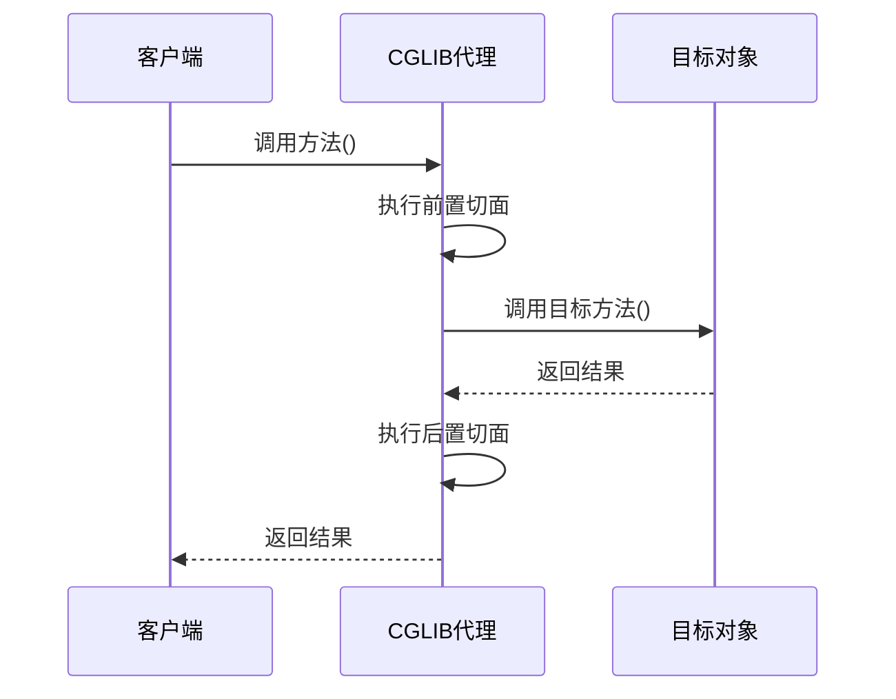
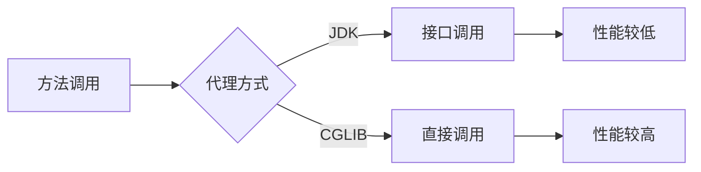

# SpringBoot为什么默认使用CGLIB

## 一、代理模式概述

Spring AOP支持两种代理方式：

| 代理方式 | 原理 | 要求 |
|----------|------|------|
| **JDK动态代理** | 基于接口 | 目标类必须实现接口 |
| **CGLIB代理** | 基于继承 | 目标类可以没有接口 |

## 二、为什么选择CGLIB

### 2.1 默认配置

SpringBoot 2.0+默认使用CGLIB：

```java
// SpringBoot自动配置
@Configuration
public class AopAutoConfiguration {
    
    @Bean
    @ConditionalOnMissingBean
    public ProxyCreatorSupport proxyCreatorSupport() {
        ProxyCreatorSupport support = new ProxyCreatorSupport();
        support.setProxyTargetClass(true); // 默认使用CGLIB
        return support;
    }
}
```

### 2.2 选择CGLIB的原因

| 因素 | JDK动态代理 | CGLIB |
|------|------------|-------|
| **接口要求** | 必须实现接口 | 无接口要求 |
| **代理方式** | 实现接口 | 继承目标类 |
| **方法拦截** | 只能拦截接口方法 | 可以拦截所有方法 |
| **性能** | 较低 | 较高 |
| **灵活性** | 受限 | 更灵活 |

## 三、CGLIB原理

### 3.1 代理生成过程



### 3.2 CGLIB代理类结构

```
目标类: UserService
代理类: UserService$$EnhancerByCGLIB$$xxxx
    - 继承 UserService
    - 重写所有非final方法
    - 添加MethodInterceptor
```

### 3.3 方法调用流程



## 四、JDK动态代理 vs CGLIB

### 4.1 对比表格

| 特性 | JDK动态代理 | CGLIB |
|------|------------|-------|
| **Java版本** | JDK 1.3+ | 需要额外依赖 |
| **代理对象创建** | 通过Proxy.newProxyInstance | 通过Enhancer.create |
| **方法调用方式** | 接口方法调用 | 直接方法调用 |
| **性能** | 调用稍慢 | 调用较快 |
| **生成类数量** | 一个代理类 | 可能生成多个类 |
| **final方法** | 不影响 | 无法拦截 |
| **构造函数** | 不调用 | 调用两次 |

### 4.2 性能对比



## 五、配置代理方式

### 5.1 强制使用JDK动态代理

```java
@Configuration
@EnableAspectJAutoProxy(proxyTargetClass = false)
public class AppConfig {
    // ...
}
```

### 5.2 强制使用CGLIB

```java
@Configuration
@EnableAspectJAutoProxy(proxyTargetClass = true)
public class AppConfig {
    // ...
}
```

### 5.3 SpringBoot配置

```yaml
spring:
  aop:
    proxy-target-class: true  # true=CGLIB, false=JDK
```

## 六、CGLIB的局限性

### 6.1 无法拦截的方法

| 方法类型 | 是否可拦截 | 原因 |
|----------|------------|------|
| **final方法** | 否 | 无法被重写 |
| **static方法** | 否 | 不属于实例方法 |
| **private方法** | 否 | 无法被继承 |

### 6.2 构造函数调用问题

```java
public class UserService {
    public UserService() {
        System.out.println("构造函数被调用");
    }
}

// CGLIB创建代理时会调用两次构造函数
// 1. 创建父类实例
// 2. 创建代理类实例
```

### 6.3 解决构造函数调用问题

```java
// 使用Objenesis跳过构造函数调用
Enhancer enhancer = new Enhancer();
enhancer.setSuperclass(UserService.class);
enhancer.setCallback(new MyMethodInterceptor());
enhancer.setUseFactory(false);
enhancer.setInterceptDuringConstruction(false);

// 使用Objenesis创建实例
Objenesis objenesis = new ObjenesisStd(true);
UserService proxy = (UserService) objenesis.newInstance(proxyClass);
```

## 七、最佳实践

### 7.1 选择建议

| 场景 | 推荐代理方式 |
|------|-------------|
| **目标类有接口** | JDK动态代理 |
| **目标类无接口** | CGLIB |
| **需要拦截所有方法** | CGLIB |
| **追求极致性能** | CGLIB |

### 7.2 注意事项

1. **避免final方法**：需要被拦截的方法不要声明为final
2. **构造函数逻辑**：避免在构造函数中执行重要业务逻辑
3. **代理类缓存**：CGLIB会缓存生成的代理类，避免重复生成
4. **内存管理**：CGLIB生成的代理类会占用PermGen（Java 7及以前）

## 八、总结

SpringBoot默认使用CGLIB的原因：

1. **无接口限制**：可以代理任何类，不需要实现接口
2. **更好的性能**：方法调用更直接，性能更好
3. **更灵活**：可以拦截所有非final方法
4. **现代Java环境**：Java 8+对PermGen的限制已大大放宽

**CGLIB不是完美的，但在大多数场景下是更好的选择！**
