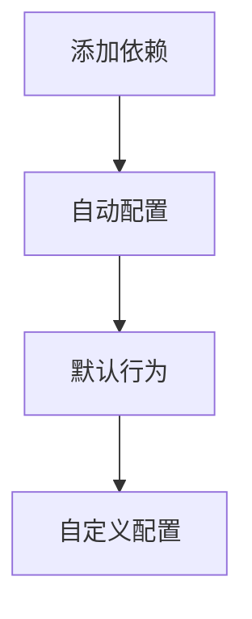
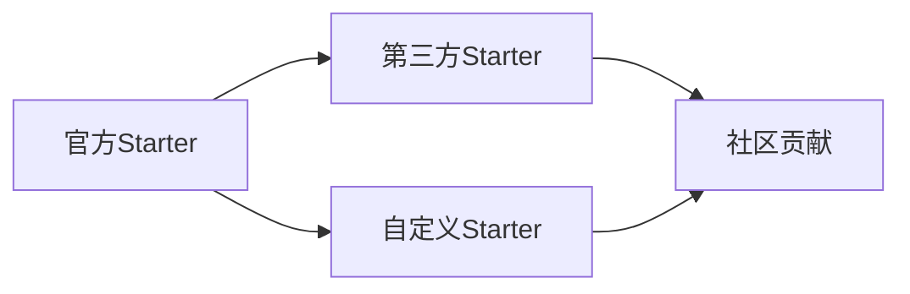
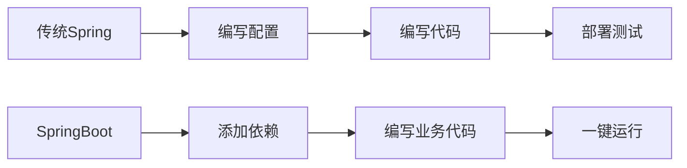
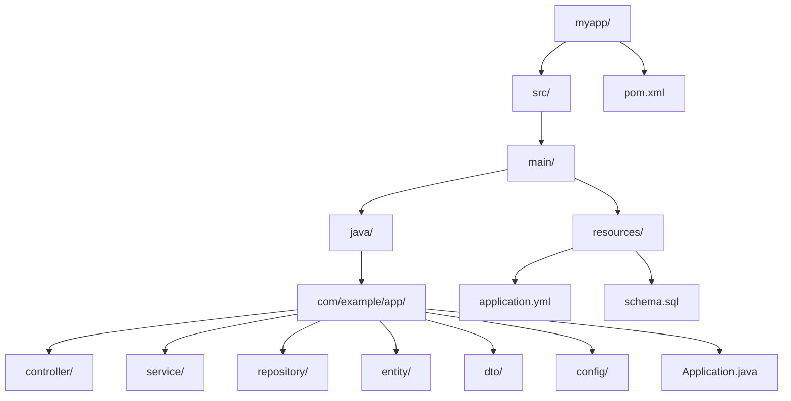

# 谈谈对SpringBoot的理解

## 一、SpringBoot是什么

SpringBoot是一个**快速开发框架**，基于Spring Framework，提供：

| 特性 | 说明 |
|------|------|
| **自动配置** | 根据依赖自动配置Bean |
| **约定优于配置** | 减少样板代码 |
| **内嵌服务器** | 无需外部服务器 |
| **可执行Jar** | 简化部署 |
| **Starter依赖** | 一站式依赖管理 |

## 二、核心设计理念

### 2.1 约定优于配置



### 2.2 开箱即用

```java
// 一个注解即可启动应用
@SpringBootApplication
public class Application {
    public static void main(String[] args) {
        SpringApplication.run(Application.class, args);
    }
}
```

### 2.3 社区驱动



## 三、核心组件

### 3.1 @SpringBootApplication

```java
@SpringBootConfiguration  // 等同于@Configuration
@EnableAutoConfiguration  // 启用自动配置
@ComponentScan           // 扫描组件
public @interface SpringBootApplication {
    // ...
}
```

### 3.2 SpringApplication

```java
public class SpringApplication {
    public static ConfigurableApplicationContext run(Class<?> primarySource, String... args) {
        return new SpringApplication(primarySource).run(args);
    }
}
```

### 3.3 自动配置机制

```mermaid
flowchart TD
    A[spring.factories] --> B[EnableAutoConfiguration]
    B --> C[配置类列表]
    C --> D[@Conditional条件判断]
    D --> E[注册Bean]
```

## 四、SpringBoot的优势

### 4.1 开发效率



### 4.2 生态系统

| 领域 | SpringBoot生态 |
|------|---------------|
| **Web** | SpringMVC、Spring WebFlux |
| **数据** | JPA、MongoDB、Redis |
| **安全** | Spring Security |
| **消息** | Kafka、RabbitMQ |
| **监控** | Actuator、Micrometer |

### 4.3 生产就绪

```yaml
# 生产环境配置
server:
  port: 8080
  
spring:
  datasource:
    url: ${DB_URL}
    username: ${DB_USERNAME}
    password: ${DB_PASSWORD}

management:
  endpoints:
    web:
      exposure:
        include: health,metrics,info
```

## 五、典型使用场景

### 5.1 Web应用

```java
@RestController
@RequestMapping("/api")
public class UserController {
    
    @Autowired
    private UserService userService;
    
    @GetMapping("/users")
    public List<User> getAllUsers() {
        return userService.findAll();
    }
    
    @GetMapping("/users/{id}")
    public User getUserById(@PathVariable Long id) {
        return userService.findById(id);
    }
}
```

### 5.2 定时任务

```java
@SpringBootApplication
@EnableScheduling
public class Application {
    
    @Scheduled(fixedRate = 10000)
    public void scheduledTask() {
        // 每10秒执行一次
        System.out.println("定时任务执行中...");
    }
}
```

### 5.3 异步处理

```java
@SpringBootApplication
@EnableAsync
public class Application {
    
    @Async
    public CompletableFuture<String> processAsync() {
        // 异步处理
        return CompletableFuture.completedFuture("result");
    }
}
```

## 六、最佳实践

### 6.1 项目结构



### 6.2 配置管理

```yaml
# application.yml
spring:
  profiles:
    active: ${SPRING_PROFILES_ACTIVE:dev}

---
# 开发环境
spring:
  config:
    activate:
      on-profile: dev
  datasource:
    url: jdbc:h2:mem:testdb

---
# 生产环境
spring:
  config:
    activate:
      on-profile: prod
  datasource:
    url: ${DB_URL}
```

## 七、总结

SpringBoot的核心价值：

1. **简化配置**：自动配置减少样板代码
2. **提高效率**：开箱即用，快速上手
3. **生态完善**：丰富的Starter和社区支持
4. **生产就绪**：内置监控、健康检查等功能
5. **灵活扩展**：支持自定义配置和扩展

**SpringBoot不是替代Spring，而是让Spring更好用！**
