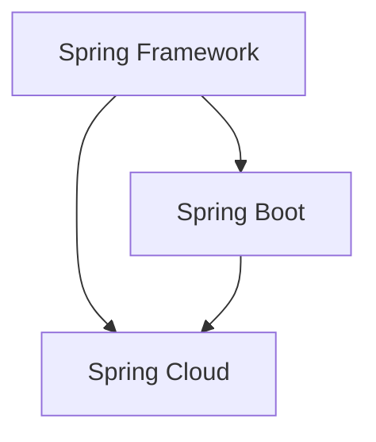
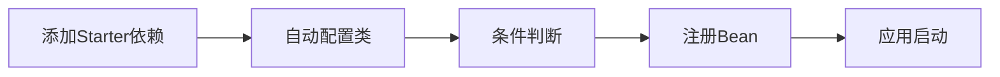

# Spring与SpringBoot的关系和区别

## 一、关系概述



**关系说明**：
- **Spring Framework**：核心框架，提供IoC、AOP等基础能力
- **Spring Boot**：基于Spring Framework，简化配置
- **Spring Cloud**：基于Spring Boot，提供微服务能力

## 二、核心区别

### 2.1 对比表格

| 特性 | Spring Framework | Spring Boot |
|------|------------------|-------------|
| **配置方式** | XML/Java配置 | 自动配置 |
| **依赖管理** | 手动管理 | Starter依赖 |
| **部署方式** | WAR包 | 可执行Jar |
| **内嵌服务器** | 无 | 内置Tomcat/Jetty/Undertow |
| **代码量** | 较多 | 较少 |
| **启动方式** | 复杂 | 简单（main方法） |
| **约定配置** | 较少 | 约定优于配置 |

### 2.2 配置方式对比

**Spring配置（XML方式）：**

```xml
<?xml version="1.0" encoding="UTF-8"?>
<beans xmlns="http://www.springframework.org/schema/beans"
       xmlns:xsi="http://www.w3.org/2001/XMLSchema-instance"
       xsi:schemaLocation="http://www.springframework.org/schema/beans
                           http://www.springframework.org/schema/beans/spring-beans.xsd">
    
    <bean id="dataSource" class="org.apache.commons.dbcp.BasicDataSource">
        <property name="driverClassName" value="com.mysql.cj.jdbc.Driver"/>
        <property name="url" value="jdbc:mysql://localhost:3306/test"/>
        <property name="username" value="root"/>
        <property name="password" value="password"/>
    </bean>
    
    <bean id="jdbcTemplate" class="org.springframework.jdbc.core.JdbcTemplate">
        <property name="dataSource" ref="dataSource"/>
    </bean>
</beans>
```

**SpringBoot配置（YAML方式）：**

```yaml
spring:
  datasource:
    url: jdbc:mysql://localhost:3306/test
    username: root
    password: password
```

### 2.3 启动方式对比

**Spring启动：**

```java
public class Main {
    public static void main(String[] args) {
        ApplicationContext context = 
            new ClassPathXmlApplicationContext("applicationContext.xml");
        MyService service = context.getBean(MyService.class);
        service.doSomething();
    }
}
```

**SpringBoot启动：**

```java
@SpringBootApplication
public class Application {
    public static void main(String[] args) {
        SpringApplication.run(Application.class, args);
    }
}
```

## 三、SpringBoot的核心优势

### 3.1 自动配置



### 3.2 Starter依赖

| Starter | 说明 |
|---------|------|
| `spring-boot-starter-web` | Web应用开发 |
| `spring-boot-starter-data-jpa` | JPA数据访问 |
| `spring-boot-starter-security` | 安全框架 |
| `spring-boot-starter-test` | 测试支持 |

### 3.3 内嵌服务器

```yaml
server:
  port: 8080
  
# 切换服务器
spring:
  main:
    web-application-type: servlet  # servlet/reactive/none

# 配置Tomcat
server:
  tomcat:
    threads:
      max: 200
```

## 四、如何选择

| 场景 | 推荐选择 |
|------|----------|
| **新项目** | SpringBoot |
| **遗留系统** | Spring Framework |
| **微服务** | SpringBoot + Spring Cloud |
| **简单工具类** | Spring Framework |

## 五、总结

**Spring vs SpringBoot：**

| 维度 | Spring | SpringBoot |
|------|--------|------------|
| **定位** | 核心框架 | 快速开发工具 |
| **配置** | 显式配置 | 自动配置 |
| **复杂度** | 较高 | 较低 |
| **适用场景** | 灵活定制 | 快速开发 |

**最佳实践**：
- 新项目优先使用SpringBoot
- 需要高度定制时使用Spring Framework
- 微服务架构使用SpringBoot + Spring Cloud
