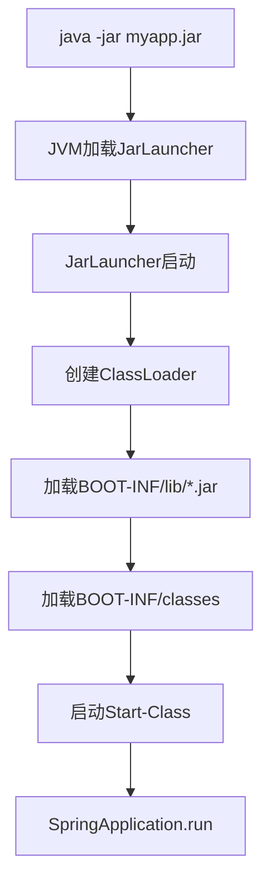
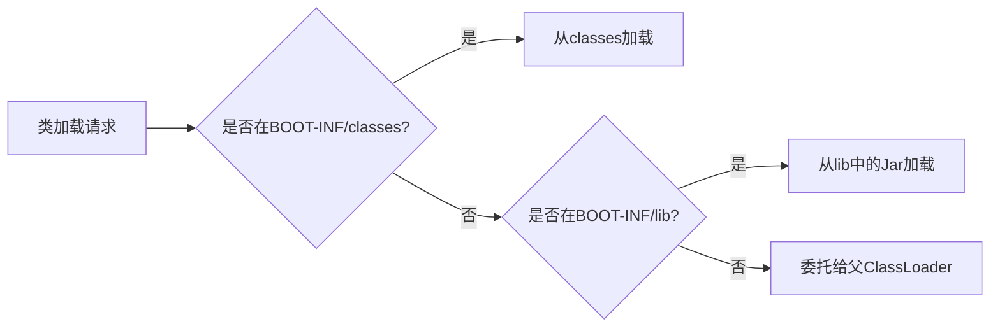

# SpringBoot可执行Jar原理

## 一、为什么SpringBoot的Jar可以直接运行

SpringBoot使用**可执行Jar**格式，包含：
- 应用代码
- 依赖Jar
- 内嵌服务器
- 启动器

## 二、Jar包结构

```
myapp.jar
├── META-INF/
│   ├── MANIFEST.MF
│   └── spring-boot/
├── BOOT-INF/
│   ├── classes/          # 应用代码
│   │   └── com/example/
│   └── lib/              # 依赖Jar
│       ├── spring-core.jar
│       ├── spring-boot.jar
│       └── ...
└── org/
    └── springframework/
        └── boot/
            └── loader/    # Spring Boot Loader
```

## 三、MANIFEST.MF配置

```properties
Manifest-Version: 1.0
Main-Class: org.springframework.boot.loader.JarLauncher
Start-Class: com.example.Application
Spring-Boot-Version: 3.2.0
```

**关键配置说明：**

| 属性 | 说明 |
|------|------|
| `Main-Class` | Java命令执行的入口类 |
| `Start-Class` | 应用的主类 |
| `Spring-Boot-Version` | SpringBoot版本 |

## 四、启动流程



## 五、Spring Boot Loader

### 5.1 核心类

| 类 | 作用 |
|------|------|
| `JarLauncher` | Jar格式启动器 |
| `WarLauncher` | War格式启动器 |
| `PropertiesLauncher` | 支持外部配置的启动器 |
| `LaunchedURLClassLoader` | 自定义类加载器 |

### 5.2 类加载顺序



## 六、可执行Jar的优势

| 特性 | 说明 |
|------|------|
| **自包含** | 包含所有依赖，无需外部依赖 |
| **可移植** | 只需Java环境即可运行 |
| **一致性** | 开发、测试、生产环境一致 |
| **简化部署** | 只需复制一个Jar文件 |

## 七、打包配置

**pom.xml配置：**

```xml
<build>
    <plugins>
        <plugin>
            <groupId>org.springframework.boot</groupId>
            <artifactId>spring-boot-maven-plugin</artifactId>
            <configuration>
                <mainClass>com.example.Application</mainClass>
            </configuration>
            <executions>
                <execution>
                    <goals>
                        <goal>repackage</goal>
                    </goals>
                </execution>
            </executions>
        </plugin>
    </plugins>
</build>
```

## 八、运行命令

```bash
# 基本运行
java -jar myapp.jar

# 指定配置文件
java -jar myapp.jar --spring.config.location=file:/config/application.yml

# 指定JVM参数
java -Xms512m -Xmx1024m -jar myapp.jar

# 指定端口
java -jar myapp.jar --server.port=8081
```

## 九、总结

SpringBoot可执行Jar的核心是：
1. 特殊的Jar结构（BOOT-INF目录）
2. 自定义类加载器（LaunchedURLClassLoader）
3. JarLauncher作为启动入口
4. 内嵌服务器支持
