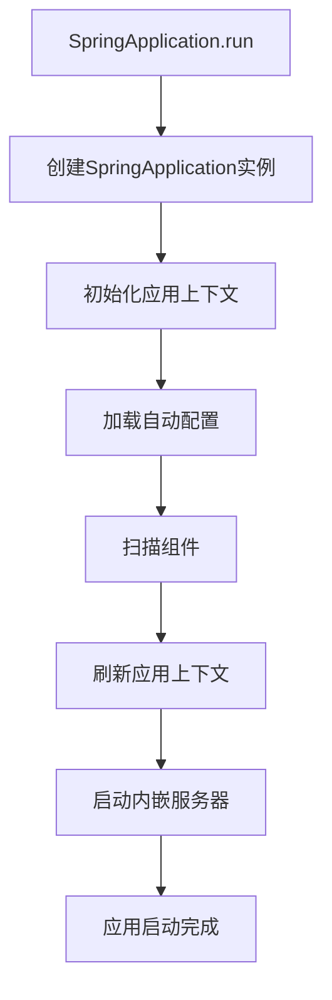
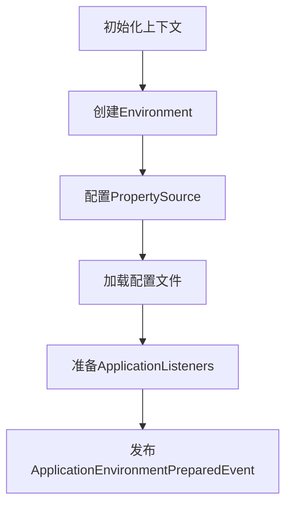
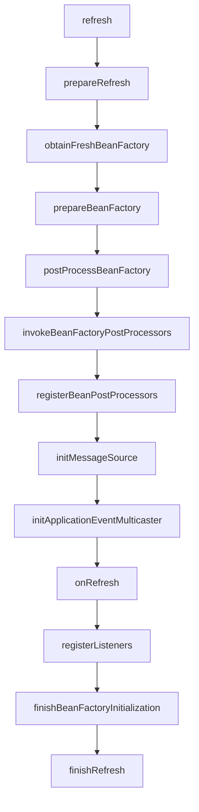
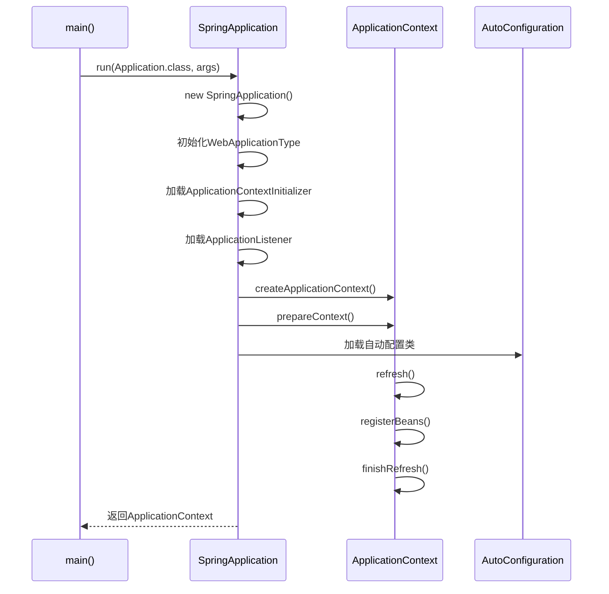

# SpringBoot启动原理解析

## 一、启动入口

```java
@SpringBootApplication
public class Application {
    public static void main(String[] args) {
        SpringApplication.run(Application.class, args);
    }
}
```

## 二、启动流程



## 三、核心阶段详解

### 3.1 SpringApplication实例创建

```java
public SpringApplication(ResourceLoader resourceLoader, Class<?>... primarySources) {
    this.resourceLoader = resourceLoader;
    this.primarySources = new LinkedHashSet<>(Arrays.asList(primarySources));
    this.webApplicationType = WebApplicationType.deduceFromClasspath();
    setInitializers((Collection) getSpringFactoriesInstances(ApplicationContextInitializer.class));
    setListeners((Collection) getSpringFactoriesInstances(ApplicationListener.class));
    this.mainApplicationClass = deduceMainApplicationClass();
}
```

### 3.2 应用上下文初始化



### 3.3 自动配置加载

```java
// SpringFactoriesLoader加载自动配置
List<String> configurations = SpringFactoriesLoader.loadFactoryNames(
    EnableAutoConfiguration.class, classLoader);
```

### 3.4 组件扫描

```java
// @SpringBootApplication包含@ComponentScan
@ComponentScan(basePackages = "com.example")
```

### 3.5 应用上下文刷新



### 3.6 内嵌服务器启动

```java
// 在onRefresh阶段启动
if (this.webApplicationType != WebApplicationType.NONE) {
    ServletContext servletContext = getServletContext();
    if (servletContext != null) {
        // 注册Servlet、Filter等
    }
}
```

## 四、关键注解

| 注解 | 作用 |
|------|------|
| `@SpringBootApplication` | 组合注解，包含以下三个 |
| `@SpringBootConfiguration` | 等同于@Configuration |
| `@EnableAutoConfiguration` | 启用自动配置 |
| `@ComponentScan` | 扫描组件 |

## 五、启动流程时序图



## 六、总结

SpringBoot启动流程：
1. 创建SpringApplication实例
2. 初始化Environment
3. 加载自动配置类
4. 扫描并注册Bean
5. 刷新应用上下文
6. 启动内嵌服务器
