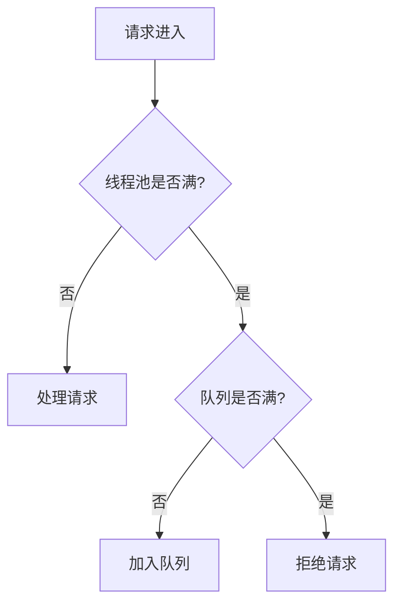

# SpringBoot并发请求处理

## 一、并发能力决定因素

SpringBoot的并发处理能力取决于以下因素：

| 因素 | 说明 | 默认值 |
|------|------|--------|
| **Tomcat线程池** | 处理HTTP请求的线程数 | 200 |
| **CPU核心数** | 影响线程池最优大小 | - |
| **IO等待时间** | 数据库、网络调用耗时 | - |
| **JVM堆内存** | 影响可创建线程数 | - |

## 二、Tomcat线程池配置

```yaml
server:
  tomcat:
    threads:
      max: 500              # 最大线程数
      min-spare: 100         # 最小空闲线程数
      max-queue-size: 1000   # 请求队列最大容量
    connection-timeout: 20000  # 连接超时时间(毫秒)
```

**线程池计算公式：**

```
最佳线程数 = CPU核心数 × (1 + IO等待时间 / CPU计算时间)
```

## 三、异步处理配置

### 3.1 启用异步支持

```java
@SpringBootApplication
@EnableAsync
public class Application {
    public static void main(String[] args) {
        SpringApplication.run(Application.class, args);
    }
}
```

### 3.2 配置异步线程池

```java
@Configuration
public class AsyncConfig {
    
    @Bean(name = "taskExecutor")
    public Executor taskExecutor() {
        ThreadPoolTaskExecutor executor = new ThreadPoolTaskExecutor();
        executor.setCorePoolSize(10);
        executor.setMaxPoolSize(50);
        executor.setQueueCapacity(1000);
        executor.setThreadNamePrefix("Async-");
        executor.initialize();
        return executor;
    }
}
```

### 3.3 使用异步方法

```java
@Service
public class MyService {
    
    @Async("taskExecutor")
    public CompletableFuture<String> processAsync() {
        // 异步处理逻辑
        return CompletableFuture.completedFuture("result");
    }
}
```

## 四、提高并发能力的策略



**优化策略：**
1. 调整线程池大小
2. 使用异步处理
3. 引入缓存减少IO
4. 使用消息队列异步解耦
5. 水平扩展多个实例
