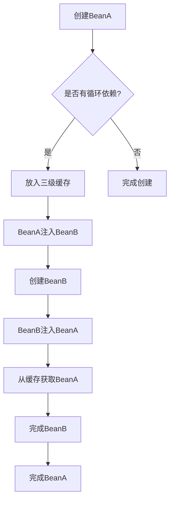

# SpringBoot循环依赖问题

## 一、什么是循环依赖

循环依赖指两个或多个Bean之间互相依赖：


## 二、Spring如何解决循环依赖

### 2.1 三级缓存机制



### 2.2 缓存说明

| 缓存级别 | 名称 | 存储内容 |
|----------|------|----------|
| **一级缓存** | singletonObjects | 完全初始化的Bean |
| **二级缓存** | earlySingletonObjects | 提前暴露的Bean |
| **三级缓存** | singletonFactories | Bean工厂 |

## 三、为什么SpringBoot禁止循环依赖

### 3.1 问题原因

SpringBoot 2.6+默认禁止循环依赖：

```yaml
spring:
  main:
    allow-circular-references: false  # 默认值
```

### 3.2 禁止原因

| 问题 | 说明 |
|------|------|
| **设计缺陷** | 循环依赖通常表示设计不佳 |
| **初始化顺序** | 可能导致Bean未完全初始化 |
| **AOP问题** | 代理对象创建时机问题 |
| **可维护性** | 代码难以理解和维护 |

## 四、如何解决循环依赖

### 4.1 重构代码

```java
// 不好的设计
@Component
public class ServiceA {
    @Autowired
    private ServiceB serviceB;
}

@Component
public class ServiceB {
    @Autowired
    private ServiceA serviceA;
}

// 改进方案：抽取公共接口
@Component
public class ServiceA {
    @Autowired
    private CommonService commonService;
}

@Component
public class ServiceB {
    @Autowired
    private CommonService commonService;
}
```

### 4.2 使用@Lazy注解

```java
@Component
public class ServiceA {
    @Autowired
    @Lazy
    private ServiceB serviceB;
}
```

### 4.3 使用Setter注入

```java
@Component
public class ServiceA {
    private ServiceB serviceB;
    
    @Autowired
    public void setServiceB(ServiceB serviceB) {
        this.serviceB = serviceB;
    }
}
```

### 4.4 允许循环依赖（不推荐）

```yaml
spring:
  main:
    allow-circular-references: true
```

## 五、总结

循环依赖通常是设计问题的信号，应该通过重构来解决，而不是简单地允许循环依赖。
