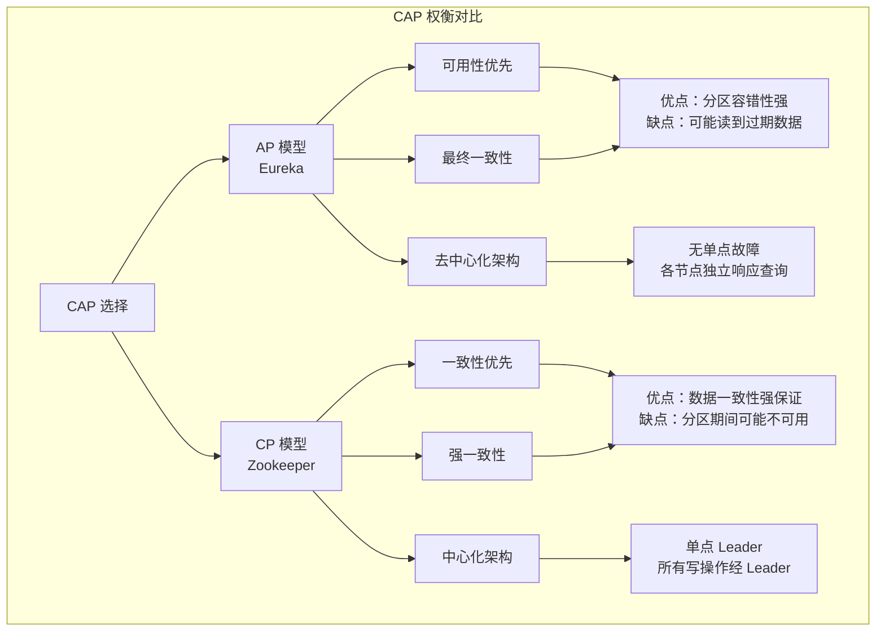
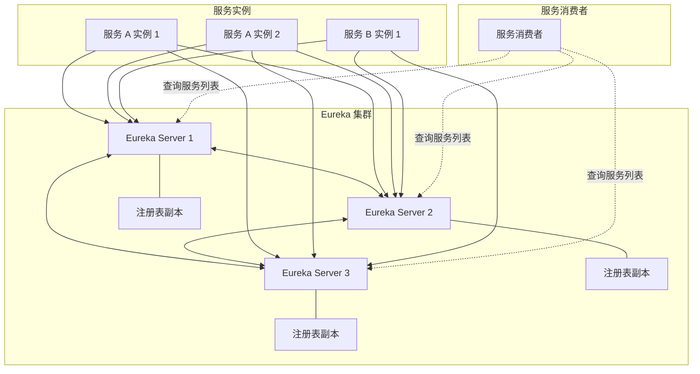
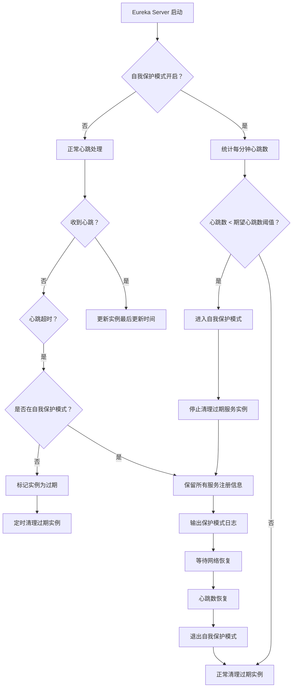
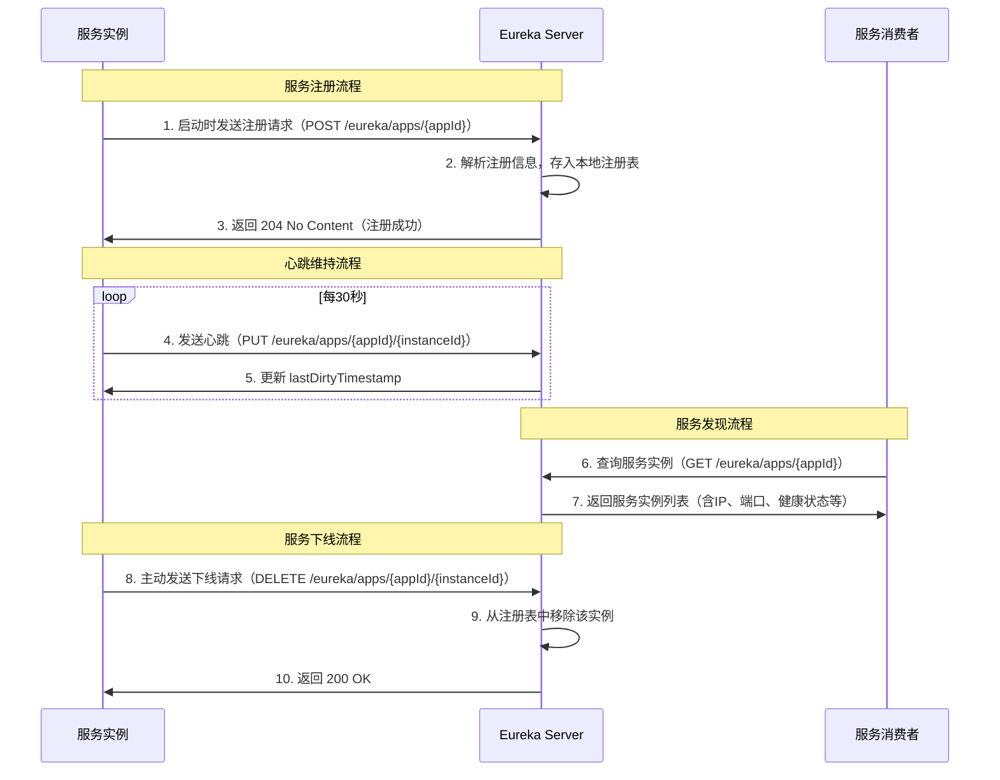
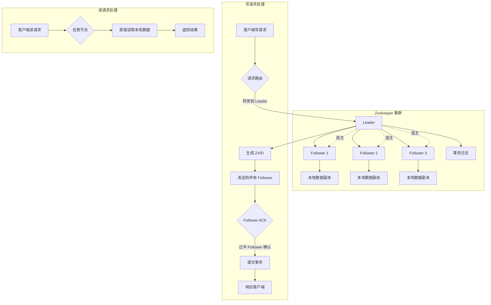
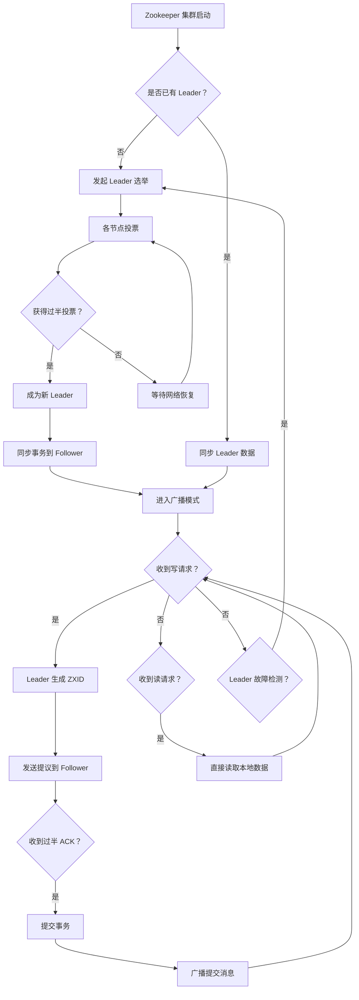
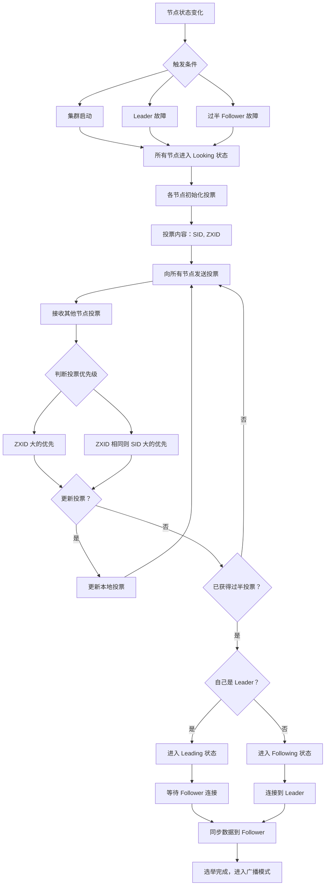
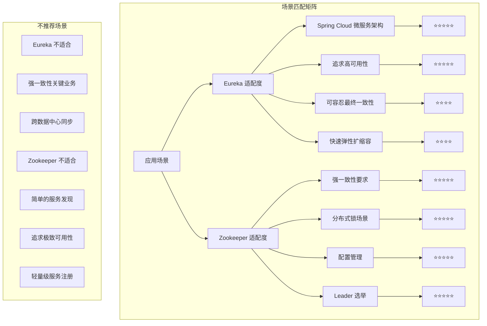
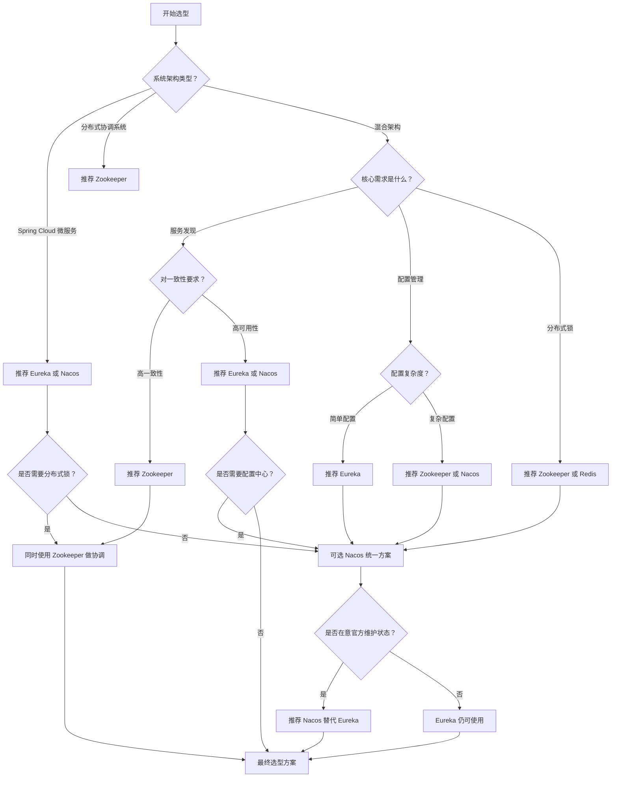
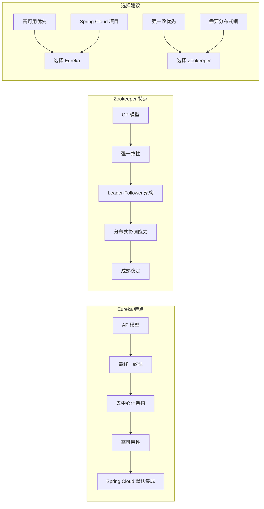

# Eureka 和 Zookeeper 有什么区别

## 1. 概述

### 1.1 文档目标与受众

本文档旨在全面对比分析 Eureka 与 Zookeeper 两种服务发现与注册中心技术在分布式系统中的应用差异，为技术选型提供系统性的参考依据。本文档主要面向以下受众群体：后端开发工程师需要深入理解服务注册与发现机制的实现原理，以便在微服务架构设计中做出合理的技术决策；架构师在进行分布式系统设计时，需要权衡不同技术方案的优劣，选择最适合业务场景的解决方案；运维工程师需要掌握服务的部署、监控和故障处理技能，理解底层机制有助于快速定位和解决问题。

服务注册与发现是微服务架构中的核心基础设施之一，它解决了服务实例动态变化情况下的服务通信问题。在传统的单体应用中，服务之间的调用通常通过硬编码的 IP 地址和端口实现，这种方式在服务实例数量固定的情况下尚且可行。然而，在现代微服务架构中，服务实例会根据负载情况动态扩缩容，容器化部署使得实例的 IP 地址经常变化，灰度发布和滚动更新会导致新旧实例交替出现。在这样的环境下，如果没有统一的服务注册与发现机制，服务消费方将无法准确获知服务提供方的最新网络地址，整个系统将无法正常运行。因此，服务注册与发现机制的重要性不言而喻，它是微服务能够实现弹性扩展和高可用性的基础保障。

### 1.2 技术基本概念

**Eureka** 是 Netflix 开源的服务注册与发现组件，是 Spring Cloud 微服务架构中最常用的服务治理方案之一。Eureka 采用纯客户端架构设计，服务实例负责向 Eureka Server 注册自己的服务信息，包括服务名称、IP 地址、端口号、健康检查路径等元数据。Eureka Server 维护所有已注册服务的注册表，并提供 RESTful 接口供其他服务查询。Eureka 的设计哲学强调可用性优先，即使在网络分区故障发生时，Eureka 仍然能够保证服务的正常发现，这在强调服务可用性的场景中具有显著优势。Eureka 2.0 版本在 2020 年宣布停止维护，但 Eureka 1.x 版本仍在大量生产环境中使用，其设计理念和实现机制仍然具有重要的学习价值。

**Zookeeper** 是 Apache 基金会旗下的开源分布式协调服务，最初诞生于 Hadoop 项目生态，用于解决分布式系统中的协调问题。Zookeeper 基于 Paxos 算法的变体 ZAB（Zookeeper Atomic Broadcast）协议实现，提供高性能、强一致性的数据存储和通知服务。Zookeeper 采用典型的中心化架构，通过 Leader-Follower 模式保证数据一致性，所有写操作必须通过 Leader 节点处理，读操作可以由任意节点直接响应。Zookeeper 的应用场景非常广泛，不仅可以用作服务注册与发现中心，还可以实现分布式锁、配置管理、Leader 选举、分布式队列等多种协调功能。然而，Zookeeper 的强一致性模型在某些场景下也可能成为限制因素，特别是在追求高可用性的服务发现场景中。

### 1.3 目录导航

- [1. 概述](#1-概述)
  - [1.1 文档目标与受众](#11-文档目标与受众)
  - [1.2 技术基本概念](#12-技术基本概念)
  - [1.3 目录导航](#13-目录导航)
- [2. CAP 理论背景](#2-cap-理论背景)
  - [2.1 CAP 理论定义](#21-cap-理论定义)
  - [2.2 一致性详解](#22-一致性详解)
  - [2.3 可用性详解](#23-可用性详解)
  - [2.4 分区容错性详解](#24-分区容错性详解)
  - [2.5 CAP 三选二的实际意义](#25-cap-三选二的实际意义)
- [3. 技术定位对比](#3-技术定位对比)
  - [3.1 Eureka 的 AP 定位](#31-eureka-的-ap-定位)
  - [3.2 Zookeeper 的 CP 定位](#32-zookeeper-的-cp-定位)
  - [3.3 AP 与 CP 的权衡对比](#33-ap-与-cp-的权衡对比)
- [4. 核心特性对比表格](#4-核心特性对比表格)
- [5. 架构原理说明](#5-架构原理说明)
  - [5.1 Eureka 架构原理](#51-eureka-架构原理)
  - [5.2 Zookeeper 架构原理](#52-zookeeper-架构原理)
- [6. 适用场景分析](#6-适用场景分析)
  - [6.1 场景匹配矩阵](#61-场景匹配矩阵)
  - [6.2 各场景详细分析](#62-各场景详细分析)
- [7. 选型决策指导](#7-选型决策指导)
  - [7.1 选型决策流程](#71-选型决策流程)
  - [7.2 选型建议汇总](#72-选型建议汇总)
- [8. 迁移和兼容方案](#8-迁移和兼容方案)
  - [8.1 从 Eureka 迁移到 Zookeeper](#81-从-eureka-迁移到-zookeeper)
  - [8.2 从 Zookeeper 迁移到 Eureka](#82-从-zookeeper-迁移到-eureka)
  - [8.3 双注册中心共存方案](#83-双注册中心共存方案)
- [9. 常见问题解答](#9-常见问题解答)
- [10. 总结](#10-总结)

## 2. CAP 理论背景

### 2.1 CAP 理论定义

CAP 理论是分布式系统领域最重要的理论基础之一，由加州大学伯克利分校的计算机科学家 Eric Brewer 在 2000 年的 PODC（分布式计算原理研讨会）上首次提出，并在 2002 年被麻省理工学院的 Seth Gilbert 和 Nancy Lynch 形式化证明。该理论指出：在一个分布式系统中， Consistency（一致性）、Availability（可用性）和 Partition tolerance（分区容错性）这三个核心特性不可能同时完全满足，最多只能同时满足其中两个。这是由于在网络分区故障发生时，系统必须在数据一致性和服务可用性之间做出权衡。

理解 CAP 理论对于正确选择服务注册与发现技术至关重要。分布式系统由于其本质特性，必须考虑网络分区的情况，网络延迟、网络设备故障、网络拥塞等因素都可能导致网络分区。一旦发生网络分区，系统设计者必须在一致性和可用性之间做出选择：要么停止部分服务以保证数据一致性，要么继续提供服务但可能返回过期数据。这个选择将直接影响系统的行为特征和应用场景适配度。

### 2.2 一致性详解

在 CAP 理论中，一致性（Consistency）指的是分布式系统中的所有数据副本在同一时刻具有相同的值，即任何读操作都能获取到最近一次写操作的结果，或者返回错误。当数据在多个节点之间复制时，必须保证所有节点看到的数据视图是一致的。在强一致性模型下，一次写操作完成后，任何后续的读操作都必须能够读取到刚刚写入的数据，即使请求被路由到不同的节点。线性一致性是分布式系统中最强的一致性保证，它要求系统的行为在逻辑上等价于一个全局有序的操作序列。

对于服务注册与发现场景，一致性意味着当某个服务实例注册或下线时，这个变化应该立即同步到所有节点。如果系统在不一致状态下运行，可能会出现服务消费方尝试调用一个已经不存在的服务实例的情况，导致调用失败；或者服务提供方已经注册但其他节点尚未感知，导致负载无法正确分配到新实例。虽然 Eureka 并不提供严格意义上的强一致性，但它通过心跳机制和定时同步尽可能减少不一致窗口，对于大多数业务场景来说，这种最终一致性模型是可以接受的。

### 2.3 可用性详解

可用性（Availability）指的是系统在合理的时间内返回合理的响应，即系统始终能够处理客户端请求并返回结果。Available 系统不保证返回的是最新写入的数据，但保证每次请求都能获得响应，无论该响应是成功还是失败。可用性通常用系统正常运行时间占总时间的百分比来衡量，例如 99.99%（四个九）表示一年内的累计停机时间不超过 52.6 分钟。高可用性是生产环境系统的基本要求，因为系统宕机会直接导致业务损失和用户体验下降。

在服务注册与发现系统中，可用性意味着无论发生什么情况，服务消费者都应该能够从注册中心查询到服务实例列表。即使注册中心的部分节点发生故障，只要还有节点能够正常响应查询，服务发现功能就应该继续工作。Eureka 正是将可用性放在首位的设计，它采用去中心化的集群架构，每个节点都保存完整的服务注册表副本，任何一个节点都可以独立响应服务查询请求。这种设计确保了即使部分节点不可用，整个服务发现系统仍然能够正常工作，满足了高可用性的要求。

### 2.4 分区容错性详解

分区容错性（Partition tolerance）指的是当网络分区故障发生时，系统仍然能够继续运行。网络分区是指分布式系统中节点之间的网络通信中断，导致系统被分割成多个无法相互通信的子区域。在现实的分布式环境中，网络故障是不可避免的，服务器硬件故障、交换机故障、光纤被挖断、网络配置错误等各种因素都可能导致网络分区。因此，分布式系统必须能够容忍网络分区的发生，否则整个系统将在任何网络故障面前完全崩溃。

对于服务注册与发现系统来说，分区容错性意味着即使数据中心之间的网络连接中断，注册中心仍然应该能够正常工作。在跨机房部署场景中，不同机房之间的网络链路可能因各种原因中断，如果注册中心无法在这种情况下继续提供服务，那么整个微服务架构将陷入瘫痪。Eureka 的设计充分考虑了分区容错性，每个机房部署独立的 Eureka 集群，机房内的服务实例注册到本地集群，即使跨机房网络中断，本机房内的服务调用仍然可以正常进行。而 Zookeeper 在发生网络分区时，为了保证一致性，可能会牺牲可用性，拒绝处理来自少数派节点的请求。

### 2.5 CAP 三选二的实际意义

在 CAP 理论中，"三选二"的表述经常被误解。实际上，CAP 理论的意思是：在网络分区故障发生时，分布式系统必须在一致性和可用性之间做出选择。当系统正常运行、没有发生网络分区时，不需要在 C 和 A 之间做选择，系统可以同时提供一致性和可用性。真正的问题在于，当网络分区发生时，系统设计必须决定是放弃一致性（保证可用性）还是放弃可用性（保证一致性）。

这个选择并不是非此即彼的简单二分法，而是一个连续的光谱。在实际系统设计中，通常需要在一致性和可用性之间找到合适的平衡点。有些系统选择强一致性但接受较低的可用性，如传统的数据库主从复制；有些系统选择高可用性但接受最终一致性，如 DNS 系统和大多数缓存系统；还有一些系统试图在两者之间取得平衡，提供弱一致性但尽量提高可用性。Eureka 和 Zookeeper 就代表了分布式系统在 CAP 权衡中的两个典型方向，前者选择 AP 模型优先保证可用性，后者选择 CP 模型优先保证一致性。

## 3. 技术定位对比

### 3.1 Eureka 的 AP 定位

Eureka 在 CAP 理论中的定位是 AP（可用性优先，允许最终不一致）。这一定位反映了 Eureka 的核心设计哲学：在分布式系统中，服务的可用性比数据一致性更加重要。当网络分区故障发生时，Eureka 选择继续提供服务，即使这意味着某些节点可能返回略微过时的服务列表。这种设计理念源自 Netflix 在大规模分布式系统运维中积累的经验，他们认为与其让服务发现系统因为追求一致性而完全不可用，不如让它在大部分情况下都能正常工作，即使偶尔会有些许不一致。

Eureka 的 AP 特性体现在多个方面。首先，Eureka Server 集群中的各个节点是对等的，每个节点都保存完整的服务注册表副本，不存在单一的主节点瓶颈。其次，服务实例可以向多个 Eureka Server 节点注册，通过心跳机制维持注册状态的同步。再次，当部分节点不可用时，服务查询请求可以被路由到其他可用节点，保证服务发现功能不中断。最后，Eureka 的自我保护机制防止在网络不稳定时因大量心跳超时而误删服务实例，避免了因临时网络抖动导致的服务注册信息丢失。这些机制共同保证了 Eureka 系统的高可用性，使其成为追求服务持续可用的场景的理想选择。

### 3.2 Zookeeper 的 CP 定位

Zookeeper 在 CAP 理论中的定位是 CP（一致性优先，可能牺牲可用性）。Zookeeper 的设计目标是为分布式系统提供可靠的协调服务，而协调服务的前提条件是各方对系统状态的认知必须一致。如果不同节点对同一份数据有不同的看法，那么基于这些数据做出的协调决策就可能是错误的，甚至可能导致严重的分布式系统故障，如数据不一致、死锁、活锁等。因此，Zookeeper 将强一致性作为首要目标，为此不惜在某些情况下牺牲可用性。

Zookeeper 的 CP 特性体现在其 Leader-Follower 架构中。所有写操作必须经过 Leader 节点处理，Follower 节点接收到的写请求会被转发给 Leader。当 Leader 节点发生故障时，系统会触发 Leader 选举流程，在新 Leader 选出之前，系统将无法处理写请求。这种设计确保了任何时刻都只有一个 Leader 负责处理写操作，避免了脑裂问题（多个节点都认为自己是 Leader）。ZAB 协议保证事务在集群中的一致性复制，只有当事务被大多数节点确认后，才会被认为提交成功。这种设计虽然提高了数据一致性，但也意味着在 Leader 选举期间，整个 Zookeeper 集群将无法处理写请求，对于依赖 Zookeeper 进行服务发现的系统来说，这可能导致短暂的服务注册与发现不可用。

### 3.3 AP 与 CP 的权衡对比



AP 和 CP 的选择本质上是两种不同设计哲学的体现，适用于不同的业务场景和需求。AP 模型适合那些对服务可用性要求极高、可以容忍短暂数据不一致的场景。在这些场景中，服务不可用直接导致业务损失，而短暂的数据不一致只会导致少量调用失败或负载分配不均，损失相对可控。典型的例子包括互联网应用、电商系统、社交网络等，这些系统的核心诉求是服务持续可用，用户体验不能因为技术问题而受到影响。

CP 模型适合那些对数据一致性要求极高、可以接受短暂服务不可用的场景。在这些场景中，数据不一致可能导致严重的业务问题，如金融交易、库存管理、订单处理等，如果系统返回了过期的库存或余额数据，可能导致超卖、资金损失等严重后果。对于这类应用，强一致性比持续可用性更重要。Zookeeper 的设计正是为了满足这类高一致性需求的分布式协调场景，虽然它也可以用于服务注册与发现，但在这个场景中，CP 特性并不一定是优势。

## 4. 核心特性对比表格

| 对比维度 | Eureka | Zookeeper |
|---------|--------|-----------|
| **一致性模型** | 最终一致性（Eventual Consistency） | 强一致性（Strong Consistency） |
| **CAP 分类** | AP（可用性优先） | CP（一致性优先） |
| **架构模式** | 去中心化、对等集群 | 中心化、Leader-Follower |
| **Leader 选举** | 无 Leader 概念，节点对等 | ZAB 协议选举 Leader |
| **数据同步机制** | 定时同步、心跳增量更新 | 事务日志同步 |
| **心跳机制** | 客户端定时向 Server 发送心跳 | Follower 与 Leader 之间心跳 |
| **故障检测** | 自我保护机制、定时清理 | Leader 监控 Follower 心跳 |
| **写操作处理** | 任意节点接收后同步到其他节点 | 必须经过 Leader 处理 |
| **读操作处理** | 任意节点直接响应 | 任意节点可读（可能读到旧数据） |
| **网络分区处理** | 继续可用，可能返回过期数据 | 少数派分区不可用 |
| **节点数量要求** | 无严格限制，建议至少 2 个 | 推荐奇数个节点（3、5、7） |
| **集群可用性** | 部分节点故障不影响整体可用性 | Leader 故障期间无法处理写操作 |
| **典型使用场景** | 微服务注册与发现 | 分布式协调服务、配置管理 |
| **客户端复杂度** | 简单，集成方便 | 相对复杂，需要处理连接断开 |
| **运维复杂度** | 较低 | 较高，需要专业运维 |
| **生态集成** | Spring Cloud 默认集成 | Dubbo 传统方案 |
| **版本维护状态** | Eureka 1.x 已停止主动维护 | 持续活跃维护 |

## 5. 架构原理说明

### 5.1 Eureka 架构原理

#### 5.1.1 去中心化设计

Eureka 采用完全去中心化的设计理念，集群中的每个节点都是对等的，不存在传统意义上的主节点或协调节点。这种设计消除了单点故障隐患，即使集群中的一半以上节点同时宕机，剩余节点仍然能够正常提供 服务发现 功能。每个 Eureka Server 节点都保存完整的服务注册表副本，服务实例可以同时向多个 Eureka Server 注册，形成交叉注册关系。当某个 Eureka Server 节点故障时，服务实例的心跳仍然会发送到其他健康的 Server 节点，确保注册信息不会丢失。



去中心化设计还体现在 Eureka 的服务查询机制上。服务消费者可以向任意一个 Eureka Server 节点查询服务实例列表，节点之间定期同步注册表数据。由于同步存在延迟，不同节点返回的服务列表可能略有差异，但这种差异是可控的，客户端可以通过定期刷新来获取最新的服务列表。Eureka 还支持区域（Region）和可用区（Zone）的概念，可以将服务实例优先注册到同可用区的 Eureka Server，减少跨区域网络调用，提升服务响应速度。

#### 5.1.2 自我保护机制

Eureka 的自我保护机制是其高可用设计的重要组成部分。在网络故障或临时断开的情况下，如果 Eureka Server 在短时间内没有收到大量服务实例的心跳，可能会误判这些实例已经下线而将它们从注册表中移除。这种误判在网络抖动或临时网络分区时尤其危险，因为服务实例本身是健康的，只是暂时无法发送心跳。自我保护机制正是为了防止这种情况而设计的。



自我保护机制的触发条件是：Eureka Server 统计最近 15 分钟内收到的续约（心跳）数量，如果发现实际心跳数低于期望心跳数的阈值（默认 0.85），就判定为网络可能出现了问题，进入自我保护模式。在自我保护模式下，Eureka Server 会停止清理任何过期实例，包括那些确实已经下线的实例，即使它们的续约时间已经超过阈值。虽然这可能导致注册表中包含一些已经下线的服务实例，但比起因网络抖动而误删健康实例来说，这个代价是值得的。自我保护机制通过牺牲一定的注册表准确性，换取了服务调用的稳定性。

#### 5.1.3 服务注册与发现流程



Eureka 的服务注册与发现流程设计简洁高效。服务实例启动时，会自动向配置好的 Eureka Server 发送注册请求，包含服务名称、实例 ID、IP 地址、端口号、健康检查路径等元数据。Eureka Server 收到注册请求后，将这些信息存储到本地注册表，并在一段时间内（默认 30 秒）在后台同步到其他对等节点。服务实例注册成功后，会开启一个定时任务，每隔 30 秒向 Eureka Server 发送一次心跳，续约自己的注册信息。如果 Eureka Server 在 90 秒内没有收到某个实例的心跳，就会认为该实例已经下线，将其从注册表中移除。

服务消费者通过查询 Eureka Server 获取服务实例列表。通常情况下，Ribbon 或其他负载均衡组件会从 Eureka 获取目标服务的所有可用实例，并根据配置的负载均衡策略选择一个实例进行调用。为了防止获取到过期的服务列表，客户端会定期（默认 30 秒）从 Eureka Server 刷新本地缓存的服务实例信息。这种缓存加定期刷新的机制，在保证服务发现功能正常工作的同时，也减少了 Eureka Server 的压力。

### 5.2 Zookeeper 架构原理

#### 5.2.1 Leader-Follower 模式

Zookeeper 采用典型的 Leader-Follower 分布式架构，所有节点在启动时都会向集群中的其他节点发送广播，确定各自的角色。如果一个节点收到其他节点的响应，并且响应节点的 ZXID（事务 ID）比自己大，则将自己的状态切换为 Follower。如果没有收到这样的响应，经过特定时间后，节点会发起选举，尝试成为 Leader。这种基于 ZXID 的选举机制确保了新选出的 Leader 拥有最完整的事务历史。



Leader 节点是整个 Zookeeper 集群的核心，负责处理所有写请求、协调分布式事务、维护集群状态。Follower 节点接收来自 Leader 的提议，并参与投票，只有当提议获得多数节点的认可后，事务才会被提交。Observer 节点是一种特殊的 Follower，不参与投票，只同步 Leader 的数据状态，用于扩展集群的读性能而不影响写吞吐。写请求的处理流程是：客户端连接到任意节点发送写请求 -> 如果该节点是 Follower，则转发给 Leader -> Leader 生成全局唯一的事务 ID（ZXID）-> Leader 向所有 Follower 发送提议 -> Follower 收到提议后写入本地事务日志并返回 ACK -> Leader 收到过半 ACK 后提交事务 -> 通知所有 Follower 提交 -> 响应客户端。

#### 5.2.2 ZAB 协议详解

ZAB（Zookeeper Atomic Broadcast）是 Zookeeper 的核心一致性协议，它是专门为 Zookeeper 设计的一致性协议，兼具 Paxos 的理论优势和工程实现的可操作性。ZAB 协议定义了两种基本模式：恢复模式（Recovery）和广播模式（Broadcast）。在集群启动或 Leader 故障后，系统进入恢复模式，通过快速 Leader 选举算法选出一个新的 Leader，确保新 Leader 拥有所有已提交的事务。在正常运行时，系统进入广播模式，处理客户端的写请求。



ZAB 协议的事务处理过程包含几个关键步骤。首先是提议阶段，Leader 节点收到写请求后，生成一个新的 ZXID（格式为 epoch << 32 | counter），其中 epoch 是 Leader 的任期编号，每次选举后递增，counter 是事务计数器。然后 Leader 将这个提议发送给所有 Follower 和 Observer。 Follower 收到提议后，将提议写入事务日志，但不立即提交。然后 Follower 向 Leader 发送 ACK 确认。最后，当 Leader 收到过半 Follower 的确认后，向所有节点发送提交消息，Follower 收到提交消息后才将提议应用到本地状态机。

ZAB 协议保证以下几点核心特性：首先是顺序保证，所有提议都按照 ZXID 的全局顺序被提交和处理，这保证了状态机状态的一致性。其次是原子性，事务要么在所有节点都提交，要么在所有节点都不提交，不存在部分提交的情况。第三是唯一性，每个 ZXID 在一个 Leader 任期内是唯一递增的，不会出现重复。最后是有效性，新 Leader 的 epoch 必须大于所有 Follower 的 epoch，确保不会有旧的 Leader 继续处理请求。

#### 5.2.3 Leader 选举机制

Zookeeper 的 Leader 选举是一个复杂但高效的过程，采用基于 ZXID 和 SID（Server ID）的投票机制。当 Leader 节点故障或集群启动时，所有节点都会进入 Looking 状态，开始选举过程。选举过程的核心是每个节点都会向其他节点发送自己的投票，投票包含两个关键信息：该节点认为应该成为 Leader 的节点 ID，以及该节点已知的最大 ZXID。其他节点收到投票后，会与自己的投票进行比较，按照规则更新自己的投票并重新广播。



选举算法的关键在于投票的比较规则。当一个节点收到来自其他节点的投票时，它会比较自己和对方的投票，判断是否需要更新自己的投票。比较规则如下：首先比较 ZXID，ZXID 大的节点优先成为 Leader，因为这意味着该节点处理了更多的事务，数据更加完整。如果 ZXID 相同，则比较 SID（服务器 ID），SID 大的节点优先。这个规则的直觉是，拥有最新数据的节点更适合成为 Leader，因为这样可以最小化恢复时需要同步的数据量。当一个节点发现自己提名的节点获得了过半的投票时，它就确定了自己和集群的状态，如果自己被选为 Leader，则进入 Leading 状态；否则进入 Following 状态。

## 6. 适用场景分析

### 6.1 场景匹配矩阵



### 6.2 各场景详细分析

**Spring Cloud 微服务架构场景**是 Eureka 最典型的应用领域。Spring Cloud Alibaba 官方推荐的 Nacos 出现之前，Eureka 是 Spring Cloud 默认集成的服务注册与发现组件。Eureka 与 Spring Cloud 的集成非常顺畅，只需要引入依赖和简单配置，就可以实现服务的自动注册与发现。Spring Cloud 为 Eureka 提供了完善的starter，包括服务注册发现、健康检查、负载均衡等功能的自动配置。对于基于 Spring Cloud 构建的传统微服务系统，Eureka 是最自然的选择，可以快速实现服务治理功能，降低开发和运维成本。

**金融服务与交易系统场景**通常对数据一致性有严格要求，这类场景更适合使用 Zookeeper 或其他 CP 系统的变体。在证券交易、支付清算、银行转账等业务中，账户余额、交易记录等关键数据必须保证强一致性，否则可能导致资金损失或合规问题。虽然这些场景也可以用 Eureka 进行服务发现，但底层的核心业务逻辑通常需要依赖 Zookeeper 或数据库来保证强一致性。对于既需要服务发现又需要强一致性的系统，可以考虑将 Eureka 用于服务发现层，Zookeeper 用于核心业务协调层。

**配置管理与分布式锁场景**是 Zookeeper 的传统优势领域。Zookeeper 的临时节点和 Watch 机制天然适合实现配置变更推送和分布式锁功能。当配置发生变更时，Zookeeper 可以主动通知所有订阅的客户端，实现配置的实时更新。对于分布式锁场景，Zookeeper 可以利用临时顺序节点实现公平锁，确保锁的获取顺序与请求顺序一致。虽然 Eureka 也可以实现简单的配置管理功能，但其功能相对有限，不适合复杂的配置管理需求。

**容器化与云原生场景**对服务注册与发现提出了新的挑战。在 Kubernetes、Docker Swarm 等容器编排平台中，服务的 IP 地址是动态分配的，实例数量会频繁变化。传统的 Eureka 或 Zookeeper 方案需要与容器平台进行集成，可能需要额外的适配层。Spring Cloud Kubernetes 项目提供了将 Kubernetes 原生服务发现与 Spring Cloud 集成的方案。对于完全基于 Kubernetes 的云原生应用，也可以考虑使用 Kubernetes 的 Service 和 Endpoint 进行服务发现，而不需要额外的服务注册中心。

## 7. 选型决策指导

### 7.1 选型决策流程



### 7.2 选型建议汇总

基于以上分析，给出以下选型建议：

**优先选择 Eureka 的场景**：团队使用 Spring Cloud 技术栈构建微服务系统，对服务治理功能的需求相对简单，只需要基本的服务注册与发现、健康检查、负载均衡等能力；对服务可用性有较高要求，可以容忍短暂的数据不一致；系统规模适中，预计服务实例数量在几百到几千量级；团队对 ZooKeeper 等分布式协调技术的运维经验不足。

**优先选择 Zookeeper 的场景**：系统对数据一致性有严格要求，如金融交易、库存管理等场景；需要使用分布式锁、Leader 选举等高级协调功能；系统规模较大，需要一个经过生产验证的分布式协调服务；团队有 Zookeeper 的运维经验和能力。

**考虑其他替代方案**：如果正在新建系统，建议评估 Spring Cloud Alibaba 的 Nacos 方案，Nacos 同时支持服务发现和配置管理，功能更加全面，是 Eureka 的官方推荐替代品；如果追求极致的可用性，可以考虑 Consul，它提供了更灵活的一致性模型选择；如果系统已经部署在 Kubernetes 平台，可以优先考虑使用 Kubernetes 原生的服务发现机制。

## 8. 迁移和兼容方案

### 8.1 从 Eureka 迁移到 Zookeeper

迁移服务注册与发现系统是一项复杂的工程任务，需要仔细规划和逐步实施。以下是从 Eureka 迁移到 Zookeeper 的推荐步骤和代码示例。

**第一步：引入 Zookeeper 依赖和配置**

```xml
<!-- Maven pom.xml -->
<dependencies>
    <!-- 保留 Eureka 依赖用于过渡期 -->
    <dependency>
        <groupId>org.springframework.cloud</groupId>
        <artifactId>spring-cloud-starter-netflix-eureka-client</artifactId>
        <version>2.2.5.RELEASE</version>
    </dependency>
    
    <!-- 引入 Zookeeper 依赖 -->
    <dependency>
        <groupId>org.springframework.cloud</groupId>
        <artifactId>spring-cloud-starter-zookeeper-discovery</artifactId>
        <version>2.2.5.RELEASE</version>
    </dependency>
</dependencies>
```

**第二步：配置 Zookeeper 连接信息**

```yaml
# application.yml
spring:
  application:
    name: user-service
  
  cloud:
    zookeeper:
      connect-string: zookeeper-host-1:2181,zookeeper-host-2:2181,zookeeper-host-3:2181
      discovery:
        enabled: true
        root: /services
  
  # Eureka 保留配置，用于过渡期双注册
  eureka:
    client:
      enabled: true
      service-url:
        defaultZone: http://eureka-server-1:8761/eureka/,http://eureka-server-2:8761/eureka/
    instance:
      prefer-ip-address: true
      lease-renewal-interval-in-seconds: 30
```

**第三步：创建 Zookeeper 服务注册配置类**

```java
@Configuration
public class ZookeeperRegistrationConfig {
    
    @Bean
    public ServiceDiscovery<ZookeeperInstance> serviceDiscovery(
            ClientFactoryBuilder clientFactoryBuilder,
            CuratorFramework curatorFramework) {
        
        String rootPath = "/services";
        return ServiceDiscoveryBuilder.builder(ZookeeperInstance.class)
                .clientFactory(clientFactoryBuilder)
                .basePath(rootPath)
                .curatorFramework(curatorFramework)
                .build();
    }
    
    @Bean
    public ServiceInstanceBuilder serviceInstanceBuilder() {
        return ServiceInstance.builder();
    }
}
```

**第四步：实现双注册逻辑**

```java
@Component
public class DualRegistrationRunner implements ApplicationRunner {
    
    private final ServiceRegistry<Registration> eurekaServiceRegistry;
    private final ServiceDiscovery<ZookeeperInstance> zkServiceDiscovery;
    private final Registration registration;
    private final boolean eurekaEnabled;
    private final boolean zookeeperEnabled;
    
    public DualRegistrationRunner(
            ServiceRegistry<Registration> eurekaServiceRegistry,
            Optional<ServiceDiscovery<ZookeeperInstance>> zkDiscovery,
            Optional<Registration> registration,
            @Value("${eureka.client.enabled:true}") boolean eurekaEnabled,
            @Value("${spring.cloud.zookeeper.enabled:true}") boolean zookeeperEnabled) {
        
        this.eurekaServiceRegistry = eurekaServiceRegistry;
        this.zkServiceDiscovery = zkDiscovery.orElse(null);
        this.registration = registration.orElse(null);
        this.eurekaEnabled = eurekaEnabled;
        this.zookeeperEnabled = zookeeperEnabled;
    }
    
    @Override
    public void run(ApplicationArguments args) throws Exception {
        if (eurekaEnabled && registration != null) {
            eurekaServiceRegistry.register(registration);
        }
        
        if (zookeeperEnabled && registration != null && zkServiceDiscovery != null) {
            ServiceInstance<ZookeeperInstance> instance = buildZkServiceInstance(registration);
            zkServiceDiscovery.registerService(instance);
        }
    }
    
    private ServiceInstance<ZookeeperInstance> buildZkServiceInstance(Registration registration) {
        return ServiceInstance.<ZookeeperInstance>builder()
                .name(registration.getServiceId())
                .uriSpec(new UriSpec("{scheme}://{address}:{port}"))
                .address(registration.getHost())
                .port(registration.getPort())
                .build();
    }
}
```

### 8.2 从 Zookeeper 迁移到 Eureka

从 Zookeeper 迁移到 Eureka 的过程相对简单，主要是因为 Eureka 主要用于服务发现，不涉及 Zookeeper 的复杂协调功能。

**第一步：更新 Maven 依赖**

```xml
<dependencies>
    <!-- 移除 Zookeeper 依赖 -->
    <dependency>
        <groupId>org.springframework.cloud</groupId>
        <artifactId>spring-cloud-starter-zookeeper-discovery</artifactId>
        <version>2.2.5.RELEASE</version>
    </dependency>
    
    <!-- 添加 Eureka 依赖 -->
    <dependency>
        <groupId>org.springframework.cloud</groupId>
        <artifactId>spring-cloud-starter-netflix-eureka-client</artifactId>
        <version>2.2.5.RELEASE</version>
    </dependency>
</dependencies>
```

**第二步：更新配置文件**

```yaml
# application.yml
spring:
  application:
    name: order-service
  cloud:
    zookeeper:
      enabled: false  # 禁用 Zookeeper
  
eureka:
  client:
    enabled: true
    service-url:
      defaultZone: http://eureka-server-1:8761/eureka/,http://eureka-server-2:8761/eureka/,http://eureka-server-3:8761/eureka/
    register-with-eureka: true
    fetch-registry: true
  instance:
    prefer-ip-address: true
    instance-id: ${spring.application.name}:${spring.cloud.client.ip-address}:${server.port}
    lease-renewal-interval-in-seconds: 30
    lease-expiration-duration-in-seconds: 90
```

**第三步：添加 Eureka 配置类**

```java
@Configuration
@EnableEurekaClient
public class EurekaConfig {
    
    @Bean
    public EurekaClientConfigBean eurekaClientConfigBean() {
        return new EurekaClientConfigBean();
    }
    
    @Bean
    public EurekaInstanceConfigBean eurekaInstanceConfigBean(InetUtils inetUtils) {
        EurekaInstanceConfigBean config = new EurekaInstanceConfigBean(inetUtils);
        config.setPreferIpAddress(true);
        return config;
    }
}
```

### 8.3 双注册中心共存方案

对于需要平滑过渡的场景，可以实现 Eureka 和 Zookeeper 双注册中心共存方案，确保两个系统都能获取到服务实例信息。

**方案一：使用 Spring Cloud Commons 抽象层**

```java
@Configuration
public class DualDiscoveryConfig {
    
    @Primary
    @Bean
    @ConditionalOnProperty(name = "discovery.type", havingValue = "zk")
    public ZookeeperServiceRegistry zookeeperServiceRegistry(
            ServiceRegistry<Registration> zkServiceRegistry) {
        return new ZookeeperServiceRegistry(zkServiceRegistry);
    }
    
    @Primary
    @Bean
    @ConditionalOnProperty(name = "discovery.type", havingValue = "eureka", matchIfMissing = true)
    public EurekaServiceRegistry eurekaServiceRegistry(
            ServiceRegistry<Registration> eurekaServiceRegistry) {
        return new EurekaServiceRegistry(eurekaServiceRegistry);
    }
}

class ZookeeperServiceRegistry implements ServiceRegistry<Registration> {
    
    private final ServiceRegistry<Registration> delegate;
    
    public ZookeeperServiceRegistry(ServiceRegistry<Registration> delegate) {
        this.delegate = delegate;
    }
    
    @Override
    public void register(Registration registration) {
        // 同时注册到 Zookeeper
        delegate.register(registration);
    }
    
    @Override
    public void deregister(Registration registration) {
        delegate.deregister(registration);
    }
    
    @Override
    public void close() {
        delegate.close();
    }
    
    @Override
    public void setStatus(Registration registration, String status) {
        delegate.setStatus(registration, status);
    }
    
    @Override
    public <T> T getStatus(Registration registration) {
        return delegate.getStatus(registration);
    }
}
```

**方案二：统一服务发现客户端封装**

```java
@Component
public class UnifiedDiscoveryClient {
    
    private final EurekaDiscoveryClient eurekaDiscoveryClient;
    private final ZookeeperDiscoveryClient zkDiscoveryClient;
    
    @Value("${discovery.prefer:eureka}")
    private String preferDiscovery;
    
    public UnifiedDiscoveryClient(
            EurekaDiscoveryClient eurekaDiscoveryClient,
            ZookeeperDiscoveryClient zkDiscoveryClient) {
        this.eurekaDiscoveryClient = eurekaDiscoveryClient;
        this.zkDiscoveryClient = zkDiscoveryClient;
    }
    
    public List<ServiceInstance> getInstances(String serviceId) {
        if ("zk".equals(preferDiscovery)) {
            return getZkInstances(serviceId);
        } else {
            return getEurekaInstances(serviceId);
        }
    }
    
    private List<ServiceInstance> getEurekaInstances(String serviceId) {
        List<ServiceInstance> instances = eurekaDiscoveryClient.getInstances(serviceId);
        if (CollectionUtils.isEmpty(instances)) {
            return zkDiscoveryClient.getInstances(serviceId);
        }
        return instances;
    }
    
    private List<ServiceInstance> getZkInstances(String serviceId) {
        List<ServiceInstance> instances = zkDiscoveryClient.getInstances(serviceId);
        if (CollectionUtils.isEmpty(instances)) {
            return eurekaDiscoveryClient.getInstances(serviceId);
        }
        return instances;
    }
}
```

## 9. 常见问题解答

**问题一：Eureka 2.x 停止维护后是否还能继续使用？**

Eureka 2.x 确实已经停止维护，Netflix 在 2020 年宣布了这一决定。但这并不意味着 Eureka 1.x 不能继续使用。Eureka 1.x 目前仍在大量生产环境中运行，其核心功能是稳定的。对于已经使用 Eureka 的系统，可以继续维护现有系统，不必急于迁移。对于新建系统，建议评估替代方案，如 Spring Cloud Alibaba 的 Nacos，它提供了与 Eureka 类似的功能并且仍在积极维护。无论选择哪种方案，都建议做好技术储备，随时准备应对可能的迁移需求。

**问题二：Zookeeper 在服务发现时如何处理网络分区？**

Zookeeper 在发生网络分区时采用 CP 模型处理。如果 Leader 节点和多数派节点在同一个分区，那么这个分区可以继续处理写请求，而少数派分区的节点将无法处理任何写请求，甚至可能停止服务。如果 Leader 节点在少数派分区，那么整个集群将无法处理写请求，直到网络恢复后重新选举出新的 Leader。在服务发现场景下，这意味着在网络分区期间，新服务可能无法注册到 Zookeeper，旧服务可能无法被及时发现。对于追求高可用性的服务发现场景，这种行为可能是不可接受的。

**问题三：Eureka 的自我保护机制会不会导致问题？**

Eureka 的自我保护机制在大多数情况下是有益的，它可以防止因临时网络抖动导致的服务实例被误删。但是，在某些极端情况下，自我保护机制也可能带来问题。例如，如果大量服务实例同时重启，所有实例都会进入自我保护模式，注册表中会保留大量已经下线的服务实例信息，导致服务消费者尝试调用不存在的实例。对于这种情况，可以通过以下方式缓解：使用更精细的健康检查机制，不仅仅依赖心跳；设置合理的实例摘除策略；在维护窗口期间手动关闭自我保护模式；监控系统注册表的变化，及时发现异常。

**问题四：如何监控 Eureka 和 Zookeeper 的健康状态？**

对于 Eureka，可以监控以下指标：服务注册数量、心跳续约成功率、自我保护模式触发状态、Eureka Server 节点间的同步延迟。Eureka 提供了 Actuator 端点，可以暴露这些指标到 Prometheus 或其他监控系统。对于 Zookeeper，可以通过四字命令（Four Letter Words）获取集群状态，包括服务器角色、连接数、延迟统计、事务处理情况等。也可以通过 JMX 监控更详细的信息。建议设置告警规则，当心跳成功率低于阈值、注册表变化异常、节点连接数异常等情况发生时及时通知运维人员。

**问题五：Eureka 和 Zookeeper 可以一起使用吗？**

是的，Eureka 和 Zookeeper 可以在同一个系统中同时使用，各自承担不同的职责。常见的方式是使用 Eureka 作为服务注册与发现中心，用于服务的注册、查询和负载均衡；同时使用 Zookeeper 处理需要强一致性的分布式协调任务，如分布式锁、Leader 选举、配置管理等。这种分层架构可以充分发挥各自的优势：Eureka 负责简单高效的服务发现，保证系统的高可用性；Zookeeper 负责需要强一致性的协调任务，保证关键业务逻辑的正确性。当然，这种架构也增加了系统的复杂度，需要维护两套基础设施。

## 10. 总结

Eureka 和 Zookeeper 是两种设计理念完全不同的分布式服务协调技术，它们在 CAP 权衡中做出了不同的选择，分别代表了 AP 和 CP 两个方向的典型实现。理解这两种技术的差异对于在微服务架构中做出正确的技术选型至关重要。

**核心区别总结**：



| 维度 | Eureka | Zookeeper |
|------|--------|-----------|
| 设计哲学 | 可用性优先，最终一致 | 一致性优先，强同步 |
| 架构复杂度 | 简单，去中心化 | 复杂，需要 Leader 选举 |
| 故障表现 | 继续可用，可能返回旧数据 | 可能短暂不可用 |
| 运维难度 | 较低 | 较高 |
| 功能范围 | 服务发现为主 | 协调服务为主 |
| 适用场景 | 通用微服务 | 金融、一致性敏感场景 |
| 维护状态 | Eureka 1.x 社区维护 | Apache 积极维护 |

技术选型没有绝对的好坏之分，只有适合与不适合。在实际项目中，应该根据业务场景的具体需求、团队的技术能力、系统的规模和发展规划等因素综合考虑，选择最合适的技术方案。同时，也要保持对技术发展的关注，及时评估新的解决方案，确保系统架构能够适应业务的发展需求。
