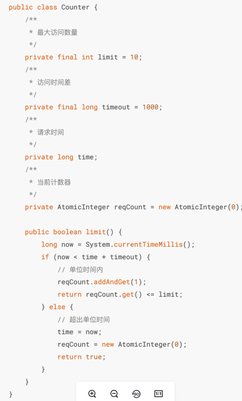
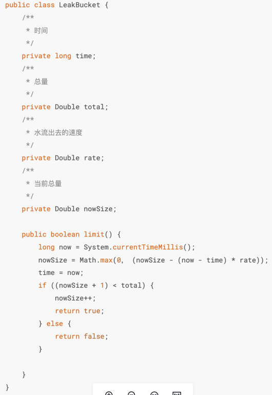
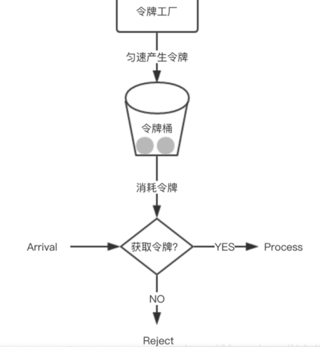

## Hystrix
断路器
### 什么是Hystrix
- 防雪崩利器，具有服务降级、服务熔断、服务隔离、监控等一些防雪崩的技术
- 防雪崩方式
  - 服务降级：接口调用失败就调用本地方法返回一个空
  - 服务熔断：接口调用失败进入调用接口提前定义好的一个熔断方法，返回错误信息
  - 服务隔离：隔离服务之间相互影响
  - 服务监控：服务发生调用时，将每秒请求数、成功请求数等运行指标记录

### 三种算法思想
计数器 = “一小时最多进100人”

到点清零，不管这一小时内人是集中进还是均匀进。

漏桶 = “排队检票，每秒只能进2个人”

不管来了多少人，都必须排队，进去速度固定。

令牌桶 = “门口发票，手里有票就能进”

如果之前没人来，票会攒起来，所以可以突然放进一波人。

### 断路器状态机算法
Hystrix 的核心是断路器模式，通过状态机来控制对下游服务的调用。断路器有三种状态：

```
┌─────────┐    错误率超阈值     ┌─────────┐
│ CLOSED  │ ─────────────────▶ │  OPEN   │
│  关闭   │                    │  打开   │
└─────────┘                    └─────────┘
     ▲                               │
     │      探测成功率达到阈值        │
     │                               │
     │       ┌───────────┐           │
     └────── │ HALF_OPEN │◀─────────┘
             │   半开     │
             └───────────┘
```

#### 三种状态说明

**CLOSED（关闭状态）**
- 正常处理所有请求
- 统计请求的成功、失败、超时、线程拒绝次数
- 当错误率超过阈值时，切换到 OPEN 状态
- 公式：错误率 = errors / (successes + failures + rejections) × 100%

**OPEN（打开状态）**
- 快速拒绝所有请求
- 调用 fallback 降级方法
- 启动熔断器睡眠窗口计时器
- 睡眠窗口到期后，切换到 HALF_OPEN 状态

**HALF_OPEN（半开状态）**
- 允许有限数量的探测请求通过
- 如果探测请求成功率达到阈值（默认 60%），切换到 CLOSED 状态
- 如果探测请求失败，切换回 OPEN 状态

#### 关键参数

| 参数 | 默认值 | 说明 |
|------|--------|------|
| circuitBreaker.requestVolumeThreshold | 20 | 熔断器打开的最小请求数 |
| circuitBreaker.sleepWindowInMilliseconds | 5000 | 熔断器打开后的恢复等待时间 |
| circuitBreaker.errorThresholdPercentage | 50 | 错误率阈值，超过此值则打开断路器 |
| circuitBreaker.forceOpen | false | 强制打开断路器 |
| metrics.rollingStats.timeInMilliseconds | 10000 | 滚动统计窗口大小（毫秒） |
| metrics.rollingStats.numBuckets | 10 | 统计窗口内的桶数量 |

#### 状态转换伪代码

```java
public class CircuitBreaker {
    private AtomicReference<State> state = new AtomicReference<>(State.CLOSED);
    private AtomicLong successCount = new AtomicLong(0);
    private AtomicLong totalCount = new AtomicLong(0);

    public boolean allowRequest() {
        switch (state.get()) {
            case CLOSED:
                return true;
            case OPEN:
                if (isAfterSleepWindow()) {
                    // OPEN -> HALF_OPEN
                    state.set(State.HALF_OPEN);
                    return true;
                }
                return false;
            case HALF_OPEN:
                return true;
        }
        return false;
    }

    public void markSuccess() {
        if (state.get() == State.HALF_OPEN) {
            if (successCount.incrementAndGet() >= requestVolumeThreshold * 0.6) {
                // HALF_OPEN -> CLOSED
                state.set(State.CLOSED);
                resetCounters();
            }
        } else if (state.get() == State.CLOSED) {
            incrementSuccessCount();
        }
    }

    public void markFailure() {
        if (state.get() == State.HALF_OPEN) {
            // HALF_OPEN -> OPEN
            state.set(State.OPEN);
        } else if (state.get() == State.CLOSED) {
            incrementFailureCount();
            if (getErrorRate() >= errorThresholdPercentage) {
                // CLOSED -> OPEN
                state.set(State.OPEN);
            }
        }
    }
}
```

### 舱壁隔离算法
Hystrix 使用舱壁模式来隔离依赖服务，防止单个服务的故障扩散到整个系统。

#### 线程池隔离
为每个依赖服务维护独立的线程池，实现服务之间的物理隔离。

```
┌─────────────────────────────────────────────────────────┐
│                     主线程池                             │
│  ┌──────────┐   ┌──────────┐   ┌──────────┐            │
│  │  请求 A  │   │  请求 B  │   │  请求 C  │            │
│  └────┬─────┘   └────┬─────┘   └────┬─────┘            │
└───────┼──────────────┼──────────────┼─────────────────┘
        │              │              │
        ▼              ▼              ▼
┌──────────────┐ ┌──────────────┐ ┌──────────────┐
│  线程池 A    │ │  线程池 B    │ │  线程池 C    │
│ (商品服务)   │ │ (用户服务)   │ │ (订单服务)   │
│ max=10      │ │ max=20      │ │ max=30      │
└──────────────┘ └──────────────┘ └──────────────┘
```

**线程池隔离原理**：
1. 每个依赖服务拥有独立的线程池
2. 线程池满时，新请求被拒绝（线程池拒绝策略）
3. 单个服务的故障不会耗尽主线程资源
4. 请求超时控制基于线程执行时间

**线程池配置参数**：

| 参数 | 说明 |
|------|------|
| coreSize | 核心线程数 |
| maximumSize | 最大线程数 |
| keepAliveTime | 线程空闲存活时间 |
| queueSizeRejectionThreshold | 队列大小阈值 |
| execution.isolation.thread.timeoutInMilliseconds | 线程执行超时时间 |

#### 信号量隔离
使用信号量（Semaphore）控制并发调用数量，适用于轻量级操作。

```java
public class SemaphoreIsolation {
    private final Semaphore semaphore;
    private final int permits;

    public SemaphoreIsolation(int permits) {
        this.permits = permits;
        this.semaphore = new Semaphore(permits);
    }

    public Object execute(Command command) throws Exception {
        if (!semaphore.tryAcquire(permits, timeout, TimeUnit.MILLISECONDS)) {
            throw new HystrixRuntimeException("Semaphore rejected");
        }

        try {
            return command.execute();
        } finally {
            semaphore.release(permits);
        }
    }
}
```

#### 两种隔离方式对比

| 特性 | 线程池隔离 | 信号量隔离 |
|------|------------|------------|
| 线程管理 | 独立线程池 | 无独立线程 |
| 开销 | 较大（线程创建、切换） | 较小（轻量级计数） |
| 异步执行 | 支持 | 不支持 |
| 超时控制 | 线程执行时间 | 信号量等待时间 |
| 适用场景 | 复杂业务逻辑、外部服务调用 | 轻量级操作、本地方法调用 |
| 资源隔离 | 强隔离 | 弱隔离 |

**选择建议**：
- 外部网络调用：优先使用线程池隔离
- 本地计算或缓存访问：使用信号量隔离
- 需要异步处理：必须使用线程池隔离

### 健康指标计算
Hystrix 使用滚动统计窗口来计算健康指标，用于判断断路器的状态。

#### 滚动窗口统计机制

```
滚动统计窗口（10秒）
┌────────┬────────┬────────┬────────┬────────┬────────┬────────┬────────┬────────┬────────┐
│ Bucket │ Bucket │ Bucket │ Bucket │ Bucket │ Bucket │ Bucket │ Bucket │ Bucket │ Bucket │
│   1    │   2    │   3    │   4    │   5    │   6    │   7    │   8    │   9    │   10   │
│ (1秒)  │ (1秒)  │ (1秒)  │ (1秒)  │ (1秒)  │ (1秒)  │ (1秒)  │ (1秒)  │ (1秒)  │ (1秒)  │
└────────┴────────┴────────┴────────┴────────┴────────┴────────┴────────┴────────┴────────┘
    │
    ▼
 每秒一个桶，每个桶记录该秒内的统计数据
```

**Bucket 统计内容**：
- 成功请求数（success）
- 失败请求数（failure）
- 超时请求数（timeout）
- 线程拒绝数（rejected）
- 短路过路数（short-circuited）

#### 错误率计算公式

**基础错误率公式**：
```
错误率 = (失败数 + 超时数 + 线程拒绝数) / (成功数 + 失败数 + 超时数 + 线程拒绝数) × 100%
```

**考虑熔断器请求量的公式**：
```
错误率 = errors / totalRequests × 100%

其中：
- errors = failures + timeouts + rejections + shortCircuits
- totalRequests = successes + errors
```

**滚动窗口总错误率**：
```java
public double calculateErrorPercentage() {
    long totalRequests = rollingCounter.getSum(HealthCount.REQUESTS);
    long errorRequests = rollingCounter.getSum(HealthCount.ERRORS);

    if (totalRequests < circuitBreakerConfiguration.getRequestVolumeThreshold()) {
        // 请求数未达到阈值，不触发熔断
        return 0;
    }

    return (double) errorRequests / totalRequests * 100;
}
```

#### 熔断器触发判断

```java
public boolean isCircuitBreakerOpen() {
    // 1. 检查请求量是否达到阈值
    if (healthCounter.getTotalRequestCount() < properties.requestVolumeThreshold().get()) {
        return false;
    }

    // 2. 计算错误率
    double errorPercentage = healthCounter.getErrorPercentage();

    // 3. 判断是否超过阈值
    return errorPercentage >= properties.circuitBreakerErrorThresholdPercentage().get();
}
```

### 请求合并算法
Hystrix 的请求合并器（Request Collapser）可以将多个请求合并为一个批量请求，减少网络开销。

#### 请求合并原理

```
未合并的请求流：
┌──────┐  ┌──────┐  ┌──────┐  ┌──────┐  ┌──────┐
│ Req1 │  │ Req2 │  │ Req3 │  │ Req4 │  │ Req5 │
└──┬───┘  └──┬───┘  └──┬───┘  └──┬───┘  └──┬───┘
   │         │         │         │         │
   ▼         ▼         ▼         ▼         ▼
┌──────────────────────────────────────────┐
│            后端服务（5次调用）              │
└──────────────────────────────────────────┘

合并后的请求流：
┌──────┐  ┌──────┐  ┌──────┐
│ Req1 │  │ Req3 │  │ Req5 │
│ Req2 │  │ Req4 │         （在窗口内合并）
└──┬───┘  └──┬───┘  └──┬───┘
   │         │         │
   ▼         ▼         ▼
┌──────────────────────────────────────────┐
│            后端服务（3次调用）              │
└──────────────────────────────────────────┘
```

#### 合并算法实现

**基于请求队列的合并**：

```java
public class RequestCollapser {
    // 请求队列
    private final ConcurrentHashMap<String, CollapsibleRequest> requestMap = new ConcurrentHashMap<>();

    // 滚动统计窗口大小（毫秒）
    private final int windowInterval;

    public Observable<T> submitRequest(CommandRequest request) {
        String cacheKey = request.getCacheKey();

        // 尝试从缓存获取
        if (cacheHandler.isCacheHit(cacheKey)) {
            return cacheHandler.getCachedResponse(cacheKey);
        }

        // 合并请求
        CollapsibleRequest collapsible = requestMap.computeIfAbsent(
            cacheKey,
            k -> new CollapsibleRequest(windowInterval)
        );

        return collapsible.addRequest(request);
    }
}

class CollapsibleRequest {
    private final List<CommandRequest> requests = new ArrayList<>();
    private final AtomicReference<Observable> response = new AtomicReference<>();
    private final long windowStart;
    private final int maxBatchSize;

    public synchronized Observable addRequest(CommandRequest request) {
        requests.add(request);

        if (requests.size() >= maxBatchSize) {
            return executeBatch();
        }

        if (response.get() == null) {
            response.set(Observable.timer(windowInterval, TimeUnit.MILLISECONDS)
                .flatMap(t -> executeBatch()));
        }

        return response.get();
    }

    private Observable executeBatch() {
        List<CommandRequest> batch = new ArrayList<>(requests);
        requests.clear();

        return batchCommand(batch).flatMap(results -> {
            // 将批量结果分发给各个请求
            return Observable.from(results)
                .zipWith(Observable.from(batch), (result, req) -> result);
        });
    }
}
```

**合并策略**：
1. **时间窗口合并**：在固定时间窗口内的请求合并为一批
2. **数量阈值合并**：当请求数达到阈值时触发合并执行
3. **动态调整**：根据系统负载动态调整合并窗口大小

**配置参数**：

| 参数 | 说明 |
|------|------|
| maxRequestsInBatch | 单批次最大请求数 |
| timerDelayInMilliseconds | 合并时间窗口大小 |
| requestCache.enabled | 是否启用请求缓存 |

### 如何限流
- 限流算法：
  - 计数器：控制单位时间内的请求数量
    - 劣势：设每分钟请求数量60个，每秒处理1个请求，用户在 00:59 发送 60 个请求，在 01:00 发送 60 个请求 此时 2 秒钟有 120 个请求(每秒 60 个请求)，远远大于了每秒钟处理数量的阈值。（突刺现象）
  - leaky bucket（漏桶）：规定固定容量的桶，进入的水无法管控数量、速度，但是对于流出的水我们可以控制速度
    - 劣势：无法应对短时间突发流量（桶满了就丢弃）
  - Token bucket令牌桶：可以准备一个队列，用来保存令牌，另外通过一个线程池定期生成令牌放到队列中，每来一个请求，就从队列中获取一个令牌，并继续执行。

#### 计数器算法详解

**算法原理**：
```
计数器 = 0
窗口开始时间 = 当前时间

当请求到达时：
  如果 (当前时间 - 窗口开始时间) >= 窗口时长：
      重置计数器 = 0
      窗口开始时间 = 当前时间

  如果 计数器 < 限流阈值：
      计数器++
      允许请求通过
  否则：
      拒绝请求
```

**数学公式**：
```
请求通过率 = min(1, 剩余请求数 / 限流阈值)

其中：
- 剩余请求数 = 限流阈值 - 已处理请求数
- 限流阈值 = rate × windowSize
```

**突刺现象分析**：
```
时刻:    00:59      01:00      01:01
        ├───────────┼───────────┤
请求:    ████████████████████████
计数:    60         60          0
真实速率:            120 req/2s

实际瞬间速率 = 120 req / 2s = 60 req/s
限流阈值 = 60 req / 60s = 1 req/s
超过阈值 59 倍！
```

**改进方案**：使用滑动窗口算法替代固定窗口

#### 漏桶算法详解

**算法原理**：
```
桶容量 = capacity
流出速率 = rate (每秒)
当前水量 = 0

当请求到达时：
  如果 (当前水量 + 1) <= 桶容量：
      当前水量++
      允许请求通过
  否则：
      拒绝请求

持续执行（后台线程）：
  如果 当前水量 > 0：
      当前水量 = max(0, 当前水量 - 流出速率 × 时间间隔)
```

**数学公式**：
```
出水量(t) = max(0, 水量(0) - rate × t)

漏桶输出速率：
output_rate = min(inflow_rate, rate)

其中：
- 水量(0) 为初始水量
- rate 为固定流出速率
```

**漏桶特性**：
```
输入速率:  ████████████████
          (可能突发)

输出速率:  ▓▓▓▓▓▓▓▓▓▓▓▓▓▓▓
          (平滑输出)

输出速率 = min(输入速率, 漏桶速率)
```

**代码实现**：
```java
public class LeakyBucket {
    private final double capacity;  // 桶容量
    private final double leakRate; // 漏出速率（单位：单位/秒）
    private double water;          // 当前水量
    private long lastLeakTime;    // 上次漏水时间

    public synchronized boolean allowRequest() {
        leak(); // 先漏水

        if (water + 1 <= capacity) {
            water += 1;
            return true;
        }
        return false;
    }

    private void leak() {
        long now = System.currentTimeMillis();
        long elapsed = now - lastLeakTime;
        double leaked = leakRate * elapsed / 1000.0;

        water = Math.max(0, water - leaked);
        lastLeakTime = now;
    }
}
```

#### 令牌桶算法详解

**算法原理**：
```
令牌桶容量 = capacity
令牌生成速率 = rate (每秒)
当前令牌数 = capacity

持续执行（后台线程）：
  如果 当前令牌数 < 容量：
      当前令牌数 = min(容量, 当前令牌数 + rate × 时间间隔)

当请求到达时：
  如果 当前令牌数 >= 1：
      当前令牌数--
      允许请求通过
  否则：
      拒绝请求
```

**数学公式**：
```
令牌数量(t) = min(capacity, capacity + rate × t - consumed_tokens)

允许条件：
available_tokens >= 1

可用令牌数更新：
tokens = min(capacity, tokens + rate × Δt - consumed)

其中：
- capacity 为令牌桶容量
- rate 为令牌生成速率
- Δt 为时间间隔
- consumed 为消耗的令牌数
```

**令牌桶与漏桶对比**：
```
相同点：
  - 都支持有界的流量控制
  - 都限制平均速率

不同点：
  漏桶：强制平滑输出，不允许突发流量
  令牌桶：允许一定程度的突发流量（最大突发量 = 桶容量）

突发流量处理：
  令牌桶: ████████████████████████████
          ↑ 突发流量可以一次消耗多个令牌

  漏桶:   ▓▓▓▓▓▓▓▓▓▓▓▓▓▓▓▓▓▓▓▓▓▓▓▓▓▓▓▓▓▓
          ↑ 突发流量被平滑化处理
```

**代码实现**：
```java
public class TokenBucket {
    private final double capacity;  // 令牌桶容量
    private final double refillRate; // 令牌生成速率
    private double tokens;           // 当前令牌数
    private long lastRefillTime;    // 上次补充时间

    public TokenBucket(double capacity, double refillRate) {
        this.capacity = capacity;
        this.refillRate = refillRate;
        this.tokens = capacity;
        this.lastRefillTime = System.currentTimeMillis();
    }

    public synchronized boolean allowRequest() {
        refill();

        if (tokens >= 1) {
            tokens -= 1;
            return true;
        }
        return false;
    }

    private void refill() {
        long now = System.currentTimeMillis();
        long elapsed = now - lastRefillTime;
        double added = refillRate * elapsed / 1000.0;

        tokens = Math.min(capacity, tokens + added);
        lastRefillTime = now;
    }
}
```

#### 限流算法对比

| 特性 | 计数器 | 漏桶 | 令牌桶 |
|------|--------|------|--------|
| 原理 | 统计单位时间内的请求数 | 控制水流出的速度 | 控制令牌的产生和消费 |
| 突发流量 | 无法处理（突刺现象） | 无法处理（桶满丢弃） | 可以处理（消耗令牌） |
| 流量平滑度 | 不平滑（固定窗口边界） | 平滑（恒定输出） | 平滑（允许突发） |
| 实现复杂度 | 简单 | 中等 | 中等 |
| 资源占用 | 低 | 低 | 中等 |
| 适用场景 | 简单限流 | 严格限流 | 需要突发能力的限流 |
| 典型应用 | API 限流 | 网络流量整形 | 限流组件（Guava RateLimiter） |

**选择建议**：
- 需要严格控制流量速率：选择漏桶
- 需要允许一定突发流量：选择令牌桶
- 简单限流场景：选择计数器（注意突刺问题）

### 降级（Fallback）机制
当请求失败、超时或断路器打开时，Hystrix 会执行降级逻辑。

#### 降级策略

**Fallback 执行时机**：
1. 远程服务调用失败（抛出异常）
2. 请求超时
3. 线程池/队列满（线程隔离）
4. 信号量拒绝（信号量隔离）
5. 断路器打开

**Fallback 方法定义**：
```java
public class MyCommand extends HystrixCommand<String> {

    public MyCommand() {
        super(HystrixCommandGroupKey.Factory.asKey("ExampleGroup"));
    }

    @Override
    protected String run() throws Exception {
        // 正常的业务逻辑
        return remoteService.execute();
    }

    @Override
    protected String getFallback() {
        // 降级逻辑
        return "Fallback Response";
    }
}
```

**降级策略优先级**：
1. **快速失败（Fail Fast）**：直接返回错误，不执行 fallback
2. **返回默认值（Static Fallback）**：返回预设的默认值
3. **返回缓存（Cached Fallback）**：返回历史缓存数据
4. **返回降级服务结果（Fallback Service）**：调用降级服务获取结果
5. **记录日志并返回空（Stubbed Fallback）**：记录异常并返回空结果

**Fallback 链式调用**：
```java
@Override
protected String getFallback() {
    // 尝试从缓存获取
    String cachedResult = getCachedValue();
    if (cachedResult != null) {
        return cachedResult;
    }

    // 调用备用服务
    try {
        return fallbackService.getResult();
    } catch (Exception e) {
        // 备用服务也失败，返回默认值
        return getDefaultValue();
    }
}
```

#### 降级与断路器的协作

```java
public class CircuitBreakerWithFallback {

    public String executeWithProtection() {
        if (circuitBreaker.isOpen()) {
            // 断路器打开，直接降级
            return fallback();
        }

        try {
            String result = remoteCall();
            circuitBreaker.markSuccess();
            return result;
        } catch (Exception e) {
            circuitBreaker.markFailure();
            return fallback();
        }
    }

    private String fallback() {
        log.warn("Circuit breaker opened, executing fallback");
        return "Degraded Response";
    }
}
```

#### 降级最佳实践

1. **降级方法应该轻量**：避免在降级逻辑中调用远程服务
2. **设置合理的超时时间**：避免降级方法本身超时
3. **记录降级日志**：便于监控和排查问题
4. **提供有意义的降级响应**：给用户友好的提示信息
5. **降级数据应该可追踪**：区分正常响应和降级响应
