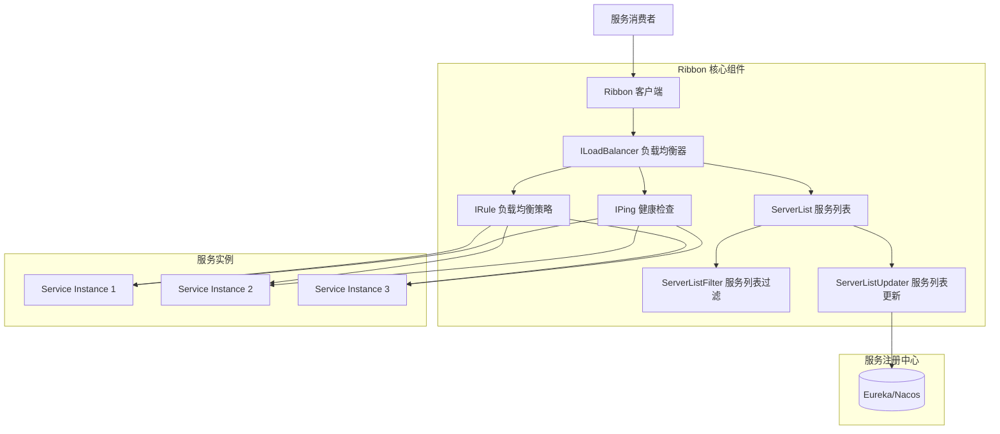
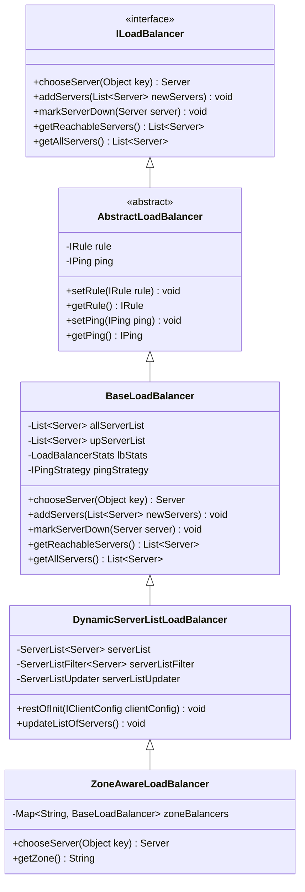
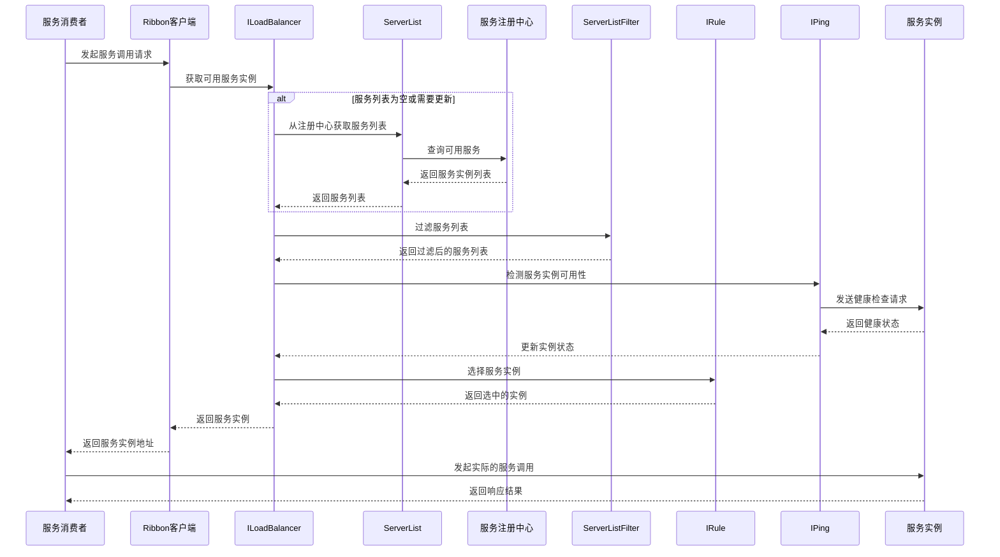
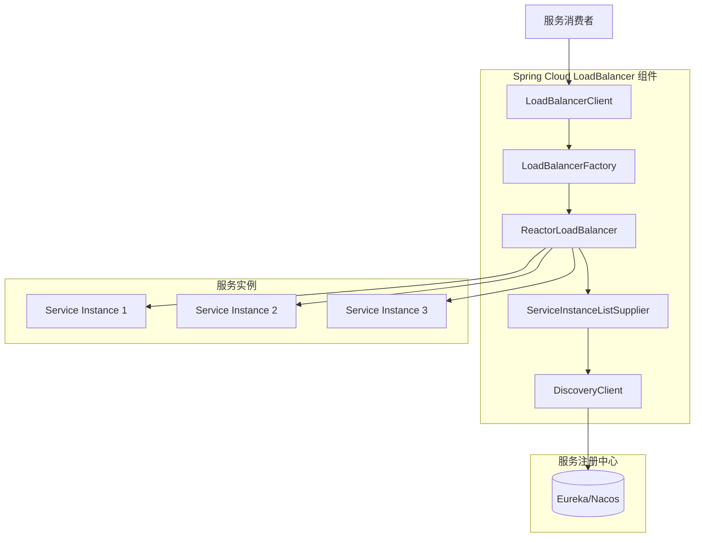
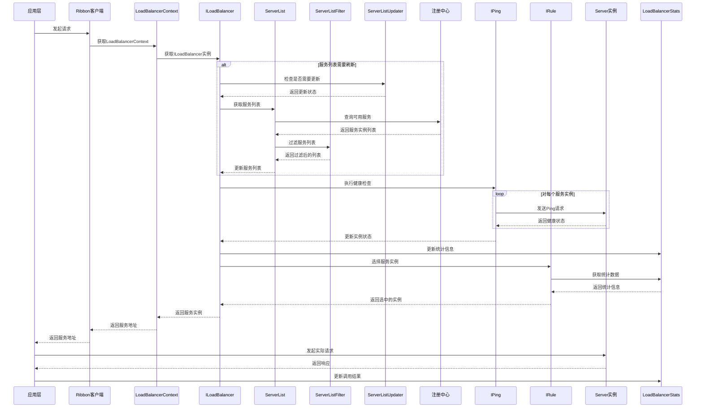
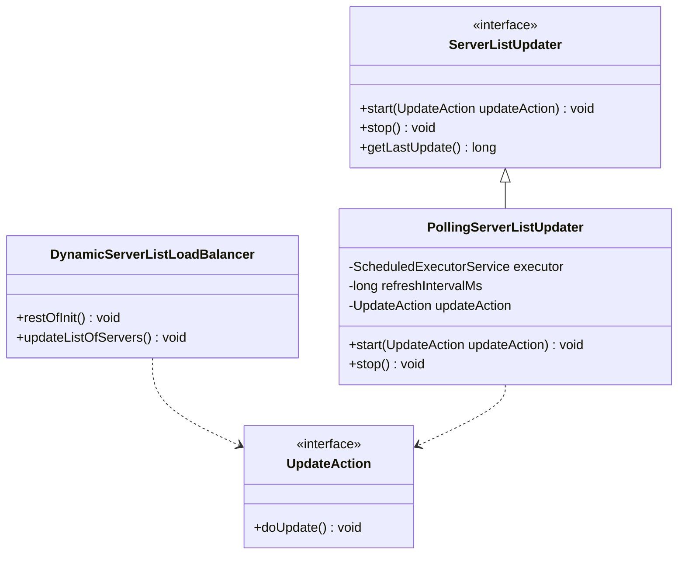
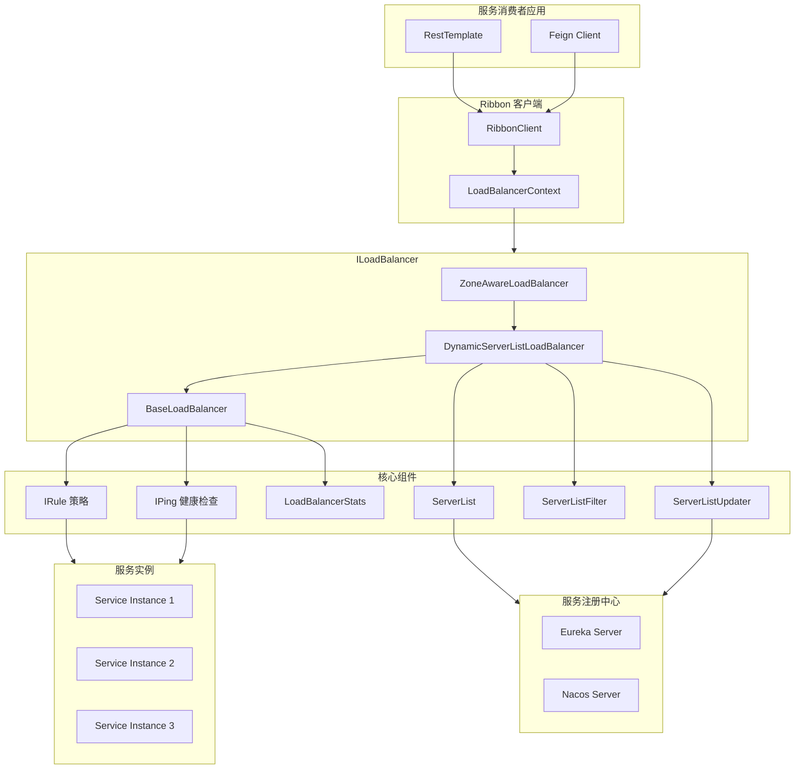

# Ribbon 如何做负载均衡

## 目录

- [1. 概述](#1-概述)
  - [1.1 什么是 Ribbon](#11-什么是-ribbon)
  - [1.2 Ribbon 的作用](#12-ribbon-的作用)
  - [1.3 Ribbon 的定位](#13-ribbon-的定位)
- [2. 核心架构](#2-核心架构)
  - [2.1 核心组件](#21-核心组件)
  - [2.2 架构图](#22-架构图)
  - [2.3 组件详解](#23-组件详解)
    - [2.3.1 ILoadBalancer](#iloadbalancer)
      - [2.3.1.1 接口设计原理](#2311-接口设计原理)
      - [2.3.1.2 核心方法](#2312-核心方法)
      - [2.3.1.3 生命周期](#2313-生命周期)
      - [2.3.1.4 类图](#2314-类图)
      - [2.3.1.5 核心实现类详解](#2315-核心实现类详解)
      - [2.3.1.6 实现类对比](#2316-实现类对比)
    - [2.3.2 IRule](#irule)
    - [2.3.3 IPing](#iping)
    - [2.3.4 ServerList](#serverlist)
- [3. 负载均衡策略](#3-负载均衡策略)
  - [3.1 轮询策略](#31-轮询策略roundrobinrule)
  - [3.2 随机策略](#32-随机策略randomrule)
  - [3.3 响应时间加权策略](#33-响应时间加权策略weightedresponsetimerule)
  - [3.4 可用性过滤策略](#34-可用性过滤策略availabilityfilteringrule)
  - [3.5 区域避免策略](#35-区域避免策略zoneavoidancerule)
  - [3.6 重试策略](#36-重试策略retryrule)
  - [3.7 策略对比](#37-策略对比)
- [4. 工作流程](#4-工作流程)
  - [4.1 完整工作流程图](#41-完整工作流程图)
  - [4.2 流程详解](#42-流程详解)
- [5. 配置和使用示例](#5-配置和使用示例)
  - [5.1 添加依赖](#51-添加依赖)
  - [5.2 基本配置](#52-基本配置)
  - [5.3 使用 RestTemplate + Ribbon](#53-使用-resttemplate--ribbon)
  - [5.4 自定义负载均衡策略](#54-自定义负载均衡策略)
  - [5.5 自定义健康检查](#55-自定义健康检查)
  - [5.6 使用 Feign + Ribbon](#56-使用-feign--ribbon)
- [6. 常见问题和最佳实践](#6-常见问题和最佳实践)
  - [6.1 常见问题](#61-常见问题)
  - [6.2 最佳实践](#62-最佳实践)
- [7. Spring Cloud LoadBalancer 介绍](#7-spring-cloud-loadbalancer-介绍)
  - [7.1 为什么需要 Spring Cloud LoadBalancer](#71-为什么需要-spring-cloud-loadbalancer)
  - [7.2 核心概念与架构](#72-核心概念与架构)
  - [7.3 与 Ribbon 对比](#73-与-ribbon-对比)
  - [7.4 迁移指南](#74-迁移指南)
  - [7.5 内置负载均衡策略](#75-内置负载均衡策略)
- [8. 自定义 LoadBalancer 实现](#8-自定义-loadbalancer-实现)
  - [8.1 自定义负载均衡策略](#81-自定义负载均衡策略)
  - [8.2 自定义服务实例过滤](#82-自定义服务实例过滤)
  - [8.3 Ribbon 自定义扩展（兼容旧版本）](#83-ribbon-自定义扩展兼容旧版本)
- [9. 架构设计深度分析](#9-架构设计深度分析)
  - [9.1 请求处理流程详解](#91-请求处理流程详解)
  - [9.2 核心架构设计原理](#92-核心架构设计原理)
  - [9.3 性能优化机制](#93-性能优化机制)
  - [9.4 容错机制](#94-容错机制)
  - [9.5 详细架构图](#95-详细架构图)

## 1. 概述

### 1.1 什么是 Ribbon

Ribbon 是 Netflix 开源的一个客户端负载均衡器，主要用于在分布式系统中实现服务间调用的负载均衡功能。它是 Spring Cloud 生态系统中的重要组件之一，与 Eureka、Feign 等组件配合使用，为微服务架构提供可靠的服务调用能力。

### 1.2 Ribbon 的作用

Ribbon 的核心作用是：

- **负载均衡**：将请求分发到多个服务实例，避免单点过载
- **服务发现**：从注册中心获取可用服务列表
- **故障转移**：自动剔除不可用的服务实例
- **容错处理**：提供重试、超时等容错机制

### 1.3 Ribbon 的定位

在微服务架构中，Ribbon 处于客户端侧，与服务消费者集成在一起。它不同于 Nginx 等服务端负载均衡器，而是在客户端本地完成负载均衡决策，减少了网络开销，提高了响应速度。

## 2. 核心架构

### 2.1 核心组件

Ribbon 的核心架构由以下几个关键组件组成：

- **ILoadBalancer**：负载均衡器的核心接口，负责管理服务列表和选择服务实例
- **IRule**：负载均衡策略接口，定义了如何从服务列表中选择一个实例
- **IPing**：健康检查接口，用于检测服务实例的可用性
- **ServerList**：服务列表接口，用于获取可用的服务实例列表
- **ServerListFilter**：服务列表过滤器，用于过滤服务实例
- **ServerListUpdater**：服务列表更新器，用于动态更新服务列表

### 2.2 架构图



### 2.3 组件详解

#### ILoadBalancer

##### 2.3.1.1 接口设计原理

ILoadBalancer 是 Ribbon 的核心接口，定义了负载均衡器的基本行为和生命周期。它的设计遵循了以下原则：

- **单一职责**：专注于服务实例的选择和管理
- **可扩展**：通过组合模式集成 IRule、IPing 等组件
- **状态管理**：维护服务实例的可用性状态
- **动态更新**：支持服务列表的动态刷新

##### 2.3.1.2 核心方法

ILoadBalancer 接口定义了以下核心方法：

| 方法名                                   | 描述         | 输入参数    | 返回值          |
| ------------------------------------- | ---------- | ------- | ------------ |
| `chooseServer(Object key)`            | 选择一个服务实例   | 选择键（可选） | Server       |
| `addServers(List<Server> newServers)` | 添加新的服务实例   | 新服务列表   | void         |
| `markServerDown(Server server)`       | 标记服务实例为不可用 | 服务实例    | void         |
| `getReachableServers()`               | 获取所有可用服务实例 | 无       | List<Server> |
| `getAllServers()`                     | 获取所有服务实例   | 无       | List<Server> |

##### 2.3.1.3 生命周期

ILoadBalancer 的生命周期包括：

1. **初始化**：创建实例，配置 IRule、IPing 等组件
2. **服务列表加载**：通过 ServerList 加载初始服务列表
3. **健康检查**：定期使用 IPing 检测服务实例状态
4. **服务选择**：通过 chooseServer 方法选择服务实例
5. **状态更新**：根据调用结果更新服务实例状态
6. **服务列表刷新**：定期更新服务列表

##### 2.3.1.4 类图



##### 2.3.1.5 核心实现类详解

###### BaseLoadBalancer

BaseLoadBalancer 是 Ribbon 的基础负载均衡器实现，提供了以下功能：

- 服务实例列表管理
- 负载均衡策略（IRule）集成
- 健康检查（IPing）集成
- 服务实例状态跟踪

**核心字段**：

- `allServerList`：所有服务实例列表
- `upServerList`：可用服务实例列表
- `lbStats`：负载均衡统计信息
- `rule`：负载均衡策略
- `ping`：健康检查策略

**适用场景**：服务列表相对固定的场景。

```java
// BaseLoadBalancer 核心代码结构
public class BaseLoadBalancer extends AbstractLoadBalancer {
    @Monitor(name = PREFIX + "AllServerList", type = DataSourceType.INFORMATIONAL)
    protected volatile List<Server> allServerList = Collections
            .synchronizedList(new ArrayList<Server>());
    
    @Monitor(name = PREFIX + "UpServerList", type = DataSourceType.INFORMATIONAL)
    protected volatile List<Server> upServerList = Collections
            .synchronizedList(new ArrayList<Server>());
    
    protected LoadBalancerStats lbStats;
    
    public BaseLoadBalancer() {
        this(null, null, null);
    }
    
    public BaseLoadBalancer(IRule rule, IPing ping) {
        this(rule, ping, null);
    }
    
    public BaseLoadBalancer(IRule rule, IPing ping, ServerListFilter<Server> filter) {
        this.rule = rule;
        this.ping = ping;
        this.filter = filter;
        initWithConfig();
    }
    
    @Override
    public Server chooseServer(Object key) {
        if (rule == null) {
            return null;
        }
        try {
            return rule.choose(key);
        } catch (Exception e) {
            return null;
        }
    }
    
    @Override
    public void markServerDown(Server server) {
        if (server == null || !server.isAlive()) {
            return;
        }
        server.setAlive(false);
    }
    
    @Override
    public List<Server> getReachableServers() {
        return upServerList;
    }
    
    @Override
    public List<Server> getAllServers() {
        return allServerList;
    }
}
```

###### DynamicServerListLoadBalancer

DynamicServerListLoadBalancer 在 BaseLoadBalancer 基础上增加了动态服务列表功能：

- 支持从注册中心动态获取服务列表
- 支持服务列表的定期刷新
- 支持服务列表过滤

**核心字段**：

- `serverList`：服务列表提供者
- `serverListFilter`：服务列表过滤器
- `serverListUpdater`：服务列表更新器

**适用场景**：服务实例动态变化的场景，如使用 Eureka、Nacos 等注册中心。

###### ZoneAwareLoadBalancer

ZoneAwareLoadBalancer 在 DynamicServerListLoadBalancer 基础上增加了区域感知功能：

- 支持跨可用区的负载均衡
- 优先选择同一可用区的服务实例
- 当某个可用区不可用时，自动切换到其他可用区

**核心字段**：

- `zoneBalancers`：按可用区划分的负载均衡器

**适用场景**：跨可用区部署的场景，需要降低网络延迟和提高可用性。

##### 2.3.1.6 实现类对比

| 实现类                           | 服务列表管理 | 动态更新 | 区域感知 | 适用场景     |
| ----------------------------- | ------ | ---- | ---- | -------- |
| BaseLoadBalancer              | 静态     | 不支持  | 不支持  | 服务列表固定   |
| DynamicServerListLoadBalancer | 动态     | 支持   | 不支持  | 服务实例动态变化 |
| ZoneAwareLoadBalancer         | 动态     | 支持   | 支持   | 跨可用区部署   |

#### IRule

IRule 是负载均衡策略接口，定义了如何选择服务实例的算法。常见实现类包括：

- **RoundRobinRule**：轮询策略
- **RandomRule**：随机策略
- **WeightedResponseTimeRule**：响应时间加权策略
- **AvailabilityFilteringRule**：可用性过滤策略
- **ZoneAvoidanceRule**：区域避免策略
- **RetryRule**：重试策略

#### IPing

IPing 是健康检查接口，用于检测服务实例的可用性。常见实现类包括：

- **DummyPing**：Dummy 实现，始终返回 true
- **PingUrl**：通过 HTTP 请求检测服务可用性
- **NIWSDiscoveryPing**：结合 Eureka 使用的健康检测

#### ServerList

ServerList 是服务列表接口，用于获取可用的服务实例列表。常见实现类包括：

- **ConfigurationBasedServerList**：基于配置的服务列表
- **DiscoveryEnabledNIWSServerList**：基于 Eureka 服务发现的服务列表

## 3. 负载均衡策略

### 3.1 轮询策略（RoundRobinRule）

**原理**：按照顺序依次选择服务实例，每个实例被选中的概率均等。

**适用场景**：服务实例性能相近，负载较为均衡的场景。

**优缺点**：

- 优点：简单公平，易于实现
- 缺点：不考虑服务实例的性能差异，可能导致性能较差的实例过载

### 3.2 随机策略（RandomRule）

**原理**：随机选择一个服务实例。

**适用场景**：服务实例性能相近，对负载均衡要求不高的场景。

**优缺点**：

- 优点：实现简单
- 缺点：可能导致某些实例被频繁选中，负载不均衡

### 3.3 响应时间加权策略（WeightedResponseTimeRule）

**原理**：根据服务实例的响应时间动态计算权重，响应时间越短，权重越高，被选中的概率越大。

**适用场景**：服务实例性能差异较大，需要根据性能动态调整负载的场景。

**优缺点**：

- 优点：能够根据实例性能动态调整负载，提高整体性能
- 缺点：需要收集响应时间数据，增加了一定的开销

### 3.4 可用性过滤策略（AvailabilityFilteringRule）

**原理**：先过滤掉由于多次访问故障而处于断路器跳闸状态的服务实例，以及并发连接数超过阈值的服务实例，然后对剩余的实例使用轮询策略进行选择。

**适用场景**：需要考虑服务实例可用性的场景。

**优缺点**：

- 优点：能够自动剔除不可用的实例，提高系统可用性
- 缺点：需要维护实例的状态信息，增加了一定的复杂度

### 3.5 区域避免策略（ZoneAvoidanceRule）

**原理**：结合区域和可用性进行选择，优先选择同一区域内的可用实例。

**适用场景**：跨可用区部署，需要降低网络延迟的场景。

**优缺点**：

- 优点：能够降低网络延迟，提高系统性能
- 缺点：需要配置区域信息，增加了一定的复杂度

### 3.6 重试策略（RetryRule）

**原理**：在选定的负载均衡策略基础上，增加重试机制。如果选择的实例调用失败，则在指定时间内重试其他实例。

**适用场景**：需要提高调用成功率的场景。

**优缺点**：

- 优点：能够提高调用成功率
- 缺点：可能增加响应时间和系统负载

### 3.7 策略对比

| 策略名称                      | 选择方式  | 考虑因素   | 适用场景       | 复杂度 |
| ------------------------- | ----- | ------ | ---------- | --- |
| RoundRobinRule            | 轮询    | 无      | 服务实例性能相近   | 低   |
| RandomRule                | 随机    | 无      | 对负载均衡要求不高  | 低   |
| WeightedResponseTimeRule  | 加权随机  | 响应时间   | 服务实例性能差异较大 | 中   |
| AvailabilityFilteringRule | 过滤后轮询 | 可用性    | 需要考虑实例可用性  | 中   |
| ZoneAvoidanceRule         | 区域优先  | 区域、可用性 | 跨可用区部署     | 高   |
| RetryRule                 | 重试    | 原策略+重试 | 需要提高调用成功率  | 中   |

## 4. 工作流程

### 4.1 完整工作流程图



### 4.2 流程详解

Ribbon 的完整工作流程如下：

1. **服务消费者发起请求**：服务消费者通过 Ribbon 发起服务调用请求。
2. **获取服务列表**：Ribbon 从 ILoadBalancer 获取可用的服务实例列表。
3. **更新服务列表**：如果服务列表为空或需要更新，从注册中心获取最新的服务实例列表。
4. **过滤服务列表**：使用 ServerListFilter 对服务列表进行过滤。
5. **健康检查**：使用 IPing 检测服务实例的可用性，更新实例状态。
6. **选择服务实例**：使用 IRule 根据负载均衡策略选择一个服务实例。
7. **返回服务实例**：将选中的服务实例地址返回给服务消费者。
8. **发起实际调用**：服务消费者根据返回的地址发起实际的服务调用。

## 5. 配置和使用示例

### 5.1 添加依赖

在 Spring Boot 项目中添加 Ribbon 依赖：

```xml
<dependency>
    <groupId>org.springframework.cloud</groupId>
    <artifactId>spring-cloud-starter-netflix-ribbon</artifactId>
</dependency>
```

如果使用的是新版 Spring Cloud，可能需要添加以下依赖：

```xml
<dependency>
    <groupId>org.springframework.cloud</groupId>
    <artifactId>spring-cloud-starter-loadbalancer</artifactId>
</dependency>
```

### 5.2 基本配置

在 application.yml 中配置 Ribbon：

```yaml
# 全局配置
ribbon:
  # 连接超时时间（毫秒）
  ConnectTimeout: 2000
  # 读取超时时间（毫秒）
  ReadTimeout: 5000
  # 是否启用负载均衡器
  OkToRetryOnAllOperations: true
  # 最大自动重试次数
  MaxAutoRetries: 1
  # 最大重试下一个服务器的次数
  MaxAutoRetriesNextServer: 1

# 针对特定服务的配置
service-provider:
  ribbon:
    # 负载均衡策略
    NFLoadBalancerRuleClassName: com.netflix.loadbalancer.WeightedResponseTimeRule
    # 服务列表（不使用注册中心时配置）
    listOfServers: http://localhost:8081,http://localhost:8082
    # 连接超时时间
    ConnectTimeout: 3000
    # 读取超时时间
    ReadTimeout: 8000
```

### 5.3 使用 RestTemplate + Ribbon

配置 RestTemplate 并启用 Ribbon：

```java
@Configuration
public class RibbonConfig {
    
    @Bean
    @LoadBalanced
    public RestTemplate restTemplate() {
        return new RestTemplate();
    }
}
```

使用 RestTemplate 调用服务：

```java
@Service
public class UserService {
    
    @Autowired
    private RestTemplate restTemplate;
    
    public User getUserById(Long id) {
        // 直接使用服务名替代主机地址
        return restTemplate.getForObject(
            "http://service-provider/user/" + id, 
            User.class
        );
    }
}
```

### 5.4 自定义负载均衡策略

#### 方式一：通过配置类自定义

```java
@Configuration
public class RibbonRuleConfig {
    
    @Bean
    public IRule ribbonRule() {
        // 使用响应时间加权策略
        return new WeightedResponseTimeRule();
    }
}
```

然后在启动类上指定使用该配置：

```java
@SpringBootApplication
@RibbonClient(name = "service-provider", configuration = RibbonRuleConfig.class)
public class ConsumerApplication {
    public static void main(String[] args) {
        SpringApplication.run(ConsumerApplication.class, args);
    }
}
```

#### 方式二：通过配置文件自定义

```yaml
service-provider:
  ribbon:
    NFLoadBalancerRuleClassName: com.netflix.loadbalancer.WeightedResponseTimeRule
```

### 5.5 自定义健康检查

自定义 IPing 实现：

```java
public class CustomPing implements IPing {
    
    @Override
    public boolean isAlive(Server server) {
        try {
            // 自定义健康检查逻辑
            String url = "http://" + server.getHostPort() + "/actuator/health";
            RestTemplate restTemplate = new RestTemplate();
            ResponseEntity<String> response = restTemplate.getForEntity(url, String.class);
            return response.getStatusCode().is2xxSuccessful();
        } catch (Exception e) {
            return false;
        }
    }
}
```

配置自定义的 IPing：

```java
@Configuration
public class RibbonPingConfig {
    
    @Bean
    public IPing ribbonPing() {
        return new CustomPing();
    }
}
```

### 5.6 使用 Feign + Ribbon

Feign 已经集成了 Ribbon，使用方式更加简洁：

```java
@FeignClient(name = "service-provider")
public interface UserFeignClient {
    
    @GetMapping("/user/{id}")
    User getUserById(@PathVariable("id") Long id);
}
```

在 application.yml 中配置 Feign 和 Ribbon：

```yaml
feign:
  client:
    config:
      default:
        connectTimeout: 3000
        readTimeout: 8000
        # 配置 Ribbon 重试
        retryer: feign.Retryer.Default
```

## 6. 常见问题和最佳实践

### 6.1 常见问题

#### 问题1：Ribbon 服务列表不更新

**原因**：服务列表更新配置不正确。

**解决方案**：检查以下配置：

```yaml
ribbon:
  # 服务列表更新间隔（毫秒）
  ServerListRefreshInterval: 30000
  # 启用动态更新
  EnableDynamicServerList: true
```

#### 问题2：负载均衡策略不生效

**原因**：配置类被 Spring Boot 主上下文扫描到，导致全局生效。

**解决方案**：将配置类放在 Spring Boot 主应用程序上下文扫描不到的包中，或者使用 `@RibbonClient` 的 `configuration` 属性指定。

#### 问题3：服务调用超时

**原因**：超时时间设置过短。

**解决方案**：适当调整超时时间：

```yaml
ribbon:
  ConnectTimeout: 5000
  ReadTimeout: 10000
```

#### 问题4：重试机制导致重复调用

**原因**：启用了所有操作的重试，但某些操作不是幂等的。

**解决方案**：只对幂等操作启用重试：

```yaml
ribbon:
  OkToRetryOnAllOperations: false
```

### 6.2 最佳实践

#### 1. 选择合适的负载均衡策略

- 服务实例性能相近：使用 RoundRobinRule
- 服务实例性能差异较大：使用 WeightedResponseTimeRule
- 跨可用区部署：使用 ZoneAvoidanceRule
- 需要提高可用性：使用 AvailabilityFilteringRule + RetryRule

#### 2. 合理配置超时时间

- 连接超时时间不宜过长，一般设置为 1-3 秒
- 读取超时时间根据业务实际情况设置，一般设置为 5-10 秒

#### 3. 慎用重试机制

- 只对幂等操作启用重试
- 合理设置重试次数，避免无限重试
- 考虑使用断路器（如 Hystrix、Sentinel）配合使用

#### 4. 监控和日志

- 配置 Ribbon 的日志级别为 DEBUG，便于排查问题
- 监控服务实例的调用情况，及时发现异常

```yaml
logging:
  level:
    com.netflix.ribbon: DEBUG
```

#### 5. 与注册中心配合使用

- 使用 Eureka、Nacos 等注册中心自动维护服务列表
- 配置适当的服务列表刷新间隔
- 启用健康检查，及时剔除不可用实例

#### 6. 性能优化

- 避免频繁创建和销毁 Ribbon 客户端
- 合理配置服务列表缓存时间
- 使用连接池提高性能

```yaml
ribbon:
  # 启用连接池
  http:
    client:
      enabled: true
  # 最大连接数
  MaxTotalConnections: 200
  # 每个主机的最大连接数
  MaxConnectionsPerHost: 50
```

## 7. Spring Cloud LoadBalancer 介绍

### 7.1 为什么需要 Spring Cloud LoadBalancer

随着 Netflix 宣布 Ribbon 进入维护模式，Spring Cloud 社区推出了 Spring Cloud LoadBalancer 作为 Ribbon 的继任者。Spring Cloud LoadBalancer 是一个基于 Spring Cloud Commons 抽象实现的客户端负载均衡器，具有以下优势：

- **Spring 原生支持**：与 Spring 生态系统更紧密集成
- **轻量级设计**：简化了架构，减少了不必要的复杂性
- **响应式编程**：支持 Reactor 和 WebFlux
- **可扩展性**：更灵活的扩展点设计
- **维护活跃**：Spring 社区持续维护和更新

### 7.2 核心概念与架构

#### 7.2.1 核心接口

Spring Cloud LoadBalancer 主要包含以下核心接口：

| 接口                            | 描述        |
| ----------------------------- | --------- |
| `ServiceInstanceListSupplier` | 服务实例列表提供者 |
| `ReactorLoadBalancer`         | 响应式负载均衡器  |
| `LoadBalancerClient`          | 负载均衡客户端   |
| `LoadBalancerFactory`         | 负载均衡器工厂   |

#### 7.2.2 架构图



### 7.3 与 Ribbon 对比

| 特性          | Ribbon              | Spring Cloud LoadBalancer |
| ----------- | ------------------- | ------------------------- |
| 维护状态        | 维护模式                | 活跃维护                      |
| 架构复杂度       | 复杂                  | 简化                        |
| 响应式支持       | 不支持                 | 支持                        |
| 配置方式        | 基于 Netflix Archaius | 基于 Spring 配置              |
| 负载均衡策略      | 丰富                  | 较少（可扩展）                   |
| 与 Spring 集成 | 较好                  | 原生                        |
| 性能          | 良好                  | 优秀                        |

### 7.4 迁移指南

#### 7.4.1 依赖替换

**使用 Ribbon 时的依赖**：

```xml
<dependency>
    <groupId>org.springframework.cloud</groupId>
    <artifactId>spring-cloud-starter-netflix-ribbon</artifactId>
</dependency>
```

**使用 Spring Cloud LoadBalancer 时的依赖**：

```xml
<dependency>
    <groupId>org.springframework.cloud</groupId>
    <artifactId>spring-cloud-starter-loadbalancer</artifactId>
</dependency>
```

#### 7.4.2 配置迁移

**Ribbon 配置**：

```yaml
service-provider:
  ribbon:
    NFLoadBalancerRuleClassName: com.netflix.loadbalancer.WeightedResponseTimeRule
    ConnectTimeout: 3000
    ReadTimeout: 8000
```

**Spring Cloud LoadBalancer 配置**：

```yaml
spring:
  cloud:
    loadbalancer:
      service-provider:
        ribbon:
          enabled: false
```

#### 7.4.3 代码迁移示例

**使用 Ribbon 配置**：

```java
@Configuration
public class RibbonRuleConfig {
    @Bean
    public IRule ribbonRule() {
        return new WeightedResponseTimeRule();
    }
}
```

**使用 Spring Cloud LoadBalancer 配置**：

```java
@Configuration
public class LoadBalancerConfig {
    @Bean
    public ReactorLoadBalancer<ServiceInstance> randomLoadBalancer(
            Environment environment,
            LoadBalancerClientFactory loadBalancerClientFactory) {
        String name = environment.getProperty(LoadBalancerClientFactory.PROPERTY_NAME);
        return new RandomLoadBalancer(
                loadBalancerClientFactory.getLazyProvider(name, ServiceInstanceListSupplier.class),
                name);
    }
}
```

#### 7.4.4 使用 RestTemplate

**使用 Ribbon + RestTemplate**：

```java
@Configuration
public class RestTemplateConfig {
    @Bean
    @LoadBalanced
    public RestTemplate restTemplate() {
        return new RestTemplate();
    }
}
```

**使用 Spring Cloud LoadBalancer + RestTemplate**：

```java
@Configuration
public class RestTemplateConfig {
    @Bean
    @LoadBalanced
    public RestTemplate restTemplate() {
        return new RestTemplate();
    }
    
    @Bean
    public LoadBalancerClientFactory loadBalancerClientFactory() {
        return new LoadBalancerClientFactory();
    }
}
```

#### 7.4.5 使用 WebClient

```java
@Configuration
public class WebClientConfig {
    @Bean
    @LoadBalanced
    public WebClient.Builder webClientBuilder() {
        return WebClient.builder();
    }
}

@Service
public class UserService {
    @Autowired
    private WebClient.Builder webClientBuilder;
    
    public Mono<User> getUserById(Long id) {
        return webClientBuilder.build()
            .get()
            .uri("http://service-provider/user/" + id)
            .retrieve()
            .bodyToMono(User.class);
    }
}
```

### 7.5 内置负载均衡策略

Spring Cloud LoadBalancer 提供了以下内置负载均衡策略：

| 策略                       | 描述       |
| ------------------------ | -------- |
| `RoundRobinLoadBalancer` | 轮询策略（默认） |
| `RandomLoadBalancer`     | 随机策略     |

## 8. 自定义 LoadBalancer 实现

### 8.1 自定义负载均衡策略

#### 8.1.1 实现自定义 LoadBalancer

```java
public class CustomLoadBalancer implements ReactorLoadBalancer<ServiceInstance> {
    
    private final ObjectProvider<ServiceInstanceListSupplier> serviceInstanceListSupplierProvider;
    private final String serviceId;
    private final AtomicInteger position = new AtomicInteger(0);
    
    public CustomLoadBalancer(
            ObjectProvider<ServiceInstanceListSupplier> serviceInstanceListSupplierProvider,
            String serviceId) {
        this.serviceInstanceListSupplierProvider = serviceInstanceListSupplierProvider;
        this.serviceId = serviceId;
    }
    
    @Override
    public Mono<Response<ServiceInstance>> choose(Request request) {
        ServiceInstanceListSupplier supplier = serviceInstanceListSupplierProvider
                .getIfAvailable(NoopServiceInstanceListSupplier::new);
        return supplier.get(request)
                .next()
                .map(serviceInstances -> processInstanceList(serviceInstances, request));
    }
    
    private Response<ServiceInstance> processInstanceList(
            List<ServiceInstance> instances, Request request) {
        if (instances.isEmpty()) {
            return new EmptyResponse();
        }
        
        // 自定义选择逻辑：优先选择端口为偶数的实例
        List<ServiceInstance> evenPortInstances = instances.stream()
                .filter(instance -> instance.getPort() % 2 == 0)
                .collect(Collectors.toList());
        
        if (!evenPortInstances.isEmpty()) {
            int pos = Math.abs(position.incrementAndGet());
            return new DefaultResponse(evenPortInstances.get(pos % evenPortInstances.size()));
        }
        
        // 降级策略：轮询
        int pos = Math.abs(position.incrementAndGet());
        return new DefaultResponse(instances.get(pos % instances.size()));
    }
}
```

#### 8.1.2 配置自定义 LoadBalancer

```java
@Configuration
public class CustomLoadBalancerConfiguration {
    
    @Bean
    public ReactorLoadBalancer<ServiceInstance> customLoadBalancer(
            Environment environment,
            LoadBalancerClientFactory loadBalancerClientFactory) {
        String name = environment.getProperty(LoadBalancerClientFactory.PROPERTY_NAME);
        return new CustomLoadBalancer(
                loadBalancerClientFactory.getLazyProvider(name, ServiceInstanceListSupplier.class),
                name);
    }
}
```

#### 8.1.3 启用自定义 LoadBalancer

```java
@SpringBootApplication
@LoadBalancerClient(name = "service-provider", configuration = CustomLoadBalancerConfiguration.class)
public class ConsumerApplication {
    public static void main(String[] args) {
        SpringApplication.run(ConsumerApplication.class, args);
    }
}
```

### 8.2 自定义服务实例过滤

```java
public class CustomServiceInstanceListSupplier implements ServiceInstanceListSupplier {
    
    private final ServiceInstanceListSupplier delegate;
    
    public CustomServiceInstanceListSupplier(ServiceInstanceListSupplier delegate) {
        this.delegate = delegate;
    }
    
    @Override
    public String getServiceId() {
        return delegate.getServiceId();
    }
    
    @Override
    public Flux<List<ServiceInstance>> get() {
        return delegate.get().map(this::filterInstances);
    }
    
    @Override
    public Flux<List<ServiceInstance>> get(Request request) {
        return delegate.get(request).map(this::filterInstances);
    }
    
    private List<ServiceInstance> filterInstances(List<ServiceInstance> instances) {
        return instances.stream()
                .filter(instance -> {
                    // 自定义过滤逻辑：只保留权重 > 50 的实例
                    String weight = instance.getMetadata().get("weight");
                    return weight == null || Integer.parseInt(weight) > 50;
                })
                .collect(Collectors.toList());
    }
}
```

### 8.3 Ribbon 自定义扩展（兼容旧版本）

#### 8.3.1 自定义 IRule

```java
public class CustomRule extends AbstractLoadBalancerRule {
    
    private final AtomicInteger nextServerCyclicCounter = new AtomicInteger(0);
    
    @Override
    public Server choose(Object key) {
        return choose(getLoadBalancer(), key);
    }
    
    public Server choose(ILoadBalancer lb, Object key) {
        if (lb == null) {
            return null;
        }
        
        List<Server> reachableServers = lb.getReachableServers();
        List<Server> allServers = lb.getAllServers();
        
        int upCount = reachableServers.size();
        int serverCount = allServers.size();
        
        if ((upCount == 0) || (serverCount == 0)) {
            return null;
        }
        
        // 自定义选择逻辑：只选择 ID 为偶数的服务器
        List<Server> evenIdServers = reachableServers.stream()
                .filter(server -> {
                    try {
                        String id = server.getId();
                        int serverId = Integer.parseInt(id);
                        return serverId % 2 == 0;
                    } catch (Exception e) {
                        return false;
                    }
                })
                .collect(Collectors.toList());
        
        if (!evenIdServers.isEmpty()) {
            int nextServerIndex = incrementAndGetModulo(evenIdServers.size());
            return evenIdServers.get(nextServerIndex);
        }
        
        // 降级策略：轮询
        int nextServerIndex = incrementAndGetModulo(upCount);
        return reachableServers.get(nextServerIndex);
    }
    
    private int incrementAndGetModulo(int modulo) {
        for (;;) {
            int current = nextServerCyclicCounter.get();
            int next = (current + 1) % modulo;
            if (nextServerCyclicCounter.compareAndSet(current, next)) {
                return next;
            }
        }
    }
    
    @Override
    public void initWithNiwsConfig(IClientConfig clientConfig) {
    }
}
```

#### 8.3.2 配置自定义 IRule

```java
@Configuration
public class RibbonCustomConfig {
    
    @Bean
    public IRule customRule() {
        return new CustomRule();
    }
}
```

## 9. 架构设计深度分析

### 9.1 请求处理流程详解

Ribbon 的完整请求处理流程包括以下步骤：



### 9.2 核心架构设计原理

#### 9.2.1 组合模式

Ribbon 采用组合模式设计，将负载均衡器拆分为多个独立的组件：

- ILoadBalancer 负责协调各个组件
- IRule 负责选择策略
- IPing 负责健康检查
- ServerList 负责服务列表获取
- ServerListFilter 负责服务列表过滤
- ServerListUpdater 负责服务列表更新

这种设计使得每个组件都可以独立替换和扩展，提高了系统的灵活性。

#### 9.2.2 观察者模式

ServerListUpdater 使用观察者模式实现服务列表的动态更新：



#### 9.2.3 装饰器模式

LoadBalancerStats 使用装饰器模式对 Server 进行增强，记录调用统计信息。

### 9.3 性能优化机制

#### 9.3.1 服务列表缓存

Ribbon 对服务列表进行缓存，避免频繁从注册中心获取：

- 初始加载时从注册中心获取完整服务列表
- 定期刷新服务列表（默认 30 秒）
- 支持增量更新

#### 9.3.2 健康检查优化

- 支持异步健康检查，不阻塞请求处理
- 支持可配置的健康检查间隔
- 支持批量健康检查

#### 9.3.3 统计信息优化

- 使用 AtomicInteger 等原子类保证线程安全
- 统计信息本地缓存，减少锁竞争
- 支持采样统计，降低性能开销

### 9.4 容错机制

#### 9.4.1 服务实例故障处理

- 标记服务实例为不可用
- 自动从可用列表中剔除
- 支持自动恢复

#### 9.4.2 降级策略

- 当所有实例不可用时，支持降级处理
- 支持备用服务列表

#### 9.4.3 超时和重试

- 支持连接超时和读取超时配置
- 支持重试机制
- 支持重试策略配置

### 9.5 详细架构图



