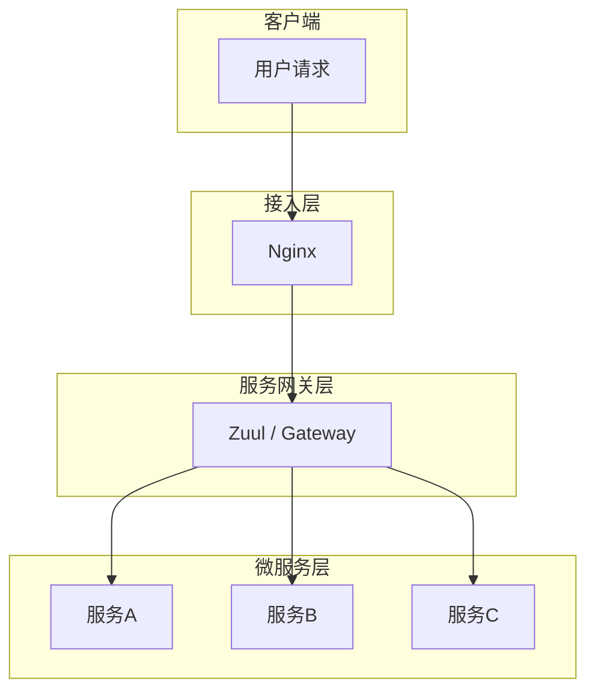
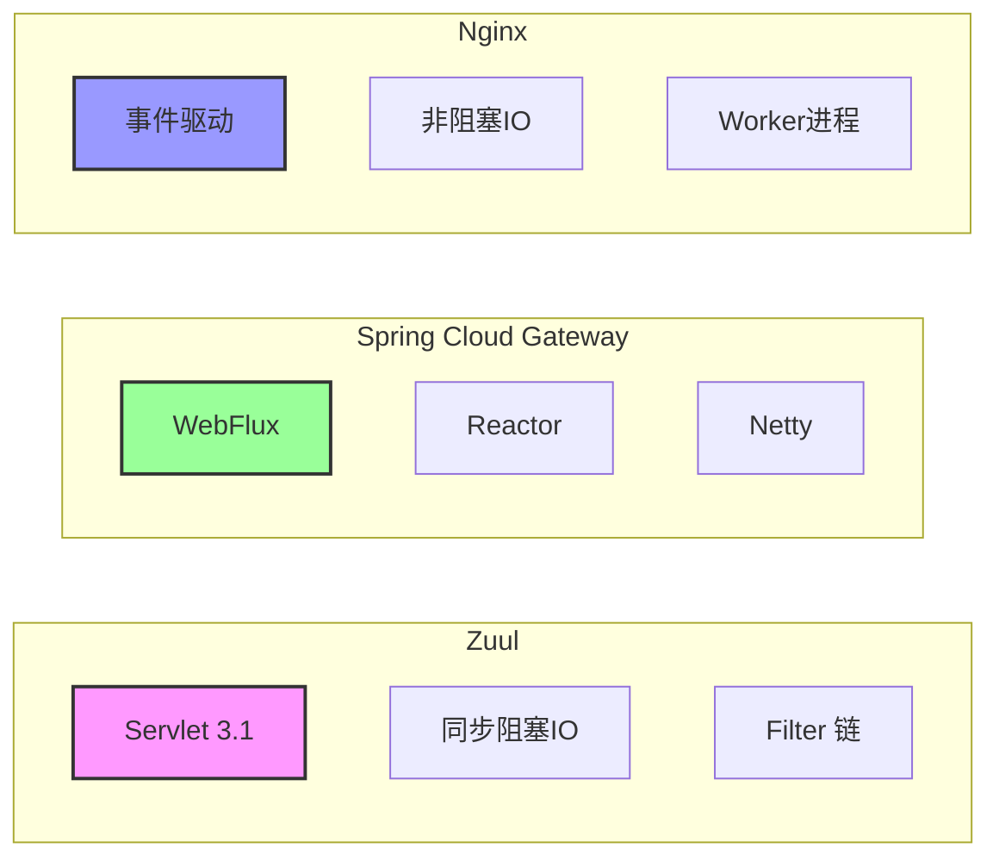
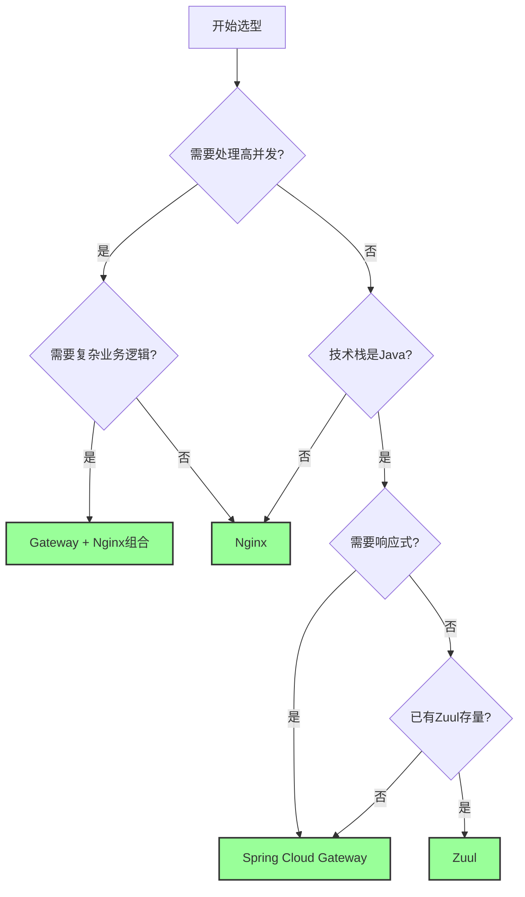
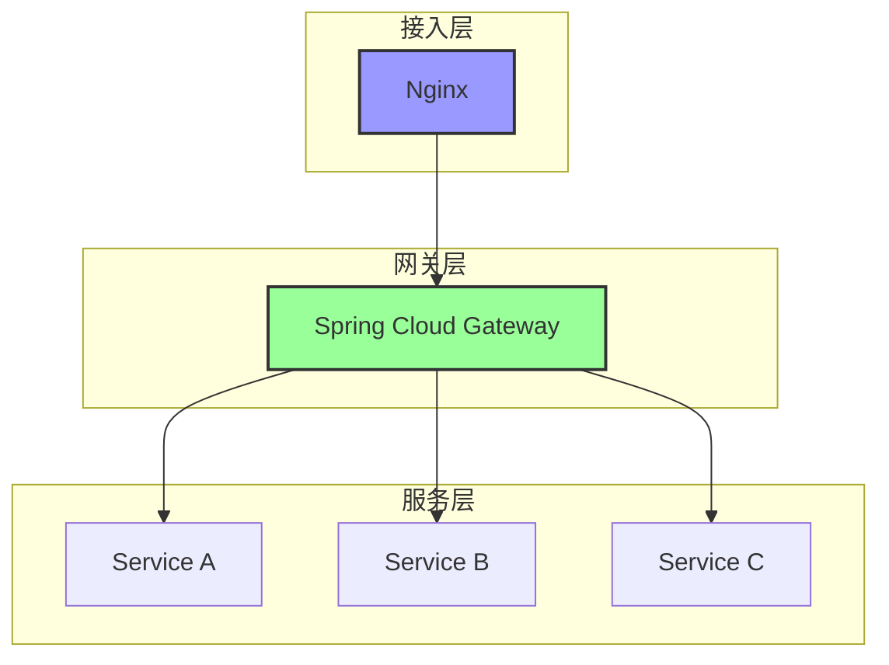

# Zuul、Spring Cloud Gateway、Nginx 区别对比

***

## 一、概述

在微服务架构中，网关（Gateway）是整个系统的入口，负责请求路由、负载均衡、安全控制等核心功能。Zuul、Spring Cloud Gateway 和 Nginx 是三种常用的网关/反向代理技术，它们各有特点和适用场景。

### 1.1 技术定位

| 技术                       | 定位         | 所属生态                 | 语言             |
| ------------------------ | ---------- | -------------------- | -------------- |
| **Zuul**                 | 微服务网关      | Spring Cloud Netflix | Java           |
| **Spring Cloud Gateway** | 新一代微服务网关   | Spring Cloud         | Java (WebFlux) |
| **Nginx**                | 高性能反向代理服务器 | 独立服务                 | C              |

### 1.2 架构位置

***

## 二、核心功能对比

### 2.1 功能特性对比

| 功能特性          | Zuul       | Spring Cloud Gateway | Nginx         |
| ------------- | ---------- | -------------------- | ------------- |
| **核心定位**      | 微服务网关      | 响应式微服务网关             | 反向代理/负载均衡     |
| **异步支持**      | 同步阻塞       | 响应式异步                | 异步事件驱动        |
| **并发性能**      | 一般         | 高                    | 极高            |
| **路由方式**      | 基于过滤器      | 基于路由断言               | 基于配置          |
| **动态路由**      | 支持（需扩展）    | 原生支持                 | 需 reload 或第三方 |
| **熔断支持**      | 集成 Hystrix | 集成 Resilience4j      | 第三方模块         |
| **限流支持**      | 需自定义       | 原生支持                 | 原生支持          |
| **SSL/TLS**   | 支持         | 支持                   | 支持（成熟）        |
| **WebSocket** | 支持         | 原生支持                 | 支持            |
| **请求重写**      | 支持         | 支持                   | 支持            |
| **路径重定向**     | 支持         | 支持                   | 支持            |
| **健康检查**      | 依赖 Eureka  | 原生支持                 | 需第三方          |
| **服务发现**      | 集成 Eureka  | 集成 Eureka/Nacos      | 需自定义          |
| **自定义过滤器**    | Java 代码    | Java 代码              | Lua 脚本        |
| **配置方式**      | 代码/配置文件    | 配置文件/代码              | 配置文件          |
| **热更新**       | 不支持        | 支持                   | 支持（reload）    |
| **监控指标**      | 基础         | 丰富（Micrometer）       | 丰富            |

### 2.2 性能对比

| 性能指标       | Zuul | Spring Cloud Gateway | Nginx   |
| ---------- | ---- | -------------------- | ------- |
| **延迟**     | 较高   | 低                    | 极低      |
| **内存占用**   | 较高   | 中等                   | 低       |
| **CPU 效率** | 一般   | 高                    | 极高      |
| **连接数**    | 有限   | 高                    | 极高（百万级） |

***

## 三、技术实现对比

### 3.1 底层技术栈

### 3.2 处理模型对比

| 特性        | Zuul   | Spring Cloud Gateway | Nginx         |
| --------- | ------ | -------------------- | ------------- |
| **线程模型**  | 每请求一线程 | 事件循环（Reactor）        | 事件循环（Worker）  |
| **IO 模型** | 同步阻塞   | 异步非阻塞                | 异步非阻塞         |
| **并发模型**  | 线程池    | Reactor              | Master-Worker |
| **阻塞点**   | 网络IO   | 几乎无                  | 几乎无           |

***

## 四、适用场景分析

### 4.1 场景匹配矩阵

| 场景               | Zuul | Spring Cloud Gateway | Nginx |
| ---------------- | ---- | -------------------- | ----- |
| **高并发入口**        | ❌    | ⚠️                   | ✅     |
| **微服务网关**        | ⚠️   | ✅                    | ⚠️    |
| **动态路由**         | ⚠️   | ✅                    | ❌     |
| **复杂业务逻辑**       | ✅    | ✅                    | ❌     |
| **WebSocket 代理** | ⚠️   | ✅                    | ✅     |
| **静态资源服务**       | ❌    | ❌                    | ✅     |
| **SSL 终止**       | ⚠️   | ⚠️                   | ✅     |
| **灰度发布**         | ⚠️   | ✅                    | ⚠️    |
| **限流熔断**         | ⚠️   | ✅                    | ⚠️    |
| **多语言支持**        | ❌    | ❌                    | ✅     |

### 4.2 选型决策流程

***

## 五、组合使用建议

在实际生产环境中，常常采用多层网关架构：

### 5.1 职责划分

| 层级      | 组件      | 职责                  |
| ------- | ------- | ------------------- |
| **接入层** | Nginx   | SSL 终止、负载均衡、静态资源、限流 |
| **网关层** | Gateway | 动态路由、熔断降级、灰度发布、认证授权 |
| **服务层** | 微服务     | 业务逻辑处理              |

***

## 六、总结与建议

### 6.1 核心区别总结

| 维度        | Zuul | Spring Cloud Gateway | Nginx |
| --------- | ---- | -------------------- | ----- |
| **性能**    | 低    | 中高                   | 极高    |
| **功能丰富度** | 中    | 高                    | 中     |
| **灵活性**   | 中    | 高                    | 低     |
| **生态集成**  | 好    | 极好                   | 一般    |
| **学习成本**  | 低    | 中                    | 中     |
| **运维复杂度** | 低    | 中                    | 低     |

### 6.2 选型建议

| 场景               | 推荐选择                 | 理由                          |
| ---------------- | -------------------- | --------------------------- |
| **纯 Java 微服务架构** | Spring Cloud Gateway | 与 Spring Cloud 无缝集成，响应式性能优秀 |
| **超高并发入口**       | Nginx                | C 语言实现，性能最优                 |
| **多层网关架构**       | Nginx + Gateway      | 各司其职，兼顾性能和功能                |
| **存量 Zuul 项目**   | 建议迁移到 Gateway        | Zuul 已停止维护，Gateway 是未来方向    |
| **多语言微服务**       | Nginx                | 语言无关，统一入口                   |
| **需要动态路由/灰度**    | Spring Cloud Gateway | 原生支持，生态完善                   |

### 6.3 迁移建议

如果正在使用 Zuul 并考虑迁移：

1. **评估现有功能**：列出 Zuul 过滤器实现的功能
2. **功能映射**：将过滤器逻辑映射到 Gateway 的 Filter/Route Predicate
3. **渐进式迁移**：先并行运行，逐步切换流量
4. **性能测试**：对比迁移前后的性能指标

***

## 七、常见问题

### Q1: Zuul 还能使用吗？

**答案**：Zuul 1.x 已停止维护，官方推荐迁移到 Spring Cloud Gateway。如果是新项目，直接使用 Gateway。

### Q2: Gateway 和 Nginx 如何选择？

**答案**：根据场景选择：

- 需要复杂业务逻辑、动态路由 → Gateway
- 需要极致性能、静态资源、SSL 终止 → Nginx
- 生产环境推荐组合使用

### Q3: Gateway 的性能比 Nginx 差很多吗？

**答案**：在高并发场景下（>50k QPS），Nginx 的性能优势明显。但对于大多数微服务场景（<10k QPS），Gateway 的性能完全够用，且功能更丰富。

### Q4: 如何实现灰度发布？

**答案**：

- **Gateway**：使用 `WeightedResponseHeaderRoutePredicateFactory` 或自定义 Predicate
- **Nginx**：使用 `split_clients` 指令或第三方模块

***

## 八、参考资料

| 资源                        | 链接                                                                         |
| ------------------------- | -------------------------------------------------------------------------- |
| Spring Cloud Gateway 官方文档 | <https://docs.spring.io/spring-cloud-gateway/docs/current/reference/html/> |
| Nginx 官方文档                | <http://nginx.org/en/docs/>                                                |
| Zuul 官方文档                 | <https://github.com/Netflix/zuul>                                          |

