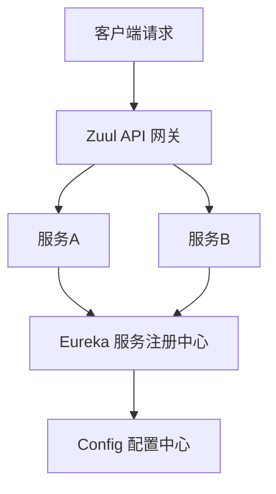
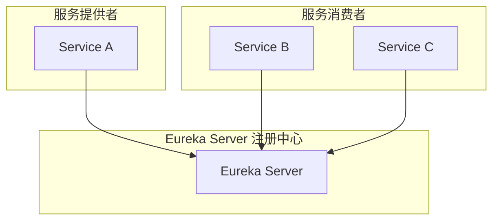
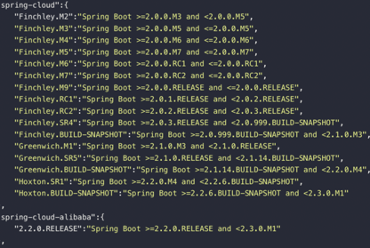

# SpringCloud 微服务架构详解

---

## 一、微服务架构概述

### 1.1 什么是微服务？

微服务是一种架构风格，它将应用程序构建为一组**松耦合、独立部署的服务**。每个服务运行在其独立的进程中，通过轻量级的机制（通常是HTTP RESTful API）进行通信。

**微服务的核心特点**：
- **单一职责**：每个服务只负责一个业务领域
- **独立部署**：每个服务可以独立开发、部署和扩展
- **技术栈灵活**：不同服务可以使用不同的技术栈
- **数据隔离**：每个服务有自己的数据库

### 1.2 微服务的演进历程

| 架构阶段 | 特点 | 技术选型 |
|---------|------|---------|
| 单体应用 | 单一代码库，部署简单 | Spring MVC + MySQL |
| 垂直拆分 | 按业务模块拆分 | 多个独立单体应用 |
| 分布式服务 | 服务化拆分 | Dubbo + Zookeeper |
| **微服务架构** | 细粒度服务治理 | **SpringCloud** / **Dubbo** |
| 云原生架构 | 容器化、自动化运维 | Kubernetes + Docker |

### 1.3 微服务的优缺点

**优点**：
1. **耦合度低**：服务间松耦合，变更影响范围小
2. **并行开发**：不同团队可以独立开发不同服务
3. **配置简单**：使用SpringBoot简化配置
4. **跨平台**：支持多种语言开发
5. **数据库独立**：每个服务可以选择最适合的数据库
6. **前后端分离**：通过API进行通信
7. **可横向扩展**：可以针对特定服务进行扩容

**缺点**：
1. **部署复杂**：服务数量多，运维成本高
2. **数据管理麻烦**：数据库拆分后，一致性保障困难
3. **性能监控困难**：需要分布式追踪和监控体系

---

## 二、SpringCloud简介

### 2.1 什么是SpringCloud？

SpringCloud是**一系列框架的有序集合**，利用SpringBoot的开发便利性，简化了分布式系统基础设施的开发。

**核心概念**：
- 是多个子项目的集合，不是单一项目
- 利用SpringBoot风格封装，简化配置
- 提供了微服务架构所需的各种组件

### 2.2 SpringCloud主要功能

SpringCloud提供了以下核心功能：
- **服务注册与发现**：Eureka
- **负载均衡**：Ribbon
- **声明式HTTP客户端**：Feign
- **服务熔断与降级**：Hystrix
- **API网关**：Zuul / SpringCloud Gateway
- **分布式配置中心**：Config
- **消息总线**：Bus
- **分布式链路追踪**：Sleuth + Zipkin

### 2.3 SpringCloud核心架构



**调用流程**：
1. 所有服务启动时向Eureka注册
2. 客户端请求通过Zuul网关路由
3. 服务间调用通过Feign和Ribbon进行负载均衡
4. Hystrix负责熔断保护
5. Config管理统一配置

---

## 三、SpringCloud核心组件详解

### 3.1 Eureka：服务注册与发现

**Eureka**是Netflix开源的服务注册中心，负责服务的注册和发现。

#### 3.1.1 Eureka架构



#### 3.1.2 核心概念

| 概念 | 说明 |
|-----|------|
| **Eureka Server** | 服务注册中心，提供服务注册和发现功能 |
| **Service Provider** | 服务提供者，向注册中心注册自己 |
| **Service Consumer** | 服务消费者，从注册中心获取服务列表 |
| **Register** | 服务注册，启动时向Eureka Server注册 |
| **Renew** | 服务续约，定期发送心跳包表明自己还存活 |
| **Fetch** | 获取服务列表，定时从Eureka Server拉取 |

#### 3.1.3 基本配置示例

**Eureka Server配置**：
```yaml
server:
  port: 8761

eureka:
  instance:
    hostname: localhost
  client:
    registerWithEureka: false  # 不向自己注册
    fetchRegistry: false       # 不拉取服务列表
    serviceUrl:
      defaultZone: http://${eureka.instance.hostname}:${server.port}/eureka/
```

**服务提供者配置**：
```yaml
server:
  port: 8080

eureka:
  client:
    serviceUrl:
      defaultZone: http://localhost:8761/eureka/
  instance:
    prefer-ip-address: true

spring:
  application:
    name: service-provider
```

**更多详情**：[Eureka 详解](Eureka.md)

---

### 3.2 Feign：声明式HTTP客户端

**Feign**是一个声明式的Web服务客户端，让编写Web服务客户端更加简单。

#### 3.2.1 Feign特点

- **声明式**：通过接口和注解定义HTTP请求
- **集成Ribbon**：自动具备负载均衡能力
- **内置Hystrix**：支持熔断和降级
- **可插拔编解码**：支持多种数据格式

#### 3.2.2 Feign使用示例

**1. 添加依赖**：
```xml
<dependency>
    <groupId>org.springframework.cloud</groupId>
    <artifactId>spring-cloud-starter-openfeign</artifactId>
</dependency>
```

**2. 启动类添加注解**：
```java
@SpringBootApplication
@EnableFeignClients
public class ConsumerApplication {
    public static void main(String[] args) {
        SpringApplication.run(ConsumerApplication.class, args);
    }
}
```

**3. 定义Feign接口**：
```java
@FeignClient("service-provider")  // 指定服务名称
public interface ProviderFeignClient {
    
    @GetMapping("/hello")
    String hello();
    
    @GetMapping("/user/{id}")
    User getUser(@PathVariable("id") Long id);
}
```

**4. 调用示例**：
```java
@RestController
public class ConsumerController {
    
    @Autowired
    private ProviderFeignClient providerFeignClient;
    
    @GetMapping("/call-hello")
    public String callHello() {
        return providerFeignClient.hello();
    }
}
```

**更多详情**：[Feign 详解](Feign.md)

---

### 3.3 Hystrix：熔断器

**Hystrix**是Netflix开源的熔断器组件，用于防止级联故障，实现服务熔断和降级。

#### 3.3.1 Hystrix解决的问题

- **服务雪崩**：一个服务故障导致整个链路失败
- **线程隔离**：保护服务不被大量请求拖垮
- **熔断降级**：服务故障时提供降级方案

#### 3.3.2 限流算法

Hystrix支持多种限流策略：

| 算法 | 原理 | 优缺点 |
|-----|------|-------|
| **计数器算法** | 固定时间窗口内计数，超过阈值拒绝请求 | 实现简单，但存在"突刺"问题 |
| **漏桶算法** | 请求像水一样流入漏桶，固定速率流出 | 平滑流量，但突发流量处理不佳 |
| **令牌桶算法** | 以恒定速率向桶中放令牌，请求需获取令牌 | 平滑限流，允许一定突发流量 |

**令牌桶算法示意**：
```mermaid
flowchart TD
    subgraph 令牌桶
        A[令牌桶<br/>(固定容量)]
        B[token]
        C[token]
        D[token]
    end
    
    E[令牌生成器] -->|恒定速率| A
    A -->|获取令牌| F[请求]
    F -->|有令牌| G[处理请求]
    F -->|无令牌| H[拒绝请求]
```

#### 3.3.3 Hystrix使用示例

**1. 添加依赖**：
```xml
<dependency>
    <groupId>org.springframework.cloud</groupId>
    <artifactId>spring-cloud-starter-netflix-hystrix</artifactId>
</dependency>
```

**2. 启动类添加注解**：
```java
@SpringBootApplication
@EnableHystrix
public class ConsumerApplication {
    public static void main(String[] args) {
        SpringApplication.run(ConsumerApplication.class, args);
    }
}
```

**3. 添加熔断注解**：
```java
@RestController
public class ConsumerController {
    
    @Autowired
    private ProviderFeignClient providerFeignClient;
    
    @HystrixCommand(fallbackMethod = "helloFallback")
    @GetMapping("/call-hello")
    public String callHello() {
        return providerFeignClient.hello();
    }
    
    // 降级方法
    public String helloFallback() {
        return "服务暂时不可用，请稍后再试";
    }
}
```

**更多详情**：[Hystrix 详解](Hystrix.md)

---

### 3.4 Config：分布式配置中心

**Config**提供了统一的配置管理功能，支持将配置外部化存储。

#### 3.4.1 Config Server特点

- **集中管理**：所有服务的配置集中管理
- **版本控制**：配置变更可追溯
- **环境隔离**：支持dev/test/prod等多个环境
- **动态刷新**：支持配置动态生效

#### 3.4.2 配置示例

**Config Server配置**：
```yaml
server:
  port: 8888

spring:
  application:
    name: config-server
  cloud:
    config:
      server:
        git:
          uri: https://github.com/your-repo/config-repo
          search-paths: config
```

**客户端配置**：
```yaml
spring:
  cloud:
    config:
      uri: http://localhost:8888
      name: my-service
      profile: dev
      label: master
```

---

### 3.5 Zuul：API网关

**Zuul**是Netflix开源的API网关，提供路由转发、过滤器等功能。

#### 3.5.1 Zuul核心功能

- **路由转发**：将请求转发到对应的后端服务
- **过滤器**：提供请求前、请求后、错误等过滤器
- **负载均衡**：集成Ribbon，支持负载均衡
- **熔断器**：集成Hystrix，支持熔断

#### 3.5.2 Zuul配置示例

```yaml
server:
  port: 9000

spring:
  application:
    name: zuul-gateway

zuul:
  routes:
    provider:
      path: /provider/**
      serviceId: service-provider
    consumer:
      path: /consumer/**
      serviceId: service-consumer
```

---

## 四、SpringCloud与SpringBoot版本对应关系

### 4.1 版本对应关系

SpringCloud与SpringBoot有严格的版本对应关系：

| SpringCloud版本 | SpringBoot版本 |
|----------------|---------------|
| Finchley | 2.0.x |
| Greenwich | 2.1.x |
| Hoxton | 2.2.x, 2.3.x |
| 2020.0.x (Ilford) | 2.4.x, 2.5.x |
| 2021.0.x (Jubilee) | 2.6.x, 2.7.x |
| 2022.0.x (Kilburn) | 3.0.x |

**官方版本对应图**：


### 4.2 SpringCloud与SpringBoot关系

| 维度 | SpringBoot | SpringCloud |
|-----|-----------|------------|
| **定位** | 脚手架，快速构建应用 | 微服务框架集 |
| **关注点** | 单个应用的配置和开发 | 多个服务的协调治理 |
| **依赖关系** | SpringCloud依赖SpringBoot | 基于SpringBoot开发 |

**简单理解**：
- SpringBoot = 脚手架，快速搭建单个应用
- SpringCloud = 工具箱，管理多个SpringBoot应用

---

## 五、SpringCloud与Dubbo对比

### 5.1 核心区别

| 对比维度 | SpringCloud | Dubbo |
|---------|------------|-------|
| **通信方式** | REST API（HTTP） | RPC（高性能） |
| **注册中心** | Eureka（AP）/ Nacos / Consul | Zookeeper（CP） |
| **网关** | Zuul / SpringCloud Gateway | 无（需单独集成） |
| **生态** | 完整的微服务套件 | 专注RPC框架 |
| **性能** | 相对较低（HTTP开销） | 高性能（TCP长连接） |
| **适用场景** | 对外API、跨语言调用 | 内部服务调用 |

### 5.2 如何选择？

**选择SpringCloud的场景**：
- 需要完整的微服务生态
- 跨语言调用
- 对外提供REST API
- 注重开发效率

**选择Dubbo的场景**：
- 对性能要求较高
- 内部服务调用
- 已有Java技术栈
- 注重RPC通信性能

---

## 六、SpringCloud最佳实践

### 6.1 架构设计原则

1. **服务拆分原则**
   - 按业务领域拆分
   - 避免过细或过粗
   - 保持单一职责

2. **数据库设计**
   - 每个服务独立数据库
   - 避免跨服务直接数据库操作
   - 通过API进行数据同步

3. **接口设计**
   - RESTful风格
   - 版本控制
   - 统一响应格式

### 6.2 运维最佳实践

1. **部署策略**
   - 容器化部署
   - CI/CD流水线
   - 蓝绿部署/金丝雀发布

2. **监控与日志**
   - 分布式链路追踪（Sleuth + Zipkin）
   - 日志聚合（ELK）
   - 服务健康检查

3. **安全**
   - API网关统一认证
   - 服务间通信加密
   - 敏感数据保护

### 6.3 开发注意事项

1. **服务契约**
   - 提前定义好接口
   - 使用API文档工具（Swagger）
   - 向后兼容

2. **容错设计**
   - 每个服务都要考虑降级方案
   - 超时设置合理
   - 重试要有幂等性保证

3. **测试策略**
   - 单元测试
   - 集成测试
   - 端到端测试
   - 混沌工程测试

---

## 七、总结

| 核心要点 | 说明 |
|---------|------|
| **微服务架构** | 将应用拆分为独立部署的服务 |
| **SpringCloud** | 基于SpringBoot的微服务框架集 |
| **核心组件** | Eureka、Feign、Hystrix、Config、Zuul |
| **架构选型** | 根据场景选择SpringCloud或Dubbo |
| **最佳实践** | 服务拆分、容错设计、监控运维 |

**学习路径建议**：
1. 先掌握SpringBoot基础
2. 理解微服务架构思想
3. 逐个学习SpringCloud组件
4. 动手实践，搭建完整微服务项目
5. 深入了解原理和源码
