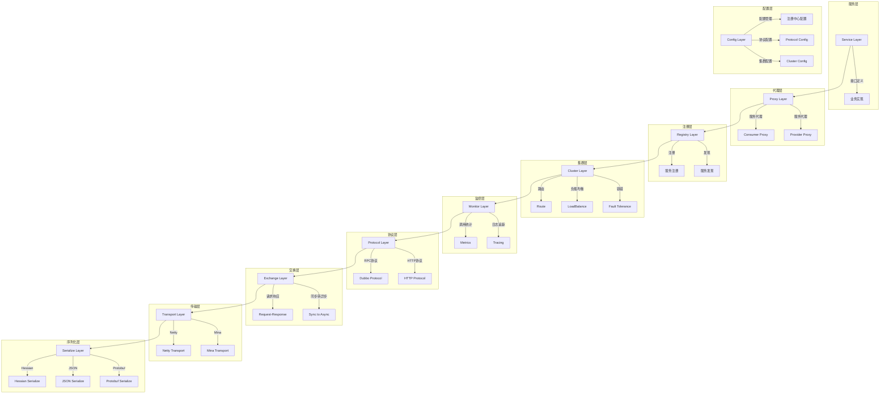
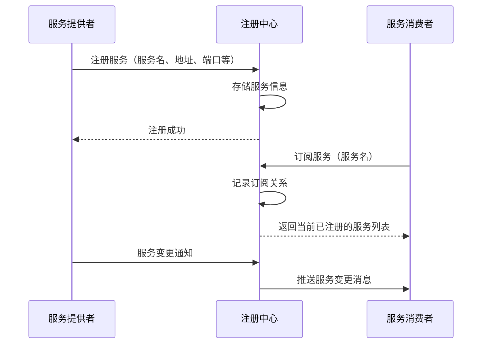
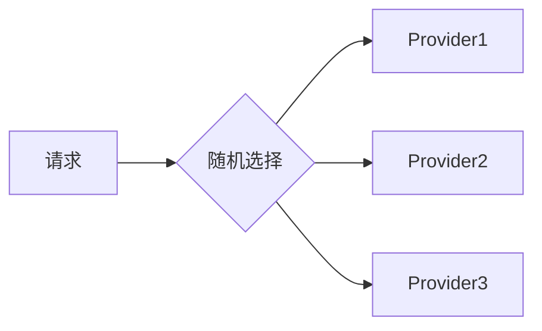
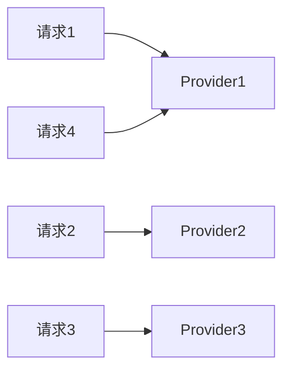
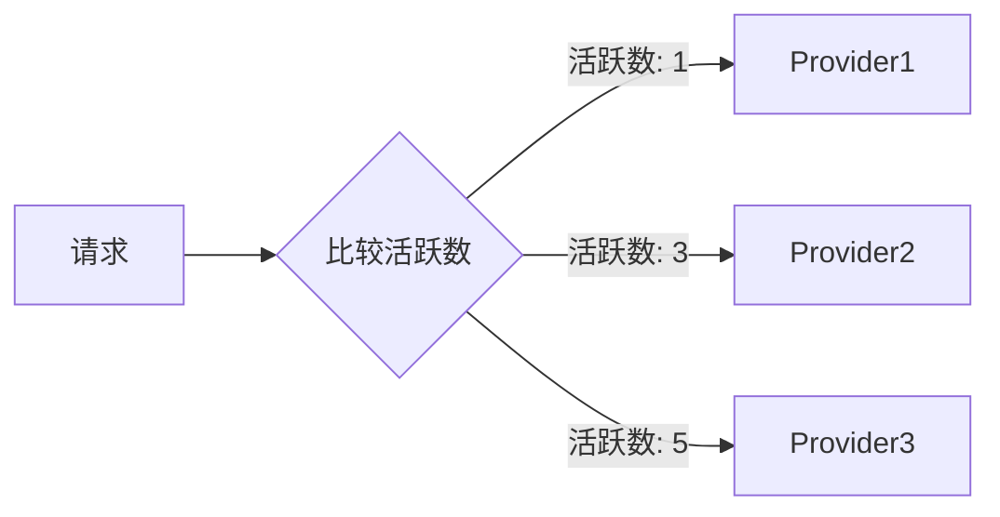
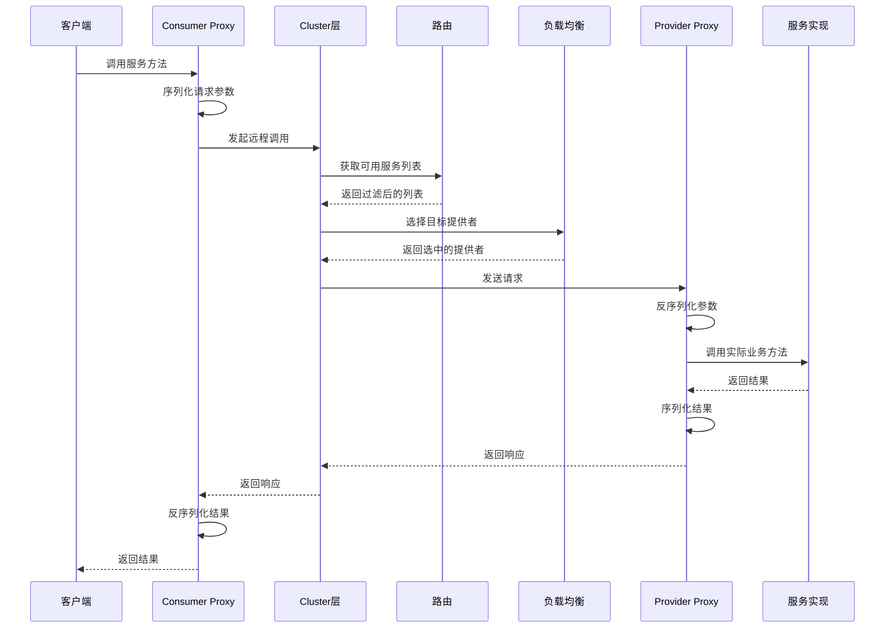

# Dubbo分布式服务框架

[dubbo官网](https://dubbo.apache.org/zh/docs/)

## 一、Dubbo架构原理

### 1.1 架构分层

Dubbo采用分层架构设计，各层职责清晰，便于扩展和维护。



### 1.2 各层职责说明

| 层级            | 名称     | 职责                        |
| ------------- | ------ | ------------------------- |
| **Service**   | 接口层    | 定义服务接口，供提供者实现和消费者调用       |
| **Config**    | 配置层    | 管理Dubbo的各种配置，如注册中心、协议、集群等 |
| **Proxy**     | 服务代理层  | 为消费者和提供者生成代理，代理之间进行网络通信   |
| **Registry**  | 注册层    | 负责服务的注册与发现，维护服务列表         |
| **Cluster**   | 集群层    | 封装多个服务提供者，实现路由、负载均衡和容错    |
| **Monitor**   | 监控层    | 对RPC接口调用次数和调用时间进行监控统计     |
| **Protocol**  | 远程调用层  | 封装RPC调用协议，支持多种协议          |
| **Exchange**  | 信息交换层  | 封装请求响应模式，实现同步转异步          |
| **Transport** | 网络传输层  | 封装网络通信，支持Netty、Mina等      |
| **Serialize** | 数据序列化层 | 实现数据序列化和反序列化              |

***

## 二、服务注册与发现

### 2.1 服务注册流程



### 2.2 服务发现流程

1. **服务订阅**：消费者启动时向注册中心订阅所需服务
2. **获取服务列表**：注册中心返回当前可用的服务提供者列表
3. **本地缓存**：消费者将服务列表缓存到本地
4. **动态更新**：当服务提供者发生变化时，注册中心主动推送变更信息
5. **故障剔除**：消费者定期检测服务健康状态，剔除不可用节点

### 2.3 注册中心挂了可以继续通信吗？

**可以**。初始化时，消费者会将提供者的地址等信息拉取到本地缓存。因此即使注册中心挂了，消费者仍然可以通过本地缓存的地址列表进行服务调用。

***

## 三、负载均衡策略

Dubbo提供了多种负载均衡策略，可根据业务场景选择合适的策略。

### 3.1 负载均衡策略对比

| 策略                 | 名称        | 原理             | 适用场景            |
| ------------------ | --------- | -------------- | --------------- |
| **Random**         | 随机负载均衡    | 随机选择一个提供者      | 适用于所有场景，简单高效    |
| **RoundRobin**     | 轮询负载均衡    | 按顺序轮流选择提供者     | 适用于提供者性能相近的场景   |
| **LeastActive**    | 最少活跃数负载均衡 | 选择活跃调用数最少的提供者  | 适用于提供者性能差异较大的场景 |
| **ConsistentHash** | 一致性哈希负载均衡 | 根据请求参数哈希到固定提供者 | 适用于需要会话保持的场景    |

### 3.2 各种策略详解

#### 3.2.1 随机负载均衡（Random）



- **特点**：简单高效，每个提供者被选中的概率相等
- **适用**：默认策略，适用于大多数场景

#### 3.2.2 轮询负载均衡（RoundRobin）



- **特点**：按顺序轮流分配，保证请求均匀分布
- **适用**：提供者性能相近，希望请求均匀分布

#### 3.2.3 最少活跃数负载均衡（LeastActive）



- **特点**：优先选择当前活跃调用数最少的提供者
- **适用**：提供者性能差异较大，需要动态分配

#### 3.2.4 一致性哈希负载均衡（ConsistentHash）

```mermaid
flowchart LR 
     A[请求Key1] --> B{哈希计算} 
     A[请求Key2] --> B 
     A[请求Key3] --> B 
     B -->|Hash(Key1)| C[Provider1] 
     B -->|Hash(Key2)| D[Provider2] 
     B -->|Hash(Key3)| E[Provider3] 
```

- **特点**：相同参数的请求会路由到相同的提供者
- **适用**：需要会话保持或缓存友好的场景

***

## 四、服务调用流程

### 4.1 完整调用流程



### 4.2 调用流程详解

1. **客户端调用**：客户端通过代理对象调用服务方法
2. **参数序列化**：将请求参数序列化为字节流
3. **集群层处理**：集群层负责路由和负载均衡
4. **服务选择**：根据负载均衡策略选择目标提供者
5. **网络传输**：通过传输层发送请求到服务提供者
6. **服务执行**：提供者反序列化参数，执行实际业务逻辑
7. **结果返回**：序列化结果并返回给客户端

***

## 五、配置示例

### 5.1 服务提供者配置

```yaml
# application.yml
dubbo:
  application:
    name: user-provider
  registry:
    address: zookeeper://127.0.0.1:2181
  protocol:
    name: dubbo
    port: 20880
  scan:
    base-packages: com.example.provider.service
```

### 5.2 服务消费者配置

```yaml
# application.yml
dubbo:
  application:
    name: user-consumer
  registry:
    address: zookeeper://127.0.0.1:2181
  consumer:
    timeout: 3000
    retries: 2
```

### 5.3 服务接口定义

```java
// 服务接口
public interface UserService {
    User getUserById(Long id);
    List<User> listUsers();
}

// 服务实现
@DubboService
public class UserServiceImpl implements UserService {
    @Override
    public User getUserById(Long id) {
        // 业务逻辑
        return userRepository.findById(id);
    }
    
    @Override
    public List<User> listUsers() {
        return userRepository.findAll();
    }
}

// 服务消费
@DubboReference
private UserService userService;
```

***

## 六、总结

Dubbo是一款高性能的Java RPC框架，具有以下特点：

| 特性        | 说明                     |
| --------- | ---------------------- |
| **高性能**   | 基于Netty实现，支持多种序列化协议    |
| **高可用**   | 支持多种负载均衡策略和容错机制        |
| **易扩展**   | 分层架构设计，便于扩展和定制         |
| **服务治理**  | 提供服务注册、发现、监控等完整功能      |
| **多协议支持** | 支持Dubbo、HTTP、gRPC等多种协议 |

Dubbo适用于构建大规模分布式系统，是微服务架构中的核心组件之一。
